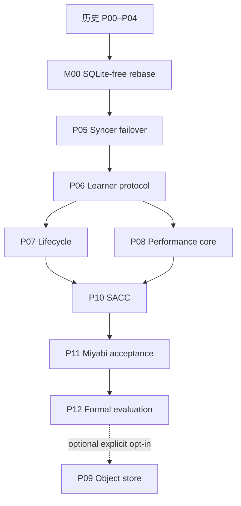

# DuraLoCo Codex Loop-Engineering Implementation Plans

本目录描述 SQLite-free 路线。P00–P04 是历史基线；M00 已完成并以 `PASS`/无 required follow-up 重新验收全部 41 个 P00–P04 acceptance IDs。当前执行起点是 P05，必须从 M00 corrected archival tip `89ae48aae5956b09fc6685074d3ea0eaea36b816` 或经 drift report 证明等价的后继 commit 开始。

必需主线是 `M00 → P05 → P06 → (P07, P08) → P10 → P11 → P12`。P09 object-store backend 保留在整体计划最后，默认不实现、不验证、不阻塞主线。

## 1. 不可协商的系统边界

- 活跃代码、配置、CLI、脚本、测试和新 artifacts 中不允许 SQLite，也不允许以 LMDB、DuckDB 或其他嵌入式数据库替代。
- 唯一持久 authority 是 immutable committed transition objects 加一个线性化 head CAS；proposal listing 只负责发现，不负责裁决。
- 本地查询状态是进程内、不可变的 `RuntimeView`，由 full replay 构建；P07 可增加经过 digest 等价验证的 snapshot+suffix replay，但不得新增数据库。
- `latest.json`、JSONL、CSV、heartbeats、运行报告和监控指标都是派生或观测数据，不能驱动 correctness 决策。
- 历史 SQLite run 保持只读；新系统不提供 SQLite reader、converter 或双写桥。若要复用 checkpoint，只能显式创建新 generation，语义是 warm-start，不是 exact continuation。
- M00 的 strict/memoized production replay 契约已成为后续基线；fresh open、takeover、CAS ambiguity、head jump 和 corruption suspicion 必须 empty-cache strict replay，memoization 不得持久或跨 owner。

详细设计见 [`SQLITE_FREE_SYSTEM_DESIGN.md`](SQLITE_FREE_SYSTEM_DESIGN.md)，M00 实际失败所得约束见 [`M00_IMPLEMENTATION_LESSONS.md`](M00_IMPLEMENTATION_LESSONS.md)，共同执行约束见 [`00_CODEX_LOOP_OPERATING_CONTRACT.md`](00_CODEX_LOOP_OPERATING_CONTRACT.md)。

## 2. 阶段索引

| 阶段 | 定位 | 依赖 | 推荐分支 |
|---|---|---|---|
| [P00（历史）](01_P00_BASELINE_AND_RESEARCH_CONTRACT.md) | 冻结基线、研究契约与 Agent Spine | — | 已归档 |
| [P01（历史）](02_P01_PROTOCOL_V2_SCHEMAS_AND_VALIDATION.md) | Protocol v2 Schema、身份与严格验证 | P00 | 已归档 |
| [P02（历史）](03_P02_REFERENCE_SIMULATOR_AND_IN_MEMORY_BACKEND.md) | 确定性参考模拟器与 In-Memory Backend | P01 | 已归档 |
| [P03（历史）](04_P03_STORAGE_ABSTRACTION_AND_POSIX_LUSTRE_CONTRACT.md) | 语义化 Storage API 与 POSIX/Lustre Contract | P02 | 已归档 |
| [P04（历史）](05_P04_TRANSACTIONAL_FRAGMENT_LOG_AND_PREFIX_RECOVERY.md) | Transactional Fragment Log 与 Prefix Recovery | P03 | 已归档 |
| [M00（已完成的第 0 里程碑）](06_M00_SQLITE_FREE_RUNTIME_REBASE_AND_P00_P04_REQUALIFICATION.md) | 删除 SQLite、建立 log-only runtime、重验 P00–P04 | P04 | `89ae48a` 已归档 |
| [P05](07_P05_SYNCER_LEASE_FENCING_AND_FAILOVER.md) | 生产 Syncer、Lease/Fencing 与 Failover | M00 | `codex/duraloco-p05-syncer-failover` |
| [P06](08_P06_LEARNER_INTERVALS_ADOPTION_AND_RECOVERY.md) | Learner Contribution Intervals、Adoption 与 Warm Recovery | P05 | `codex/duraloco-p06-learner-protocol` |
| [P07](09_P07_COMPACTION_GC_ACKS_AND_LEARNER_CAPSULES.md) | Compaction、Reachability GC、Ack 与 Learner Capsules | P06 | `codex/duraloco-p07-lifecycle` |
| [P08](10_P08_DIRECT_FRAGMENT_IO_STREAMING_REDUCER_AND_TELEMETRY.md) | Direct Fragment I/O、Streaming Reducer 与 Telemetry | P06 | `codex/duraloco-p08-performance-core` |
| [P10](11_P10_SACC_AND_ALGORITHM_SYSTEM_CODESIGN.md) | Storage-Aware Commit Controller 与协同优化 | P07, P08 | `codex/duraloco-p10-sacc` |
| [P11](12_P11_MIYABI_INTEGRATION_CHAOS_AND_9NODE_ACCEPTANCE.md) | Miyabi 集成、Chaos 与 9-node Acceptance | P10 | `codex/duraloco-p11-miyabi-acceptance` |
| [P12](13_P12_FORMAL_EXPERIMENTS_ARTIFACT_AND_PAPER_EVIDENCE.md) | 正式实验、Artifact 与 Claim–Evidence | P11 | `codex/duraloco-p12-evaluation` |
| [P09（可选，暂缓）](14_P09_OBJECT_STORE_BACKEND_AND_HYBRID_BASELINE_OPTIONAL.md) | S3-Compatible Backend、MinIO 与 Hybrid Baseline | P12 + 显式选择 | `codex/duraloco-p09-object-store` |

## 3. 依赖图



P07 与 P08 可以在独立 worktree 开发，但 shared log/head/frontier/commit 与 production syncer 仍由单 writer 集成。P09 不参与自动推进。

## 4. 研究里程碑映射

| 路线里程碑 | 阶段 |
|---|---|
| Historical foundation | P00–P04 |
| Milestone 0: SQLite-free foundation | M00 |
| POSIX DuraLoCo runtime | P05–P08 |
| Performance controller | P10 |
| Miyabi acceptance | P11 |
| Formal evaluation | P12 |
| Optional object-store extension | P09 |

## 5. 使用方式

### 5.1 每次恢复必读

Codex 必须读取根 `AGENTS.md`、`miyabi-development` skill、共同契约、SQLite-free 设计、[`P00_P04_IMPLEMENTATION_LESSONS.md`](P00_P04_IMPLEMENTATION_LESSONS.md)、[`M00_IMPLEMENTATION_LESSONS.md`](M00_IMPLEMENTATION_LESSONS.md)、`plans/duraloco/{STATE.yaml,DECISIONS.md,BLOCKERS.md}`、M00 最终报告和当前阶段文件。真实 HEAD 若与计划基线不同，应保留现有改动并生成 drift report，不得强制 reset。

### 5.2 当前启动点

```text
使用 miyabi-development skill 执行 P05。从 M00 corrected archival tip 89ae48aae5956b09fc6685074d3ea0eaea36b816 开始，读取共同契约、SQLITE_FREE_SYSTEM_DESIGN.md、P00_P04_IMPLEMENTATION_LESSONS.md、M00_IMPLEMENTATION_LESSONS.md、M00 最终报告/Checker 和 07_P05_SYNCER_LEASE_FENCING_AND_FAILOVER.md。保留 M00 的单 head-CAS、strict/memoized replay、marker-last publication 和分阶段 telemetry 契约，按 1→2→9 节点阶梯实现 lease/fencing/failover/authoritative stop；不要自动 merge main。
```

### 5.3 自动推进

每个阶段只有在所有 acceptance IDs 有当前实现证据、独立 Checker 通过、双语 phase report 和 milestone commit 完成后才可自动推进。P05 从 M00 corrected archival tip 开始；任何非 transient 9-node terminal 失败后必须暂停同 shape 重提，先做 review、targeted benchmark 和同 commit 1→2-node 重验收。

### 5.4 English milestone summary

P00–P04 are historical evidence. M00 is complete: all 41 remapped gates passed on the SQLite-free runtime, with one committed-log/head authority and strict/memoized replay equivalence. P05 is the current start point. P05–P12 must preserve the M00 replay, publication, validation, telemetry, and no-database contracts. P09 remains an optional post-P12 extension.

## 6. 全局 Gate

在后续阶段推进前必须持续证明：

1. active surface 的 SQLite/embedded-DB 扫描为零；
2. strict Protocol v2 validation、shared selection semantics 与 deterministic replay；
3. storage CAS、one-CAS transaction、prefix recovery 和 ancestry-aware response-loss reconciliation；
4. 删除全部本地派生状态后只靠 committed log/head 恢复；
5. full 与 fragment production tensor path 具有事务一致性；
6. lease/fencing、learner interval、safe lifecycle 和 performance controller 各阶段 gate；
7. 所有 mutation request identity；P05+ 的失败/取消/重试 manifest 使用 schema v2，
   具有稳定 `validation_shape`、scheduler/termination evidence 与 `parent_run_id` lineage；
8. Miyabi login 节点仅 control-plane，runtime 按 1→2→9 节点验证；
9. 从 M00 起每个 milestone 的 9-node GPT-2/WikiText-2、50 inner steps × 10 outer transitions terminal gate；
10. 最终干净 commit 上 tests、state、双语 report、checksums 与 Checker verdict 一致。
11. M00 反例持续通过：head jump/corrupt successor 不污染 memoization，takeover empty-cache strict replay，same-base flood 在 payload I/O 前拒绝；
12. 大对象一次验证结果在 transaction attempt 内复用，分阶段 telemetry 和 terminal retry review 齐全。

任何 SQLite 读写、第二 authority、durable `selected/pending/applied` 状态、proposal listing 决定 correctness、或无法仅凭 log 恢复的行为都会阻塞后续阶段。

## 7. Artifact 与审批

运行证据写入 `artifacts/duraloco/<phase>/<run_id>/`，至少包含 manifest、commands、checker report 和必要 raw traces；不得创建 `.db`、`.sqlite` 或 DB dump。P07 destructive GC apply、公共云/真实凭据、超出既定 Miyabi 资源范围和公开发布仍需要明确批准。P09 只有用户未来显式选择后才启动。

## 8. 最终完成条件

必需路线在 P12 完成，P09 不是完成条件。P12 可以得出 Supported、Bounded/conditional 或 Rejected/negative，三者都必须保存完整证据，不得通过删除不利结果制造成功。

## 9. 文件校验

```bash
python scripts/agent/build_duraloco_master.py --check
(cd plans/duraloco/codex/DuraLoCo_Codex_Loop_Plans && sha256sum -c SHA256SUMS.txt)
```


---

---
title: "DuraLoCo Codex Loop Operating Contract"
version: "2.1"
date: "2026-07-11"
repository: "https://github.com/UnbearableFate/fs_based_decoupled_diloco"
planning_basis: "M00 corrected archival tip 89ae48aae5956b09fc6685074d3ea0eaea36b816"
---

# DuraLoCo Codex Loop Operating Contract

本文件定义所有阶段共享的执行协议。阶段文件描述“做什么”，本文件描述 Codex “怎样持续、可审计地做”。任何阶段计划与本文件冲突时，优先采用更安全、更可验证、权限更小的规则，并在 `DECISIONS.md` 记录冲突。

## 1. 总目标

将当前 filesystem-backed Decoupled DiLoCo prototype 演进为 DuraLoCo：一个以 durable fragment commit log 为全局优化器权威状态的 event-sourced storage-native optimizer。实现过程必须同时优化以下目标：

1. **Correctness first**：先建立不变量、参考模型和故障验证，再接入昂贵训练。
2. **Small reversible increments**：每个阶段、每个循环都产生可独立验证和回退的增量。
3. **Persistent state**：进度、决策、阻塞、运行证据和研究结论写入仓库或 artifact，不依赖会话记忆。
4. **Maker–checker separation**：实现者和检查者使用不同上下文；Checker 不接受“测试通过”作为唯一证据。
5. **Environment-aware execution**：本地、Miyabi 登录节点、PBS compute node 的权限和验证职责严格分离。
6. **Research integrity**：计划值、目标值和实测值严格区分；任何论文 claim 都必须追溯到不可变 run manifest。
7. **No embedded database**：活跃系统不得依赖 SQLite 或任何替代的嵌入式数据库；持久化 authority 只有 committed transition log 与 head CAS。

## 2. Agent Loop

每个工作单元采用以下六拍循环：

```text
ORIENT → SPECIFY/RED → IMPLEMENT/GREEN → HARDEN → CHECK → PERSIST
   ↑                                                       │
   └──────────────── next smallest failing gap ─────────────┘
```

### 2.1 ORIENT

Codex 必须先执行并记录：

```bash
hostname
git status --short --branch
git rev-parse HEAD
git log -5 --oneline
```

然后读取：

- 根目录和当前目录链上的 `AGENTS.md`；
- 当前阶段文件；
- M00 及后续阶段的 `P00_P04_IMPLEMENTATION_LESSONS.md`；
- M00 及后续阶段的 `SQLITE_FREE_SYSTEM_DESIGN.md`；
- P05 及后续阶段的 `M00_IMPLEMENTATION_LESSONS.md`；
- `plans/duraloco/STATE.yaml`；
- 尚未关闭的 `DECISIONS.md`、`BLOCKERS.md`；
- 上一阶段 `PHASE_REPORT.md`；
- 被修改模块及其现有测试；
- 与本阶段有关的 DuraLoCo 草稿章节。

不得在未理解现有兼容路径、数据格式和测试意图前进行大范围重命名或目录搬迁。

### 2.2 SPECIFY/RED

在写生产实现前，先产生至少一种可执行失败证据：

- 单元测试；
- 状态机 trace；
- golden manifest；
- crash failpoint；
- storage contract test；
- benchmark baseline；
- 静态 invariant checker；
- 明确的 CLI/output schema。

测试必须证明它会捕获目标缺陷。对于修复 bug，先在原实现上复现；对于新协议，先用 reference model 固定期望行为。

### 2.3 IMPLEMENT/GREEN

- 只实现让当前最小失败证据通过所需的变更；
- 不借机重写无关模块；
- 保留迁移期兼容路径，除非阶段计划明确删除；SQLite 是 M00 明确要删除的例外，不得以兼容为由保留读路径；
- 新增依赖必须有 ADR、版本约束和无依赖替代方案评估；
- 权威状态只能有一个来源；运行时索引只能是进程内 `RuntimeView`，必须能从 log 重放，不得落盘为数据库；
- fresh open、takeover、explicit verify、CAS ambiguity、head jump 和 corruption suspicion 从 empty-cache strict replay 开始；已验证 ObjectRef memoization 只能是当前 process/owner 的优化，不得序列化或跨 ownership 传递；
- 大对象处理必须先做廉价 metadata/base/epoch rejection，然后进行 typed vectorized validation；一次 transaction attempt 中不得重复 read/hash/finite-check/publish 同一 ObjectRef；
- 协议行为必须通过类型、schema 和显式错误表达，不能依靠目录名或隐含排序。

### 2.4 HARDEN

在 happy path 通过后，补充：

- 边界值；
- 重复、乱序、陈旧、future 和冲突输入；
- crash-before / crash-after；
- I/O timeout、短读、校验失败；
- 多进程竞态；
- 兼容性和迁移；
- 可观测性、错误分类和 artifact 捕获。

### 2.5 CHECK

独立 Checker 使用只读工作树或独立 worktree：

1. 阅读 research contract 和阶段 gate；
2. 先审查 diff，再运行验证；
3. 设计至少一个 Maker 未运行的反例；
4. 检查测试是否误把 mock 成功当作真实 backend 成功；
5. 检查是否在 Miyabi 登录节点进行了 runtime 工作；
6. 输出结构化 checker report；
7. 若 milestone Checker 未通过，明确记录失败现象、预期与实际、证据和原因；原因尚未证实时必须写 `unknown`，不得把推测写成 root cause。

写密集型任务不得由多个 subagent 并行修改同一核心目录。适合并行的工作仅限独立的文献核查、测试设计、日志分析、静态审查和互不重叠的 backend 实现。

### 2.6 PERSIST

每个循环结束时更新：

```text
plans/duraloco/STATE.yaml
plans/duraloco/DECISIONS.md
plans/duraloco/BLOCKERS.md
artifacts/duraloco/<phase>/<run_id>/manifest.json
artifacts/duraloco/<phase>/<run_id>/commands.log
artifacts/duraloco/<phase>/<run_id>/checker_report.md
plans/duraloco/phases/<phase>_PHASE_REPORT.md
```

`STATE.yaml` 必须能让一个全新的 Codex 会话在不依赖聊天历史的情况下恢复：当前阶段、当前 loop、通过/失败 gate、下一动作和仅限外部风险操作所需的审批。

### 2.7 双语里程碑与 Checker 失败报告

这里的 milestone 包括已完成的历史基线 `P00`–`P04`、新路线的第 0 里程碑 `M00`、必需主线 `P05`–`P08`、`P10`–`P12`，以及在显式选择后才生效的可选 `P09`。历史 P00–P04 报告中的 SQLite 记录只是当时证据，不是后续实现依据。阶段首次进入 `checking`，以及随后到达 `completed` 或 `blocked` 时，Maker 必须创建或更新：

```text
plans/duraloco/phases/PXX_PHASE_REPORT.md
```

该 Markdown 报告必须在同一文件中包含 `## English` 和 `## 中文`，两部分陈述相同事实，至少包括：milestone/phase、当前状态、已完成与未完成的 acceptance targets、branch/commit、验证命令或 job/run IDs、Checker verdict、已知限制和下一动作。只翻译标题、不翻译正文不算双语报告。

当 Checker 给出 `FAIL`、`BLOCKED`，或带有阻塞必需 gate 的 `PASS_WITH_FOLLOWUPS` 时，agent 必须在修复或重试前，把以下内容追加到该报告的 Checker failure history，并同步写入对应 artifact 的 `checker_report.md`：

- failure attempt、时间和 Checker identity；
- **phenomenon / 现象**：可观察到的失败、最小复现、expected vs actual；
- **reason / 原因**：已证实的 root cause；若尚未证实则明确标记 `unknown` 并列出待验证假设；
- 受影响的 acceptance IDs/invariants、证据路径、job/run IDs；
- 修复动作、重试 lineage（新 run ID 和 `parent_run_id`）及当前结果。

失败历史是 append-only evidence。后续通过不得删除、覆盖或改写早先失败；只能追加 resolution。阶段不得在双语报告未反映最终 Checker 结果时标记 `completed` 或开始下一阶段。

当一个新的 `PXX` target 通过全部必需 gate 和独立 Checker 后，agent 必须创建一个 milestone archival Git commit，提交该阶段实现、最终 `STATE.yaml`、双语 phase report 和受版本控制的 evidence references。报告/状态必须记录 verified implementation/evidence commit；如还需记录刚生成的 archival commit SHA，则用紧随其后的 metadata-only commit 写入，避免要求 commit 自我引用。archival（及必要的 metadata）commit 成功前不得把下一 `PXX` 标记为已开始。此规则只要求 feature-branch commit，不授权 merge `main`。

### 2.8 自动目标与阶段推进

- 一个 loop/goal 的必需 acceptance gates 全部有证据且独立 Checker 结论为 `PASS`，或 `PASS_WITH_FOLLOWUPS` 且 follow-up 不影响必需 gate 时，agent 立即把该 goal 标记为完成并自动进入下一个 goal，无需用户复核。
- 一个 phase 的全部必需 acceptance IDs 通过后，agent 把 phase 标记为 `completed`，持久化报告和 verified commit，并按照依赖图自动创建/切换到下一 phase 分支继续执行；阶段之间不设置人工审核或等待状态。
- 可逆且位于既定 research contract 内的协议、默认值和实现选择由 agent 决定，写入 `DECISIONS.md`，经独立 Checker 复核后生效。
- 自动推进不授权 merge `main`、发布 artifact/公开数据、使用真实凭据或公共云/付费资源、超过 Miyabi 自主资源范围、删除共享数据或执行 destructive lifecycle 操作；这些外部风险动作仍按明确审批门处理，但不阻止不依赖该动作的后续工作。
- 若下一 phase 有多个依赖，只有所有依赖 phase 都 `completed` 且集成 Checker 通过后才自动进入；P07/P08 等并行分支必须按依赖图汇合，不得以单分支完成冒充集成完成。可选 P09 不得阻塞 P10–P12 或主线完成，且不得被自动启动。
- M00 已在 corrected archival tip `89ae48aae5956b09fc6685074d3ea0eaea36b816` 完成，verified implementation 为 `c052438a3cfe5e16c3b154fc842f32dcd61ec6ff`，最终 Checker 无 required follow-up。P05 必须从该 corrected archival tip 或经 drift report 证明等价的后继 commit 开始。

### 2.9 P00–P04 经验驱动的 M00 与后续必需 gate

M00 及后续阶段必须读取并执行
`P00_P04_IMPLEMENTATION_LESSONS.md` 和 `SQLITE_FREE_SYSTEM_DESIGN.md`。P05 及后续阶段还必须读取
`M00_IMPLEMENTATION_LESSONS.md`。以下约束来自已经发生且由独立
Checker 复现的失败：

- 所有可重试 mutation 以持久化 request identity 区分原请求重试与
  独立的相同内容调用；
- response-loss/takeover/restart reconciliation 检查权威 ancestry，不只比较
  当前 head 或 cache；
- simulator/runtime/replay/recovery 共用一个语义实现，或以对抗顺序、
  mutant 和 digest 等价性证据证明无偏差；
- typed fail-closed 边界覆盖 parse/validate/setup/lock/publish/cleanup/recovery 全路径，
  做决策时使用 immutable input snapshot；
- 每次提交或执行尝试（含 fail、inconclusive、queued-cancelled 与
  pre-allocation cancellation）都产生 manifest；每个相同 validation shape 的
  retry 以 `parent_run_id` 串联；
- 仅当当前持久化套件、state、双语 report、acceptance mapping 与
  checksum 在最终干净 target commit 上一致为绿，且独立 Checker 重放
  历史反例后无 required-gate follow-up，才能完成 phase；
- 真实 backend 结论必须绑定 capability/mount/stripe/module 证据和明确
  non-claim；queue/cancel/resubmit 必须绑定相同 commit/config/gates 并记录 lineage。
- 活跃代码、配置、CLI、脚本、测试和新 artifact 不得导入、创建、备份或恢复 SQLite/DB；静态 forbidden-surface 扫描是每个后续 milestone 的必需 gate。
- 历史 SQLite run 不得就地迁移；如需利用其 checkpoint，只能显式 bootstrap 到新 generation，并标记为 warm-start 而非 exact continuation。
- object-type schema 必须区分 proposal floating dtype 与 optimizer-state integer scalar；identity-bearing optional field 缺失时必须 canonical omission，不得以 `null` 代替。
- learner 可以 marker-last 方式发布 immutable content-addressed proposal，但不得拥有 head-CAS surface；publication 后必须等待 committed successor、authoritative stop 或明确 no-progress policy，不得从同一 base 产生 proposal flood。
- M00 确立的 production replay contract 是：strict 与 memoized 结果对每个 prefix digest 等价；memoization key 是完整 `(key, sha256, size)` ObjectRef，且只在完整 replay 成功后更新。
- transaction telemetry 不得只报一个 aggregate interval；至少分离 catalog/rejection、read/hash/validation、aggregation、outer step、immutable publication、coordination、head CAS、strict/memoized replay、export/adoption。
- 任何非 transient 9-node terminal 失败后，必须先暂停同 shape 重提，保留 authority timeline/stage timings/qstat/manifest，完成 workflow/root-cause review 和最小 1-node benchmark，再在同一 clean commit 通过 1-node、2-node 资格验证后只提交一次新 9-node retry。

## 3. 分支与 Worktree 纪律

- 每个阶段使用独立分支：PXX 使用 `codex/duraloco-pXX-<slug>`，M00 使用 `codex/duraloco-m00-sqlite-free-rebase`。
- 阶段开始时记录 base branch 和 base commit；基线漂移时生成 `drift_report.md`。
- Codex 可以创建和 push feature branch，但不得默认合并 `main`。
- 阶段分支通过全部 gate 后状态为 `completed`；下一阶段从该 verified commit（或通过集成 Checker 的依赖汇合 commit）自动继续。是否最终 merge `main` 仍由用户决定，但不作为阶段推进条件。
- Worktree 只用于独立任务。协议核心、frontier/head、syncer pipeline 等共享写热点必须单 writer。
- Checker 必须使用不同工作树或至少干净 checkout，不能在 Maker 的未提交状态上判断。
- 禁止 `git reset --hard`、覆盖用户未提交修改、无授权 force push 或重写共享分支历史。

建议提交粒度：

```text
spec/test → minimal implementation → hardening → docs/migration → evidence
```

WIP commit 可以存在于 feature branch；提交合并候选前可在用户授权范围内整理，但只能使用 `--force-with-lease`，不得覆盖其他人的远端更新。

## 4. 持久化状态格式

### 4.1 STATE.yaml 最小字段

`templates/PHASE_STATE.yaml` 是可直接复制并通过当前 checker 的 P05
literal initial state；不再使用 `PXX` 或省略 acceptance 的伪代码冒充可执行
YAML。机器权威 schema 是 `scripts/agent/check_phase_state.py`，要求：

- planning/actual base、feature branch、loop/goal 和 verified commit；
- 与当前 phase plan 完全相等的 acceptance ID set；
- checks、decisions、blockers、artifacts、next action、approval 和 checker report；
- P05 及以后的 `last_terminal_failure_review` 和
  `terminal_retry_authorized`，以及指向 targeted 1-node benchmark、同 clean
  commit Miyabi 1-node/2-node manifests 的 `terminal_retry_qualification` map。
  `terminal_retry_authorized: true` 时 review 和三项 qualification 不得为空。

后续 phase 初始化时，从当前阶段计划生成完整 acceptance map，再用
checker 验证；不得手工保留前一 phase 的数量或 ID。

### 4.2 Run manifest 最小字段

每次验证或实验产生不可变 manifest。历史 M00 及以前 artifact 保留
schema v1；P05 及以后的新 manifest 必须使用 schema v2。机器权威定义是
`scripts/agent/check_run_manifest.py`，完整 v2 shape 在
`templates/RUN_MANIFEST.json`。必需字段包括：

- v1 的 run/parent ID、purpose/phase、git/dirty state、host/PBS/config/model/data/backend/seed、
  commands/stdout/stderr、exit/result/assertions 和 self digest；
- 稳定 `validation_shape` 和结构化 `termination_kind`；
- PBS queue/requested resources/final qstat state/termination detail；
- authority head before/after、stage metrics 和 workflow review references；
- 授权 terminal retry 的同 commit targeted benchmark、1-node 和 2-node qualification references。

使用 `create_run_manifest.py --validation-shape <stable-shape>` 生成；创建器会对
P05 及以后默认选择 schema v2，也允许显式传入 `--schema-version 2`。不得手工
混合 v1/v2 字段。

禁止覆盖同一 run manifest。重试必须使用新的 run ID，并通过 `parent_run_id`
指向同一 validation shape 的前一次尝试。提交时先建立 run 目录和 append-only
submission record；terminal outcome 已知后只创建一次最终 immutable manifest，
不得先写占位 manifest 再覆盖。即使作业在 allocation 前取消，也要写最终
`result: inconclusive` / `termination_kind: pre_allocation_cancelled` manifest，并记录
queue、job ID、请求资源、最后 qstat 状态和取消原因。

## 5. Miyabi 执行契约

### 5.1 Host routing

首先运行 `hostname`：

- 非 `miyabi-g*` / `interact-g*`：本地 workflow；
- `miyabi-g*`：登录/控制平面；
- PBS allocation 中的 `mg<number>`：compute/debug node；
- 不确定时同时检查 `$PBS_JOBID` 和 `$PBS_NODEFILE`，采用更安全解释。

### 5.2 登录节点允许与禁止

登录节点只允许：

- 读写文件、git 操作；
- `bash -n`；
- 使用满足 `pyproject.toml` 版本要求的项目解释器做 `py_compile` 等纯静态检查；本仓库使用 `.venv/bin/python`，不得因登录节点裸 `python` 可用而忽略其版本；
- 不执行项目 runtime 的静态检查；
- `qsub`、`qstat`、日志检查；
- 配置和命令 dry run。

登录节点禁止：

- `pytest`；
- 导入 `torch`、`transformers`、`datasets` 等重 runtime；
- 模型加载、训练、评估、预处理；
- `mpirun`、`torchrun`、CUDA/NCCL；
- 用“很小”作为绕过 PBS 的理由。

所有 PBS/interactive runtime 在启动项目代码前必须禁用 module pager、记录 `module list`、记录 Python 版本，并在作业 shell 内加载所需的精确 module/version。若明确依赖 Miyabi-G compute-node 默认栈，可以使用空 `REQUIRED_MODULES`，但必须在脚本和日志中声明并记录实际默认栈。

### 5.3 验证阶梯

```text
L0  test/spec construction
L1  local safe static/unit checks
L2  GitHub feature-branch sync
L3  Miyabi login-node static checks
L4  1-node PBS targeted runtime
L5  1-node real model/data ≤10 optimizer steps
L6  2-node PBS distributed/runtime contract ≤10 minutes
L7  full Miyabi batch within the autonomous envelope: select<=16 and walltime<=02:00:00
```

1-node interactive：

```bash
GROUP_ID="${GROUP_ID:-$(groups | tr ' ' '\n' | awk '/^xg/ {print; exit}')}"
GROUP_ID="${GROUP_ID:-$(groups | awk '{print $1}')}"
qsub -I -l select=1 -W group_list="$GROUP_ID" -q interact-g -l walltime=00:30:00
```

2-node interactive：

```bash
GROUP_ID="${GROUP_ID:-$(groups | tr ' ' '\n' | awk '/^xg/ {print; exit}')}"
GROUP_ID="${GROUP_ID:-$(groups | awk '{print $1}')}"
qsub -I -l select=2:mpiprocs=1 -W group_list="$GROUP_ID" -q interact-g -l walltime=00:10:00
```

进入 allocation 后确认 `hostname` 为 compute node。每次 runtime 尝试后执行：

```bash
qstat "$PBS_JOBID"
qstat -f "$PBS_JOBID" | egrep 'Job Id|job_state|resources_used.walltime|Resource_List.walltime'
```

若剩余 walltime 不足以完成下一次完整尝试和清理，退出并申请新 allocation。

Open MPI 环境传递使用：

```bash
mpirun ... /usr/bin/env "KEY=value" ... bash -lc '...'
```

不得混用 `mpirun -x` 与 `OMPI_MCA_mca_base_env_list`。

## 6. 验证证据分级

任何“通过”必须注明层级：

- `STATIC_PASS`：语法、schema、lint 或纯静态检查；
- `UNIT_PASS`：dependency-complete 单进程测试；
- `REFERENCE_PASS`：与 deterministic reference 比较；
- `CONTRACT_PASS`：真实 backend contract；
- `RUNTIME_PASS`：真实 process/runtime path；
- `MIYABI_1NODE_PASS`；
- `MIYABI_2NODE_PASS`；
- `MIYABI_9NODE_PASS`；
- `EXPERIMENT_COMPLETE`。

较低层级不得替代阶段要求的较高层级。MinIO 结果不得写成公共 S3 结果；synthetic smoke 不得写成模型质量结果；mock storage 不得写成 Lustre contract 结果。

## 7. 自动重试与停止

允许自动重试的情况：

- 确定为 transient 的 PBS 排队/连接、对象存储 5xx、受控随机故障；
- 重试策略本身是被测试对象；
- 每次重试有新 run ID 和 parent link。

必须停止的情况：

- 同一根因连续三次修复仍失败；
- 五个连续 loop 没有缩小失败面；
- 当前问题要求超出用户授权的研究目标或 materially 扩大研究主张；既定目标内的可逆语义选择由 agent 记录 ADR、经 Checker 复核后自动继续；
- 需要单个 Miyabi 作业超过 16 节点或 2 小时，或需要公共云/其他付费资源；
- 需要真实凭据、删除共享数据、运行 destructive GC；
- 出现可能污染论文结果的数据/代码版本不一致；
- 无法判断当前是否处于 Miyabi login 或 compute node。
- 一次非 transient 9-node terminal 失败后，尚未完成 workflow/root-cause review、targeted 1-node benchmark 和同 clean commit 的 1→2-node 重验收，却准备再次提交同 shape 作业。

停止时创建 `BLOCKER-<date>-<slug>.md`，包括最小复现、预期/实际、已尝试方案、证据、影响范围、候选决策和推荐下一步。不要用扩大重构来掩盖阻塞。

## 8. 研究结果纪律

- 不得填充虚构 loss、throughput、P99、cost 或 improvement。
- 目标阈值以 `target` 标记，实测以 `observed` 标记。
- 所有图表只从不可变 run manifests 和原始日志生成。
- 分析脚本必须能在丢失某个 run、seed 不齐、配置不匹配时拒绝聚合。
- 负面结果保留，不删除异常 seed；排除 run 必须给出预注册规则和理由。
- 每个论文 claim 维护 `claim → metric → experiment ID → run IDs → figure/table` 追踪链。

## 9. 安全和成本

- 凭据只能来自环境、Miyabi 允许的 secret 机制或用户明确提供的临时凭据；禁止写入 Git、配置、日志或 artifact。
- Agent 可自行决定并提交单个 `select<=16` 且 `walltime<=02:00:00` 的 Miyabi 作业，包括 9-node 作业，无需用户批准；仍须遵守阶段前置 gate、作业预检和 1→2→9 验证阶梯。
- 单个 Miyabi 作业超过 16 节点或 2 小时，以及 public cloud、跨区域 egress、其他付费资源和 destructive lifecycle policy，均需用户批准。
- GC 默认 dry-run，直到 reachability proof 和并发恢复测试通过；实际 destructive apply 仍需外部风险审批，但不构成 phase-transition review。
- 故障注入只能作用于隔离的 run root/bucket prefix，不得向共享根目录发送 kill/delete。

## 10. 完成定义

阶段只有同时满足以下条件才可标记 `completed` 并自动进入下一阶段：

1. 所有阶段 acceptance IDs 有证据；
2. Checker 结论为 `PASS`，或 `PASS_WITH_FOLLOWUPS` 且 follow-up 不影响任何必需 gate；
3. 必需的 Miyabi 层级已运行，或明确标为 `BLOCKED`，不能用“未运行但应当可以”代替；
4. 文档、迁移说明和 config schema 与实现一致；
5. branch 已 push，工作树干净；
6. 结果中没有未解释的 NaN、重复 apply、split-brain、live-object deletion 或状态漂移；
7. 未自动 merge `main`；阶段推进使用 verified phase/integration commit，不等待 main merge。
8. 从 P04 起，每个尚未归档的 milestone（包括 M00）必须以一次真实 Miyabi 9-node
   GPT-2 + WikiText-2 训练作为 terminal gate：8 个 learner node + 1 个 syncer node，
   默认 syncer node 上运行一个 active syncer；P05/P11 failover gate 可在该节点
   同时运行 active/standby 两个进程，但同一时刻只有当前 fenced owner 可写，
   `training.inner_steps=50`，并且恰好提交 10 个 global/outer optimizer
   transitions。synthetic、tiny model、少节点或仅 pytest 结果不得替代。
9. 该 9-node 作业必须在相同 verified commit 上执行本阶段全部新增功能的
   runtime/probe；artifact 必须记录 PBS job ID、9 个 hostname、config digest、
   50×10 计数、stop reason、loss finite 检查、checkpoint/head/replay 结果和
   feature-specific assertions。任一 assertion 未通过时不得完成 milestone，
   Checker 报告必须记录现象和简短原因。
   作业必须通过 `qsub` 提交且 `#PBS -l walltime=00:15:00`；15 分钟内未完成
   50×10 和全部 assertions 即视为真实性能/活性失败信号，不得把 walltime
   超时当作可忽略的排队或基础设施成功，也不得用延长 walltime 伪装通过。
10. 到达 milestone 时生成 English/中文双语 Markdown phase report，并在
    Checker 授权后提交独立 milestone Git commit。P00–P03 是本规则加入前
    已归档的历史阶段；P04 terminal run 必须以累计方式覆盖当前 harness 可见的
    P00–P04 功能；M00 必须用无 SQLite 实现重新覆盖这些功能，P05 及以后不得再使用该历史豁免。
11. 从 M00 起，forbidden-surface 扫描必须证明活跃代码、配置、CLI、脚本、测试和新 artifacts 中没有 SQLite/嵌入式数据库依赖；历史报告和设计说明中的否定性文字除外。
12. P05 及以后的新 run manifests 必须使用 schema v2，并通过当前 `check_run_manifest.py`；历史 v1 manifests 保持可验证但不得作为新 phase 的模板。

## 11. 共同启动指令

```text
读取仓库根 AGENTS.md、miyabi-development skill、DuraLoCo 共同执行契约和当前阶段计划。先识别 hostname、branch、commit 和工作树状态。使用单 writer 的 maker loop；先写失败测试/规范，再做最小实现；独立 checker 复核。每轮更新 STATE.yaml 和 artifact manifest。goal/phase 必需 gate 达成并通过 Checker 后立即标记 completed，并按依赖图自动推进，不等待用户审核。遵守 Miyabi 登录节点 control-plane 限制与 1→2→9 节点验证阶梯。单个 select<=16 且 walltime<=02:00:00 的 Miyabi 作业（包括 9 节点）由 agent 自主决定和提交；超出此范围或使用公共云/其他付费资源前取得用户批准。不得自动合并 main，不得虚构实验结果。
```

## 12. 参考

- Miyabi Codex skill：https://github.com/UnbearableFate/miyabi-development
- 当前 SQLite-free baseline：M00 corrected archival tip `89ae48aae5956b09fc6685074d3ea0eaea36b816`
- OpenAI Codex skills：`https://developers.openai.com/codex/skills`
- OpenAI Codex `AGENTS.md`：`https://developers.openai.com/codex/guides/agents-md`
- OpenAI Codex worktrees：`https://developers.openai.com/codex/app/worktrees`
- 研究草稿：`references/DuraLoCo_research_draft_zh.md`


---

# DuraLoCo 无 SQLite 系统设计

## 1. 设计结论

DuraLoCo 从 M00 开始不得导入、调用、生成、备份、恢复或要求
SQLite。也不得用另一个嵌入式数据库替换 SQLite 来保留同样的双重状态
模型。系统只有一个持久化权威：P04 建立的、由单一 head CAS 线性化的
committed transition log。

所有查询结构、scanner cursor、pending/eligible set、learner liveness、调度中间状态
和 metrics summary 都必须是以下两类之一：

1. 进程内可丢弃的 immutable/replace-on-write 视图；
2. 从 committed log、不可变 objects、heartbeats 或 append-only telemetry 重建的导出物。

丢失任意本地目录后，新进程仍必须仅依赖 shared storage 中的权威 log 和
其可达 objects 恢复到同一 committed state digest。

## 2. 权威数据模型

### 2.1 唯一可变权威

`control/head.json` 是唯一可变权威指针。它通过 backend
`conditional_replace` 推进，并指向 checksum-verified frontier。一个 optimizer
transition 只能在 head CAS 成功时成为 committed。

### 2.2 不可变 objects

以下内容在 head CAS 之前按 content identity 不可变发布：

- proposal manifest 与 payload object；
- fragment/full-vector params object；
- outer optimizer state object；
- commit record；
- frontier；
- drop/supersession/stop/lease decision object（对应阶段引入后）；
- P07 引入的 snapshot、pin 与 learner capsule。

prepared 但不可从 head 达到的 objects 只是 orphan evidence，不能影响选择、
恢复或终止判定。

### 2.3 完整 frontier

frontier 必须记录恢复和下一次决策所需的全部权威事实：

- commit sequence 与 parent lineage；
- 每个 fragment 的 version、params ref 和 outer-state ref；
- 已消费 proposal IDs 或其等价的已验证 compact summary；
- 已提交 drop/supersession decisions；
- deterministic scheduler cursor；
- 后续阶段引入的 fencing epoch、stop state、controller state 和 snapshot refs。

任何上述事实都不得仅存在于本地索引、JSONL telemetry、CSV 或 heartbeat。

## 3. 进程内 RuntimeView

### 3.1 启动构建

syncer 启动时调用 `replay_log` 并构建一个不可变 `RuntimeView`：

```text
RuntimeView
  head/frontier/commit lineage
  fragment params + outer-state refs
  consumed proposal IDs
  committed drop/supersession decisions
  learner/session/fragment last committed sequence
  scheduler cursor
  stop/fencing/controller state when available
```

M00 已验证两种同一语义 replay：fresh open、takeover、explicit verify、CAS
ambiguity、head jump 或 corruption suspicion 使用 empty-cache strict full replay；同一
process/owner 的 steady-state replay 仍完整验证 head 和 manifest/causal chain，但可对该
process 已成功验证的完整 ObjectRef `(key, sha256, size)` 跳过大 tensor
重读。memoization 只在完整 replay 成功后更新，不序列化、不跨 owner、不是
authority。P07 引入 snapshot + suffix replay 后可降低启动成本，但 snapshot 本身
也必须是 head-reachable 权威事实，并与 strict/memoized full replay digest 等价。

### 3.2 运行时更新

每次 head CAS 成功后，syncer 从已提交 commit/frontier 生成新的
`RuntimeView`，再原子替换进程内引用。不允许在 CAS 之前将 proposal 持久化为
`selected`。未提交选择只存在于当前调用栈/内存对象中。

进程崩溃会丢失该视图；新进程通过 replay 生成等价视图。视图不写入本地
持久化存储。

## 4. Proposal discovery 与选择

1. learner 先发布 content-addressed immutable payload，最后发布 discovery marker/Protocol v2 manifest；learner 可 immutable put，但不得拥有 head-CAS surface；
2. scanner listing 只用于发现 candidate key，可以重复、漏项或重排；
3. syncer 对每个 candidate 执行 P01 full validation 和 immutable-byte snapshot；
4. 使用 `RuntimeView` 在 payload I/O 前排除已消费 interval/base、已 drop、错误 epoch、rollback 或超 staleness proposal，production tensor 使用 typed vectorized validation；
5. 调用与 P02 reference/replay 共用的 deterministic selection kernel；
6. CAS conflict 后丢弃内存 selection，对新 head 完整 replay/revalidate/reselect。

scanner cursor 只能是内存 hint。重启时允许从头扫描；正确性不依赖 cursor 持久化。
一次 transaction attempt 内 scan/load/publish 复用 typed validated result，不对同一 ObjectRef
重复 read/hash/finite-check/fsync。候选可并发验证，但最终 selection order 和 quarantine
结果必须确定。

## 5. 生产 tensor transition

M00 将现有 full-vector/fragment `safetensors` 与 outer optimizer state 发布接入
P04 transaction：

- payload 保持大对象编码，commit/frontier 只保存 ObjectRef 和实现 digest；
- reducer/outer-step 必须在 P02 numeric contract 内与 reference 等价；
- `latest.json`、materialized full weights 和人类可读 summaries 可保留为兼容导出，
  但它们必须从 committed frontier 生成，不参与权威判定；
- update 的 pending/selected/applied/dropped 状态通过“candidate 可见性 + committed
  selection/drop decisions”推导，不存在独立状态表。

## 6. 恢复、停止与 liveness

- **Global recovery**：从 head 完整 replay 或 P07 snapshot+suffix replay。
- **Response loss**：以 request identity 和 committed ancestry 识别原操作是否已成功。
- **Liveness**：heartbeat files 和进程内计时器只提供观测/调度信号，不是权威。
- **Stop**：M00 至少从权威 log 恢复 terminal fact；P05 完成 stop/lease/fencing
  state machine。
- **Learner recovery**：P06 提供 warm restart，P07 capsule 提供 exact learner restart。

任何恢复路径都不读取 DB dump、本地数据库或未受权威 log 绑定的状态快照。

## 7. Telemetry 与 analysis

- 运行事件以 append-only JSONL 记录，每条包含 run/actor/event/request/commit IDs；
- 高频 metrics 可使用 CSV/JSONL，并绑定 schema/version/config digest；
- analysis CLI 直接 fold committed log + telemetry + manifests；
- 生成的 summaries/plots 是可删除导出物，不得反向影响 protocol；
- P08 如需加速扫描，只能使用内存索引、key sharding 和 committed watermark，
  不引入本地数据库。

## 8. 旧 run 与配置迁移

旧 SQLite-backed run 保持不可变历史 artifact，但新代码不提供 DB reader、恢复或
就地转换。如需延续权重，必须在移除前的已验证 commit 上完成权重/外优化器
checkpoint 导出，然后使用 M00 `bootstrap-new-generation` 在新 run generation 中导入
这些不可变 objects。

该 bootstrap：

- 不读取旧 DB；
- 不保留 pending/selected/applied history；
- 不声称 exact continuation；
- 记录 source checkpoint digests、新 run/generation ID 和显式 warm-start 语义。

以下配置/CLI 字段必须删除并 fail closed：

```text
sqlite_local_dir
resume_db_dump
db_dump_every_versions
keep_last_db_dumps
--sqlite-local-dir
--db
```

## 9. 必须删除的代码和 artifacts

- `fs_diloco/sqlite_store.py`；
- `fs_diloco/schema.sql`；
- `fs_diloco/log/cache.py` 及 `rebuild-cache` CLI；
- Python `sqlite3` imports；
- `db_dumps/` path、retention、backup/restore 代码；
- SQLite-specific tests、PBS variables、shell helpers 和 evidence validators；
- 默认或隐式兼容的 SQLite config keys。

历史 phase reports/artifacts 可继续包含该词，但不得被当作当前 runtime 依赖。

## 10. 不变量

1. 除单一 head CAS 外没有 committed transition mutation。
2. 本地持久化状态全部删除后，committed state digest 不变。
3. 没有 durable `selected`、pending 或 applied 中间状态。
4. proposal 只能出现在一个 committed selection 中。
5. params 和 outer state 始终由同一 frontier 成对引用。
6. listing、heartbeat、JSONL、CSV、`latest.json` 和内存视图都不是权威。
7. 恢复、takeover、analysis 和 Checker 都不需要 SQLite 或其他本地数据库。
8. 旧 DB-backed run 不在新 generation 中静默恢复或混用权威。

## 11. 阶段边界

- **M00**：实现无数据库生产运行时，删除 SQLite 全部表面，重跑
  P00–P04 审核标准。
- **P05**：在 M00 运行时上增加 lease/fencing/failover/stop，不再负责数据库迁移。
- **P06**：完成 learner v2 publication/adoption/warm recovery。
- **P07**：以 head-reachable snapshot + suffix replay 提供有界恢复与 lifecycle。
- **P08/P10–P12**：只使用 committed log、内存视图、JSONL/manifests 和可达 snapshots。
- **可选 P09**：对象存储 backend 必须通过同一无数据库 contract。


---

# P00–P04 实施经验与后续阶段强化约束

本文从 `plans/duraloco/phases/P00_PHASE_REPORT.md`至
`P04_PHASE_REPORT.md`、`P04_DRIFT_REPORT.md`、阶段状态、独立 Checker
报告以及 `artifacts/duraloco/P00`至`P04` 的 manifests/运行记录中
提取已由实际失败和修复验证的经验。M00 及后续阶段必须把
这些经验当作必需 gate，而不是可选建议。

## 1. 幂等性必须绑定请求身份

P03 曾把“相同 expected version + 相同 bytes”的独立调用错误归类为
丢响应重试，导致多个 CAS winner。修复后，只有持久化的相同
`request_id` 才可识别为 after-effect retry。因此：

- lease acquire/renew/release、proposal publication、head CAS、delete、multipart
  complete/abort 等每个可重试 mutation 都必须有稳定 request identity；
- 必须同时测试“同 ID 同内容”、“不同 ID 同内容”和“同 ID 不同内容”；
- 不允许用 payload equality、当前可见状态或调用者推测替代 request identity。

## 2. 恢复必须检查权威历史，不只检查当前 head

P04 曾在 successor 已推进 head 后无法识别很晚到达的 CAS 成功
丢响应重试。修复通过验证 prepared commit/frontier 是否已在权威
ancestry 中解决。因此后续 reconciliation 必须：

- 区分当前 head equality、已提交 ancestry、未提交 orphan 和真正 conflict；
- 覆盖“响应丢失 → 后续成功推进 → 原请求延迟重试”的反例；
- 重启、takeover、stop、adoption 和 lifecycle 操作都不得只从可变 cache
  或最新指针推断结果。

## 3. 一种语义只能有一个可执行实现路径

P02 曾出现 `select_quorum` 遵守 oldest-first，而 trace replay 使用另一套
lexical-first 逻辑的偏差。后续阶段必须：

- simulator、runtime、replay、recovery 和 Checker 共用同一 policy kernel，或用
  双向 equivalence/mutant tests 证明两个实现一致；
- 新增 fairness、adoption、GC roots 或 controller policy 时，必须保留一个
  可最小化的确定性反例和稳定 replay digest；
- 不得用“正常顺序下结果一致”替代 adversarial ordering/interleaving。

## 4. fail-closed 边界必须包围整个操作

P01 在 deep JSON/header、host-language container/type、nested mutability 和 byte
snapshot 上曾出现缺口；P03 的 temp/parent/lock setup 与 cleanup 曾泄漏原始
`OSError`。因此：

- typed error/retryability 翻译必须覆盖 validation、setup、publication、lock、
  cleanup 和 inspect/recovery，不只是 happy-path 核心调用；
- 做决策时使用一个 immutable byte/state snapshot，防止验证与使用之间变化；
- 每个外部边界都要注入 retryable/non-retryable infrastructure errors、
  malformed/deep input 和 cleanup failure。

## 5. 证据生命周期是 correctness gate 的一部分

P04 的首次独立 Checker 虽未发现事务安全缺陷，仍因当前测试/
状态/双语报告不同步和 retry lineage 缺失而 `BLOCKED`。P00 也曾修复
stale evidence references、bundle checksum 和 missing retry parent。因此：

- 每次已提交的 PBS/本地尝试，包括 fail、inconclusive、排队后取消和
  未分配节点的尝试，都必须有不可变 manifest 和结果/取消原因；
- 同一 validation shape 的重试使用新 `run_id`，并用 `parent_run_id`
  指向前一尝试；不得仅在报告散文中提到失败前任；
- 实现、回归测试、`STATE.yaml`、双语 report、acceptance mapping 和
  checksums 必须在同一个最终目标提交上同步为绿；
- 机器可读的 manifest/state 字段是主验证面；双语报告保留人类可审计
  摘要，不应使用只存在于自由文本的脆弱标记替代结构化证据。

## 6. 最终 Checker 必须针对最终干净提交重放当前套件

早期的通过证据不能替代最终 target 的验证。每个后续 phase 必须：

- Maker 在最终干净 commit 上重跑受影响的最小套件和必需 1/2/9-node
  shape，不得把旧 commit 的成功结果直接冒充新 commit 证据；
- Checker 必须从最终 commit 运行当前持久化套件，重跑至少一个
  历史失败的精确反例和一个新反例；
- 仅当 Checker 的结构化 verdict 无 required-gate follow-up，且最终
  report/state/manifest 已持久化时才允许 `checking -> completed`。

## 7. 真实 backend 证据必须同时记录 capability 和 non-claim

P03 验证了 Lustre 上的 directory fsync、advisory lock、atomic replace 和
两节点 race，但明确不将结论扩大到 permanent provider loss、所有 MDS/
controller failure 或物理介质保证。后续阶段必须：

- 记录 mount/filesystem/stripe/module/capability probe 与 fail-closed downgrade；
- 把 mock、memory、POSIX/Lustre、MinIO 和 public cloud 证据分层；
- 在 checker report 和论文 evidence 中同时写明 supported claim 和 non-claim。

## 8. PBS 排队与取消也是可复现执行记录

P04 的首个 9-node regular-queue 作业因预计等待超过一小时而在分配前
取消，随后在不放宽 commit/config/walltime/assertions 的前提下切换到
`debug-g` 完成。后续计划必须：

- 保存 submission host、queue、job ID、请求资源、观测的排队状态、
  取消原因与是否获得 allocation；
- 切换 queue 或重提交时保持相同 verified commit/config/gates，并建立
  `parent_run_id` lineage；
- 资源等待不得被写成 runtime failure，runtime failure 也不得被排队切换
  掩盖。

## 9. 与后续阶段的对应

| 经验 | 必须落地的阶段 |
|---|---|
| request identity 与 response-loss 辨识 | M00、P05、P06、P07、可选 P09 |
| ancestry-aware reconciliation | M00、P05、P06、P07、P11 |
| 单 policy kernel/replay equivalence | P06、P08、P10、P12 |
| 全边界 typed failure 与 immutable snapshot | P05–P08、P10–P12、可选 P09 |
| manifest retry lineage、state/report 同步、最终 commit Checker | M00 及所有后续阶段 |
| backend capability/non-claim | P05、P07、P08、P11、P12、可选 P09 |
| queue/cancel/resubmit provenance | 所有 Miyabi runtime 阶段 |


---

---
plan_id: "P00"
title: "冻结基线、研究契约与 Agent Spine"
status: "planned"
date: "2026-07-10"
repository: "https://github.com/UnbearableFate/fs_based_decoupled_diloco"
planning_basis_branch: "codex/fs-diloco-miyabi"
planning_basis_commit: "afc50a1e179c64321645b278b2497ea3ab3fe24d"
target_branch: "codex/duraloco-p00-contract"
depends_on:
  []
required_skill: "miyabi-development"
execution_mode: "single-writer maker + independent checker"
automatic_progression: true
agent_decision_gates:
  - "research contract、failure model、恢复语义和协议 P0 不变量由 agent 冻结并经独立 Checker 复核；通过后自动进入 P01。"
human_approval_gates: []
---

# P00 — 冻结基线、研究契约与 Agent Spine

> **历史计划声明（2026-07-11）：** 本阶段已按旧系统完成，文中 SQLite/DB 相关内容只记录当时基线与证据。活跃路线由 M00 的 SQLite-free 设计取代；不得从本文恢复、保留或新建 SQLite 依赖。

> 本文件是可直接交给 Codex 执行的阶段计划，不是背景说明。执行前必须同时读取：
>
> 1. 仓库根目录 `AGENTS.md`；
> 2. `00_CODEX_LOOP_OPERATING_CONTRACT.md`；
> 3. `miyabi-development` skill 的 `SKILL.md`；
> 4. P00 没有上一阶段输入；若 `plans/duraloco/STATE.yaml` 等运行状态不存在，则从本 bundle 的模板初始化；若已存在，则先校验并按持久化状态恢复；
> 5. `references/DuraLoCo_research_draft_zh.md` 中与本阶段对应的章节。
>
> 计划基于 `codex/fs-diloco-miyabi` 的 `afc50a1e179c64321645b278b2497ea3ab3fe24d` 编写。Codex 必须在执行开始时验证真实基线；若仓库已经前进，先产生 drift report，不得为了匹配本文而强制 reset 或丢弃用户改动。

## 1. 阶段使命

把“当前 prototype 是什么”“DuraLoCo 要保证什么”“Codex 如何记录进度和证据”固定为可执行契约。在此阶段不改变 learner/syncer 的训练语义；目标是建立后续所有工作可依赖的基线、术语、状态文件和回归证据。

### 1.1 本阶段支撑的研究主张

该阶段本身不支撑性能或容错论文 claim。它确保后续任何 correctness、goodput 和 model-quality 结论都能够追溯到冻结的代码、配置、环境、failure assumptions 与数值语义。

### 1.2 完成后的系统增量

仓库获得 DuraLoCo 持久化 agent spine、research contract、baseline inventory、可重复的现有 full/fragment smoke 以及 phase-gate 工具。

## 2. 前置条件

- [ ] 确认能读取规划基线分支；
- [ ] 确认计划 bundle 位于 `plans/duraloco/codex/DuraLoCo_Codex_Loop_Plans/`；
- [ ] 确认 DuraLoCo 研究草稿位于 bundle 的 `references/`，并在运行期文档中记录该路径。

## 3. 范围

### 3.1 必须完成

- [ ] 盘点当前模块、配置、tests、PBS scripts、文件布局和所有权威状态；
- [ ] 冻结术语：proposal、commit、frontier、head、logical inclusion、global exact recovery、warm restart、exact learner restart；
- [ ] 定义 failure model、linearization assumptions 和非目标；
- [ ] 定义参数/outer optimizer 的 numeric contract；
- [ ] 建立 STATE、DECISIONS、BLOCKERS、TRACEABILITY 和 artifact manifest；
- [ ] 记录现有 full-vector、fragment、resume、retention 和 Miyabi smoke 的基线行为；
- [ ] 更新 `AGENTS.md`，让后续 Codex 会话自动发现 phase 规则。

### 3.2 明确不做

- 不实现 Protocol v2；
- 不修改现有 update 选择或 outer optimizer 数值；
- 不宣称现有系统满足 exactly-once、prefix recovery 或 syncer failover；
- 不提交 9 节点训练。

## 4. 预期仓库变更

建议新增：

```text
plans/duraloco/
  STATE.yaml
  DECISIONS.md
  BLOCKERS.md
  TRACEABILITY.md
  phases/
  references/
docs/duraloco/
  research_contract.md
  failure_model.md
  invariants.md
  numeric_contract.md
  baseline_inventory.md
  migration_map.md
scripts/agent/
  capture_baseline.py
  check_phase_state.py
  create_run_manifest.py
tests/
  test_agent_state_contract.py
  test_baseline_compatibility.py
```

允许更新：根 `AGENTS.md`、README 的开发入口、`.gitignore`。不得移动现有 `fs_diloco/*.py` 或改变 runtime default。

## 5. 需要先冻结的设计决策

- [ ] D-0001：authority model——现阶段如实记录 filesystem、`latest.json`、SQLite 的分散状态；目标模型为 commit log 单一权威；
- [ ] D-0002：failure model 是否覆盖 process kill、node loss、storage timeout、data corruption、MDS/object-store availability；
- [ ] D-0003：数值可重复性等级：bitwise、digest-stable metadata、或 tolerance-based tensor equivalence；
- [ ] D-0004：三种 recovery guarantee 的边界；
- [ ] D-0005：研究不主张替代 NCCL/RDMA 高频同步。

每项决策必须写入 `plans/duraloco/DECISIONS.md`，包含：上下文、候选方案、所选方案、拒绝方案、兼容性影响和可逆性。不得把未决语义隐藏在实现细节中。

## 6. Codex 执行循环

### Loop 1 — 基线与漂移清单

**目标。** 固定真实代码基线并识别计划与仓库现状的偏差。

**先产生的失败证据或规范。**

- [ ] 建立一个会在 branch/commit、脏工作树或关键路径缺失时失败的 baseline capture test。

**实现任务。**

- [ ] 记录目录树、依赖、配置、CLI、现有 protocol path、SQLite schema、PBS scripts；
- [ ] 把此前审查发现映射为可复现 issue IDs，不把审查文本当作已自动证明；
- [ ] 生成 `baseline_inventory.md` 与 `migration_map.md`。

**本循环验证。**

- [ ] `capture_baseline.py` 在干净树生成 manifest；
- [ ] 修改任一关键配置后 digest 检查会失败。

**本循环持久化输出。**

- [ ] baseline manifest；
- [ ] drift report（若需要）；
- [ ] 模块/测试/PBS 对照表。

**停止条件。** 上述验证全部通过，且未引入未记录的行为变化。

### Loop 2 — 研究契约与不变量

**目标。** 把论文词汇变成工程可测试的定义。

**先产生的失败证据或规范。**

- [ ] 为缺少必填术语、不变量 ID 重复或 claim 无证据映射编写静态失败检查。

**实现任务。**

- [ ] 编写 failure model；
- [ ] 定义 I-001 至少包括 committed-prefix、one logical inclusion、causal base、fragment/outer-state pairing、fencing、safe GC；
- [ ] 定义 global exact、warm learner、exact learner；
- [ ] 定义 numeric contract 与允许误差。

**本循环验证。**

- [ ] 文档链接和 invariant IDs 由脚本检查；
- [ ] TRACEABILITY 中每个 P0 claim 都指向未来 test owner。

**本循环持久化输出。**

- [ ] research contract；
- [ ] invariant catalog；
- [ ] numeric contract；
- [ ] traceability seed。

**停止条件。** 上述验证全部通过，且未引入未记录的行为变化。

### Loop 3 — Agent spine 与 phase gate

**目标。** 让新 Codex 会话可以从磁盘恢复工作状态。

**先产生的失败证据或规范。**

- [ ] `check_phase_state.py` 对缺字段、非法状态转换、无证据 PASS 返回非零。

**实现任务。**

- [ ] 创建 state/template/artifact 目录；
- [ ] 实现 run manifest 创建与 checksum；
- [ ] 把共同执行契约摘要加入 AGENTS；
- [ ] 定义 phase 状态转换。

**本循环验证。**

- [ ] 模板可解析；
- [ ] 无 checker report 时不能标记 completed 或自动推进；
- [ ] 脏树和缺 commit 被 manifest 标记。

**本循环持久化输出。**

- [ ] STATE、DECISIONS、BLOCKERS、TRACEABILITY；
- [ ] phase gate scripts；
- [ ] AGENTS 更新。

**停止条件。** 上述验证全部通过，且未引入未记录的行为变化。

### Loop 4 — 现有实现回归基线

**目标。** 在不改变 runtime 语义的情况下保存现有可运行证据。

**先产生的失败证据或规范。**

- [ ] 先定义期望产物、日志事件和有限 loss 检查；若当前路径不满足，记录为 baseline limitation，不在本阶段偷修。

**实现任务。**

- [ ] 运行依赖可用环境中的现有 unit tests；
- [ ] 运行 local tiny synthetic smoke；
- [ ] 在前置 gate 通过且资源可用时走 Miyabi 1-node 现有 debug 路径；该范围内资源无需用户批准；
- [ ] 保存 run roots、日志和 digests。
- [ ] 将已有 `runs/` 视为 legacy evidence：只选择代表性 run 读取 control/config/log/DB 摘要和关键 artifact digest，不递归哈希或复制全部历史 tensor；新的最小 smoke 必须产生不可变 manifest。

**本循环验证。**

- [ ] 现有 tests 结果完整记录；
- [ ] smoke 的 `latest.json`、weights、DB dump、日志事件被 evidence checker 验证。

**本循环持久化输出。**

- [ ] baseline test report；
- [ ] baseline smoke manifest；
- [ ] 已知缺陷列表。
- [ ] legacy run 采样清单及未纳入强证据的理由。

**停止条件。** 上述验证全部通过，且未引入未记录的行为变化。

## 7. 不变量与失败注入

### 7.1 本阶段必须维护的不变量

- [ ] P00 不改变训练、merge、selection、resume 和 retention 的默认行为；
- [ ] 所有基线结果绑定 commit/config/environment；
- [ ] 计划目标和观察结果分栏记录；
- [ ] 未运行的 Miyabi 验证不得标为 PASS。

### 7.2 必须覆盖的故障与反例

- [ ] 脏工作树；
- [ ] 规划基线与实际分支漂移；
- [ ] 缺配置或脚本；
- [ ] run manifest 缺 commit/config digest；
- [ ] STATE 非法跳转到 completed/下一 phase。

## 8. 验收标准

以下条件是阶段 gate，不是建议。Maker 必须给出命令、退出码和 artifact 路径；Checker 必须逐项复核。

- [ ] P00-A01：`baseline_inventory.md` 覆盖当前 package、tests、configs、scripts、data/control state；
- [ ] P00-A02：research contract 明确定义三种 recovery、logical exactly-once、commit point 和 non-claims；
- [ ] P00-A03：每个核心不变量拥有唯一 ID 和 future test owner；
- [ ] P00-A04：phase state checker 可拒绝缺证据的完成状态；
- [ ] P00-A05：所有现有可运行 tests/smokes 结果被保存，失败项有最小复现；
- [ ] P00-A06：runtime 默认行为未改变；
- [ ] P00-A07：Checker 复核 baseline 和研究契约；
- [ ] P00-A08：独立 Checker 复核并接受 research contract；通过后自动进入 P01，无需用户批准。

## 9. 验证矩阵

| 层级 | 本阶段要求 | 说明 |
|---|---|---|
| 本地静态 | 必须 | Markdown/link/schema/state checks；shell syntax。 |
| 本地 runtime | 条件必须 | 依赖完整时运行现有 tests 和 tiny smoke。 |
| Miyabi login static | 需要同步时必须 | `bash -n`、配置和 branch/commit 检查；不得 pytest。 |
| Miyabi 1-node | 推荐为基线证据 | 使用现有 `run_1node_debug.pbs` 或等价 interactive real path。 |
| Miyabi 2-node | 本阶段不要求 | 不为基线契约消耗多节点。 |
| Miyabi 9-node | 禁止 | 尚无 correctness foundation。 |

## 10. Maker–Checker 交接

### Maker 必须提交

- 只包含本阶段范围的 feature branch；
- 实现、测试、文档和迁移说明；
- `plans/duraloco/STATE.yaml` 的最新状态；
- `artifacts/duraloco/<phase>/<run_id>/manifest.json`；
- 每条验收标准对应的证据路径；
- 已知限制、跳过的验证及原因；
- `git status --short --branch` 与 `git rev-parse HEAD` 输出。

### Checker 必须独立检查

- 从 diff 和规范反向推导是否有漏项，而不是只运行 Maker 提供的 happy-path 命令；
- 至少增加或执行一个 Maker 未列出的反例；
- 检查测试是否会在回退实现时真正失败；
- 检查是否存在静默兼容性破坏、权威状态双写、错误的故障假设或不可复现结果；
- 输出 `artifacts/duraloco/<phase>/<run_id>/checker_report.md`，结论只能是 `PASS`、`PASS_WITH_FOLLOWUPS` 或 `BLOCKED`。

Checker 不得直接修改 Maker 的工作树。发现问题后，由 Maker 在原阶段分支修复并重新提交验证。

## 11. 自动推进与 Agent 决策门

- [ ] research contract、failure model、恢复语义和协议 P0 不变量由 agent 冻结并写入 DECISIONS；独立 Checker 通过后，P00 标记 `completed` 并自动进入 P01。
- [ ] P00→P01 不需要人工审核；本阶段没有外部风险审批门。

## 12. 阻塞与停止规则

- 同一根因连续三次修复后仍未通过同一 gate：写入 `BLOCKERS.md` 并停止扩大改动。
- 若实现当前目标需要调整 research contract、failure model、协议线性化点或数值语义：agent 选择最小可逆方案，记录 ADR 和影响，经 Checker 复核后继续；只有 materially 超出用户授权研究目标时才停止请求决策。
- 需要在 Miyabi 登录节点运行被禁止的 runtime 命令：停止，转为 PBS allocation。
- 单个 Miyabi 作业可由 agent 自主决定并提交（`select<=16`、`walltime<=02:00:00`，包括 9 节点）；超出该范围或需要付费公共云资源时停止并取得明确批准。
- 发现基础分支包含未合并的用户改动或基线漂移：保留改动，生成 drift report，不得覆盖。

## 13. 阶段完成报告模板

```text
P00 status:
actual baseline:
research-contract checker verdict:
existing tests: pass/fail/skipped
local smoke run ID:
Miyabi 1-node run ID or reason skipped:
open P0 defects:
next phase gate: P01 allowed / blocked
```

## 14. 可直接复制给 Codex 的启动指令

```text
使用 miyabi-development skill 执行 P00。

仓库：https://github.com/UnbearableFate/fs_based_decoupled_diloco
规划基线：codex/fs-diloco-miyabi @ afc50a1e179c64321645b278b2497ea3ab3fe24d
目标分支：codex/duraloco-p00-contract
阶段计划：plans/duraloco/codex/DuraLoCo_Codex_Loop_Plans/01_P00_BASELINE_AND_RESEARCH_CONTRACT.md
共同契约：plans/duraloco/codex/DuraLoCo_Codex_Loop_Plans/00_CODEX_LOOP_OPERATING_CONTRACT.md

先执行 hostname、git status --short --branch、git rev-parse HEAD，并读取 AGENTS.md、共同契约、当前阶段文件和相关研究草稿。P00 没有上一阶段报告；从 bundle 模板初始化运行状态。若基线漂移，先写 drift report；不要 reset 用户改动。

按阶段文件中的 Loop 顺序工作。每个 Loop 都要先建立失败测试或可执行规范，再做最小实现，随后运行分层验证和独立 checker。持续更新 plans/duraloco/STATE.yaml；不要自动合并 main；不要在 Miyabi 登录节点运行 pytest、torch/transformers/datasets 导入、训练、mpirun 或其他 runtime 工作。

结束时在全部必需 gate 有证据且 Checker 通过时标记 completed，并按依赖图自动启动下一个可执行 goal/phase，不等待用户审核；否则输出 BLOCKED，并给出最小复现、已尝试方案和下一项决策。
```

## 15. 参考输入

- `references/DuraLoCo_research_draft_zh.md`
- 现有实现：`https://github.com/UnbearableFate/fs_based_decoupled_diloco/tree/codex/fs-diloco-miyabi`
- Miyabi skill：`https://github.com/UnbearableFate/miyabi-development`


---

---
plan_id: "P01"
title: "Protocol v2 Schema、身份与严格验证"
status: "planned"
date: "2026-07-10"
repository: "https://github.com/UnbearableFate/fs_based_decoupled_diloco"
planning_basis_branch: "codex/fs-diloco-miyabi"
planning_basis_commit: "afc50a1e179c64321645b278b2497ea3ab3fe24d"
target_branch: "codex/duraloco-p01-protocol-v2"
depends_on:
  - "P00"
required_skill: "miyabi-development"
execution_mode: "single-writer maker + independent checker"
automatic_progression: true
agent_decision_gates:
  - "若需要调整 P00 冻结的 proposal identity、payload kind、recovery 或 numeric contract，agent 记录 ADR 与兼容性影响，经独立 Checker 复核后继续。"
human_approval_gates: []
---

# P01 — Protocol v2 Schema、身份与严格验证

> **历史计划声明（2026-07-11）：** 本阶段已按旧系统完成，文中 SQLite/DB 相关内容只记录当时基线与证据。活跃路线由 M00 的 SQLite-free 设计取代；不得从本文恢复、保留或新建 SQLite 依赖。

> 本文件是可直接交给 Codex 执行的阶段计划，不是背景说明。执行前必须同时读取：
>
> 1. 仓库根目录 `AGENTS.md`；
> 2. `00_CODEX_LOOP_OPERATING_CONTRACT.md`；
> 3. `miyabi-development` skill 的 `SKILL.md`；
> 4. 上一阶段的 `PHASE_REPORT.md`、`STATE.yaml` 和未关闭的决策记录；
> 5. `references/DuraLoCo_research_draft_zh.md` 中与本阶段对应的章节。
>
> 计划基于 `codex/fs-diloco-miyabi` 的 `afc50a1e179c64321645b278b2497ea3ab3fe24d` 编写。Codex 必须在执行开始时验证真实基线；若仓库已经前进，先产生 drift report，不得为了匹配本文而强制 reset 或丢弃用户改动。

## 1. 阶段使命

建立 DuraLoCo Protocol v2 的机器可验证数据边界：canonical manifests、content identities、严格因果验证、payload 完整性和 quarantine。修复当前协议会接受 future base、路径越界、错误 hash/size/shape/dtype/NaN 等问题的根因。

### 1.1 本阶段支撑的研究主张

DuraLoCo 的任何 crash consistency 与 exactly-once 结论都以前置输入验证为条件。本阶段提供“只有完整、同 run、因果合法且内容一致的 proposal 才能进入选择集合”的可测保证。

### 1.2 完成后的系统增量

新增独立 `protocol` package 和 v1→v2 只读迁移适配器；现有 runtime 可在 feature flag 下调用 validator，但尚不切换 commit path。

## 2. 前置条件

- [ ] P00 research contract 已冻结并通过独立 Checker；
- [ ] 参数索引与 fragment layout digest 生成规则已有基线；
- [ ] agent 评估是否新增 jsonschema/pydantic 依赖并记录 ADR；若收益不足，使用标准库实现。

## 3. 范围

### 3.1 必须完成

- [ ] Proposal、Commit、Frontier、Head、ObjectRef、DropDecision schema；
- [ ] canonical JSON 与稳定 digest；
- [ ] learner session + sequence + content identity；
- [ ] run/generation/model/index/layout/base/frontier 因果验证；
- [ ] payload path containment、size、SHA-256、safetensors key/shape/dtype/finite 验证；
- [ ] future-version/stale/conflicting-identity 拒绝；
- [ ] 错误分类、quarantine 和审计记录；
- [ ] v1 manifest read-only adapter。

### 3.2 明确不做

- 不实现 head CAS；
- 不改变 syncer commit pipeline；
- 不实现 S3；
- 不让 v1 和 v2 写入同一 authority namespace。

## 4. 预期仓库变更

建议新增：

```text
fs_diloco/protocol/
  __init__.py
  schemas.py
  canonical_json.py
  identities.py
  manifests.py
  validation.py
  errors.py
  invariants.py
  v1_adapter.py
tests/protocol/
  test_canonical_json.py
  test_identities.py
  test_schema_roundtrip.py
  test_validation_matrix.py
  test_quarantine.py
  golden/
```

可能小幅修改 `param_index.py`、`fragment_index.py` 以提供稳定 digest API；旧调用保持兼容。

## 5. 需要先冻结的设计决策

- [ ] D-0101：identity-bearing manifest 中是否禁止 JSON float；推荐禁止或使用规范 decimal string；
- [ ] D-0102：proposal ID 的精确定义及自引用规避；
- [ ] D-0103：payload_kind 初版选择 `pseudo_gradient`、`local_end_weight` 或二者；
- [ ] D-0104：finite check 是全量还是可配置抽样；correctness suite 必须全量；
- [ ] D-0105：quarantine object layout 与保留策略；
- [ ] D-0106：v1 adapter 是仅解析、仅导入，还是允许迁移工具重写。

每项决策必须写入 `plans/duraloco/DECISIONS.md`，包含：上下文、候选方案、所选方案、拒绝方案、兼容性影响和可逆性。不得把未决语义隐藏在实现细节中。

## 6. Codex 执行循环

### Loop 1 — Canonical encoding 与 ID

**目标。** 相同逻辑内容在所有 host/backend 上生成相同 bytes 和 digest。

**先产生的失败证据或规范。**

- [ ] 为 key order、Unicode、hex 大小写、NaN/Inf、额外字段、float 表示、重复 identity 制作 golden tests。

**实现任务。**

- [ ] 实现 canonical JSON；
- [ ] 定义 ObjectRef 和各类 content IDs；
- [ ] 生成跨进程 golden vectors；
- [ ] 禁止隐式时间戳进入 content identity。

**本循环验证。**

- [ ] golden bytes/digests 稳定；
- [ ] 随机 key order 不改变 digest；
- [ ] 非法数值和 unknown fields 被拒绝。

**本循环持久化输出。**

- [ ] canonical spec；
- [ ] golden vector fixtures；
- [ ] identity API。

**停止条件。** 上述验证全部通过，且未引入未记录的行为变化。

### Loop 2 — Schema types

**目标。** 让协议对象具有显式、不可变、可 round-trip 的类型。

**先产生的失败证据或规范。**

- [ ] 缺字段、错误类型、额外字段、范围错误和未知 enum 均有失败用例。

**实现任务。**

- [ ] 实现 Proposal/Commit/Frontier/Head/ObjectRef/DropDecision；
- [ ] 分离 identity fields 与 observational fields；
- [ ] 增加 protocol_version/run_generation。

**本循环验证。**

- [ ] round-trip 保持 canonical bytes；
- [ ] schema version mismatch 返回 typed error；
- [ ] 所有 required fields 有测试。

**本循环持久化输出。**

- [ ] protocol schemas；
- [ ] JSON examples；
- [ ] schema documentation。

**停止条件。** 上述验证全部通过，且未引入未记录的行为变化。

### Loop 3 — 分层 validator

**目标。** 将 metadata、causal 和 payload 验证分层并可审计。

**先产生的失败证据或规范。**

- [ ] 复现 path escape、错误 hash/size、wrong key/shape/dtype、NaN、future base、wrong run/layout；
- [ ] 验证不会因 KeyError 终止 scanner。

**实现任务。**

- [ ] 实现 fast metadata validation；
- [ ] 实现 current frontier 上下文的 causal validation；
- [ ] 实现 payload read/verify；
- [ ] 错误映射到 retryable/quarantine/fatal categories。

**本循环验证。**

- [ ] 完整恶意/损坏矩阵；
- [ ] future base 永不 eligible；
- [ ] shared root 外路径永不读取。

**本循环持久化输出。**

- [ ] validator；
- [ ] error taxonomy；
- [ ] validation report object。

**停止条件。** 上述验证全部通过，且未引入未记录的行为变化。

### Loop 4 — Quarantine 与兼容适配

**目标。** 错误 proposal 不崩溃 syncer且不会悄然消失。

**先产生的失败证据或规范。**

- [ ] 同一坏 manifest 多次发现；冲突 proposal_id；v1 缺 v2 字段。

**实现任务。**

- [ ] 实现 quarantine record；
- [ ] 保证重复 quarantine 幂等；
- [ ] 实现 v1 read-only adapter 和显式 compatibility mode；
- [ ] 增加 inspect CLI。

**本循环验证。**

- [ ] 重复扫描无重复副作用；
- [ ] 冲突 identity 被升级为 fatal protocol conflict；
- [ ] 默认 v2 namespace 不接受 v1。

**本循环持久化输出。**

- [ ] quarantine module；
- [ ] migration docs；
- [ ] CLI evidence。

**停止条件。** 上述验证全部通过，且未引入未记录的行为变化。

## 7. 不变量与失败注入

### 7.1 本阶段必须维护的不变量

- [ ] 只有 validator 返回 `VALID` 的 proposal 才能进入 eligibility；
- [ ] proposal_id 对应唯一 canonical identity 和 payload hash；
- [ ] `base_version <= current_version`；
- [ ] 路径不能逃逸 backend namespace；
- [ ] manifest 不一致不会导致进程级未捕获异常；
- [ ] v1/v2 authority namespace 不混写。

### 7.2 必须覆盖的故障与反例

- [ ] truncated JSON；
- [ ] unknown fields；
- [ ] duplicate keys（parser 策略需定义）；
- [ ] payload missing/short/extra bytes；
- [ ] checksum mismatch；
- [ ] wrong safetensors key；
- [ ] shape/dtype mismatch；
- [ ] NaN/Inf；
- [ ] future/stale base；
- [ ] same proposal ID different content；
- [ ] wrong run/generation/layout/index。

## 8. 验收标准

以下条件是阶段 gate，不是建议。Maker 必须给出命令、退出码和 artifact 路径；Checker 必须逐项复核。

- [ ] P01-A01：所有 protocol objects 有 canonical encoding 和 stable digest golden tests；
- [ ] P01-A02：future base、path escape、wrong hash/size/key/shape/dtype、NaN/Inf 均被拒绝；
- [ ] P01-A03：坏输入被 typed quarantine，不使 scanner/syncer crash；
- [ ] P01-A04：同一 identity 不允许映射到不同内容；
- [ ] P01-A05：v1 adapter 默认不写 v2 authority；
- [ ] P01-A06：validator 不依赖目录 listing 或 filename 提供关键字段；
- [ ] P01-A07：现有非协议 tests 无回归；
- [ ] P01-A08：Checker 增加至少一个 malformed manifest 反例并通过。

## 9. 验证矩阵

| 层级 | 要求 | 核心命令/证据 |
|---|---|---|
| 本地静态 | 必须 | compile、schema examples、golden fixture check。 |
| 本地 unit | 必须 | `tests/protocol/` 全部通过；随机 malformed corpus。 |
| Miyabi login | 仅静态 | `bash -n`、`py_compile`；不得运行 pytest。 |
| Miyabi 1-node | 条件 | 仅在本地缺少 safetensors/torch 运行环境时跑 payload validator tests。 |
| 多节点 | 不要求 | 协议输入边界不需要多节点。 |

## 10. Maker–Checker 交接

### Maker 必须提交

- 只包含本阶段范围的 feature branch；
- 实现、测试、文档和迁移说明；
- `plans/duraloco/STATE.yaml` 的最新状态；
- `artifacts/duraloco/<phase>/<run_id>/manifest.json`；
- 每条验收标准对应的证据路径；
- 已知限制、跳过的验证及原因；
- `git status --short --branch` 与 `git rev-parse HEAD` 输出。

### Checker 必须独立检查

- 从 diff 和规范反向推导是否有漏项，而不是只运行 Maker 提供的 happy-path 命令；
- 至少增加或执行一个 Maker 未列出的反例；
- 检查测试是否会在回退实现时真正失败；
- 检查是否存在静默兼容性破坏、权威状态双写、错误的故障假设或不可复现结果；
- 输出 `artifacts/duraloco/<phase>/<run_id>/checker_report.md`，结论只能是 `PASS`、`PASS_WITH_FOLLOWUPS` 或 `BLOCKED`。

Checker 不得直接修改 Maker 的工作树。发现问题后，由 Maker 在原阶段分支修复并重新提交验证。

## 11. 自动推进与 Agent 决策门

- [ ] 既定研究目标内的 proposal identity、payload kind、recovery 或 numeric contract 调整由 agent 选择最小可逆方案，记录 ADR，经 Checker 复核后生效。
- [ ] P01 必需 gate 通过后自动进入 P02，无需人工审核。

## 12. 阻塞与停止规则

- 同一根因连续三次修复后仍未通过同一 gate：写入 `BLOCKERS.md` 并停止扩大改动。
- 若实现当前目标需要调整 research contract、failure model、协议线性化点或数值语义：agent 记录 ADR、兼容性与证据，经 Checker 复核后继续；只有 materially 超出用户授权研究目标时才停止请求决策。
- 需要在 Miyabi 登录节点运行被禁止的 runtime 命令：停止，转为 PBS allocation。
- 单个 Miyabi 作业可由 agent 自主决定并提交（`select<=16`、`walltime<=02:00:00`，包括 9 节点）；超出该范围或需要付费公共云资源时停止并取得明确批准。
- 发现基础分支包含未合并的用户改动或基线漂移：保留改动，生成 drift report，不得覆盖。

## 13. 阶段完成报告模板

记录 schema version、golden digest 集、malformed case 数、quarantine 分类、v1 compatibility decision、未决协议语义。

## 14. 可直接复制给 Codex 的启动指令

```text
使用 miyabi-development skill 执行 P01。

仓库：https://github.com/UnbearableFate/fs_based_decoupled_diloco
规划基线：codex/fs-diloco-miyabi @ afc50a1e179c64321645b278b2497ea3ab3fe24d
目标分支：codex/duraloco-p01-protocol-v2
阶段计划：plans/duraloco/codex/DuraLoCo_Codex_Loop_Plans/02_P01_PROTOCOL_V2_SCHEMAS_AND_VALIDATION.md
共同契约：plans/duraloco/codex/DuraLoCo_Codex_Loop_Plans/00_CODEX_LOOP_OPERATING_CONTRACT.md

先执行 hostname、git status --short --branch、git rev-parse HEAD，并读取 AGENTS.md、共同契约、当前阶段文件、上一阶段报告和相关研究草稿。若基线漂移，先写 drift report；不要 reset 用户改动。

按阶段文件中的 Loop 顺序工作。每个 Loop 都要先建立失败测试或可执行规范，再做最小实现，随后运行分层验证和独立 checker。持续更新 plans/duraloco/STATE.yaml；不要自动合并 main；不要在 Miyabi 登录节点运行 pytest、torch/transformers/datasets 导入、训练、mpirun 或其他 runtime 工作。

结束时在全部必需 gate 有证据且 Checker 通过时标记 completed，并按依赖图自动启动下一个可执行 goal/phase，不等待用户审核；否则输出 BLOCKED，并给出最小复现、已尝试方案和下一项决策。
```

## 15. 参考输入

- `references/DuraLoCo_research_draft_zh.md`
- 现有实现：`https://github.com/UnbearableFate/fs_based_decoupled_diloco/tree/codex/fs-diloco-miyabi`
- Miyabi skill：`https://github.com/UnbearableFate/miyabi-development`


---

---
plan_id: "P02"
title: "确定性参考模拟器与 In-Memory Backend"
status: "planned"
date: "2026-07-10"
repository: "https://github.com/UnbearableFate/fs_based_decoupled_diloco"
planning_basis_branch: "codex/fs-diloco-miyabi"
planning_basis_commit: "afc50a1e179c64321645b278b2497ea3ab3fe24d"
target_branch: "codex/duraloco-p02-reference-model"
depends_on:
  - "P01"
required_skill: "miyabi-development"
execution_mode: "single-writer maker + independent checker"
automatic_progression: true
agent_decision_gates:
  - "outer optimizer 数学、quorum selection 或 staleness weighting 的参考语义调整由 agent 记录 ADR 和 oracle 证据，经独立 Checker 复核。"
human_approval_gates: []
---

# P02 — 确定性参考模拟器与 In-Memory Backend

> **历史计划声明（2026-07-11）：** 本阶段已按旧系统完成，文中 SQLite/DB 相关内容只记录当时基线与证据。活跃路线由 M00 的 SQLite-free 设计取代；不得从本文恢复、保留或新建 SQLite 依赖。

> 本文件是可直接交给 Codex 执行的阶段计划，不是背景说明。执行前必须同时读取：
>
> 1. 仓库根目录 `AGENTS.md`；
> 2. `00_CODEX_LOOP_OPERATING_CONTRACT.md`；
> 3. `miyabi-development` skill 的 `SKILL.md`；
> 4. 上一阶段的 `PHASE_REPORT.md`、`STATE.yaml` 和未关闭的决策记录；
> 5. `references/DuraLoCo_research_draft_zh.md` 中与本阶段对应的章节。
>
> 计划基于 `codex/fs-diloco-miyabi` 的 `afc50a1e179c64321645b278b2497ea3ab3fe24d` 编写。Codex 必须在执行开始时验证真实基线；若仓库已经前进，先产生 drift report，不得为了匹配本文而强制 reset 或丢弃用户改动。

## 1. 阶段使命

在不依赖 filesystem、GPU、训练模型或生产 syncer 的情况下，建立 DuraLoCo 状态机的 executable specification。通过 deterministic simulator、in-memory backend、随机 trace 与 crash enumeration 固定安全语义。

### 1.1 本阶段支撑的研究主张

后续 POSIX、S3 和 production runtime 不是自行定义正确性，而是必须 refinement 到同一个 reference transition system。本阶段是 prefix recovery 和 exactly-once logical inclusion 的 oracle。

### 1.2 完成后的系统增量

新增纯 CPU/标准库可运行的 backend、state machine、reference outer optimizer、trace grammar、model checker 和 replay tool。

## 2. 前置条件

- [ ] P01 schema、identity 与 validator 已冻结；
- [ ] P00 numeric contract 已冻结并通过独立 Checker；
- [ ] 确定 reference compute dtype、rounding 和 proposal ordering。

## 3. 范围

### 3.1 必须完成

- [ ] InMemoryStorageBackend 的语义操作；
- [ ] proposal publication、eligibility、quorum selection、prepare、CAS commit、drop/supersede 状态；
- [ ] single global head + per-fragment frontier reference model；
- [ ] deterministic SGD/momentum/Nesterov/AdamW transition；
- [ ] 随机合法/非法 trace generator；
- [ ] 每个逻辑操作前后的 crash injection；
- [ ] replay、state digest、prefix verifier；
- [ ] reference vs legacy fragment_count=1 对照。

### 3.2 明确不做

- 不追求生产性能；
- 不实现真实 POSIX locking；
- 不接入 HF model；
- 不实现 controller；
- 不把 Python 调度偶然顺序当协议语义。

## 4. 预期仓库变更

```text
fs_diloco/storage/memory.py
fs_diloco/testing/
  reference_simulator.py
  deterministic_reference.py
  trace.py
  model_checker.py
  crash_matrix.py
  oracles.py
fs_diloco/log/model.py
tests/reference/
  test_reference_transitions.py
  test_random_traces.py
  test_crash_prefixes.py
  test_double_inclusion.py
  test_reference_outer_optim.py
  golden_traces/
```

## 5. 需要先冻结的设计决策

- [ ] D-0201：初版使用 single global head 对所有 fragment commits 全序化；
- [ ] D-0202：CAS 失败后的 proposal 是否立即重新 eligible；
- [ ] D-0203：同 learner/session/base 多 proposal 的 supersession 规则；
- [ ] D-0204：quorum tie-break 和公平性基础规则；
- [ ] D-0205：reference tensor representation 与 tolerance。

每项决策必须写入 `plans/duraloco/DECISIONS.md`，包含：上下文、候选方案、所选方案、拒绝方案、兼容性影响和可逆性。不得把未决语义隐藏在实现细节中。

## 6. Codex 执行循环

### Loop 1 — In-memory storage contract

**目标。** 提供无 I/O 干扰的 immutable put、put-if-absent、conditional replace、get/head/delete 语义。

**先产生的失败证据或规范。**

- [ ] 重复 immutable key 不同 bytes、错误 expected version、missing key、stale CAS。

**实现任务。**

- [ ] 实现版本 token；
- [ ] 实现 operation trace；
- [ ] 支持注入 timeout-before/after-effect；
- [ ] 禁止 listing 参与 commit correctness。

**本循环验证。**

- [ ] contract tests 对所有返回状态穷举；
- [ ] after-effect timeout 重试保持幂等。

**本循环持久化输出。**

- [ ] memory backend；
- [ ] operation history。

**停止条件。** 上述验证全部通过，且未引入未记录的行为变化。

### Loop 2 — Reference transition system

**目标。** 将 proposal→commit→frontier/head 表达为纯函数状态转换。

**先产生的失败证据或规范。**

- [ ] 为非法 base、重复 inclusion、outer state mismatch、wrong parent 建立 failing traces。

**实现任务。**

- [ ] 定义 immutable SystemState；
- [ ] 实现 eligible/select/prepare/commit/recover；
- [ ] 定义 drop decisions；
- [ ] 输出 state digest。

**本循环验证。**

- [ ] 每个 transition 检查 invariants；
- [ ] 相同 trace 产生相同 digest。

**本循环持久化输出。**

- [ ] reference state machine；
- [ ] transition spec。

**停止条件。** 上述验证全部通过，且未引入未记录的行为变化。

### Loop 3 — Deterministic optimizer oracle

**目标。** 固定 quorum merge 与 outer optimizer 数值语义。

**先产生的失败证据或规范。**

- [ ] 与 torch reference 的 SGD/momentum/Nesterov/AdamW 对照；
- [ ] fragment_count=1 与 full-vector 对照。

**实现任务。**

- [ ] 实现 float64 CPU reducer/outer step；
- [ ] 明确 weight normalization、staleness 和 token count；
- [ ] 保存 golden tensor digests。

**本循环验证。**

- [ ] 预定义 tolerance 内一致；
- [ ] 输入次序变化不改变 canonical selected order 下结果。

**本循环持久化输出。**

- [ ] optimizer oracle；
- [ ] golden results。

**停止条件。** 上述验证全部通过，且未引入未记录的行为变化。

### Loop 4 — Trace/model checking

**目标。** 自动探索重复、乱序、crash 和 failover interleavings。

**先产生的失败证据或规范。**

- [ ] 加入一个有意 double-apply 的 mutant，确认 checker 必须失败。

**实现任务。**

- [ ] 定义 trace grammar；
- [ ] 生成 seeded randomized traces；
- [ ] 枚举 crash point 和 restart；
- [ ] 比较恢复状态与合法 committed prefix；
- [ ] 输出最小化失败 trace。

**本循环验证。**

- [ ] 快速 suite 至少覆盖 1,000 seeded traces；
- [ ] 显式/nightly suite 至少 10,000 tiny traces；
- [ ] mutant tests 能检测破坏。

**本循环持久化输出。**

- [ ] model checker CLI；
- [ ] failure minimizer；
- [ ] trace corpus。

**停止条件。** 上述验证全部通过，且未引入未记录的行为变化。

## 7. 不变量与失败注入

### 7.1 本阶段必须维护的不变量

- [ ] committed head 链无分叉；
- [ ] 恢复状态等于某个 committed prefix 的 fold；
- [ ] 每个 proposal 最多一次 logical inclusion；
- [ ] fragment output 与 outer state 由同一 commit 引用；
- [ ] 未成功 CAS 的 prepared objects 不可见为 committed；
- [ ] 相同 trace 与 seed 产生相同 state digest。

### 7.2 必须覆盖的故障与反例

- [ ] crash before/after each storage effect；
- [ ] response lost after successful CAS；
- [ ] duplicate publish；
- [ ] stale CAS；
- [ ] two tentative syncers；
- [ ] wrong parent commit；
- [ ] proposal reorder；
- [ ] recovery from every prefix。

## 8. 验收标准

以下条件是阶段 gate，不是建议。Maker 必须给出命令、退出码和 artifact 路径；Checker 必须逐项复核。

- [ ] P02-A01：reference simulator 不依赖 torch、HF、filesystem 或网络；
- [ ] P02-A02：每个 transition 自动检查 invariant catalog；
- [ ] P02-A03：所有 crash traces 恢复到旧或新合法 prefix；
- [ ] P02-A04：double logical inclusion 为零；
- [ ] P02-A05：故意注入的 double-apply、wrong-parent、state-pairing mutants 被测试捕获；
- [ ] P02-A06：外部 optimizer reference 与 legacy fragment_count=1 在 numeric contract 内一致；
- [ ] P02-A07：失败 trace 可稳定复现并最小化；
- [ ] P02-A08：Checker 独立构造一个 interleaving 反例。

## 9. 验证矩阵

| 层级 | 要求 |
|---|---|
| 本地 unit/reference | 必须；本阶段的主要 gate。 |
| Miyabi login | 只做静态同步检查。 |
| Miyabi 1-node | 不要求 GPU；若本地缺依赖，可在 compute node 运行完整 reference suite。 |
| 多节点 | 不要求；并发由 deterministic trace 模拟。 |

## 10. Maker–Checker 交接

### Maker 必须提交

- 只包含本阶段范围的 feature branch；
- 实现、测试、文档和迁移说明；
- `plans/duraloco/STATE.yaml` 的最新状态；
- `artifacts/duraloco/<phase>/<run_id>/manifest.json`；
- 每条验收标准对应的证据路径；
- 已知限制、跳过的验证及原因；
- `git status --short --branch` 与 `git rev-parse HEAD` 输出。

### Checker 必须独立检查

- 从 diff 和规范反向推导是否有漏项，而不是只运行 Maker 提供的 happy-path 命令；
- 至少增加或执行一个 Maker 未列出的反例；
- 检查测试是否会在回退实现时真正失败；
- 检查是否存在静默兼容性破坏、权威状态双写、错误的故障假设或不可复现结果；
- 输出 `artifacts/duraloco/<phase>/<run_id>/checker_report.md`，结论只能是 `PASS`、`PASS_WITH_FOLLOWUPS` 或 `BLOCKED`。

Checker 不得直接修改 Maker 的工作树。发现问题后，由 Maker 在原阶段分支修复并重新提交验证。

## 11. 自动推进与 Agent 决策门

- [ ] 参考语义调整由 agent 记录 ADR、golden trace 和兼容性影响，经 Checker 复核后生效。
- [ ] P02 必需 gate 通过后自动进入 P03，无需人工审核。

## 12. 阻塞与停止规则

- 同一根因连续三次修复后仍未通过同一 gate：写入 `BLOCKERS.md` 并停止扩大改动。
- 若实现当前目标需要调整 research contract、failure model、协议线性化点或数值语义：agent 记录 ADR 和 oracle 证据，经 Checker 复核后继续；只有 materially 超出用户授权研究目标时才停止请求决策。
- 需要在 Miyabi 登录节点运行被禁止的 runtime 命令：停止，转为 PBS allocation。
- 单个 Miyabi 作业可由 agent 自主决定并提交（`select<=16`、`walltime<=02:00:00`，包括 9 节点）；超出该范围或需要付费公共云资源时停止并取得明确批准。
- 发现基础分支包含未合并的用户改动或基线漂移：保留改动，生成 drift report，不得覆盖。

## 13. 阶段完成报告模板

报告 trace 数、event/crash point 覆盖、mutant kill rate、reference digests、任何无法满足的 invariant。

## 14. 可直接复制给 Codex 的启动指令

```text
使用 miyabi-development skill 执行 P02。

仓库：https://github.com/UnbearableFate/fs_based_decoupled_diloco
规划基线：codex/fs-diloco-miyabi @ afc50a1e179c64321645b278b2497ea3ab3fe24d
目标分支：codex/duraloco-p02-reference-model
阶段计划：plans/duraloco/codex/DuraLoCo_Codex_Loop_Plans/03_P02_REFERENCE_SIMULATOR_AND_IN_MEMORY_BACKEND.md
共同契约：plans/duraloco/codex/DuraLoCo_Codex_Loop_Plans/00_CODEX_LOOP_OPERATING_CONTRACT.md

先执行 hostname、git status --short --branch、git rev-parse HEAD，并读取 AGENTS.md、共同契约、当前阶段文件、上一阶段报告和相关研究草稿。若基线漂移，先写 drift report；不要 reset 用户改动。

按阶段文件中的 Loop 顺序工作。每个 Loop 都要先建立失败测试或可执行规范，再做最小实现，随后运行分层验证和独立 checker。持续更新 plans/duraloco/STATE.yaml；不要自动合并 main；不要在 Miyabi 登录节点运行 pytest、torch/transformers/datasets 导入、训练、mpirun 或其他 runtime 工作。

结束时在全部必需 gate 有证据且 Checker 通过时标记 completed，并按依赖图自动启动下一个可执行 goal/phase，不等待用户审核；否则输出 BLOCKED，并给出最小复现、已尝试方案和下一项决策。
```

## 15. 参考输入

- `references/DuraLoCo_research_draft_zh.md`
- 现有实现：`https://github.com/UnbearableFate/fs_based_decoupled_diloco/tree/codex/fs-diloco-miyabi`
- Miyabi skill：`https://github.com/UnbearableFate/miyabi-development`


---

---
plan_id: "P03"
title: "语义化 Storage API 与 POSIX/Lustre Contract"
status: "planned"
date: "2026-07-10"
repository: "https://github.com/UnbearableFate/fs_based_decoupled_diloco"
planning_basis_branch: "codex/fs-diloco-miyabi"
planning_basis_commit: "afc50a1e179c64321645b278b2497ea3ab3fe24d"
target_branch: "codex/duraloco-p03-posix-storage"
depends_on:
  - "P02"
required_skill: "miyabi-development"
execution_mode: "single-writer maker + independent checker"
automatic_progression: true
agent_decision_gates:
  - "若 Lustre 实测无法支持计划中的 CAS/locking 语义，agent 基于 contract evidence 选择最小替代设计，记录 ADR，经独立 Checker 复核。"
human_approval_gates: []
---

# P03 — 语义化 Storage API 与 POSIX/Lustre Contract

> **历史计划声明（2026-07-11）：** 本阶段已按旧系统完成，文中 SQLite/DB 相关内容只记录当时基线与证据。活跃路线由 M00 的 SQLite-free 设计取代；不得从本文恢复、保留或新建 SQLite 依赖。

> 本文件是可直接交给 Codex 执行的阶段计划，不是背景说明。执行前必须同时读取：
>
> 1. 仓库根目录 `AGENTS.md`；
> 2. `00_CODEX_LOOP_OPERATING_CONTRACT.md`；
> 3. `miyabi-development` skill 的 `SKILL.md`；
> 4. 上一阶段的 `PHASE_REPORT.md`、`STATE.yaml` 和未关闭的决策记录；
> 5. `references/DuraLoCo_research_draft_zh.md` 中与本阶段对应的章节。
>
> 计划基于 `codex/fs-diloco-miyabi` 的 `afc50a1e179c64321645b278b2497ea3ab3fe24d` 编写。Codex 必须在执行开始时验证真实基线；若仓库已经前进，先产生 drift report，不得为了匹配本文而强制 reset 或丢弃用户改动。

## 1. 阶段使命

把当前对 `Path`、glob、rename 的直接依赖替换为语义化 storage contract，并在本地 POSIX 与 Miyabi Lustre 上验证 immutable write、conditional replace、durability、visibility 与并发行为。

### 1.1 本阶段支撑的研究主张

DuraLoCo 的 correctness 依赖一小组明确 storage primitives，而不是依赖“共享目录通常能工作”。本阶段刻画 POSIX/Lustre 能提供和不能提供的语义边界。

### 1.2 完成后的系统增量

新增 backend-neutral API、POSIX implementation、capability probe、fault-injection wrapper 和跨进程 contract suite；尚不迁移 production commit path。

## 2. 前置条件

- [ ] Reference backend contract 通过；
- [ ] 确认 Miyabi 可使用的共享 run root；
- [ ] 所有 contract tests 使用隔离 prefix；
- [ ] 明确 parent fsync 与 Lustre durability 仅在所声明 failure model 内解释。

## 3. 范围

### 3.1 必须完成

- [ ] `put_immutable`、`put_if_absent`、`conditional_replace`、`get`、`head`、`range_get`、`delete_batch`；
- [ ] ObjectRef/version token/error taxonomy；
- [ ] POSIX temp write、file fsync、rename/link/O_EXCL、parent directory fsync；
- [ ] CAS/lock 实现与 stale lock 恢复；
- [ ] listing 只作 discovery/GC；
- [ ] fault injection：before-effect/after-effect timeout、short read、corruption、EIO；
- [ ] capability probe 与报告；
- [ ] 本地多进程和 Miyabi 2-node Lustre contract tests。

### 3.2 明确不做

- 不接入 syncer commit；
- 不实现 S3；
- 不声称 fsync 等于所有节点/存储故障下的物理持久性；
- 不在共享非测试 prefix 执行 delete。

## 4. 预期仓库变更

```text
fs_diloco/storage/
  __init__.py
  base.py
  errors.py
  object_ref.py
  posix.py
  fault_injection.py
  capability_probe.py
  layout.py
tests/storage/
  contract.py
  test_memory_contract.py
  test_posix_contract.py
  test_posix_multiprocess.py
  test_fault_injection.py
scripts/miyabi/
  run_storage_contract_1node.pbs
  run_storage_contract_2node.pbs
```

保留 `atomic_io.py` 作为 legacy adapter；新代码不得继续扩散直接 Path 操作。

## 5. 需要先冻结的设计决策

- [ ] D-0301：POSIX conditional replace 的版本 token 与锁策略；
- [ ] D-0302：目录 fsync 不支持时的 capability downgrade；
- [ ] D-0303：读后校验频率与 always-verify correctness mode；
- [ ] D-0304：namespace/object layout 与 key normalization；
- [ ] D-0305：对 EIO/ESTALE/ENOENT visibility race 的重试分类。

每项决策必须写入 `plans/duraloco/DECISIONS.md`，包含：上下文、候选方案、所选方案、拒绝方案、兼容性影响和可逆性。不得把未决语义隐藏在实现细节中。

## 6. Codex 执行循环

### Loop 1 — Backend interface 与 conformance suite

**目标。** 先以 memory backend 固定所有操作的可观察语义。

**先产生的失败证据或规范。**

- [ ] 定义 duplicate immutable put、stale CAS、after-effect timeout、delete missing 等 contract cases。

**实现任务。**

- [ ] 实现 Protocol/ABC；
- [ ] 定义 typed results/errors；
- [ ] 编写可对任意 backend 重用的 contract suite。

**本循环验证。**

- [ ] memory backend 全部 conformance tests；
- [ ] 调用方不需要检查 backend 类型。

**本循环持久化输出。**

- [ ] storage base API；
- [ ] contract test harness。

**停止条件。** 上述验证全部通过，且未引入未记录的行为变化。

### Loop 2 — POSIX durable object operations

**目标。** 实现 immutable object 与可校验读取。

**先产生的失败证据或规范。**

- [ ] 并发 put same/different bytes；
- [ ] kill between write/fsync/rename/dir-fsync；
- [ ] short/corrupt read。

**实现任务。**

- [ ] 同目录 temp；
- [ ] file fsync；
- [ ] atomic publish；
- [ ] parent fsync capability；
- [ ] checksum/size verification；
- [ ] safe key-to-path mapping。

**本循环验证。**

- [ ] 多进程 tests；
- [ ] path traversal 被拒；
- [ ] after-effect timeout 可幂等重试。

**本循环持久化输出。**

- [ ] PosixBackend；
- [ ] durability notes。

**停止条件。** 上述验证全部通过，且未引入未记录的行为变化。

### Loop 3 — Conditional head operation

**目标。** 在声明的 failure model 下提供单 key compare-and-swap。

**先产生的失败证据或规范。**

- [ ] 两个进程/节点用同 expected version 并发 replace；必须只有一个成功。

**实现任务。**

- [ ] 实现 lock/fencing token；
- [ ] 处理 stale lock；
- [ ] 返回新 version；
- [ ] 不依赖 mtime 作为唯一版本。

**本循环验证。**

- [ ] 本地多进程 race；
- [ ] Miyabi 2-node race；
- [ ] 100+ rounds 无双成功。

**本循环持久化输出。**

- [ ] conditional replace；
- [ ] CAS evidence。

**停止条件。** 上述验证全部通过，且未引入未记录的行为变化。

### Loop 4 — Capability probe 与 fault wrapper

**目标。** 使 runtime 在 backend 不满足要求时 fail closed。

**先产生的失败证据或规范。**

- [ ] 模拟不支持 dir fsync、非原子 rename、list 延迟、EIO。

**实现任务。**

- [ ] 实现 probe CLI；
- [ ] 生成 JSON capability report；
- [ ] 实现 deterministic fault schedule wrapper；
- [ ] 配置 required capabilities。

**本循环验证。**

- [ ] 不满足 required capability 时 startup 非零退出；
- [ ] fault schedule 可 replay。

**本循环持久化输出。**

- [ ] probe report；
- [ ] fault wrapper；
- [ ] Miyabi run scripts。

**停止条件。** 上述验证全部通过，且未引入未记录的行为变化。

## 7. 不变量与失败注入

### 7.1 本阶段必须维护的不变量

- [ ] commit correctness 不依赖 listing；
- [ ] immutable key 不可被不同 bytes 覆盖；
- [ ] 同 expected version 的 competing CAS 最多一个成功；
- [ ] 任何读取返回内容都经过 size/hash 验证或显式标记未验证；
- [ ] backend capability 不足时 fail closed；
- [ ] 测试删除只作用于 run-isolated prefix。

### 7.2 必须覆盖的故障与反例

- [ ] process kill at every publication step；
- [ ] two-process/two-node CAS race；
- [ ] stale lock；
- [ ] after-effect timeout；
- [ ] short read/corruption；
- [ ] delayed list visibility；
- [ ] EIO/ESTALE/permission/full quota；
- [ ] path traversal。

## 8. 验收标准

以下条件是阶段 gate，不是建议。Maker 必须给出命令、退出码和 artifact 路径；Checker 必须逐项复核。

- [ ] P03-A01：memory 与 POSIX 通过同一 conformance suite；
- [ ] P03-A02：immutable key 冲突被检测；
- [ ] P03-A03：本地和 Miyabi 2-node CAS race 每轮最多一个 winner；
- [ ] P03-A04：listing omission 不影响 head read/commit；
- [ ] P03-A05：parent fsync/capability 结果被记录，不做超出证据的 durability claim；
- [ ] P03-A06：fault wrapper 可按 seed/replay schedule 复现；
- [ ] P03-A07：legacy runtime 未被默认切换；
- [ ] P03-A08：Checker 审查 lock/CAS failure window。

## 9. 验证矩阵

| 层级 | 要求 |
|---|---|
| 本地 unit | 必须：memory/posix contract、multiprocess race、fault wrapper。 |
| Miyabi login | 必须：脚本 `bash -n`、路径/config review；不得运行 contract pytest。 |
| Miyabi 1-node | 必须：真实 Lustre prefix 的 immutable/read/durability probe。 |
| Miyabi 2-node | 必须：CAS race、visibility 和 stale-lock takeover；最大 10 分钟。 |
| 9-node | 不要求。 |

每个 Lustre run 记录 filesystem path、mount/stripe 可观察信息、两个 hostname、PBS job ID 和 operation trace。

## 10. Maker–Checker 交接

### Maker 必须提交

- 只包含本阶段范围的 feature branch；
- 实现、测试、文档和迁移说明；
- `plans/duraloco/STATE.yaml` 的最新状态；
- `artifacts/duraloco/<phase>/<run_id>/manifest.json`；
- 每条验收标准对应的证据路径；
- 已知限制、跳过的验证及原因；
- `git status --short --branch` 与 `git rev-parse HEAD` 输出。

### Checker 必须独立检查

- 从 diff 和规范反向推导是否有漏项，而不是只运行 Maker 提供的 happy-path 命令；
- 至少增加或执行一个 Maker 未列出的反例；
- 检查测试是否会在回退实现时真正失败；
- 检查是否存在静默兼容性破坏、权威状态双写、错误的故障假设或不可复现结果；
- 输出 `artifacts/duraloco/<phase>/<run_id>/checker_report.md`，结论只能是 `PASS`、`PASS_WITH_FOLLOWUPS` 或 `BLOCKED`。

Checker 不得直接修改 Maker 的工作树。发现问题后，由 Maker 在原阶段分支修复并重新提交验证。

## 11. 自动推进与 Agent 决策门

- [ ] 若 Lustre 无法支持原 CAS/locking 语义，agent 在 single-writer namespace、external lock service 或 head sharding 中选择有证据的最小可逆替代方案，写入 ADR，经 Checker 复核后继续。
- [ ] P03 必需 gate 通过后自动进入 P04，无需人工审核。

## 12. 阻塞与停止规则

- 同一根因连续三次修复后仍未通过同一 gate：写入 `BLOCKERS.md` 并停止扩大改动。
- 若实现当前目标需要调整 research contract、failure model、协议线性化点或数值语义：agent 记录 ADR、contract evidence 和兼容性影响，经 Checker 复核后继续；只有 materially 超出用户授权研究目标时才停止请求决策。
- 需要在 Miyabi 登录节点运行被禁止的 runtime 命令：停止，转为 PBS allocation。
- 单个 Miyabi 作业可由 agent 自主决定并提交（`select<=16`、`walltime<=02:00:00`，包括 9 节点）；超出该范围或需要付费公共云资源时停止并取得明确批准。
- 发现基础分支包含未合并的用户改动或基线漂移：保留改动，生成 drift report，不得覆盖。

## 13. 阶段完成报告模板

报告每项 storage capability、支持/降级状态、2-node CAS winner 统计、故障窗口、未覆盖的 physical failure assumptions。

## 14. 可直接复制给 Codex 的启动指令

```text
使用 miyabi-development skill 执行 P03。

仓库：https://github.com/UnbearableFate/fs_based_decoupled_diloco
规划基线：codex/fs-diloco-miyabi @ afc50a1e179c64321645b278b2497ea3ab3fe24d
目标分支：codex/duraloco-p03-posix-storage
阶段计划：plans/duraloco/codex/DuraLoCo_Codex_Loop_Plans/04_P03_STORAGE_ABSTRACTION_AND_POSIX_LUSTRE_CONTRACT.md
共同契约：plans/duraloco/codex/DuraLoCo_Codex_Loop_Plans/00_CODEX_LOOP_OPERATING_CONTRACT.md

先执行 hostname、git status --short --branch、git rev-parse HEAD，并读取 AGENTS.md、共同契约、当前阶段文件、上一阶段报告和相关研究草稿。若基线漂移，先写 drift report；不要 reset 用户改动。

按阶段文件中的 Loop 顺序工作。每个 Loop 都要先建立失败测试或可执行规范，再做最小实现，随后运行分层验证和独立 checker。持续更新 plans/duraloco/STATE.yaml；不要自动合并 main；不要在 Miyabi 登录节点运行 pytest、torch/transformers/datasets 导入、训练、mpirun 或其他 runtime 工作。

结束时在全部必需 gate 有证据且 Checker 通过时标记 completed，并按依赖图自动启动下一个可执行 goal/phase，不等待用户审核；否则输出 BLOCKED，并给出最小复现、已尝试方案和下一项决策。
```

## 15. 参考输入

- `references/DuraLoCo_research_draft_zh.md`
- 现有实现：`https://github.com/UnbearableFate/fs_based_decoupled_diloco/tree/codex/fs-diloco-miyabi`
- Miyabi skill：`https://github.com/UnbearableFate/miyabi-development`


---

---
plan_id: "P04"
title: "Transactional Fragment Log 与 Prefix Recovery"
status: "planned"
date: "2026-07-10"
repository: "https://github.com/UnbearableFate/fs_based_decoupled_diloco"
planning_basis_branch: "codex/fs-diloco-miyabi"
planning_basis_commit: "afc50a1e179c64321645b278b2497ea3ab3fe24d"
target_branch: "codex/duraloco-p04-transaction-log"
depends_on:
  - "P03"
required_skill: "miyabi-development"
execution_mode: "single-writer maker + independent checker"
automatic_progression: true
agent_decision_gates:
  - "初版默认 single global head；如证据要求多 head/分片事务，agent 记录 ADR、reference proof 和迁移影响，经独立 Checker 复核。"
human_approval_gates: []
---

# P04 — Transactional Fragment Log 与 Prefix Recovery

> **历史计划声明（2026-07-11）：** 本阶段已按旧系统完成，文中 SQLite/DB 相关内容只记录当时基线与证据。活跃路线由 M00 的 SQLite-free 设计取代；不得从本文恢复、保留或新建 SQLite 依赖。M00 将重新执行 P00–P04 gate，其新证据才能授权 P05。

> 本文件是可直接交给 Codex 执行的阶段计划，不是背景说明。执行前必须同时读取：
>
> 1. 仓库根目录 `AGENTS.md`；
> 2. `00_CODEX_LOOP_OPERATING_CONTRACT.md`；
> 3. `miyabi-development` skill 的 `SKILL.md`；
> 4. 上一阶段的 `PHASE_REPORT.md`、`STATE.yaml` 和未关闭的决策记录；
> 5. `references/DuraLoCo_research_draft_zh.md` 中与本阶段对应的章节。
>
> 计划基于 `codex/fs-diloco-miyabi` 的 `afc50a1e179c64321645b278b2497ea3ab3fe24d` 编写。Codex 必须在执行开始时验证真实基线；若仓库已经前进，先产生 drift report，不得为了匹配本文而强制 reset 或丢弃用户改动。

## 1. 阶段使命

实现 DuraLoCo 核心：proposal、output fragment、outer optimizer state、commit record、frontier 和 head。所有大对象先不可变写入，唯一 head CAS 共同提交 selected proposals、new fragment 与 outer state。

### 1.1 本阶段支撑的研究主张

已提交 log 是 global optimizer 的唯一权威来源；任意 syncer crash 后可恢复到合法 committed prefix；proposal 在 at-least-once transport 下最多一次 logical inclusion。

### 1.2 完成后的系统增量

在 memory/POSIX backend 上运行完整 transactional commit、replay、inspect 和 cache rebuild；尚未把现有 learner/syncer 默认切到 v2。

## 2. 前置条件

- [ ] P03 CAS contract 在目标 backend 通过；
- [ ] P02 reference state machine 和 optimizer oracle 通过；
- [ ] P01 schemas 已冻结；
- [ ] single global head 决策已记录并通过独立 Checker；

## 3. 范围

### 3.1 必须完成

- [ ] 不可变 proposal/commit/frontier/snapshot object layout；
- [ ] global head schema 与 CAS；
- [ ] prepared outputs/outer state；
- [ ] selected proposal consumption set；
- [ ] one-CAS commit algorithm；
- [ ] startup replay、prefix verification、orphan detection；
- [ ] SQLite/materialized index 从 log 重建；
- [ ] inspect/verify/replay CLI；
- [ ] 每个 commit stage crash injection。

### 3.2 明确不做

- 不实现 leader lease；CAS 防止双提交，但不提供高效 single leader；
- 不实现 learner adoption；
- 不实现 compaction/GC；
- 不优化大 tensor I/O。

## 4. 预期仓库变更

```text
fs_diloco/log/
  __init__.py
  layout.py
  head.py
  frontier.py
  proposal_index.py
  consumption_index.py
  commit.py
  replay.py
  verify.py
  cache.py
  inspect_cli.py
fs_diloco/optimizer/
  transition.py
  reference_adapter.py
tests/log/
  test_commit_happy_path.py
  test_commit_crash_matrix.py
  test_cas_conflict.py
  test_replay_prefix.py
  test_cache_rebuild.py
  test_orphans.py
```

## 5. 需要先冻结的设计决策

- [ ] D-0401：head CAS 是唯一 commit point；
- [ ] D-0402：frontier 包含 per-fragment commit/version/object refs 和 global scheduler state；
- [ ] D-0403：outer optimizer state 是 per-fragment immutable object；
- [ ] D-0404：proposal consumption 记录在 commit 还是独立 index；
- [ ] D-0405：commit selection/weights 使用哪些 canonical representations；
- [ ] D-0406：orphan 的定义和最小保留期。

每项决策必须写入 `plans/duraloco/DECISIONS.md`，包含：上下文、候选方案、所选方案、拒绝方案、兼容性影响和可逆性。不得把未决语义隐藏在实现细节中。

## 6. Codex 执行循环

### Loop 1 — Object layout 与 genesis

**目标。** 建立可验证的 run generation、genesis commit/frontier/head。

**先产生的失败证据或规范。**

- [ ] wrong run/generation、missing genesis object、head ref hash mismatch。

**实现任务。**

- [ ] 定义 key layout；
- [ ] 创建 idempotent run initialization；
- [ ] 验证 model/index/layout digests；
- [ ] 禁止复用非空 generation。

**本循环验证。**

- [ ] 重复 init same config 幂等；
- [ ] 不同 config 冲突失败；
- [ ] genesis fold 可恢复。

**本循环持久化输出。**

- [ ] layout/genesis API；
- [ ] run init CLI。

**停止条件。** 上述验证全部通过，且未引入未记录的行为变化。

### Loop 2 — Prepare transition

**目标。** 从合法 proposals 确定性地产生 output fragment、outer state、commit/frontier objects。

**先产生的失败证据或规范。**

- [ ] proposal input order shuffled；
- [ ] selected duplicate；
- [ ] wrong base；
- [ ] outer state step mismatch。

**实现任务。**

- [ ] 调用 reference-compatible reducer/outer step；
- [ ] canonical selection/weight record；
- [ ] 写 immutable outputs 和 commit/frontier；
- [ ] prepare 不改变 head。

**本循环验证。**

- [ ] 相同 logical input 产生相同 commit ID/digests；
- [ ] prepared orphan 对 reader 不可见为 committed。

**本循环持久化输出。**

- [ ] prepare pipeline；
- [ ] transition artifacts。

**停止条件。** 上述验证全部通过，且未引入未记录的行为变化。

### Loop 3 — CAS commit 与 exactly-once inclusion

**目标。** 通过单一 head CAS 线性化整个 optimizer transition。

**先产生的失败证据或规范。**

- [ ] 两个 writers 基于同 parent；
- [ ] CAS 成功响应丢失后重试；
- [ ] 同 proposal 在后继 commit 再次出现。

**实现任务。**

- [ ] 实现 commit_head；
- [ ] CAS conflict 后重读/revalidate；
- [ ] 消费集合检查；
- [ ] response-loss idempotency。

**本循环验证。**

- [ ] competing writer 只有一个 commit；
- [ ] 成功响应丢失后能识别已提交；
- [ ] double inclusion 被拒。

**本循环持久化输出。**

- [ ] transactional commit API；
- [ ] CAS/conflict logs。

**停止条件。** 上述验证全部通过，且未引入未记录的行为变化。

### Loop 4 — Replay、verify 与 cache rebuild

**目标。** 只凭 durable log 恢复 global optimizer state 和派生索引。

**先产生的失败证据或规范。**

- [ ] 删除 SQLite/cache；
- [ ] 截断到每个 prefix；
- [ ] 注入 dangling/orphan/bad ref。

**实现任务。**

- [ ] fold commit chain；
- [ ] 校验 parent、seq、hash、frontier；
- [ ] 重建 proposal consumption/cache；
- [ ] inspect 与 verify CLI。

**本循环验证。**

- [ ] 每个 prefix digest 与 reference model 相同；
- [ ] cache 删除后结果不变；
- [ ] orphan 不进入 committed view。

**本循环持久化输出。**

- [ ] replay/verify CLI；
- [ ] cache rebuild；
- [ ] crash matrix report。

**停止条件。** 上述验证全部通过，且未引入未记录的行为变化。

## 7. 不变量与失败注入

### 7.1 本阶段必须维护的不变量

- [ ] head 是唯一可变权威指针；
- [ ] commit_seq 单调且 parent 链连续；
- [ ] head 可达的所有 refs 存在并校验；
- [ ] proposal 最多一次出现在 committed selected set；
- [ ] fragment 与 outer state 由同一 commit/frontier 原子引用；
- [ ] 删除所有缓存后可恢复相同 state digest；
- [ ] prepared/orphan objects 不影响 committed state。

### 7.2 必须覆盖的故障与反例

- [ ] crash before/after each immutable put；
- [ ] crash before/after head CAS；
- [ ] CAS success response lost；
- [ ] two writers same parent；
- [ ] missing/corrupt referenced object；
- [ ] cache loss/corruption；
- [ ] orphan proliferation；
- [ ] replay every prefix。

## 8. 验收标准

以下条件是阶段 gate，不是建议。Maker 必须给出命令、退出码和 artifact 路径；Checker 必须逐项复核。

- [ ] P04-A01：head CAS 是代码中唯一 committed transition 线性化点；
- [ ] P04-A02：所有 crash points 恢复为旧或新合法 prefix；
- [ ] P04-A03：CAS response loss 不造成 double commit；
- [ ] P04-A04：proposal double logical inclusion 为零；
- [ ] P04-A05：fragment/outer state pairing 不可部分可见；
- [ ] P04-A06：SQLite/cache 删除后可完全重建；
- [ ] P04-A07：memory 与 POSIX 产生相同 committed state digest；
- [ ] P04-A08：inspect/verify CLI 能定位首个损坏 commit；
- [ ] P04-A09：Checker 审核 one-CAS proof path。

## 9. 验证矩阵

| 层级 | 要求 |
|---|---|
| 本地 reference/unit | 必须：完整 crash matrix、two-writer threads/processes。 |
| Miyabi 1-node | 必须：Lustre commit/replay 与 cache rebuild。 |
| Miyabi 2-node | 必须：two-writer same-parent CAS、response-loss/takeover simulation。 |
| Miyabi 9-node | **必须**：以 `qsub` 提交且 `walltime=00:15:00`；真实 `gpt2` + WikiText-2，1 syncer + 8 learners，`inner_steps=50`，恰好 10 个 global outer transitions；在同一 verified commit 上运行 P04 commit/replay/cache/orphan/CLI assertions 并保存 manifest。15 分钟未完成视为失败信号。 |

## 10. Maker–Checker 交接

### Maker 必须提交

- 只包含本阶段范围的 feature branch；
- 实现、测试、文档和迁移说明；
- `plans/duraloco/STATE.yaml` 的最新状态；
- `artifacts/duraloco/<phase>/<run_id>/manifest.json`；
- 每条验收标准对应的证据路径；
- 已知限制、跳过的验证及原因；
- `git status --short --branch` 与 `git rev-parse HEAD` 输出。
- terminal 9-node GPT-2 50×10 run 的 PBS job、9 hosts、config digest、finite-loss、10-transition、checkpoint 和 P04 feature assertion 证据。

### Checker 必须独立检查

- 从 diff 和规范反向推导是否有漏项，而不是只运行 Maker 提供的 happy-path 命令；
- 至少增加或执行一个 Maker 未列出的反例；
- 检查测试是否会在回退实现时真正失败；
- 检查是否存在静默兼容性破坏、权威状态双写、错误的故障假设或不可复现结果；
- 输出 `artifacts/duraloco/<phase>/<run_id>/checker_report.md`，结论只能是 `PASS`、`PASS_WITH_FOLLOWUPS` 或 `BLOCKED`。

Checker 不得直接修改 Maker 的工作树。发现问题后，由 Maker 在原阶段分支修复并重新提交验证。

## 11. 自动推进与 Agent 决策门

- [ ] 初版 single global head 由 agent 按 P02/P03 evidence 冻结；如需多 head/分片事务，必须有 ADR、reference proof 和迁移计划并通过 Checker。
- [ ] P04 必需 gate 通过后自动进入 P05，无需人工审核。

## 12. 阻塞与停止规则

- 同一根因连续三次修复后仍未通过同一 gate：写入 `BLOCKERS.md` 并停止扩大改动。
- 若实现当前目标需要调整 research contract、failure model、协议线性化点或数值语义：agent 记录 ADR、proof obligation 和兼容性影响，经 Checker 复核后继续；只有 materially 超出用户授权研究目标时才停止请求决策。
- 需要在 Miyabi 登录节点运行被禁止的 runtime 命令：停止，转为 PBS allocation。
- 单个 Miyabi 作业可由 agent 自主决定并提交（`select<=16`、`walltime<=02:00:00`，包括 9 节点）；超出该范围或需要付费公共云资源时停止并取得明确批准。
- 发现基础分支包含未合并的用户改动或基线漂移：保留改动，生成 drift report，不得覆盖。

## 13. 阶段完成报告模板

报告 crash point 数、prefix digests、double inclusion count、CAS conflict/retry、orphan 数、cache rebuild 证据和线性化点审查。

## 14. 可直接复制给 Codex 的启动指令

```text
使用 miyabi-development skill 执行 P04。

仓库：https://github.com/UnbearableFate/fs_based_decoupled_diloco
规划基线：codex/fs-diloco-miyabi @ afc50a1e179c64321645b278b2497ea3ab3fe24d
目标分支：codex/duraloco-p04-transaction-log
阶段计划：plans/duraloco/codex/DuraLoCo_Codex_Loop_Plans/05_P04_TRANSACTIONAL_FRAGMENT_LOG_AND_PREFIX_RECOVERY.md
共同契约：plans/duraloco/codex/DuraLoCo_Codex_Loop_Plans/00_CODEX_LOOP_OPERATING_CONTRACT.md

先执行 hostname、git status --short --branch、git rev-parse HEAD，并读取 AGENTS.md、共同契约、当前阶段文件、上一阶段报告和相关研究草稿。若基线漂移，先写 drift report；不要 reset 用户改动。

按阶段文件中的 Loop 顺序工作。每个 Loop 都要先建立失败测试或可执行规范，再做最小实现，随后运行分层验证和独立 checker。持续更新 plans/duraloco/STATE.yaml；不要自动合并 main；不要在 Miyabi 登录节点运行 pytest、torch/transformers/datasets 导入、训练、mpirun 或其他 runtime 工作。

结束时在全部必需 gate 有证据且 Checker 通过时标记 completed，并按依赖图自动启动下一个可执行 goal/phase，不等待用户审核；否则输出 BLOCKED，并给出最小复现、已尝试方案和下一项决策。
```

## 15. 参考输入

- `references/DuraLoCo_research_draft_zh.md`
- 现有实现：`https://github.com/UnbearableFate/fs_based_decoupled_diloco/tree/codex/fs-diloco-miyabi`
- Miyabi skill：`https://github.com/UnbearableFate/miyabi-development`


---

---
plan_id: "M00"
title: "无 SQLite 运行时重构与 P00–P04 再验收"
status: "completed"
date: "2026-07-11"
repository: "https://github.com/UnbearableFate/fs_based_decoupled_diloco"
planning_basis_branch: "codex/duraloco-p04-transaction-log"
planning_basis_commit: "a655413cea6ebe9bc368b5827318efd766683b5a"
target_branch: "codex/duraloco-m00-sqlite-free-rebase"
depends_on:
  - "P04"
required_skill: "miyabi-development"
execution_mode: "single-writer maker + independent checker"
automatic_progression: true
agent_decision_gates:
  - "无数据库 RuntimeView、production tensor ObjectRef codec 和 warm-start generation 格式由 agent 依据 P00–P04 contracts 冻结并经独立 Checker 复核。"
human_approval_gates: []
verified_implementation: "c052438a3cfe5e16c3b154fc842f32dcd61ec6ff"
corrected_archival_tip: "89ae48aae5956b09fc6685074d3ea0eaea36b816"
checker_verdict: "PASS; required_gate_followups: none"
---

# M00 — 无 SQLite 运行时重构与 P00–P04 再验收

> **完成声明（2026-07-11）：** M00-A01–A12、全部 41 个 P00–P04 重映射 gate、1/2/9-node ladder 和独立 Checker 均已通过。执行证据以 `plans/duraloco/phases/M00_PHASE_REPORT.md` 和 `M00_IMPLEMENTATION_LESSONS.md` 为准；本文保留为已完成 milestone 的原始执行契约，当前路线从 P05 开始。

> M00 是 P00–P04 之后的新路线第 0 milestone，已取代原计划
> “P05 内把 SQLite 降级为 cache”的方案并完成。P05 现已获得启动授权。

执行前必须同时读取：

1. 仓库根目录 `AGENTS.md`；
2. `00_CODEX_LOOP_OPERATING_CONTRACT.md`；
3. `SQLITE_FREE_SYSTEM_DESIGN.md`；
4. `P00_P04_IMPLEMENTATION_LESSONS.md`；
5. `miyabi-development` skill 的 `SKILL.md`；
6. `plans/duraloco/STATE.yaml`、`DECISIONS.md`、`BLOCKERS.md`；
7. P00–P04 的 phase reports/states、P04 drift report 和所有最终/失败 Checker 记录；
8. P00–P04 阶段计划与 research draft 相关章节。

## 1. 阶段使命

在当前 P04 实现上构建一个完整无 SQLite/无本地数据库的生产运行时，
将 full-vector 与 fragment syncer 的 discovery、selection、merge、outer step、publish、
resume 和 analysis 迁移到“committed log + 进程内 RuntimeView + append-only telemetry”
模型，然后在最终干净 commit 上重新通过 P00–P04 的全部审核等级。

### 1.1 必须实现的结果

- 源码、运行配置、scripts、tests 和当前 evidence tooling 中不存在 SQLite
  import、schema、DB dump、CLI 或 config dependency；
- production syncer 只从 committed log 恢复权威状态；
- pending/eligible/selected 仅存在进程内，applied/dropped 由 committed decisions 推导；
- 当前 full-vector 与 fragment 两种运行路径都通过同一 head-CAS transaction；
- 恢复、takeover 演练、analysis 和 evidence checker 不需要任何 DB；
- 旧 DB-backed run 不就地恢复；只允许显式 checkpoint warm-start 新 generation。

### 1.2 明确不做

- 不保留 SQLite 只读兼容层、converter 或可选 extra；
- 不引入 LMDB、DuckDB、LevelDB、Redis 或另一个持久化数据库替代；
- 不将 JSONL、CSV、heartbeats、`latest.json` 或内存 RuntimeView 提升为权威；
- 不在 M00 实现 lease/fencing、learner v2 adoption、GC 或 SACC；
- 不修改 P00–P04 历史 artifacts 来伪造无 SQLite 证据。

## 2. 前置条件与基线

- [ ] 基于已完成 P04 verified implementation `a655413...`，不回退到 planning basis；
- [ ] 保留 P00–P04 reports/artifacts 为历史审计证据；
- [ ] 生成 M00 drift report，列出当前实际 branch/commit 和未提交用户改动；
- [ ] 冻结无 SQLite 设计 ADR 和 P00–P04 acceptance 重映射；
- [ ] 未提交用户工作不被 reset、覆盖或混入证据 commit。

## 3. 预期代码重构

```text
fs_diloco/
  runtime_view.py              # replay-derived immutable process view
  proposal_catalog.py          # listing-as-discovery + P01 validation
  syncer.py                    # one sqlite-free dispatcher/runtime
  analysis.py                  # committed-log + JSONL/manifests fold
  log/
    replay.py
    commit.py
    production_codec.py        # safetensors/ObjectRef bridge
    bootstrap.py               # new-generation warm start, no DB reader
    inspect_cli.py              # verify/replay/orphans, no rebuild-cache

removed:
  fs_diloco/sqlite_store.py
  fs_diloco/schema.sql
  fs_diloco/log/cache.py
  scripts/miyabi/dump_sqlite.sh
```

同时删除配置、paths、retention、analysis、PBS/local scripts、evidence validators 和 tests
中的 DB dump/SQLite 表面。

## 4. 需要先冻结的决策

- [ ] D-M0001：RuntimeView 字段、不变性和 CAS 后替换时机；
- [ ] D-M0002：production full/fragment tensor ObjectRef codec 与实现 digest；
- [ ] D-M0003：proposal discovery 重扫、重复、漏项和 quarantine 语义；
- [ ] D-M0004：JSONL/CSV telemetry schema 与 analysis deterministic fold；
- [ ] D-M0005：旧 checkpoint 到新 generation 的 warm-start 语义和显式 non-claim；
- [ ] D-M0006：旧 SQLite config/CLI 字段的 fail-closed 错误和删除时点。

## 5. Codex 执行循环

### Loop 1 — 规范、静态禁止项与接口重构

**先产生的失败证据。**

- [ ] 静态 checker 在 active source/config/script/test 中发现 `sqlite3`、`sqlite_store`、
  `schema.sql`、`db_dump`、`resume_db_dump`、`sqlite_local_dir` 或旧 CLI 时失败；
- [ ] 旧 config/CLI keys 被传入时 fail closed，不静默忽略；
- [ ] 删除本地 runtime 目录后，旧 syncer 恢复测试必须先失败。

**实现任务。**

- [ ] 建立 `RuntimeView`、proposal catalog 和接口协议；
- [ ] 将 liveness、selection、analysis 从 `SQLiteStore` 类型解耦；
- [ ] 删除 SQLite source/schema/config/path/retention/CLI/evidence code；
- [ ] 替换 SQLite tests 为 runtime-view/replay/catalog/telemetry tests；
- [ ] 更新 README、design、user guide、runbook 和配置示例。

**本循环 gate。**

- [ ] active runtime 静态 forbidden-surface checker 通过；
- [ ] package import/CLI/config static checks 通过；
- [ ] 无 DB 时 unit fixtures 可构造 full/fragment runtime state。

### Loop 2 — 无数据库 discovery、selection 与 RuntimeView

**先产生的失败证据。**

- [ ] listing duplicate/omission/reorder；scanner restart；malformed/future/stale proposal flood；
- [ ] 同 lineage rollback；newer ID 排在 older proposal 之前；CAS conflict 后旧 selection 重用；
- [ ] 进程内 view 丢失后重启。

**实现任务。**

- [ ] replay 构建 RuntimeView；
- [ ] 全量可重入 scanner + P01 validator/quarantine；
- [ ] 复用 P02 selection kernel，禁止独立 runtime policy；
- [ ] CAS conflict 后 replay/revalidate/reselect；
- [ ] commit 成功后才生成新 RuntimeView。

**本循环 gate。**

- [ ] restart 前后 eligible/consumed/drop/lineage digest 一致；
- [ ] 无 durable selected，每个 proposal 最多一次 logical inclusion；
- [ ] listing 行为不改变 committed state。

### Loop 3 — Production tensor transition 与无 DB resume

**先产生的失败证据。**

- [ ] full/fragment params 与 outer-state 部分发布；
- [ ] crash before/after every immutable object 与 head CAS；
- [ ] CAS 成功响应丢失后 successor 继续推进；
- [ ] 删除所有本地状态和 compatibility exports 后重启；
- [ ] warm-start 试图伪装 exact continuation。

**实现任务。**

- [ ] 将现有 safetensors/outer-state 发布绑定到 P04 commit/frontier ObjectRefs；
- [ ] `latest.json` 改为 committed frontier 的导出物；
- [ ] full-vector 与 fragment syncer 都通过同一 transaction API；
- [ ] 实现 log-only resume 和 `bootstrap-new-generation`；
- [ ] response-loss 以 request identity + ancestry 解析；
- [ ] metrics/analysis 改为 committed log + JSONL/manifests fold。

**本循环 gate。**

- [ ] 从空本地目录恢复后 params/outer-state/consumption/scheduler digest 相同；
- [ ] memory/POSIX 与 production full/fragment path 在 numeric contract 内一致；
- [ ] 旧 DB-backed run 只能显式 warm-start 新 generation。

### Loop 4 — P00–P04 完整再验收

**本地/静态。**

- [ ] P00 contract/state/evidence/checksum/PBS static suite；
- [ ] P01 strict schemas/validation/quarantine/goldens 和独立反例；
- [ ] P02 reference/crash/model-check/mutants/numeric oracle，包括显式 10,000 traces；
- [ ] P03 memory/POSIX conformance、fault schedule、error taxonomy 与 capability checker；
- [ ] P04 transaction/crash/CAS/replay/orphan/inspect 套件，将 cache gate 改为“空本地目录恢复”。

**Miyabi 阶梯。**

- [ ] login node 只运行 `bash -n`、checksum、static checker；
- [ ] 1-node：全量 dependency-complete tests + real Lustre log-only recovery + full/fragment tiny path；
- [ ] 2-node：100 轮 backend race + 20 轮 transaction same-parent race + 无 DB process takeover；
- [ ] 9-node terminal：真实 GPT-2/WikiText-2，1 syncer + 8 learners，`inner_steps=50`，
  恰好 10 outer transitions，15 分钟硬 walltime，full SQLite-free runtime 断言；
- [ ] 最终独立 Checker 在最终干净 commit 上重跑当前套件、P00–P04 历史反例
  和至少一个新反例。

## 6. 原 P00–P04 审核标准重映射

| 原阶段 | M00 必须重新证明的内容 | 有意的语义变更 |
|---|---|---|
| P00 | contracts、invariants、state/evidence validators、clean manifests、full/fragment real baseline | P00-A06 的 legacy compatibility 改为 SQLite-free CLI/config 兼容；旧 DB keys 必须显式拒绝 |
| P01 | A01–A08 全部 schema/canonical/validation/quarantine/v1-read-only 反例 | v1 adapter 不得读取或输出 DB 状态 |
| P02 | A01–A08 reference、crash prefix、double inclusion、mutants、numeric oracle、deterministic replay | 无 |
| P03 | A01–A08 memory/POSIX contract、single winner、listing independence、capability、fault/error matrix | 无 |
| P04 | A01–A05/A07–A09 one-CAS、crash、response loss、pairing、backend equality、inspect/checker | P04-A06 改为删除所有本地派生状态后从 committed log 精确恢复，不再构建 DB cache |

原始 reports 和 artifacts 保留原结果。M00 不得把过去含 SQLite 的 PASS 直接当作
新结构的证据；所有重映射 gate 必须产生新 run IDs 和新 Checker report。

## 7. M00 验收标准

- [ ] M00-A01：active source/config/scripts/tests/evidence tooling 中无 SQLite/DB-dump dependency，静态 forbidden-surface checker fail closed；
- [ ] M00-A02：唯一 committed transition 路径是 P04 head CAS，`latest.json`/telemetry/heartbeats 都为导出或观测；
- [ ] M00-A03：RuntimeView 可从 full replay 确定性构建，丢失进程/本地目录后 digest 不变；
- [ ] M00-A04：full/fragment syncer 都无 durable selected/pending/applied state，proposal double inclusion 为零；
- [ ] M00-A05：production safetensors params/outer state 成对进入 commit/frontier，部分发布不可见为 committed；
- [ ] M00-A06：无 DB resume、successor 后 response-loss 和新 generation warm-start 的语义与证据完整；
- [ ] M00-A07：analysis/evidence checker 只 fold committed log + JSONL/manifests，缺失/损坏导出不影响权威；
- [ ] M00-A08：P00–P04 所有可适用 acceptance IDs 在最终干净 commit 上产生新 PASS 证据，两个显式重映射项经 Checker 批准；
- [ ] M00-A09：Miyabi 1-node full suite/log-only recovery/full+fragment tiny real path 通过；
- [ ] M00-A10：Miyabi 2-node races/takeover 无 split-brain、double winner、double inclusion 或本地持久化依赖；
- [ ] M00-A11：9-node GPT-2/WikiText-2 50×10 terminal gate 在无 SQLite 代码/配置/artifact 条件下通过；
- [ ] M00-A12：独立 Checker 验证删除面、单权威 proof、P00–P04 mapping、历史失败回归和 attempt lineage，`required_gate_followups: none`。

## 8. 证据与 Maker–Checker 交接

Maker 必须提交：

- M00 feature branch 和最终干净 verified commit；
- SQLite surface 删除 inventory 与 forbidden checker output；
- P00–P04 acceptance mapping JSON/Markdown；
- 1/2/9-node manifests、PBS job IDs、hosts、config digests、qstat 和 parent lineage；
- crash/response-loss/restart/takeover 最小 traces；
- 双语 `plans/duraloco/phases/M00_PHASE_REPORT.md` 和 `M00_STATE.yaml`；
- 已知 non-claims、warm-start 限制和后续 P05 输入。

Checker 必须独立：

- 从最终 commit 反向审计所有 SQLite/import/config/path/script/artifact 表面；
- 删除本地目录并在新进程中恢复；
- 重跑 P02 oldest-first divergence、P03 identical-payload distinct-request CAS、P04 delayed
  response-loss ancestry 和 corrupt-local-state 等历史反例；
- 增加至少一个“工作目录无任何 DB 但有 listing omission + process kill”新反例；
- 审核 M00-A01–A12 和所有重映射 P00–P04 gates。

## 9. 自动推进与停止规则

- M00 全部 gate 通过、独立 Checker `PASS`、双语报告/状态持久化并完成
  archival commit 后，自动进入 P05；
- 任何 SQLite 代码/配置/运行 artifact 在 active path 中仍被要求，M00 必须阻塞；
- 任何绕过 committed log 的本地持久化权威或 durable selected 必须阻塞；
- 同一根因连续三次修复仍未通过同一 gate，按共同契约记录 blocker；
- 不得在 Miyabi login node 运行 runtime；先 1-node，再 2-node，最后 9-node。

## 10. 可直接复制给 Codex 的启动指令

```text
使用 miyabi-development skill 执行 M00 SQLite-free runtime rebase。

基线：已完成 P04 verified implementation a655413cea6ebe9bc368b5827318efd766683b5a
目标分支：codex/duraloco-m00-sqlite-free-rebase
阶段计划：plans/duraloco/codex/DuraLoCo_Codex_Loop_Plans/06_M00_SQLITE_FREE_RUNTIME_REBASE_AND_P00_P04_REQUALIFICATION.md
系统设计：plans/duraloco/codex/DuraLoCo_Codex_Loop_Plans/SQLITE_FREE_SYSTEM_DESIGN.md
共同契约：plans/duraloco/codex/DuraLoCo_Codex_Loop_Plans/00_CODEX_LOOP_OPERATING_CONTRACT.md

先读取 AGENTS.md、共同契约、无 SQLite 设计、P00–P04 经验、当前 STATE/DECISIONS/BLOCKERS、
P00–P04 reports/states/checker artifacts 和 M00 计划。保留用户改动，不 reset，不 merge main。

按 ORIENT -> SPECIFY/RED -> IMPLEMENT/GREEN -> HARDEN -> CHECK -> PERSIST 执行。删除所有 SQLite/本地数据库运行表面，不建兼容 reader 或替代数据库。在最终干净 commit 上按顺序完成静态、1-node、2-node、9-node 验证和独立 Checker。只有 M00-A01–A12 以及重映射 P00–P04 gates 均有新证据且 Checker 无 required-gate follow-up 时才标记 completed 并进入 P05。
```


---

# M00 实施经验与后续强制约束

本文件从 M00 双语阶段报告、八次 9-node 失败历史、production replay workflow
review、最终 Maker ladder、独立 Checker 反例和当前实现中提取后续阶段必须执行的
工程约束。它不是背景总结；P05 及之后每个阶段都必须把相关条目映射到 acceptance
ID、测试和 artifact。

## 1. 已验证基线

- 路线基线：M00 corrected archival tip `89ae48aae5956b09fc6685074d3ea0eaea36b816`；
- verified implementation：`c052438a3cfe5e16c3b154fc842f32dcd61ec6ff`；
- corrected persistence/checker commit：`c4753d4eea0be58f68b3f888c83212778fff3a3f`；
- final Checker：PBS `2359355.opbs`，`PASS`，`required_gate_followups: none`；
- terminal baseline：GPT-2/WikiText-2，1 syncer node + 8 learner nodes，50×10，
  7m24s；strict CPU replay 6.177s，strict GPU replay 6.875s，process-local
  memoized replay 0.013s，steady-state post-CAS replay 4.835–4.940s。

这些值是 observed baseline，不是永久阈值。后续 phase 必须在相同 workload shape
下报告相对变化，不得把 M00 的通过直接复用为新功能的通过。

## 2. Schema、identity 与语义一致性

M00 发现并修复了三类“局部实现看似合理、组合后违反协议”的错误：

1. outer optimizer state 合法包含 `I64` step tensor，而 proposal payload 仍只能使用
   冻结的浮点 dtype；parser 必须按对象语义验证，不能用一个 dtype allowlist 覆盖所有对象；
2. 缺失的 optional identity field 必须从 canonical body 中省略，不能写成 `null`；
3. same-base interval overlap 必须在 reference、catalog、production prepare 和 replay
   全部执行同一语义，不能只在事后 replay 才发现。

因此后续阶段必须：

- schema change 同时覆盖 absent/null/unknown/conflicting 字段和对象类型特定 dtype；
- identity-bearing optional field 使用唯一 canonical omission 规则；
- reference/runtime/prepare/replay/recovery 调用共享 policy kernel，或用 adversarial
  digest/mutant 证明等价；
- cheap committed interval/epoch/base rejection 必须发生在大 payload 读取之前，prepare
  时再次验证，CAS conflict/epoch change 后完整 revalidate/reselect。

## 3. Learner publication 与 backpressure

真实 9-node 运行证明，小型 fixture 会隐藏 proposal flood 和 multi-GB payload 延迟。
learner 在提交一个 interval 后若只等待一次短 scan，会从同一 committed base 连续产生
proposal。正确约束是：

- learner 可先发布 content-addressed immutable payload，再发布 discovery marker；marker
  是 publication 的最后一步；
- learner 不得拥有 `conditional_replace`、head key 或任何 head-CAS 能力；测试应检查这条
  权限边界，而不是禁止 learner 使用 storage backend；
- publication 后必须等待 committed successor、authoritative stop 或明确 no-progress policy，
  不得因为一次空 listing/短 timeout 就开始重叠 interval；
- M00 的 bfloat16 proposal transport 与 float32 aggregation/committed params 是已验证组合；
  改变 dtype 必须有新 implementation identity、numeric evidence 和 I/O 对照；
- P07 GC 必须把“payload 已发布、marker 尚未发布”的对象视为 in-flight/grace candidate，
  不能立即删除。

## 4. 大对象验证与 replay

M00 的主要性能失败不是算法，而是同一 immutable tensor 被反复读取、hash、finite-check、
重新发布和 replay。后续不得回退到这种路径：

- bounded/reference fixture 可用 dependency-free scalar validator；production tensor 必须走
  vectorized validator。路由依据 workload/object type，不只依据文件扩展名；
- 每个 candidate 的 read/SHA/structural/finite validation 应产生 typed validated result，
  scan/load/publish 在一次事务尝试中复用它，不得重复读取；
- 独立 candidate 可并发验证，但 quarantine 写入和最终 selection order 必须确定；
- learner-side immutable publication 已经是合法 authority preparation；syncer 对同一
  ObjectRef 只验证/观察，不得串行重写和 fsync 新副本；
- process-local memoization key 必须是完整 ObjectRef `(key, sha256, size)`，只在完整 replay
  成功后更新，永不序列化、永不成为 authority；
- fresh open、takeover、explicit verify、CAS conflict/response ambiguity、head jump、cache
  清空或 corruption suspicion 必须从 empty cache 做 strict replay；
- memoized 与 strict replay 对每个 prefix 必须 digest 相等。corruption test 必须创建新的
  content-addressed ObjectRef，不能原地修改已缓存 identity 来制造不可能场景。

## 5. Coordination 对 M00 replay 的约束

P05 引入 lease/fencing 时，不能把 verified-object cache 或未提交 selection 跨 ownership
边界继承。standby takeover 的第一步必须是 empty-cache strict replay；只有完成 head、完整
manifest/causal chain 和所有新 ObjectRef 验证后，才可进入 memoized steady state。

TTL/renew/takeover 预算必须显式考虑 M00 observed strict replay（约 6–7s）、steady-state
post-CAS replay（约 5s）和真实 storage tail；这些值只能用于初始测量假设，不能替代 clock
skew/safety proof。fencing safety 必须来自单调 epoch 和 head-CAS，不得依赖“通常 replay
比 TTL 快”。

## 6. Telemetry 与昂贵重试纪律

单一 `global_interval_seconds` 曾把 catalog、validation、publication、CAS、replay 和 export
混在一起，导致连续局部猜测。后续每次 transaction/coordination 必须至少记录：

- catalog/cheap rejection；
- proposal observation/read/SHA/validation；
- aggregation 与 outer step；
- successor immutable publication；
- lease acquire/renew/fence/control transition；
- head CAS；
- strict/memoized post-CAS replay；
- materialized export/adoption/stop observation。

任何必需 9-node terminal attempt 因非 transient 根因失败后，不得立即用另一处局部修改
重提同 shape 作业。必须先：

1. 保留 authority timeline、stage timing、qstat 和完整失败 manifest；
2. 写 workflow/root-cause review，区分 confirmed 与 unknown；
3. 用最小 1-node benchmark 或 preserved-prefix replay 证伪/证实瓶颈；
4. 在同一 clean commit 重新通过 1-node 和 2-node 资格验证；
5. 只提交一次新的 9-node terminal retry。

若新 retry 再次失败，重复 review，而不是扩大并发重试。所有 deliberate operator
termination 也必须记录真实 exit status、有效 committed prefix 和 `parent_run_id`。

## 7. 后续阶段映射

| 经验 | 强制落地阶段 |
|---|---|
| head jump 后 empty-cache strict replay、cache 不跨 owner | P05、P11 |
| committed-successor backpressure、same-base interval | P05、P06 |
| marker-last immutable publication 与 in-flight grace | P06、P07 |
| strict/memoized/snapshot+suffix digest 等价 | P05、P07、P08、P11 |
| typed validated result、无重复大对象 I/O | P05、P06、P08 |
| object-type dtype 与 canonical optional identity | P05–P08、可选 P09 |
| 分阶段 telemetry 与 terminal retry review | P05–P12、可选 P09 |
| distinct ObjectRef corruption fixture | P05、P07、P11 |
| bfloat16 transport/float32 committed state non-regression | P06、P08、P10、P12 |

## 8. Checker 必须保留的 M00 反例

后续 Checker 至少选择与本阶段相关的一项重放：

- writer 在 immutable publication 中被 kill，下一次 listing omission，恢复后 proposal
  仍恰好 logical inclusion 一次；
- stale process 持有旧 verified cache，观察 head jump 与损坏 successor 时 fail closed，
  cache 不被污染，恢复后 strict/memoized digest 相等；
- same-base proposal flood 在 payload read 前被拒绝；
- absent optional identity field 与显式 `null` 不产生相同 canonical identity；
- learner 可 immutable publish，但无法调用 head CAS；
- distinct successor outer-state corruption 在 fresh strict replay 中被检测。


---

---
plan_id: "P05"
title: "生产 Syncer 集成、Lease/Fencing 与 Failover"
status: "planned"
date: "2026-07-11"
repository: "https://github.com/UnbearableFate/fs_based_decoupled_diloco"
planning_basis_branch: "codex/duraloco-m00-sqlite-free-rebase"
planning_basis_commit: "89ae48aae5956b09fc6685074d3ea0eaea36b816"
target_branch: "codex/duraloco-p05-syncer-failover"
depends_on:
  - "M00"
required_skill: "miyabi-development"
execution_mode: "single-writer maker + independent checker"
automatic_progression: true
agent_decision_gates:
  - "M00 已将 SQLite-free runtime 设为唯一路径；P05 只在 lease/fencing 和 1/2/9-node gates 通过后推进。"
human_approval_gates:
  - "任何 destructive lifecycle 操作需要批准；历史 SQLite run 不转换。"
---

# P05 — 生产 Syncer 集成、Lease/Fencing 与 Failover

> 本文件是可直接交给 Codex 执行的阶段计划，不是背景说明。执行前必须同时读取：
>
> 1. 仓库根目录 `AGENTS.md`；
> 2. `00_CODEX_LOOP_OPERATING_CONTRACT.md`；
> 3. `miyabi-development` skill 的 `SKILL.md`；
> 4. 上一阶段的 `PHASE_REPORT.md`、`STATE.yaml` 和未关闭的决策记录；
> 5. `P00_P04_IMPLEMENTATION_LESSONS.md`；
> 6. `SQLITE_FREE_SYSTEM_DESIGN.md` 和 M00 最终报告；
> 7. `M00_IMPLEMENTATION_LESSONS.md` 和 `plans/duraloco/reviews/M00_PRODUCTION_REPLAY_WORKFLOW_REVIEW.md`；
> 8. `references/DuraLoCo_research_draft_zh.md` 中与本阶段对应的章节。
>
> P05 必须以 M00 corrected archival tip `89ae48aae5956b09fc6685074d3ea0eaea36b816` 为基线，其 verified runtime implementation 为 `c052438a3cfe5e16c3b154fc842f32dcd61ec6ff`。执行开始时必须证明 target branch 包含该 archival tip；现有 P05 branch 若落后，仅做保留历史的 fast-forward/正常集成，不得 reset 或丢弃用户改动。

## 1. 阶段使命

在 M00 已验证的 `fs_diloco.syncer`、`ProductionTransactionalLog`、`RuntimeView` 和 `ProposalCatalog` 上增量加入 lease/fencing、standby takeover、启动 reconciliation 和 authoritative stop。不重建并行 `syncer_v2` runtime；必须保留 M00 的 strict/memoized replay、marker-last publication、typed production validation 和分阶段 telemetry。

### 1.1 本阶段支撑的研究主张

syncer 不再是持有不可恢复本地状态的单点；在进程崩溃或 leader 切换后，新实例仅凭 durable log 恢复，并且旧 leader 无法以低 epoch 推进 head。

### 1.2 完成后的系统增量

在唯一 SQLite-free syncer runtime 上支持 synthetic production path、双 syncer chaos 和 failover；不保留数据库版 runtime 或双写开关。

## 2. 前置条件

- [ ] M00 全部 gate 和 P00–P04 重验收通过；
- [ ] P03 Miyabi CAS contract 通过；
- [ ] 明确 lease 时钟/TTL failure assumptions；
- [ ] active config/CLI forbidden-surface 扫描中 SQLite/embedded DB 为零。
- [ ] M00 corrected final Checker、41-ID mapping、real-prefix replay benchmark 和 7m24s terminal baseline 都可读；
- [ ] P05 branch ancestry 包含 `89ae48a`，并记录 M00 observed strict replay 6.177/6.875s 与 steady-state post-CAS replay 4.835–4.940s 作为 TTL/RTO 初始测量输入，而非安全假设。

## 3. 范围

### 3.1 必须完成

- [ ] syncer ingest 使用 P01 validator/quarantine；
- [ ] quorum selection 与 commit pipeline 解耦；
- [ ] lease acquisition/renewal、monotonic fencing epoch；
- [ ] lease/commit/stop mutation 使用持久化 request ID，区分丢响应重试与独立的相同调用；
- [ ] head commit 检查 epoch；
- [ ] standby startup full replay/`RuntimeView` rebuild；
- [ ] response-loss reconciliation 查询 committed ancestry，不只比较当前 head；
- [ ] 取消持久 `selected` 状态；
- [ ] stop/request/terminal 状态通过 log 提交；
- [ ] 可控 failpoints；
- [ ] 对应 M00 单一 runtime config namespace，不新增 DB 兼容开关。
- [ ] takeover 必须 empty-cache strict replay，verified ObjectRef memoization 不跨 owner/session；
- [ ] epoch/owner 变更后丢弃旧的未提交 selection/validated bytes，重做 cheap rejection、validation 和 selection；
- [ ] lease/renew/fence/takeover/stop 独立 stage telemetry，不混入单一 global interval。

### 3.2 明确不做

- 不完成 learner v2 publication/adoption；可用 test producer；
- 不实现 compaction/GC；
- 不实现 SACC；
- 不读取、迁移或转换旧 SQLite run；历史 checkpoint 只能按 M00 的新 generation warm-start 流程使用。

## 4. 预期仓库变更

```text
fs_diloco/syncer.py                 # 保留现有公共 runtime/entrypoint
fs_diloco/log/production.py         # epoch/owner-aware transactional commit
fs_diloco/log/replay.py             # strict/memoized ownership-bound replay
fs_diloco/log/model.py              # lease/fence/stop control schemas
fs_diloco/runtime_view.py           # committed coordination/stop projection
fs_diloco/proposal_catalog.py       # epoch/base cheap rejection + typed validation
fs_diloco/coordination/
  __init__.py
  lease.py
  fencing.py
  clock.py
  state_machine.py
tests/coordination/
  test_reference_state_machine.py
  test_ingest_quarantine.py
  test_commit_pipeline.py
  test_lease_fencing.py
  test_takeover.py
  test_stop_recovery.py
  test_replay_cache_ownership.py
scripts/chaos/
  run_dual_syncer.py
scripts/miyabi/
  run_duraloco_p05_1node.pbs
  run_duraloco_p05_2node.pbs
```

不得创建与现有 `fs_diloco.syncer` 并行的 runtime/policy/replay 实现。可以从现有文件中抽取纯 coordination module，但公共 entrypoint、selection kernel、production transaction 和 replay 契约必须保持单一。

## 5. 需要先冻结的设计决策

- [ ] D-0501：lease 使用 backend conditional object，epoch 如何单调分配；
- [ ] D-0502：clock skew 假设和 lease safety/liveness 分界；
- [ ] D-0503：旧 leader 在 lease 过期后如何被 head CAS fencing；
- [ ] D-0504：stop 作为 commit event 还是 head metadata；
- [ ] D-0505：M00 runtime 的 run/generation namespace 隔离，以及禁止历史 DB run 原地续跑的 fail-closed 语义。
- [ ] D-0506：lease/commit/stop request identity 的持久化位置、conflict 语义和 retry 结果；
- [ ] D-0507：response-loss 在 successor head 已推进时的 ancestry-aware reconciliation 界限。
- [ ] D-0508：fencing epoch/owner 如何由单一 head-CAS 可线性化地生效，避免 lease-object 与 optimizer head 之间的 TOCTOU 双权威；
- [ ] D-0509：control-only transition 与 optimizer transition 的 sequence/count/replay 语义，确保 50×10 中“10”只计 optimizer transitions；
- [ ] D-0510：owner/session 变更时 strict replay、memoization invalidation、uncommitted selection discard 和 corruption fallback；
- [ ] D-0511：TTL/renew margin/takeover RTO 如何从实测 strict replay、storage tail 和 clock-skew envelope 推导；clock 只影响 liveness，不得承担 fencing safety。

每项决策必须写入 `plans/duraloco/DECISIONS.md`，包含：上下文、候选方案、所选方案、拒绝方案、兼容性影响和可逆性。不得把未决语义隐藏在实现细节中。

## 6. Codex 执行循环

### Loop 1 — Coordination 参考状态机与权威边界

**目标。** 在修改 production runtime 前，用纯状态机冻结 acquire/renew/expire/takeover/release/stop 与 optimizer commit 的唯一线性化语义。

**先产生的失败证据或规范。**

- [ ] 双 contender、clock skew、acquire/renew response loss、owner pause/resume、control transition crash 的 model traces；
- [ ] 反例必须能杀死“仅检查 lease file”、“仅检查 wall clock”和“旧 epoch 仍可 CAS”的 mutant。

**实现任务。**

- [ ] 实现 dependency-free coordination reference state machine 和 canonical traces；
- [ ] 冻结 owner/session/epoch/request identity 和 control-only transition schema；
- [ ] 明确 lease observational object 与 head-anchored fencing fact 的边界；
- [ ] 确定 optimizer transition count 不被 renew/control transition 污染。

**本循环验证。**

- [ ] exhaustive bounded interleavings 中最多一个 epoch/owner 可 commit；
- [ ] safety 在极端 clock skew 下仍成立，只有 liveness 受影响；
- [ ] reference control replay 不依赖 listing、telemetry 或本地状态。

**本循环持久化输出。**

- [ ] coordination schema/reference model/goldens；
- [ ] M00 authority/replay compatibility matrix。

**停止条件。** 上述验证全部通过，且未引入未记录的行为变化。

### Loop 2 — Lease 与 fencing

**目标。** 在两个 syncer 存活时只有当前 epoch 可以推进 head。

**先产生的失败证据或规范。**

- [ ] 双实例同时 acquire；旧 leader pause 后恢复；lease renew response lost。

**实现任务。**

- [ ] 实现 acquire/renew/release；
- [ ] 为每个 mutation 生成并持久化 request ID；
- [ ] epoch 写入 lease、commit、head；
- [ ] commit 前后验证 fencing；
- [ ] 记录 owner/session。
- [ ] 所有 head mutation 继续通过一个可审计 transactional head-CAS API；
- [ ] epoch/owner 改变时废弃旧 selection 和 typed validated result，重做 cheap base/epoch filter 后再读大对象。

**本循环验证。**

- [ ] 双 syncer 至多一个 active writer；
- [ ] 旧 epoch CAS 永远失败；
- [ ] standby 最终可 takeover。
- [ ] 同 ID/同内容 retry 幂等；不同 ID/同内容只有一个 winner；同 ID/不同内容 fail closed。

**本循环持久化输出。**

- [ ] lease/fencing module；
- [ ] dual-syncer trace。

**停止条件。** 上述验证全部通过，且未引入未记录的行为变化。

### Loop 3 — Crash-recoverable runtime

**目标。** 在每个 syncer pipeline stage kill 后自动 reconcile。

**先产生的失败证据或规范。**

- [ ] kill ingest/compute/output/record/frontier/pre/post CAS；
- [ ] 删除全部进程本地派生状态。
- [ ] stale owner 持有 memoized genesis 时观察 head jump + distinct corrupt successor；
- [ ] acquire 成功后、fencing fact 生效前/后、strict replay 前/后的 crash matrix。

**实现任务。**

- [ ] fresh start/takeover 以 empty-cache strict replay 启动；
- [ ] 识别已提交 response-loss；
- [ ] 在 successor commit 已推进 head 后仍能从权威 ancestry 识别原操作；
- [ ] 忽略/记录 orphan；
- [ ] 从 committed log 重建 metrics/`RuntimeView`；
- [ ] 去除 selected-stuck state。
- [ ] 只在完整 strict replay 成功后建立新 owner 的 process-local ObjectRef memoization；
- [ ] 保留 M00 stage timings，新增 acquire/renew/fence/takeover/replay RTO 分段。

**本循环验证。**

- [ ] 所有 kill points 无永久 selected；
- [ ] 恢复后 state digest 与 reference 一致；
- [ ] 下一 commit 可继续。
- [ ] setup/lock/publish/cleanup/replay 的 retryable 与 non-retryable 错误都转换为 typed outcome。
- [ ] strict/memoized digest 一致，失败 replay 不污染 cache，memoization 不跨 owner/session。

**本循环持久化输出。**

- [ ] recovery path；
- [ ] failpoint suite。

**停止条件。** 上述验证全部通过，且未引入未记录的行为变化。

### Loop 4 — Stop 与操作 CLI

**目标。** 使停止、完成、故障和 operator shutdown 可区分、可恢复。

**先产生的失败证据或规范。**

- [ ] stop commit 前后 crash；本地 budget 与 global stop 冲突。

**实现任务。**

- [ ] 定义 stop event/state；
- [ ] 实现 request/observe/ack；
- [ ] 增加 inspect/takeover CLI；
- [ ] 日志中打印 epoch/head/run。
- [ ] 将现有 `stop.json` 降为 committed stop 的派生导出，learner 以 committed/replayed stop fact 为最终判定。

**本循环验证。**

- [ ] 重启后 stop 不丢失；
- [ ] 未授权旧 leader 不能覆盖 stop；
- [ ] 状态原因明确。

**本循环持久化输出。**

- [ ] stop state machine；
- [ ] operator commands。

**停止条件。** 上述验证全部通过，且未引入未记录的行为变化。

## 7. 不变量与失败注入

### 7.1 本阶段必须维护的不变量

- [ ] 任何 head advance 的 fencing_epoch 不低于当前 lease epoch；
- [ ] 过期/旧 leader 不能 commit；
- [ ] 不存在本地持久化状态；清空进程内 view 不改变 authority；
- [ ] 没有 durable `selected` 中间状态；
- [ ] stop 状态可从 log 恢复；
- [ ] 所有 proposal 先验证再选择。
- [ ] lease/renew 时钟只影响 liveness；单调 epoch + owner/session + head CAS 承担 safety；
- [ ] takeover 不继承旧 process memoization 或 selection，首个可写状态必须来自 empty-cache strict replay；
- [ ] learner/standby 无 head-CAS surface；所有 head mutation 经过唯一 audited API；
- [ ] control transitions 不计入 outer optimizer transition count；derived `stop.json` 不是 authority。

### 7.2 必须覆盖的故障与反例

- [ ] two syncers simultaneous start；
- [ ] leader pause beyond TTL then resume；
- [ ] renew response loss；
- [ ] leader kill every stage；
- [ ] process restart 和空本地目录；
- [ ] SQLite/embedded-DB forbidden-surface mutant；
- [ ] bad/future proposal flood；
- [ ] stop before/after CAS crash。
- [ ] acquire/renew/fence/control-event 每个 prepare/publish/CAS/response-loss point；
- [ ] stale owner + head jump + distinct corrupt successor；
- [ ] strict replay 超过 renew margin、clock forward/backward jump、lease object 丢失/损坏；
- [ ] same-base/future-epoch flood 在 payload read 前被拒绝。

## 8. 验收标准

以下条件是阶段 gate，不是建议。Maker 必须给出命令、退出码和 artifact 路径；Checker 必须逐项复核。

- [ ] P05-A01：production syncer 的 optimizer/control apply 全部通过单一 audited transactional head-CAS API；
- [ ] P05-A02：清空全部本地派生状态后，仅凭 committed log/head 重建 `RuntimeView` 并继续；
- [ ] P05-A03：双 syncer 测试无 split-brain；
- [ ] P05-A04：旧 epoch commit 全部被拒；
- [ ] P05-A05：每个 failpoint 后无永久 selected 更新；
- [ ] P05-A06：stop reason 与 terminal state 可重启恢复；
- [ ] P05-A07：公共 syncer entrypoint 只进入 SQLite-free runtime，旧 DB flags/config keys 明确 fail closed；
- [ ] P05-A08：Miyabi 2-node takeover 有 run artifact；
- [ ] P05-A09：Checker 审查 lease/fencing 的 clock assumptions，并独立复核 D-M0010–D-M0012 的 M00 evidence attribution；复核通过后这些决策才成为 P05+ 规范约束。
- [ ] P05-A10：`fs-diloco-syncer` 和 `python -m fs_diloco.syncer` 一致进入 SQLite-free runtime，并通过入口兼容测试。
- [ ] P05-A11：lease/commit/stop response-loss 测试证明 request identity 可区分原请求重试和独立的相同调用；
- [ ] P05-A12：successor 已推进后的延迟重试从 committed ancestry 得到唯一、可重放的结果；
- [ ] P05-A13：最终干净 commit 的 1/2-node Maker 与 Checker 证据均使用 run-manifest schema v2，具有完整 validation shape、attempt manifests/retry lineage，当前 suite、state 和双语 report 同步为绿。
- [ ] P05-A14：active source/config/CLI/scripts/tests/new artifacts 的 SQLite/embedded-DB forbidden-surface 扫描为零。
- [ ] P05-A15：9-node GPT-2/WikiText-2 terminal run 使用 1 个 syncer node + 8 个 learner node、`inner_steps=50`、10 outer transitions，在 15 分钟 walltime 内通过，并覆盖 lease/fencing/takeover 断言；syncer node 的进程拓扑由 P05-A20 定义。
- [ ] P05-A16：coordination reference/model-checker 覆盖 acquire/renew/expire/takeover/release/stop 与 crash/response-loss，并杀死 wall-clock-only、lease-file-only 和 stale-epoch mutants；
- [ ] P05-A17：takeover 以 empty-cache strict replay 开始，旧 owner memoization/selection 不被继承；stale-cache + head-jump + distinct-corrupt-successor 反例 fail closed 且恢复后 strict/memoized digest 一致；
- [ ] P05-A18：TTL/renew/takeover 报告绑定 M00 observed replay baseline、当前 storage tail 和 clock-skew envelope，并证明 safety 不依赖时间预测；
- [ ] P05-A19：authoritative stop/control replay 与 optimizer count 分离，`stop.json` 删除/损坏后可重建，50×10 仍恰好计 10 个 optimizer transitions；
- [ ] P05-A20：terminal run 在第 9 个 syncer node 上运行 active + standby 两个 syncer process，注入一次 active kill/pause 后 standby 接管，仍在 15 分钟内完成 8 learners + 10 outer transitions，零 split-brain/double inclusion。

## 9. 验证矩阵

| 层级 | 要求 |
|---|---|
| 本地 | unit、dual process、kill matrix 必须。 |
| Miyabi login | branch/config/script static only。 |
| Miyabi 1-node | 当前 production syncer + test producers；strict/memoized replay、coordination state machine 与实际 GPU outer path targeted。 |
| Miyabi 2-node | 必须：leader/standby、kill/takeover、旧 leader 恢复；≤10 分钟。 |
| 9-node | 必须：8 learner nodes + 1 syncer node；syncer node 同时运行 active/standby 两进程并注入一次 takeover；50×10、15 分钟、零 split-brain/double inclusion。 |

## 10. Maker–Checker 交接

### Maker 必须提交

- 只包含本阶段范围的 feature branch；
- 实现、测试、文档和历史 run warm-start 说明；
- `plans/duraloco/STATE.yaml` 的最新状态；
- `artifacts/duraloco/<phase>/<run_id>/manifest.json`；
- 每条验收标准对应的证据路径；
- 已知限制、跳过的验证及原因；
- `git status --short --branch` 与 `git rev-parse HEAD` 输出。

### Checker 必须独立检查

- 从 diff 和规范反向推导是否有漏项，而不是只运行 Maker 提供的 happy-path 命令；
- 至少增加或执行一个 Maker 未列出的反例；
- 检查测试是否会在回退实现时真正失败；
- 检查是否存在静默兼容性破坏、权威状态双写、错误的故障假设或不可复现结果；
- 输出 `artifacts/duraloco/<phase>/<run_id>/checker_report.md`，结论只能是 `PASS`、`PASS_WITH_FOLLOWUPS` 或 `BLOCKED`。

Checker 不得直接修改 Maker 的工作树。发现问题后，由 Maker 在原阶段分支修复并重新提交验证。

## 11. 自动推进与外部风险审批门

- [ ] lease/fencing、1/2/9-node 和 Checker gates 通过后，在 M00 的唯一 runtime 上自动推进；
- [ ] 历史 DB run 保持不变，不存在 migration/conversion gate。
- [ ] P05 必需 gate 通过后自动进入 P06。

## 12. 阻塞与停止规则

- 同一根因连续三次修复后仍未通过同一 gate：写入 `BLOCKERS.md` 并停止扩大改动。
- 若实现当前目标需要调整 research contract、failure model、协议线性化点或数值语义：agent 记录 ADR、migration impact 和 failover evidence，经 Checker 复核后继续；只有 materially 超出用户授权研究目标或需要 destructive migration 时才停止请求决策。
- 需要在 Miyabi 登录节点运行被禁止的 runtime 命令：停止，转为 PBS allocation。
- 单个 Miyabi 作业可由 agent 自主决定并提交（`select<=16`、`walltime<=02:00:00`，包括 9 节点）；超出该范围或需要付费公共云资源时停止并取得明确批准。
- 发现基础分支包含未合并的用户改动或基线漂移：保留改动，生成 drift report，不得覆盖。
- 任何 non-transient 9-node terminal 失败后：立即停止同 shape 重提，先保留 authority/stage/lease timeline 并写 workflow review，用 targeted 1-node benchmark 验证 root cause，再在同 clean commit 重跑 1→2-node 后只允许一次新 terminal retry。

## 13. 阶段完成报告模板

报告 epoch/owner/session sequence、control vs optimizer transition counts、leader changes、head commits、kill points、clock-skew envelope、TTL/renew margin、strict replay 与 memoized replay、takeover RTO（observed，不预设）、double/split count、cache invalidation、stop replay 和分阶段 critical path。

## 14. 可直接复制给 Codex 的启动指令

```text
使用 miyabi-development skill 执行 P05。

仓库：https://github.com/UnbearableFate/fs_based_decoupled_diloco
规划基线：M00 corrected archival tip 89ae48aae5956b09fc6685074d3ea0eaea36b816（verified runtime c052438a3cfe5e16c3b154fc842f32dcd61ec6ff）
目标分支：codex/duraloco-p05-syncer-failover
阶段计划：plans/duraloco/codex/DuraLoCo_Codex_Loop_Plans/07_P05_SYNCER_LEASE_FENCING_AND_FAILOVER.md
共同契约：plans/duraloco/codex/DuraLoCo_Codex_Loop_Plans/00_CODEX_LOOP_OPERATING_CONTRACT.md
系统设计：plans/duraloco/codex/DuraLoCo_Codex_Loop_Plans/SQLITE_FREE_SYSTEM_DESIGN.md
M00 经验：plans/duraloco/codex/DuraLoCo_Codex_Loop_Plans/M00_IMPLEMENTATION_LESSONS.md

先执行 hostname、git status --short --branch、git rev-parse HEAD，并读取 AGENTS.md、共同契约、当前阶段文件、上一阶段报告和相关研究草稿。若基线漂移，先写 drift report；不要 reset 用户改动。

按阶段文件中的 Loop 顺序工作。每个 Loop 都要先建立失败测试或可执行规范，再做最小实现，随后运行分层验证和独立 checker。持续更新 plans/duraloco/STATE.yaml；不要自动合并 main；不要在 Miyabi 登录节点运行 pytest、torch/transformers/datasets 导入、训练、mpirun 或其他 runtime 工作。

结束时在全部必需 gate 有证据且 Checker 通过时标记 completed，并按依赖图自动启动下一个可执行 goal/phase，不等待用户审核；否则输出 BLOCKED，并给出最小复现、已尝试方案和下一项决策。
```

## 15. 参考输入

- `references/DuraLoCo_research_draft_zh.md`
- 现有实现：M00 corrected archival tip `89ae48aae5956b09fc6685074d3ea0eaea36b816`
- Miyabi skill：`https://github.com/UnbearableFate/miyabi-development`


---

---
plan_id: "P06"
title: "Learner Contribution Intervals、Adoption 与 Warm Recovery"
status: "planned"
date: "2026-07-11"
repository: "https://github.com/UnbearableFate/fs_based_decoupled_diloco"
planning_basis_branch: "codex/duraloco-p05-syncer-failover"
planning_basis_commit: "resolve_from_P05_verified_report"
target_branch: "codex/duraloco-p06-learner-protocol"
depends_on:
  - "P05"
required_skill: "miyabi-development"
execution_mode: "single-writer maker + independent checker"
automatic_progression: true
agent_decision_gates:
  - "inner optimizer adoption policy 默认值由 agent 基于 numeric/recovery evidence 决定并经独立 Checker 复核；"
  - "SQLite-free learner/syncer 路径在兼容性和 1/2/9-node gates 通过后由 agent 自动推进。"
human_approval_gates: []
---

# P06 — Learner Contribution Intervals、Adoption 与 Warm Recovery

> 本文件是可直接交给 Codex 执行的阶段计划，不是背景说明。执行前必须同时读取：
>
> 1. 仓库根目录 `AGENTS.md`；
> 2. `00_CODEX_LOOP_OPERATING_CONTRACT.md`；
> 3. `miyabi-development` skill 的 `SKILL.md`；
> 4. 上一阶段的 `PHASE_REPORT.md`、`STATE.yaml` 和未关闭的决策记录；
> 5. `P00_P04_IMPLEMENTATION_LESSONS.md`；
> 6. `SQLITE_FREE_SYSTEM_DESIGN.md`；
> 7. `M00_IMPLEMENTATION_LESSONS.md`；
> 8. `references/DuraLoCo_research_draft_zh.md` 中与本阶段对应的章节。
>
> P06 必须以 P05 双语报告记录的 verified commit 为基线。执行开始时验证真实 commit；若仓库已经前进，先产生 drift report，不得强制 reset 或丢弃用户改动。

## 1. 阶段使命

在 M00 已验证的 marker-last immutable publication、committed-successor backpressure、bfloat16 proposal transport 和 P05 authoritative stop/fencing 上，完成 learner session/sequence、interval base freeze、boundary-only adoption、warm restart 与数据/RNG cursor hooks。不重建并行 `learner_v2` runtime。

### 1.1 本阶段支撑的研究主张

DuraLoCo 的 selected proposal 表示一段唯一 local work，而不是可能重复包含已应用训练进展的任意参数快照；learner crash 最多损失未提交 interval，并能从 committed frontier warm restart。

### 1.2 完成后的系统增量

现有 `fs_diloco.learner` 增量获得可重放 interval/session 语义、boundary adoption 和 warm recovery，并与 P05 production syncer 完成 end-to-end run；公共 entrypoint 和 authority path 保持单一。

## 2. 前置条件

- [ ] P05 production syncer lease/fencing/authoritative-stop path 已通过；
- [ ] proposal payload kind 已冻结；
- [ ] fragment schedule 初版定义；
- [ ] warm restart 的非精确性已在 research contract 中明确。
- [ ] M00/P05 forbidden-surface gate 仍证明没有 SQLite 或替代嵌入式数据库。
- [ ] M00 marker-last publication、learner no-head-CAS、same-base flood rejection、bfloat16 transport/float32 committed-state 反例仍通过。

## 3. 范围

### 3.1 必须完成

- [ ] learner_session_id 与 durable monotonic sequence；
- [ ] interval base/frontier freeze；
- [ ] local work token/step accounting；
- [ ] proposal payload/content publication；
- [ ] response-loss/idempotent retry；
- [ ] publication request ID 持久化，不以 payload equality 推断 retry；
- [ ] global adoption 仅在 interval boundary；
- [ ] per-fragment base vector/cursor；
- [ ] warm restart；
- [ ] global stop 优先级；
- [ ] inner optimizer adoption policies 与实验标记；
- [ ] RNG/data cursor 抽象 hooks。
- [ ] publication 后持续等待 committed successor、authoritative stop 或明确 no-progress outcome，不以单次空 listing/短 timeout 开始重叠 interval；
- [ ] absent optional identity field 使用 canonical omission，不写 `null`；
- [ ] typed validated publication result 在当次 attempt 内复用，不重复 read/hash/finite-check/publish 大对象。

### 3.2 明确不做

- 不实现 exact learner capsule；
- 不实现 lazy streaming dataset 完整重构，除非为 cursor 正确性所需；
- 不实现 SACC 动态 local interval；
- 不保证 warm restart bitwise continuation。
- 不为 session、sequence、cursor 或 adoption 引入本地数据库；持久事实必须是 immutable object/commit，查询状态必须由 replay 派生。

## 4. 预期仓库变更

```text
fs_diloco/learner.py
fs_diloco/learner_protocol/
  session.py
  interval.py
  publication.py
  adoption.py
  recovery.py
  data_cursor.py
  rng_state.py
tests/learner_protocol/
  test_interval_base_freeze.py
  test_sequence_idempotency.py
  test_boundary_adoption.py
  test_warm_restart.py
  test_stop_priority.py
  test_inner_optimizer_policy.py
```

不得建立与现有 `fs_diloco.learner` 并行的 runtime/default path。可抽取无冲突的纯 policy/state modules，但公共 entrypoint、publication 和 adoption 路径必须唯一。

## 5. 需要先冻结的设计决策

- [ ] D-0601：proposal 是 pseudo-gradient 还是 local end weight；
- [ ] D-0602：同 session/base 的 superseding proposal 是否允许；
- [ ] D-0603：fragment schedule 是 committed round-robin、acceptable set 还是 learner-local cursor；
- [ ] D-0604：inner optimizer reset-all/reset-fragment/preserve 的默认策略；
- [ ] D-0605：target token 计数定义；
- [ ] D-0606：session sequence 在 immutable publication/request object 中的 durable identity，以及如何从 log/listing 恢复；不得使用数据库 counter。
- [ ] D-0607：publication/adoption request identity 与 committed-ancestry reconciliation；
- [ ] D-0608：reference、runtime 与 replay 共用的 interval/adoption policy kernel 边界。
- [ ] D-0609：M00 bfloat16 proposal transport 与 float32 aggregation/committed params 的 implementation identity 如何在 interval/adoption manifest 中冻结；
- [ ] D-0610：committed-successor/no-progress/authoritative-stop 等待状态机，以及 P05 epoch/owner 变更时如何重新绑定 base；
- [ ] D-0611：optional predecessor identity 的 canonical omission 和 cross-session 边界。

每项决策必须写入 `plans/duraloco/DECISIONS.md`，包含：上下文、候选方案、所选方案、拒绝方案、兼容性影响和可逆性。不得把未决语义隐藏在实现细节中。

## 6. Codex 执行循环

### Loop 1 — Session、sequence 与 interval

**目标。** 每段 local work 具有唯一、持久、不可重叠身份。

**先产生的失败证据或规范。**

- [ ] learner restart 后 seq 重用；interval 中途采用 global；同一 tokens 被两个 proposal 声明。

**实现任务。**

- [ ] 实现 session state；
- [ ] freeze base frontier/vector；
- [ ] 记录 start/end token cursor；
- [ ] proposal identity 绑定 interval。

**本循环验证。**

- [ ] restart 创建新 session 或安全继续 seq；
- [ ] interval boundaries 不重叠；
- [ ] base 在 interval 内不可变。

**本循环持久化输出。**

- [ ] session/interval modules；
- [ ] lineage log。

**停止条件。** 上述验证全部通过，且未引入未记录的行为变化。

### Loop 2 — Proposal publication

**目标。** payload + manifest 在 timeout/重复提交下幂等。

**先产生的失败证据或规范。**

- [ ] payload 成功响应丢失；manifest 重发；same ID conflicting payload。
- [ ] 不同 request ID 但相同 payload 的并发 publication。

**实现任务。**

- [ ] 使用 storage API immutable puts；
- [ ] 先 payload 后 manifest；
- [ ] 用 immutable publication/request identity 恢复重试，不保存本地持久化 publication state；
- [ ] 冲突 fail closed。
- [ ] 复用 M00 marker-last publication 和 typed validated bytes/result；
- [ ] publication 后进入 committed-successor/stop/no-progress 等待状态，新 epoch/head 到达前不开始重叠 interval。

**本循环验证。**

- [ ] 任意 publication crash 重启后最多一个 canonical proposal；
- [ ] syncer 可验证/消费。
- [ ] payload 发布后 marker 前 crash 留下的 orphan 不可见为 proposal，恢复可重用同 ObjectRef；
- [ ] absent optional predecessor 不以 `null` 进入 identity，显式 `null`/conflict fail closed。

**本循环持久化输出。**

- [ ] publication pipeline；
- [ ] crash tests。

**停止条件。** 上述验证全部通过，且未引入未记录的行为变化。

### Loop 3 — Boundary adoption 与 optimizer policy

**目标。** 采用 committed fragments 不污染正在形成的 proposal 因果边界。

**先产生的失败证据或规范。**

- [ ] inner step polling 时 head 变化；多个 fragment 版本变化；optimizer state policy 差异。

**实现任务。**

- [ ] 只在 boundary adopt；
- [ ] 记录 adopted frontier；
- [ ] 实现并标记 reset-all/reset-updated-fragment/preserve；
- [ ] scheduler/scaler hooks。

**本循环验证。**

- [ ] interval metadata 与实际 base digest 一致；
- [ ] 未更新 fragment state 策略符合配置；
- [ ] 策略进入 run manifest。
- [ ] interval/adoption 选择调用与 reference/replay 相同的 policy kernel；

**本循环持久化输出。**

- [ ] adoption module；
- [ ] policy ablation hooks。

**停止条件。** 上述验证全部通过，且未引入未记录的行为变化。

### Loop 4 — Warm restart 与 stop

**目标。** learner crash 后从 committed global state 恢复，不误称 exact continuation。

**先产生的失败证据或规范。**

- [ ] kill before/after proposal publish/adoption；global stop 与 local budget 冲突。

**实现任务。**

- [ ] 恢复 model/frontier/session metadata；
- [ ] 丢弃或重发未完成 interval 的明确规则；
- [ ] global stop 优先；
- [ ] 记录 lost/repeated token estimate。

**本循环验证。**

- [ ] warm restart 可继续提交；
- [ ] stop 后不继续无界训练；
- [ ] 报告恢复语义和 lost work。

**本循环持久化输出。**

- [ ] warm recovery；
- [ ] stop tests；
- [ ] 1/2-node E2E。

**停止条件。** 上述验证全部通过，且未引入未记录的行为变化。

## 7. 不变量与失败注入

### 7.1 本阶段必须维护的不变量

- [ ] 一个 proposal 对应一个不可变 base 和一个非重叠 interval；
- [ ] session+sequence 不重复映射到不同内容；
- [ ] adoption 不发生在 interval 内部；
- [ ] global stop 优先于本地 max step；
- [ ] warm restart 不宣称恢复 inner optimizer/RNG/data exact state；
- [ ] proposal token count 使用冻结定义。
- [ ] learner restart 只从 committed frontier 与 immutable publication facts 恢复，本地 `RuntimeView` 丢失不影响 correctness。

### 7.2 必须覆盖的故障与反例

- [ ] crash before/after payload、manifest、ack；
- [ ] restart sequence reuse；
- [ ] head changes mid-interval；
- [ ] multiple fragment updates；
- [ ] global stop race；
- [ ] same ID conflicting payload；
- [ ] slow learner stale proposal。
- [ ] 单次 listing omission/短 timeout 后的 committed-successor backpressure；
- [ ] payload-before-marker crash 与 marker response loss；
- [ ] epoch/owner 在 interval 中切换；
- [ ] bfloat16 proposal 与 float32 committed state numeric/identity 回归。

## 8. 验收标准

以下条件是阶段 gate，不是建议。Maker 必须给出命令、退出码和 artifact 路径；Checker 必须逐项复核。

- [ ] P06-A01：interval base freeze 有自动测试；
- [ ] P06-A02：session/sequence 在 restart 下无冲突；
- [ ] P06-A03：proposal publication 对 response loss 幂等；
- [ ] P06-A04：adoption 只发生于 boundary；
- [ ] P06-A05：三种 optimizer policy 行为被测试并写入 manifest；
- [ ] P06-A06：global stop 在设置 local budget 时仍生效；
- [ ] P06-A07：warm restart 能继续训练且明确记录 lost/repeated work；
- [ ] P06-A08：fragment_count=1 与 full/reference 在 numeric contract 内一致；
- [ ] P06-A09：Miyabi 1-node real path ≤10 step finite；
- [ ] P06-A10：2-node learner + P05 production syncer E2E。
- [ ] P06-A11：`fs-diloco-learner` 和 `python -m fs_diloco.learner` 一致使用 SQLite-free authority，旧 DB flags/config keys 明确 fail closed。
- [ ] P06-A12：publication response-loss 以 request identity 辨识，并覆盖同 ID/同内容、不同 ID/同内容和同 ID/冲突内容；
- [ ] P06-A13：reference/runtime/replay 在 adversarial proposal order、restart 与 cross-session boundary 上生成相同 adoption digest；
- [ ] P06-A14：最终 1/2-node 证据包含失败/取消/重试 manifests 和 `parent_run_id` lineage，当前 state/report/tests 一致。
- [ ] P06-A15：active source/config/CLI/scripts/tests/new artifacts 中没有 SQLite/embedded-DB 依赖，session/sequence 可在空本地目录下恢复且不重用。
- [ ] P06-A16：9-node GPT-2/WikiText-2 terminal run 以 1 syncer + 8 learners、`inner_steps=50`、10 outer transitions 在 15 分钟 walltime 内通过，且 interval/adoption/warm-restart 断言全部成立。
- [ ] P06-A17：重放 M00 same-base flood 反例，publication 后的空 listing/短 timeout 不产生重叠 interval，并在 payload read 前拒绝已消费 base；
- [ ] P06-A18：marker-last publication 的 payload/marker crash-response-loss matrix 通过，learner 包含 immutable publication 能力但静态和 runtime audit 均证明无 head-CAS surface；
- [ ] P06-A19：absent optional predecessor 采用 canonical omission，`null`/unknown/conflicting field 的 identity tests fail closed；
- [ ] P06-A20：M00 bfloat16 proposal transport/float32 aggregation 与 committed state 在 full/fragment、restart、adoption 中的 numeric/implementation digest 不回归，且一次 attempt 不重复大对象 I/O/验证。

## 9. 验证矩阵

| 层级 | 要求 |
|---|---|
| 本地 | interval/publication/restart tests；tiny synthetic E2E。 |
| Miyabi 1-node | 必须：真实 model/data ≤10 optimizer steps，finite loss，至少一个 production commit/boundary adoption。 |
| Miyabi 2-node | 必须：syncer 与 learner 分节点，proposal→commit→adopt→stop。 |
| 9-node | 必须：GPT-2/WikiText-2 1S+8L、50×10、15 分钟 terminal gate，包含 interval/adoption/warm-restart 断言。 |

## 10. Maker–Checker 交接

### Maker 必须提交

- 只包含本阶段范围的 feature branch；
- 实现、测试、文档和迁移说明；
- `plans/duraloco/STATE.yaml` 的最新状态；
- `artifacts/duraloco/<phase>/<run_id>/manifest.json`；
- 每条验收标准对应的证据路径；
- 已知限制、跳过的验证及原因；
- `git status --short --branch` 与 `git rev-parse HEAD` 输出。

### Checker 必须独立检查

- 从 diff 和规范反向推导是否有漏项，而不是只运行 Maker 提供的 happy-path 命令；
- 至少增加或执行一个 Maker 未列出的反例；
- 检查测试是否会在回退实现时真正失败；
- 检查是否存在静默兼容性破坏、权威状态双写、错误的故障假设或不可复现结果；
- 输出 `artifacts/duraloco/<phase>/<run_id>/checker_report.md`，结论只能是 `PASS`、`PASS_WITH_FOLLOWUPS` 或 `BLOCKED`。

Checker 不得直接修改 Maker 的工作树。发现问题后，由 Maker 在原阶段分支修复并重新提交验证。

## 11. 自动推进与 Agent 决策门

- [ ] inner optimizer adoption policy 默认值由 agent 按 numeric/recovery evidence 决定，记录 ADR 和 manifest，经 Checker 复核后生效；
- [ ] SQLite-free learner/syncer 兼容性和 1/2/9-node gates 通过后由 agent 自动推进；
- [ ] P06 必需 gate 通过后，按依赖图自动启动 P07 和 P08；无需人工审核。可选 P09 不在此处启动。

## 12. 阻塞与停止规则

- 同一根因连续三次修复后仍未通过同一 gate：写入 `BLOCKERS.md` 并停止扩大改动。
- 若实现当前目标需要调整 research contract、failure model、协议线性化点或数值语义：agent 记录 ADR、numeric/recovery evidence 和兼容性影响，经 Checker 复核后继续；只有 materially 超出用户授权研究目标时才停止请求决策。
- 需要在 Miyabi 登录节点运行被禁止的 runtime 命令：停止，转为 PBS allocation。
- 单个 Miyabi 作业可由 agent 自主决定并提交（`select<=16`、`walltime<=02:00:00`，包括 9 节点）；超出该范围或需要付费公共云资源时停止并取得明确批准。
- 发现基础分支包含未合并的用户改动或基线漂移：保留改动，生成 drift report，不得覆盖。
- 非 transient 9-node terminal 失败后禁止立即同 shape 重提；必须先完成 workflow review、targeted 1-node benchmark 和同 clean commit 1→2-node 重验收，再只提交一次新 retry。

## 13. 阶段完成报告模板

报告 sessions、interval lineage、proposal IDs、adopted frontiers、warm restart lost/repeated tokens、optimizer policy、1/2-node run IDs。

## 14. 可直接复制给 Codex 的启动指令

```text
使用 miyabi-development skill 执行 P06。

仓库：https://github.com/UnbearableFate/fs_based_decoupled_diloco
规划基线：P05 双语报告中的 verified commit（执行时解析）
目标分支：codex/duraloco-p06-learner-protocol
阶段计划：plans/duraloco/codex/DuraLoCo_Codex_Loop_Plans/08_P06_LEARNER_INTERVALS_ADOPTION_AND_RECOVERY.md
共同契约：plans/duraloco/codex/DuraLoCo_Codex_Loop_Plans/00_CODEX_LOOP_OPERATING_CONTRACT.md
系统设计：plans/duraloco/codex/DuraLoCo_Codex_Loop_Plans/SQLITE_FREE_SYSTEM_DESIGN.md
M00 经验：plans/duraloco/codex/DuraLoCo_Codex_Loop_Plans/M00_IMPLEMENTATION_LESSONS.md

先执行 hostname、git status --short --branch、git rev-parse HEAD，并读取 AGENTS.md、共同契约、当前阶段文件、上一阶段报告和相关研究草稿。若基线漂移，先写 drift report；不要 reset 用户改动。

按阶段文件中的 Loop 顺序工作。每个 Loop 都要先建立失败测试或可执行规范，再做最小实现，随后运行分层验证和独立 checker。持续更新 plans/duraloco/STATE.yaml；不要自动合并 main；不要在 Miyabi 登录节点运行 pytest、torch/transformers/datasets 导入、训练、mpirun 或其他 runtime 工作。

结束时在全部必需 gate 有证据且 Checker 通过时标记 completed，并按依赖图自动启动下一个可执行 goal/phase，不等待用户审核；否则输出 BLOCKED，并给出最小复现、已尝试方案和下一项决策。
```

## 15. 参考输入

- `references/DuraLoCo_research_draft_zh.md`
- 现有实现：`https://github.com/UnbearableFate/fs_based_decoupled_diloco/tree/codex/fs-diloco-miyabi`
- Miyabi skill：`https://github.com/UnbearableFate/miyabi-development`


---

---
plan_id: "P07"
title: "Compaction、Reachability GC、Ack 与 Learner Capsules"
status: "planned"
date: "2026-07-11"
repository: "https://github.com/UnbearableFate/fs_based_decoupled_diloco"
planning_basis_branch: "codex/duraloco-p06-learner-protocol"
planning_basis_commit: "resolve_from_P06_verified_report"
target_branch: "codex/duraloco-p07-lifecycle"
depends_on:
  - "P06"
required_skill: "miyabi-development"
execution_mode: "single-writer maker + independent checker"
automatic_progression: true
agent_decision_gates:
  - "exact learner capsule 的存储预算/频率默认值由 agent 在自主资源范围和有界增长证据内决定，经独立 Checker 复核。"
human_approval_gates:
  - "启用任何非 dry-run GC 前必须人工批准；"
---

# P07 — Compaction、Reachability GC、Ack 与 Learner Capsules

> 本文件是可直接交给 Codex 执行的阶段计划，不是背景说明。执行前必须同时读取：
>
> 1. 仓库根目录 `AGENTS.md`；
> 2. `00_CODEX_LOOP_OPERATING_CONTRACT.md`；
> 3. `miyabi-development` skill 的 `SKILL.md`；
> 4. 上一阶段的 `PHASE_REPORT.md`、`STATE.yaml` 和未关闭的决策记录；
> 5. `P00_P04_IMPLEMENTATION_LESSONS.md`；
> 6. `SQLITE_FREE_SYSTEM_DESIGN.md`；
> 7. `M00_IMPLEMENTATION_LESSONS.md`；
> 8. `references/DuraLoCo_research_draft_zh.md` 中与本阶段对应的章节。
>
> P07 必须以 P06 双语报告记录的 verified commit 为基线；执行时验证 commit 并对任何前进生成 drift report，不得强制 reset。

## 1. 阶段使命

使 durable log 长期运行时空间有界，并提供安全恢复边界。实现 compaction snapshot、reachability/pinning、ack/watermark、orphan grace 和 exact learner capsule。

### 1.1 本阶段支撑的研究主张

DuraLoCo 可以将 committed update log 用作全局 checkpoint，同时通过可证明的 reachability GC 控制长期存储；exact learner recovery 通过独立低频 capsule 实现，而不是错误地把 fragment proposal 当完整 checkpoint。

### 1.2 完成后的系统增量

新增 global snapshot+suffix recovery、GC dry-run/apply、learner ack/watermark、capsule save/restore 和并发恢复测试。

## 2. 前置条件

- [ ] M00 strict/memoized production replay 与 P05 control/optimizer log 稳定；
- [ ] P06 learner state/cursor hooks 存在；
- [ ] storage prefix 完全隔离；
- [ ] 定义 pinned experiments/replay policy。
- [ ] M00 learner payload-before-marker publication 和 P06 interval/session semantics 已冻结；

## 3. 范围

### 3.1 必须完成

- [ ] compaction snapshot 包含 fragment+outer state+frontier/consumption digest；
- [ ] snapshot commit/pin；
- [ ] suffix replay；
- [ ] reachability graph；
- [ ] ack/watermark；
- [ ] orphan/expired/superseded proposal lifecycle；
- [ ] GC mark/report/apply；
- [ ] concurrent restore/GC safety；
- [ ] learner capsule：model local state、inner optimizer、scheduler/scaler、RNG、data cursor、interval state；
- [ ] accelerated bounded-storage soak。
- [ ] 对 payload 已发布但 marker 未发布的 in-flight object 建立 publication grace；
- [ ] strict full、memoized full 和 snapshot+suffix 三种 replay 对每个 prefix digest 等价，corrupt snapshot 回退 empty-cache strict replay。

### 3.2 明确不做

- 不立即运行 72h 正式 soak；
- 不删除用户历史 run；
- 不做跨 provider archival policy；
- 不把 capsule 频率自动调优。

## 4. 预期仓库变更

```text
fs_diloco/log/
  snapshot.py
  compaction.py
  reachability.py
  gc.py
  pins.py
  acknowledgements.py
fs_diloco/learner_protocol/
  capsule.py
  exact_recovery.py
fs_diloco/duraloco_cli/
  gc.py
  snapshot.py
  restore.py
tests/lifecycle/
  test_snapshot_suffix_replay.py
  test_reachability.py
  test_gc_dry_run.py
  test_gc_restore_race.py
  test_capsule_roundtrip.py
  test_capsule_crash.py
  test_bounded_growth.py
```

`fs_diloco/cli.py` 保持现有 dispatcher 兼容；不得创建同名 `fs_diloco/cli/` package。新增 lifecycle 命令放入 `duraloco_cli`，再通过显式 project entrypoint 或现有 dispatcher 子命令暴露。

## 5. 需要先冻结的设计决策

- [ ] D-0701：snapshot 是 log 中的 commit event 还是 side index + pin；
- [ ] D-0702：ack 的语义是 learner observed、durably adopted 或 no-longer-needs；
- [ ] D-0703：inactive learner 是否阻止 GC；
- [ ] D-0704：orphan grace、quarantine retention 和 replay pin；
- [ ] D-0705：capsule consistency point 与未决 proposal 的处理；
- [ ] D-0706：GC 操作的二阶段 mark/apply 与审批 token。
- [ ] D-0707：M00 payload-before-marker window、未完成 multipart/临时 publication 和 quarantine object 的 grace roots；
- [ ] D-0708：snapshot+suffix 如何与 process-local verified ObjectRef memoization 组合，哪些情况必须 empty-cache strict fallback；
- [ ] D-0709：P05 fencing/control transitions、authoritative stop 和 P06 session/interval facts 在 snapshot/reachability 中的完整性。

每项决策必须写入 `plans/duraloco/DECISIONS.md`，包含：上下文、候选方案、所选方案、拒绝方案、兼容性影响和可逆性。不得把未决语义隐藏在实现细节中。

## 6. Codex 执行循环

### Loop 1 — Snapshot 与 suffix recovery

**目标。** 从最近 snapshot + committed suffix 恢复相同 global state。

**先产生的失败证据或规范。**

- [ ] snapshot 写到一半；head 前进并发；snapshot ref corrupt。

**实现任务。**

- [ ] 定义 snapshot manifest；
- [ ] 写 immutable state；
- [ ] 绑定 covered commit；
- [ ] 恢复选择最新合法 reachable snapshot；
- [ ] 回放 suffix。

**本循环验证。**

- [ ] snapshot/no snapshot state digest 相同；
- [ ] crash 后旧 snapshot 仍可用；
- [ ] corrupt snapshot fallback。
- [ ] snapshot+suffix、memoized full 与 empty-cache strict full 对每个 prefix digest 相同；
- [ ] fallback 后不复用失败 snapshot/cache 产生的任何新 memoization。

**本循环持久化输出。**

- [ ] snapshot/restore；
- [ ] compaction report。

**停止条件。** 上述验证全部通过，且未引入未记录的行为变化。

### Loop 2 — Ack、watermark 与 reachability

**目标。** 明确哪些 proposal/objects 对 active learners、restore points 和 experiments 仍可达。

**先产生的失败证据或规范。**

- [ ] 慢/掉线 learner；pinned replay；frontier 与 capsule 引用旧 fragment。

**实现任务。**

- [ ] 定义 ack record；
- [ ] 计算 per learner/fragment watermarks；
- [ ] 构建 object graph；
- [ ] 生成解释性 reachability report。

**本循环验证。**

- [ ] 每个 live object 有引用路径；
- [ ] 每个 candidate delete 有原因和 grace。
- [ ] payload-before-marker、marker response-loss、active lease/owner、未完成 capsule/snapshot 都有可解释 grace/root 分类。

**本循环持久化输出。**

- [ ] reachability engine；
- [ ] ack APIs。

**停止条件。** 上述验证全部通过，且未引入未记录的行为变化。

### Loop 3 — 安全 GC

**目标。** 默认 dry-run，只有不可达且过 grace 的对象可删除。

**先产生的失败证据或规范。**

- [ ] GC 与 restore、commit、capsule upload 并发；delete response loss；list omission。
- [ ] root enumeration/setup/lock/delete/cleanup 注入 retryable/non-retryable 错误。

**实现任务。**

- [ ] mark generation；
- [ ] revalidate head/epoch；
- [ ] batch delete idempotency；
- [ ] delete/batch-delete 持久化 request ID，不以 key/payload equality 推断原请求重试；
- [ ] tombstone/audit report；
- [ ] 审批 token。

**本循环验证。**

- [ ] 并发 tests 零 live deletion；
- [ ] 重复 GC 幂等；
- [ ] listing omission 不误删。
- [ ] 每个删除决策绑定一个 immutable root snapshot 与可重放 digest。

**本循环持久化输出。**

- [ ] GC CLI；
- [ ] dry-run/apply reports。

**停止条件。** 上述验证全部通过，且未引入未记录的行为变化。

### Loop 4 — Learner capsule exact recovery

**目标。** 恢复 learner inner state 与 data/RNG cursor。

**先产生的失败证据或规范。**

- [ ] capsule before/after proposal/adoption crash；optimizer/model mismatch；partial upload。

**实现任务。**

- [ ] 序列化 model-local/inner optimizer/scheduler/scaler/RNG/data/interval；
- [ ] content hashes；
- [ ] capsule manifest/pin；
- [ ] restore validation；
- [ ] 与 warm restart 对照。

**本循环验证。**

- [ ] deterministic tiny continuation 在 numeric contract 内；
- [ ] 坏 capsule fail closed；
- [ ] 未决 proposal 规则一致。

**本循环持久化输出。**

- [ ] capsule pipeline；
- [ ] exact recovery report。

**停止条件。** 上述验证全部通过，且未引入未记录的行为变化。

### Loop 5 — Accelerated soak

**目标。** 在短时间高事件率下验证对象数量和字节达到稳态。

**先产生的失败证据或规范。**

- [ ] 关闭 GC 产生线性增长作为对照。

**实现任务。**

- [ ] 构造大量 tiny commits/proposals/snapshots；
- [ ] 周期 compaction/GC；
- [ ] 记录 live/orphan/deleted counts。

**本循环验证。**

- [ ] 启用 lifecycle 后 steady-state 有界；
- [ ] 无 live deletion；
- [ ] 恢复任一 pinned point。

**本循环持久化输出。**

- [ ] soak traces；
- [ ] growth plots raw data。

**停止条件。** 上述验证全部通过，且未引入未记录的行为变化。

## 7. 不变量与失败注入

### 7.1 本阶段必须维护的不变量

- [ ] GC 只删除从当前 head、合法 snapshot、active capsule、pin 和 grace roots 均不可达的对象；
- [ ] snapshot 覆盖 prefix 与 suffix 连续；
- [ ] exact capsule 的 model/optimizer/RNG/data/interval 属于同一 consistency point；
- [ ] ack 不被误解释为 proposal 已提交；
- [ ] 所有 delete 可审计且幂等；
- [ ] 默认 GC dry-run。
- [ ] snapshot 是 immutable log object，snapshot+suffix 只重建进程内 `RuntimeView`；不引入 SQLite 或其他持久化索引。

### 7.2 必须覆盖的故障与反例

- [ ] snapshot partial/crash；
- [ ] GC mark/apply crash；
- [ ] head moves during GC；
- [ ] restore races GC；
- [ ] list omission；
- [ ] delete timeout after effect；
- [ ] capsule partial/corrupt；
- [ ] inactive/reactivated learner。
- [ ] payload immutable put 成功后 marker 前 learner kill/list omission/GC race；
- [ ] stale memoized process 与 corrupt/new snapshot head jump；
- [ ] corruption fixture 必须使用 distinct successor ObjectRef，不原地改写已缓存 content identity。

## 8. 验收标准

以下条件是阶段 gate，不是建议。Maker 必须给出命令、退出码和 artifact 路径；Checker 必须逐项复核。

- [ ] P07-A01：snapshot+suffix 与 full replay digest 一致；
- [ ] P07-A02：reachability report 可解释每个 live/candidate object；
- [ ] P07-A03：并发 GC/restore/commit tests 零 live deletion；
- [ ] P07-A04：GC 默认 dry-run，apply 需要显式 approval token；
- [ ] P07-A05：delete response loss 重试幂等；
- [ ] P07-A06：learner capsule exact tiny continuation 通过；
- [ ] P07-A07：warm/exact recovery 语义和成本分开报告；
- [ ] P07-A08：accelerated soak 显示有界 steady-state；
- [ ] P07-A09：Checker 独立审查 reachability roots。
- [ ] P07-A10：现有 `fs_diloco.cli` dispatcher 未被 package shadow，新增 lifecycle CLI 的 entrypoint/import 兼容测试通过。
- [ ] P07-A11：GC delete response-loss 用 request identity 证明幂等，并将独立的相同 delete 与冲突请求分类正确；
- [ ] P07-A12：reachability/GC 在 immutable root snapshot 上计算，listing omission、head 并发推进和 setup/cleanup 失败都不造成 live deletion；
- [ ] P07-A13：最终 soak/1-node 与 Checker 证据包含完整 attempt lineage，当前 state/report/tests/checksums 一致。
- [ ] P07-A14：snapshot+suffix 和 full replay 在空本地目录下 digest 等价，active surface 不含 SQLite/embedded DB。
- [ ] P07-A15：9-node GPT-2/WikiText-2 terminal run 在 15 分钟内完成 1S+8L、50×10，并验证 snapshot/replay/capsule 与 GC dry-run 断言。
- [ ] P07-A16：empty-cache strict full、memoized full、snapshot+suffix 对每个 control/optimizer prefix digest 一致，corrupt/missing/stale snapshot 会 fail closed 并回退 strict replay；
- [ ] P07-A17：M00 marker-last publication 的 payload-before-marker kill + listing omission + concurrent GC 反例零 live deletion，grace 到期前 object 有可解释 root；
- [ ] P07-A18：reachability snapshot 包含 P05 epoch/owner/control stop 和 P06 session/interval/capsule facts，GC 不把 control-only transition 误认为可删除或 outer transition；
- [ ] P07-A19：corruption tests 使用 distinct content-addressed successor refs，并证明失败 replay/snapshot 不污染 process-local memoization。

## 9. 验证矩阵

| 层级 | 要求 |
|---|---|
| 本地 | lifecycle unit、concurrent stress、accelerated soak。 |
| Miyabi 1-node | snapshot/restore/capsule real filesystem + tiny model。 |
| Miyabi 2-node | GC 与 learner/syncer/restore 并发；仅隔离 prefix，GC dry-run 默认。 |
| 9-node/长时间 | 必须先完成 1S+8L、50×10、15 分钟 terminal gate；累计 24/72h soak 延后 P12，以可恢复的 ≤2h segments 自动续接。 |

## 10. Maker–Checker 交接

### Maker 必须提交

- 只包含本阶段范围的 feature branch；
- 实现、测试、文档和迁移说明；
- `plans/duraloco/STATE.yaml` 的最新状态；
- `artifacts/duraloco/<phase>/<run_id>/manifest.json`；
- 每条验收标准对应的证据路径；
- 已知限制、跳过的验证及原因；
- `git status --short --branch` 与 `git rev-parse HEAD` 输出。

### Checker 必须独立检查

- 从 diff 和规范反向推导是否有漏项，而不是只运行 Maker 提供的 happy-path 命令；
- 至少增加或执行一个 Maker 未列出的反例；
- 检查测试是否会在回退实现时真正失败；
- 检查是否存在静默兼容性破坏、权威状态双写、错误的故障假设或不可复现结果；
- 输出 `artifacts/duraloco/<phase>/<run_id>/checker_report.md`，结论只能是 `PASS`、`PASS_WITH_FOLLOWUPS` 或 `BLOCKED`。

Checker 不得直接修改 Maker 的工作树。发现问题后，由 Maker 在原阶段分支修复并重新提交验证。

## 11. 自动推进与外部风险审批门

- [ ] 启用任何非 dry-run GC 前必须人工批准；
- [ ] exact learner capsule 的存储预算/频率默认值由 agent 在自主资源范围和有界增长证据内决定，经 Checker 复核后生效；
- [ ] P07 必需 correctness gates 可用 GC dry-run 证据完成；未获 destructive apply 批准不阻止 phase `completed`。P08 也完成并通过集成 Checker 后自动进入 P10；不等待可选 P09。

## 12. 阻塞与停止规则

- 同一根因连续三次修复后仍未通过同一 gate：写入 `BLOCKERS.md` 并停止扩大改动。
- 若实现当前目标需要调整 research contract、failure model、协议线性化点或数值语义：agent 记录 ADR、reachability proof 和恢复影响，经 Checker 复核后继续；只有 materially 超出用户授权研究目标或需要 destructive apply 时才停止请求决策。
- 需要在 Miyabi 登录节点运行被禁止的 runtime 命令：停止，转为 PBS allocation。
- 单个 Miyabi 作业可由 agent 自主决定并提交（`select<=16`、`walltime<=02:00:00`，包括 9 节点）；超出该范围或需要付费公共云资源时停止并取得明确批准。
- 发现基础分支包含未合并的用户改动或基线漂移：保留改动，生成 drift report，不得覆盖。
- 非 transient 9-node terminal 失败后禁止立即同 shape 重提；必须先完成 workflow review、targeted 1-node benchmark 和同 clean commit 1→2-node 重验收，再只提交一次新 retry。

## 13. 阶段完成报告模板

报告 snapshot covered seq、suffix 长度、reachability roots、候选/实际删除、capsule bytes/RTO、bounded-growth 数据和 GC 审批状态。

## 14. 可直接复制给 Codex 的启动指令

```text
使用 miyabi-development skill 执行 P07。

仓库：https://github.com/UnbearableFate/fs_based_decoupled_diloco
规划基线：P06 双语报告中的 verified commit（执行时解析）
目标分支：codex/duraloco-p07-lifecycle
阶段计划：plans/duraloco/codex/DuraLoCo_Codex_Loop_Plans/09_P07_COMPACTION_GC_ACKS_AND_LEARNER_CAPSULES.md
共同契约：plans/duraloco/codex/DuraLoCo_Codex_Loop_Plans/00_CODEX_LOOP_OPERATING_CONTRACT.md
系统设计：plans/duraloco/codex/DuraLoCo_Codex_Loop_Plans/SQLITE_FREE_SYSTEM_DESIGN.md
M00 经验：plans/duraloco/codex/DuraLoCo_Codex_Loop_Plans/M00_IMPLEMENTATION_LESSONS.md

先执行 hostname、git status --short --branch、git rev-parse HEAD，并读取 AGENTS.md、共同契约、当前阶段文件、上一阶段报告和相关研究草稿。若基线漂移，先写 drift report；不要 reset 用户改动。

按阶段文件中的 Loop 顺序工作。每个 Loop 都要先建立失败测试或可执行规范，再做最小实现，随后运行分层验证和独立 checker。持续更新 plans/duraloco/STATE.yaml；不要自动合并 main；不要在 Miyabi 登录节点运行 pytest、torch/transformers/datasets 导入、训练、mpirun 或其他 runtime 工作。

结束时在全部必需 gate 有证据且 Checker 通过时标记 completed，并按依赖图自动启动下一个可执行 goal/phase，不等待用户审核；否则输出 BLOCKED，并给出最小复现、已尝试方案和下一项决策。
```

## 15. 参考输入

- `references/DuraLoCo_research_draft_zh.md`
- 现有实现：`https://github.com/UnbearableFate/fs_based_decoupled_diloco/tree/codex/fs-diloco-miyabi`
- Miyabi skill：`https://github.com/UnbearableFate/miyabi-development`


---

---
plan_id: "P08"
title: "Direct Fragment I/O、Streaming Reducer 与 Telemetry"
status: "planned"
date: "2026-07-11"
repository: "https://github.com/UnbearableFate/fs_based_decoupled_diloco"
planning_basis_branch: "codex/duraloco-p06-learner-protocol"
planning_basis_commit: "resolve_from_P06_verified_report"
target_branch: "codex/duraloco-p08-performance-core"
depends_on:
  - "P06"
required_skill: "miyabi-development"
execution_mode: "single-writer maker + independent checker"
automatic_progression: true
agent_decision_gates:
  - "引入 CUDA/C++ extension、改变 tensor layout 或默认 precision 由 agent 基于 profile、numeric equivalence 和回退方案决定，经独立 Checker 复核。"
human_approval_gates: []
---

# P08 — Direct Fragment I/O、Streaming Reducer 与 Telemetry

> 本文件是可直接交给 Codex 执行的阶段计划，不是背景说明。执行前必须同时读取：
>
> 1. 仓库根目录 `AGENTS.md`；
> 2. `00_CODEX_LOOP_OPERATING_CONTRACT.md`；
> 3. `miyabi-development` skill 的 `SKILL.md`；
> 4. 上一阶段的 `PHASE_REPORT.md`、`STATE.yaml` 和未关闭的决策记录；
> 5. `P00_P04_IMPLEMENTATION_LESSONS.md`；
> 6. `SQLITE_FREE_SYSTEM_DESIGN.md`；
> 7. `M00_IMPLEMENTATION_LESSONS.md`；
> 8. `references/DuraLoCo_research_draft_zh.md` 中与本阶段对应的章节。
>
> P08 必须以 P06 双语报告记录的 verified commit 为基线；执行时验证 commit 并对任何前进生成 drift report，不得强制 reset。

## 1. 阶段使命

消除当前 fragment path 中 whole-model flatten/scatter 和 quorum 全量驻留的主要放大，使内存、CPU copy 与 I/O 更接近 fragment 大小；建立能够支撑论文性能结论的端到端 telemetry。

### 1.1 本阶段支撑的研究主张

Storage-native 协议的开销不是由低效 prototype 实现主导；fragment merge 的峰值工作内存接近 O(fragment size)，并可测量 publish-to-adopt critical path。

### 1.2 完成后的系统增量

新增 direct gather/scatter、streaming weighted accumulator、buffer/prefetch、增量 scanner 与结构化 metrics/benchmark harness；行为与 reference optimizer 等价。

## 2. 前置条件

- [ ] P06 v2 E2E 可运行；
- [ ] P02 numeric oracle 可比较；
- [ ] 明确 whole-tensor fragmentation 初版保持不变；
- [ ] 记录性能前基线。
- [ ] 导入 M00 observed baseline：7m24s terminal、strict replay 6.177/6.875s、memoized 0.013s、steady post-CAS replay 4.835–4.940s，并将其标为 observed 而非 target；
- [ ] M00 typed vectorized validation、ObjectRef memoization、learner-side immutable publication 和 bfloat16 transport/float32 committed-state 契约仍通过。

## 3. 范围

### 3.1 必须完成

- [ ] 根据 parameter index 直接 gather/scatter 目标 fragment；
- [ ] streaming weighted reduce；
- [ ] accumulation dtype 与 deterministic mode；
- [ ] pinned CPU buffers/可选 CUDA stream；
- [ ] bounded in-flight reads/writes；
- [ ] incremental proposal discovery/cursor；
- [ ] 目录/key sharding；
- [ ] publish/read/validate/quorum/merge/commit/adopt telemetry；
- [ ] memory/I/O/request benchmark harness；
- [ ] legacy vs optimized 数值对照。
- [ ] optimized/runtime/reference 共用选择与数值语义，不重复实现 policy。
- [ ] typed validated result 在 scan/prefetch/reduce/publish 一次 attempt 内复用，对同 ObjectRef 不重复 read/SHA/finite-check/fsync；
- [ ] cheap base/epoch/consumed rejection 先于 payload I/O，CAS conflict、P05 epoch change 或 head jump 后废弃 prefetch/selection 并严格重验；
- [ ] strict/memoized/snapshot+suffix replay 的大对象读取计数、digest 和 fallback 可观测。

### 3.2 明确不做

- 不实现 sub-tensor fragmentation 默认路径；
- 不在无 evidence 时手写 CUDA kernel；
- 不实现 SACC policy；
- 不以 synthetic bandwidth 代替真实 E2E。

## 4. 预期仓库变更

```text
fs_diloco/optimizer/
  fragment_access.py
  streaming_reduce.py
  buffers.py
fs_diloco/storage/
  scanner.py
  prefetch.py
fs_diloco/telemetry/
  events.py
  recorder.py
  summaries.py
benchmarks/
  bench_fragment_access.py
  bench_streaming_reduce.py
  bench_storage_pipeline.py
tests/performance_core/
  test_fragment_access_equivalence.py
  test_streaming_reduce_equivalence.py
  test_memory_bound.py
  test_scanner_incremental.py
```

## 5. 需要先冻结的设计决策

- [ ] D-0801：accumulation dtype 和 deterministic reduction order；
- [ ] D-0802：pinned buffers 的生命周期和 backpressure；
- [ ] D-0803：CPU/GPU overlap 是否默认启用；
- [ ] D-0804：scanner watermark 和 listing 仅 discovery 的实现；
- [ ] D-0805：telemetry event schema 与 overhead sampling。
- [ ] D-0806：M00 bfloat16 proposal transport、float32 accumulation/committed params 与 direct fragment codec 的 dtype/implementation identity；
- [ ] D-0807：typed validated result 的 lifetime，prefetch cancellation 和 P05 owner/epoch 切换时的 invalidation；
- [ ] D-0808：strict/memoized/snapshot+suffix replay 的 I/O counters 和 correctness fallback telemetry。

每项决策必须写入 `plans/duraloco/DECISIONS.md`，包含：上下文、候选方案、所选方案、拒绝方案、兼容性影响和可逆性。不得把未决语义隐藏在实现细节中。

## 6. Codex 执行循环

### Loop 1 — 性能基线与 profiler

**目标。** 先量化 whole flatten、quorum memory、metadata scan 和 I/O 放大。

**先产生的失败证据或规范。**

- [ ] 建立 benchmark assertions 只检测回归，不预设无法跨机器保证的绝对速度。

**实现任务。**

- [ ] 测量 bytes copied、peak RSS/VRAM、read/write、object ops、latency；
- [ ] 分离 cheap rejection、read、SHA、structural/finite validation、aggregation、outer step、immutable publication、coordination、head CAS、strict/memoized replay、export/adoption；
- [ ] 记录 model-equivalent tensor sizes；
- [ ] 生成 raw JSON。

**本循环验证。**

- [ ] 同 commit/seed 重复可聚合；
- [ ] 环境信息完整；
- [ ] 缺数据时分析拒绝。

**本循环持久化输出。**

- [ ] baseline benchmarks；
- [ ] metric schema。

**停止条件。** 上述验证全部通过，且未引入未记录的行为变化。

### Loop 2 — Direct fragment access

**目标。** 只访问 fragment 对应参数/slices。

**先产生的失败证据或规范。**

- [ ] 与 legacy flatten/slice/scatter 在多 dtype/layout 下对照。

**实现任务。**

- [ ] 缓存 fragment layout；
- [ ] 实现 gather/scatter；
- [ ] 支持 whole-tensor fragment；
- [ ] 避免不相关 parameter clone。

**本循环验证。**

- [ ] 数值等价；
- [ ] copy bytes 随 fragment 而非 model 增长；
- [ ] autograd/optimizer ownership 无破坏。

**本循环持久化输出。**

- [ ] fragment access API；
- [ ] equivalence report。

**停止条件。** 上述验证全部通过，且未引入未记录的行为变化。

### Loop 3 — Streaming reducer

**目标。** 逐 proposal 累加，不同时保留 quorum tensors。

**先产生的失败证据或规范。**

- [ ] 不同 q、weights、staleness、dtype、input order。

**实现任务。**

- [ ] 实现 weighted accumulator；
- [ ] 校验每个输入后释放；
- [ ] deterministic/reference mode；
- [ ] bounded prefetch。
- [ ] 输入进入 reducer 前必须持有 typed validation token，不在 reducer 里重读/重验证；

**本循环验证。**

- [ ] 与 reference tolerance 一致；
- [ ] peak working set 对 q 不线性增长；
- [ ] corrupt input 中途失败不 commit。

**本循环持久化输出。**

- [ ] streaming reducer；
- [ ] memory profile。

**停止条件。** 上述验证全部通过，且未引入未记录的行为变化。

### Loop 4 — Scanner/prefetch/telemetry

**目标。** 减少历史目录重复扫描，并完整测量 storage pipeline。

**先产生的失败证据或规范。**

- [ ] list omission/duplicate；cursor restart；telemetry writer crash。

**实现任务。**

- [ ] incremental cursor；
- [ ] key sharding；
- [ ] prefetch queue/backpressure；
- [ ] scanner/prefetch 对同一 immutable manifest/object snapshot 验证和使用，避免 TOCTOU；
- [ ] 结构化 event IDs；
- [ ] 单写者 metrics。

**本循环验证。**

- [ ] restart 不漏 committed manifest；
- [ ] 重复 discovery 幂等；
- [ ] telemetry 可重建每个 commit timeline。
- [ ] P05 owner/epoch/head 变化取消旧 prefetch 和 validated result，不把它们带入新 transaction attempt；
- [ ] memoized replay 读取零历史大对象的优化不削弱 fresh strict replay 损坏检测。

**本循环持久化输出。**

- [ ] scanner/prefetch；
- [ ] telemetry schema；
- [ ] dashboard-ready raw data。

**停止条件。** 上述验证全部通过，且未引入未记录的行为变化。

## 7. 不变量与失败注入

### 7.1 本阶段必须维护的不变量

- [ ] 优化路径与 reference 数值语义一致；
- [ ] 不相关 fragment 参数不被改写；
- [ ] peak merge working set 不随 quorum 线性增长；
- [ ] corrupt/incomplete input 不产生 commit；
- [ ] telemetry 不成为 authority；
- [ ] scanner listing 只发现，不决定 committed state。
- [ ] incremental cursor 只存在于进程内 `RuntimeView` 或 committed watermark，不存入 SQLite/嵌入式数据库。

### 7.2 必须覆盖的故障与反例

- [ ] input corruption mid-stream；
- [ ] prefetch timeout/cancel；
- [ ] OOM pressure；
- [ ] scanner duplicate/omission/restart；
- [ ] telemetry file crash；
- [ ] mixed dtype/shape；
- [ ] q scaling。
- [ ] epoch/head jump 取消 in-flight prefetch/reducer；
- [ ] stale typed validation token 和 distinct corrupt successor ObjectRef；
- [ ] bfloat16 proposal/float32 accumulation 的 overflow、NaN 和 tolerance 边界。

## 8. 验收标准

以下条件是阶段 gate，不是建议。Maker 必须给出命令、退出码和 artifact 路径；Checker 必须逐项复核。

- [ ] P08-A01：direct fragment access 与 legacy/reference 等价；
- [ ] P08-A02：streaming reducer 与 reference 等价；
- [ ] P08-A03：峰值工作内存随 q 增长不呈现旧实现的 q×fragment 线性驻留；
- [ ] P08-A04：fragment access copy/I/O 由测量证明接近 fragment scope；
- [ ] P08-A05：scanner restart/duplicate/list omission tests 通过；
- [ ] P08-A06：每个 commit 可从 telemetry 重建 publish→select→read→merge→CAS→adopt timeline；
- [ ] P08-A07：performance 结果保存 raw manifests，不只保留汇总；
- [ ] P08-A08：Miyabi 1-node GPU profile 与 2-node storage pipeline evidence。
- [ ] P08-A09：optimized/runtime/reference 在 adversarial order、restart 和并发 prefetch 下的 decision/state digest 等价，且回归能杀死一个独立 policy 实现 mutant；
- [ ] P08-A10：profile/benchmark 的 fail、inconclusive、queued-cancelled 和 retry 都有 raw manifest lineage，最终 Checker 在最终干净 commit 重放当前等价套件。
- [ ] P08-A11：scanner restart 在空本地目录下不丢失 correctness，active surface 与 telemetry artifacts 不含 SQLite/DB。
- [ ] P08-A12：9-node GPT-2/WikiText-2 terminal run 在 15 分钟内完成 1S+8L、50×10，同时产生 direct-I/O/streaming/telemetry 断言和 raw profile。
- [ ] P08-A13：每个 ObjectRef 在单次 transaction attempt 的 read/SHA/finite-check/publish 次数有上界断言，scan/prefetch/reduce/publish 复用 typed validated result；
- [ ] P08-A14：M00 bfloat16 proposal/float32 accumulation 与 committed params 在 direct fragment/streaming path 中符合 numeric 合同，任何 dtype 改动都绑定新 implementation identity；
- [ ] P08-A15：P05 epoch/head jump 会取消旧 prefetch/reduction/validated token 并 strict revalidate，distinct corrupt successor fail closed，失败不污染 memoization；
- [ ] P08-A16：telemetry 可分别还原 M00 列出的所有 critical-path stages，并同时报告 strict/memoized/snapshot+suffix 的 digest、大对象读取数和 fallback reason。

## 9. 验证矩阵

| 层级 | 要求 |
|---|---|
| 本地 | 数值等价、CPU memory、scanner tests。 |
| Miyabi 1-node | 必须：真实 GPU/model fragment gather/scatter、streaming reduce、10-step E2E profile。 |
| Miyabi 2-node | 必须：learner→Lustre→syncer pipeline latency与backpressure。 |
| 9-node | 必须：1S+8L、50×10、15 分钟 terminal gate，启用并验证本阶段 direct-I/O/streaming/telemetry 路径。 |

性能 gate 以相对复杂度和完整测量为主；不得把单次噪声测量硬编码成通用绝对阈值。

## 10. Maker–Checker 交接

### Maker 必须提交

- 只包含本阶段范围的 feature branch；
- 实现、测试、文档和迁移说明；
- `plans/duraloco/STATE.yaml` 的最新状态；
- `artifacts/duraloco/<phase>/<run_id>/manifest.json`；
- 每条验收标准对应的证据路径；
- 已知限制、跳过的验证及原因；
- `git status --short --branch` 与 `git rev-parse HEAD` 输出。

### Checker 必须独立检查

- 从 diff 和规范反向推导是否有漏项，而不是只运行 Maker 提供的 happy-path 命令；
- 至少增加或执行一个 Maker 未列出的反例；
- 检查测试是否会在回退实现时真正失败；
- 检查是否存在静默兼容性破坏、权威状态双写、错误的故障假设或不可复现结果；
- 输出 `artifacts/duraloco/<phase>/<run_id>/checker_report.md`，结论只能是 `PASS`、`PASS_WITH_FOLLOWUPS` 或 `BLOCKED`。

Checker 不得直接修改 Maker 的工作树。发现问题后，由 Maker 在原阶段分支修复并重新提交验证。

## 11. 自动推进与 Agent 决策门

- [ ] CUDA/C++ extension、tensor layout 或默认 precision 变更由 agent 依据 profile、numeric equivalence、portable fallback 和回滚证据决定，经 Checker 复核后生效。
- [ ] P08 必需 gate 通过后标记 `completed`；等待依赖图中的 P07 完成并通过集成 Checker 后自动进入 P10，不等待人工审核，也不等待可选 P09。

## 12. 阻塞与停止规则

- 同一根因连续三次修复后仍未通过同一 gate：写入 `BLOCKERS.md` 并停止扩大改动。
- 若实现当前目标需要调整 research contract、failure model、协议线性化点或数值语义：agent 记录 ADR、profile/numeric evidence 和 fallback，经 Checker 复核后继续；只有 materially 超出用户授权研究目标时才停止请求决策。
- 需要在 Miyabi 登录节点运行被禁止的 runtime 命令：停止，转为 PBS allocation。
- 单个 Miyabi 作业可由 agent 自主决定并提交（`select<=16`、`walltime<=02:00:00`，包括 9 节点）；超出该范围或需要付费公共云资源时停止并取得明确批准。
- 发现基础分支包含未合并的用户改动或基线漂移：保留改动，生成 drift report，不得覆盖。
- 非 transient 9-node terminal 失败后禁止立即同 shape 重提；必须先完成 workflow review、targeted 1-node benchmark 和同 clean commit 1→2-node 重验收，再只提交一次新 retry。

## 13. 阶段完成报告模板

报告 model/fragment/q、legacy vs optimized peak RSS/VRAM、bytes copied、P50/P95/P99 timeline、numeric error、scanner ops 和 raw run IDs。

## 14. 可直接复制给 Codex 的启动指令

```text
使用 miyabi-development skill 执行 P08。

仓库：https://github.com/UnbearableFate/fs_based_decoupled_diloco
规划基线：P06 双语报告中的 verified commit（执行时解析）
目标分支：codex/duraloco-p08-performance-core
阶段计划：plans/duraloco/codex/DuraLoCo_Codex_Loop_Plans/10_P08_DIRECT_FRAGMENT_IO_STREAMING_REDUCER_AND_TELEMETRY.md
共同契约：plans/duraloco/codex/DuraLoCo_Codex_Loop_Plans/00_CODEX_LOOP_OPERATING_CONTRACT.md
系统设计：plans/duraloco/codex/DuraLoCo_Codex_Loop_Plans/SQLITE_FREE_SYSTEM_DESIGN.md
M00 经验：plans/duraloco/codex/DuraLoCo_Codex_Loop_Plans/M00_IMPLEMENTATION_LESSONS.md

先执行 hostname、git status --short --branch、git rev-parse HEAD，并读取 AGENTS.md、共同契约、当前阶段文件、上一阶段报告和相关研究草稿。若基线漂移，先写 drift report；不要 reset 用户改动。

按阶段文件中的 Loop 顺序工作。每个 Loop 都要先建立失败测试或可执行规范，再做最小实现，随后运行分层验证和独立 checker。持续更新 plans/duraloco/STATE.yaml；不要自动合并 main；不要在 Miyabi 登录节点运行 pytest、torch/transformers/datasets 导入、训练、mpirun 或其他 runtime 工作。

结束时在全部必需 gate 有证据且 Checker 通过时标记 completed，并按依赖图自动启动下一个可执行 goal/phase，不等待用户审核；否则输出 BLOCKED，并给出最小复现、已尝试方案和下一项决策。
```

## 15. 参考输入

- `references/DuraLoCo_research_draft_zh.md`
- 现有实现：`https://github.com/UnbearableFate/fs_based_decoupled_diloco/tree/codex/fs-diloco-miyabi`
- Miyabi skill：`https://github.com/UnbearableFate/miyabi-development`


---

---
plan_id: "P10"
title: "Storage-Aware Commit Controller（SACC）与算法–系统协同"
status: "planned"
date: "2026-07-11"
repository: "https://github.com/UnbearableFate/fs_based_decoupled_diloco"
planning_basis_branch: "P07_P08_verified_integration"
planning_basis_commit: "resolve_from_P07_P08_integration_report"
target_branch: "codex/duraloco-p10-sacc"
depends_on:
  - "P07"
  - "P08"
required_skill: "miyabi-development"
execution_mode: "single-writer maker + independent checker"
automatic_progression: true
agent_decision_gates:
  - "controller 动态 action 必须先通过 advisory/shadow、guardrail、replay 和独立 Checker gates；通过后由 agent 自动 promotion。"
human_approval_gates: []
---

# P10 — Storage-Aware Commit Controller（SACC）与算法–系统协同

> 本文件是可直接交给 Codex 执行的阶段计划，不是背景说明。执行前必须同时读取：
>
> 1. 仓库根目录 `AGENTS.md`；
> 2. `00_CODEX_LOOP_OPERATING_CONTRACT.md`；
> 3. `miyabi-development` skill 的 `SKILL.md`；
> 4. 上一阶段的 `PHASE_REPORT.md`、`STATE.yaml` 和未关闭的决策记录；
> 5. `P00_P04_IMPLEMENTATION_LESSONS.md`；
> 6. `SQLITE_FREE_SYSTEM_DESIGN.md`；
> 7. `M00_IMPLEMENTATION_LESSONS.md`；
> 8. `references/DuraLoCo_research_draft_zh.md` 中与本阶段对应的章节。
>
> P10 必须以 P07/P08 通过集成 Checker 的 verified commit 为基线；执行时验证 commit 并对任何前进生成 drift report，不得强制 reset。

## 1. 阶段使命

基于可观测 storage tail latency、queue depth、staleness、selection fairness、object/request cost 和 local compute interval，设计稳定、可重放的 SACC。先做 deterministic heuristic 与 shadow evaluation，再有限启用。

### 1.1 本阶段支撑的研究主张

DuraLoCo 不只是把已知日志协议接到持久存储；它针对 Decoupled DiLoCo 的长 local compute 与 quorum semantics 联合控制持久化尾延迟、staleness 和存储放大，从而在当前 POSIX/Lustre 基线上刻画 storage-native 的 break-even region。该主张不要求 object-store portability。

### 1.2 完成后的系统增量

新增 committed controller decisions、adaptive grace、in-flight/bundling/backpressure、eager vs selected-only policy、cost model、fairness controller 和 simulation/small-run ablations。

## 2. 前置条件

- [ ] P08 telemetry 可信；
- [ ] P03 POSIX/Lustre backend 可测；
- [ ] P07 lifecycle 可处理策略产生的对象；
- [ ] 固定-policy baseline 已保存。
- [ ] M00/P08 分阶段 telemetry 能区分 cheap rejection、payload I/O/validation、publication、coordination、CAS、strict/memoized/snapshot replay 和 export/adoption；
- [ ] M00 7m24s terminal 与 replay timings 只作 observed fixed-policy baseline，不作 controller target。

## 3. 范围

### 3.1 必须完成

- [ ] SACC observation/action/state schema；
- [ ] shadow/advisory/enforced modes；
- [ ] P50/P95/P99 latency and arrival EMA；
- [ ] adaptive grace；
- [ ] bounded in-flight read/write/prefetch；
- [ ] fragment bundling/coalescing；
- [ ] eager durability vs selected-only materialization；
- [ ] fair quorum age-credit；
- [ ] storage cost/amplification model；
- [ ] hysteresis/cooldown/guardrails；
- [ ] controller decisions 进入 commit/replay；
- [ ] simulator + small model ablation。
- [ ] simulator/runtime/replay 调用同一 fairness/materialization/action policy kernel。
- [ ] controller 不得通过延长 strict replay 间隔、跨 owner 复用 memoization、跳过 full validation 或削弱 committed-successor backpressure 来获得表面 goodput。

### 3.2 明确不做

- 不直接实现学习型 RL controller；
- 不同时修改优化算法数学和系统策略；
- 不在无 shadow evidence 时动态改变 local interval；
- 不宣称单一策略对所有 backend/scale 最优。

## 4. 预期仓库变更

```text
fs_diloco/coordination/
  controller.py
  observations.py
  actions.py
  adaptive_grace.py
  fairness.py
  materialization.py
  cost_model.py
fs_diloco/testing/
  controller_simulator.py
configs/duraloco/sacc/
analysis/
  analyze_sacc.py
tests/controller/
  test_determinism.py
  test_hysteresis.py
  test_guardrails.py
  test_fairness.py
  test_replay.py
```

## 5. 需要先冻结的设计决策

- [ ] D-1001：可由 controller 修改的 action 集；
- [ ] D-1002：shadow→enforced promotion gate；
- [ ] D-1003：grace 目标 quantile/overlap margin；
- [ ] D-1004：selected-only protocol 的 availability→payload handshake；
- [ ] D-1005：fairness objective 与 max starvation；
- [ ] D-1006：cost function 单位和 provider normalization；
- [ ] D-1007：controller state 是否成为 frontier 的一部分。
- [ ] D-1008：policy kernel 的唯一性、版本 digest 与 simulator/runtime/replay 等价性边界。
- [ ] D-1009：哪些 M00/P05/P08 stage metrics 是 controller observation，如何避免用 aggregate interval 误归因；
- [ ] D-1010：controller action 在 owner/epoch/head jump、strict fallback 和 replay-cache invalidation 期间的冻结/回退语义。

每项决策必须写入 `plans/duraloco/DECISIONS.md`，包含：上下文、候选方案、所选方案、拒绝方案、兼容性影响和可逆性。不得把未决语义隐藏在实现细节中。

## 6. Codex 执行循环

### Loop 1 — Observation 与 replay contract

**目标。** 相同 event stream 产生相同 controller decisions。

**先产生的失败证据或规范。**

- [ ] event reorder、missing telemetry、clock skew、restart。

**实现任务。**

- [ ] 定义 logical-time observations；
- [ ] 避免 wall-clock nondeterminism进入 replay；
- [ ] commit decision/action；
- [ ] 恢复 controller state。

**本循环验证。**

- [ ] fixed trace replay decisions identical；
- [ ] 缺 metric 时 fail-safe fallback。

**本循环持久化输出。**

- [ ] controller schema；
- [ ] replay tests。

**停止条件。** 上述验证全部通过，且未引入未记录的行为变化。

### Loop 2 — Adaptive grace 与 fairness

**目标。** 根据 arrival/latency 分布调整窗口，同时避免 learner ID 偏置和饥饿。

**先产生的失败证据或规范。**

- [ ] 同步候选>qmax 的 lexical bias；慢 learner；burst arrivals；tail spike。

**实现任务。**

- [ ] age-credit selection；
- [ ] quantile/EMA grace；
- [ ] min/max guardrails；
- [ ] selection credit persistence。

**本循环验证。**

- [ ] 公平性 synthetic tests；
- [ ] 无永久 starvation；
- [ ] 决策稳定。

**本循环持久化输出。**

- [ ] grace/fairness policy；
- [ ] ablation configs。

**停止条件。** 上述验证全部通过，且未引入未记录的行为变化。

### Loop 3 — Materialization、bundling 与 backpressure

**目标。** 控制 eager 写放大和 selected-only 额外往返。

**先产生的失败证据或规范。**

- [ ] selected learner upload 前失败；bundle partial；queue overload。

**实现任务。**

- [ ] 实现 availability manifests；
- [ ] selection request/token；
- [ ] bundle manifests；
- [ ] bounded queues；
- [ ] fallback to eager。

**本循环验证。**

- [ ] failure semantics 无 double inclusion；
- [ ] queue bounded；
- [ ] bundle 仍可验证/GC。

**本循环持久化输出。**

- [ ] materialization modes；
- [ ] I/O amplification traces。

**停止条件。** 上述验证全部通过，且未引入未记录的行为变化。

### Loop 4 — Cost model 与 shadow controller

**目标。** 估计 bytes/requests/useful token、storage latency overlap 和 staleness。

**先产生的失败证据或规范。**

- [ ] 缺成本配置、provider switching、outlier spike。

**实现任务。**

- [ ] 实现 cost metrics；
- [ ] shadow recommendation；
- [ ] 不影响训练；
- [ ] 对 fixed policies 离线评估。

**本循环验证。**

- [ ] shadow 输出可重放；
- [ ] 决策附原因/约束；
- [ ] 无 metric 时保持 fixed baseline。

**本循环持久化输出。**

- [ ] cost model；
- [ ] shadow reports。

**停止条件。** 上述验证全部通过，且未引入未记录的行为变化。

### Loop 5 — 有限 enforced 与 ablation

**目标。** 在小规模安全范围验证 controller 不振荡且不损害模型路径。

**先产生的失败证据或规范。**

- [ ] rapid action oscillation；guardrail breach；quality smoke divergence。

**实现任务。**

- [ ] cooldown/hysteresis；
- [ ] 仅启用 grace/inflight/bundle 起步；
- [ ] local interval/quorum 初始保持 policy lock，只有 shadow/guardrail/replay/Checker gates 通过后才由 agent 自动解锁；
- [ ] 多 backend trace/small LM。

**本循环验证。**

- [ ] 无振荡/队列失控；
- [ ] fixed vs shadow vs enforced 可比较；
- [ ] 所有 action 在 commit log。

**本循环持久化输出。**

- [ ] controller E2E；
- [ ] break-even raw grid。

**停止条件。** 上述验证全部通过，且未引入未记录的行为变化。

## 7. 不变量与失败注入

### 7.1 本阶段必须维护的不变量

- [ ] controller decision 可由 committed event stream replay；
- [ ] guardrail 外动作永不执行；
- [ ] controller failure 回退到明确 fixed policy；
- [ ] selection fairness 不依赖固定 learner lexical order；
- [ ] selected-only failure 不重复/丢失已提交 contribution；
- [ ] controller 不静默改变 optimizer 数学。
- [ ] controller 持久事实只能是 committed decision object；观测窗口和派生状态仅存于 `RuntimeView`，不使用数据库。

### 7.2 必须覆盖的故障与反例

- [ ] telemetry missing/out-of-order；
- [ ] latency tail spike；
- [ ] queue overload；
- [ ] controller restart；
- [ ] selected learner failure；
- [ ] bundle partial；
- [ ] policy oscillation；
- [ ] provider cost missing。

## 8. 验收标准

以下条件是阶段 gate，不是建议。Maker 必须给出命令、退出码和 artifact 路径；Checker 必须逐项复核。

- [ ] P10-A01：P07/P08 已汇合到同一 clean integration commit，独立 integration Checker 对两组 acceptance evidence 与共享 log/head/frontier/commit 契约给出 `PASS`；随后 controller trace replay deterministic；
- [ ] P10-A02：shadow mode 对训练无行为影响；
- [ ] P10-A03：adaptive grace 有 min/max/hysteresis；
- [ ] P10-A04：fair selection 消除稳定 lexical bias且无长期饥饿；
- [ ] P10-A05：eager/selected-only/bundling failure tests 通过；
- [ ] P10-A06：cost/amplification 指标完整；
- [ ] P10-A07：enforced 初版只启用通过 shadow/guardrail/replay/Checker gates 的 actions；
- [ ] P10-A08：small-run fixed/shadow/enforced 对照完成；
- [ ] P10-A09：Checker 审核 replay determinism、stability 和算法语义边界。
- [ ] P10-A10：simulator/runtime/replay 共用 policy kernel 或通过 adversarial ordering 和 mutant tests 证明完全等价；
- [ ] P10-A11：enforced action 的 response-loss/restart 可从 committed decision ancestry 重建，且不依赖 wall-clock 或本地持久化状态；
- [ ] P10-A12：fixed/shadow/enforced 每个 run 的失败、取消与重试有 manifest lineage，最终 Checker 在最终干净 commit 重放当前套件。
- [ ] P10-A13：删除进程派生状态后 controller replay 结果不变，active source/config/artifacts 不含 SQLite/embedded DB。
- [ ] P10-A14：9-node GPT-2/WikiText-2 terminal run 在 15 分钟内完成 1S+8L、50×10，并验证经 shadow/guardrail 授权的 SACC 路径及 replay。
- [ ] P10-A15：controller observation 仅使用结构化 stage metrics，能分辨 validation/I/O/publication/coordination/CAS/replay/export 瓶颈，不从单一 global interval 猜测 root cause；
- [ ] P10-A16：enforced policy 不改变 M00 strict replay trigger、memoization ownership、typed validation、marker-last publication 或 committed-successor backpressure；回归 mutant 证明任一削弱会被拒绝；
- [ ] P10-A17：owner/epoch/head jump 或 strict fallback 发生时，当前 action 废弃或按 committed decision 确定恢复，不复用旧 observation/cache。

## 9. 验证矩阵

| 层级 | 要求 |
|---|---|
| 本地 simulator | 必须：arrival/latency/failure grid、determinism、stability。 |
| Miyabi 1-node | fixed/shadow/enforced tiny real path。 |
| Miyabi 2-node | tail delay/failure injection、fair quorum、backpressure。 |
| POSIX/Lustre | 必须：至少一个真实 backend trace。 |
| MinIO/object store | 可选；缺失不阻塞 P10，不得写成已支持。 |
| 9-node | 必须：1S+8L、50×10、15 分钟 terminal gate，仅启用已通过 shadow/guardrail/replay 的稳定策略。 |

## 10. Maker–Checker 交接

### Maker 必须提交

- 只包含本阶段范围的 feature branch；
- 实现、测试、文档和迁移说明；
- `plans/duraloco/STATE.yaml` 的最新状态；
- `artifacts/duraloco/<phase>/<run_id>/manifest.json`；
- 每条验收标准对应的证据路径；
- 已知限制、跳过的验证及原因；
- `git status --short --branch` 与 `git rev-parse HEAD` 输出。

### Checker 必须独立检查

- 从 diff 和规范反向推导是否有漏项，而不是只运行 Maker 提供的 happy-path 命令；
- 至少增加或执行一个 Maker 未列出的反例；
- 检查测试是否会在回退实现时真正失败；
- 检查是否存在静默兼容性破坏、权威状态双写、错误的故障假设或不可复现结果；
- 输出 `artifacts/duraloco/<phase>/<run_id>/checker_report.md`，结论只能是 `PASS`、`PASS_WITH_FOLLOWUPS` 或 `BLOCKED`。

Checker 不得直接修改 Maker 的工作树。发现问题后，由 Maker 在原阶段分支修复并重新提交验证。

## 11. 自动推进与 Agent 决策门

- [ ] controller 动态改变 local interval、quorum 或算法权重前必须通过 advisory/shadow、guardrail、replay 和 Checker gates；通过后由 agent 自动 promotion。
- [ ] P10 必需 gate 通过后自动进入 P11，无需人工审核。

## 12. 阻塞与停止规则

- 同一根因连续三次修复后仍未通过同一 gate：写入 `BLOCKERS.md` 并停止扩大改动。
- 若实现当前目标需要调整 research contract、failure model、协议线性化点或数值语义：agent 记录 ADR、shadow/replay evidence 和 guardrail，经 Checker 复核后继续；只有 materially 超出用户授权研究目标时才停止请求决策。
- 需要在 Miyabi 登录节点运行被禁止的 runtime 命令：停止，转为 PBS allocation。
- 单个 Miyabi 作业可由 agent 自主决定并提交（`select<=16`、`walltime<=02:00:00`，包括 9 节点）；超出该范围或需要付费公共云资源时停止并取得明确批准。
- 发现基础分支包含未合并的用户改动或基线漂移：保留改动，生成 drift report，不得覆盖。
- 非 transient 9-node terminal 失败后禁止立即同 shape 重提；必须先完成 workflow review、targeted 1-node benchmark 和同 clean commit 1→2-node 重验收，再只提交一次新 retry。

## 13. 阶段完成报告模板

报告 controller mode/actions、decision replay digest、fairness、queue/latency/staleness、bytes/requests、oscillation guardrail和 fixed/shadow/enforced run IDs。

## 14. 可直接复制给 Codex 的启动指令

```text
使用 miyabi-development skill 执行 P10。

仓库：https://github.com/UnbearableFate/fs_based_decoupled_diloco
规划基线：P07/P08 verified integration commit（执行时解析）
目标分支：codex/duraloco-p10-sacc
阶段计划：plans/duraloco/codex/DuraLoCo_Codex_Loop_Plans/11_P10_SACC_AND_ALGORITHM_SYSTEM_CODESIGN.md
共同契约：plans/duraloco/codex/DuraLoCo_Codex_Loop_Plans/00_CODEX_LOOP_OPERATING_CONTRACT.md
系统设计：plans/duraloco/codex/DuraLoCo_Codex_Loop_Plans/SQLITE_FREE_SYSTEM_DESIGN.md
M00 经验：plans/duraloco/codex/DuraLoCo_Codex_Loop_Plans/M00_IMPLEMENTATION_LESSONS.md

先执行 hostname、git status --short --branch、git rev-parse HEAD，并读取 AGENTS.md、共同契约、当前阶段文件、上一阶段报告和相关研究草稿。若基线漂移，先写 drift report；不要 reset 用户改动。

按阶段文件中的 Loop 顺序工作。每个 Loop 都要先建立失败测试或可执行规范，再做最小实现，随后运行分层验证和独立 checker。持续更新 plans/duraloco/STATE.yaml；不要自动合并 main；不要在 Miyabi 登录节点运行 pytest、torch/transformers/datasets 导入、训练、mpirun 或其他 runtime 工作。

结束时在全部必需 gate 有证据且 Checker 通过时标记 completed，并按依赖图自动启动下一个可执行 goal/phase，不等待用户审核；否则输出 BLOCKED，并给出最小复现、已尝试方案和下一项决策。
```

## 15. 参考输入

- `references/DuraLoCo_research_draft_zh.md`
- 现有实现：`https://github.com/UnbearableFate/fs_based_decoupled_diloco/tree/codex/fs-diloco-miyabi`
- Miyabi skill：`https://github.com/UnbearableFate/miyabi-development`


---

---
plan_id: "P11"
title: "Miyabi 集成、Chaos Runner 与 9 节点 Acceptance"
status: "planned"
date: "2026-07-11"
repository: "https://github.com/UnbearableFate/fs_based_decoupled_diloco"
planning_basis_branch: "codex/duraloco-p10-sacc"
planning_basis_commit: "resolve_from_P10_verified_report"
target_branch: "codex/duraloco-p11-miyabi-acceptance"
depends_on:
  - "P10"
required_skill: "miyabi-development"
execution_mode: "single-writer maker + independent checker"
automatic_progression: true
agent_decision_gates:
  - "历史 P00–P04、M00 与必需主线 P05–P08/P10 verified commits 按依赖图由 agent 集成并经独立 Checker 复核；可选 P09 不参与本 gate。"
human_approval_gates:
  - "单个 Miyabi 作业超过 16 节点或 2 小时时必须批准；16 节点、2 小时以内（含 9 节点）由 agent 自主决定。"
  - "destructive GC 或作用于共享资源的真实故障操作必须批准。"
---

# P11 — Miyabi 集成、Chaos Runner 与 9 节点 Acceptance

> 本文件是可直接交给 Codex 执行的阶段计划，不是背景说明。执行前必须同时读取：
>
> 1. 仓库根目录 `AGENTS.md`；
> 2. `00_CODEX_LOOP_OPERATING_CONTRACT.md`；
> 3. `miyabi-development` skill 的 `SKILL.md`；
> 4. 上一阶段的 `PHASE_REPORT.md`、`STATE.yaml` 和未关闭的决策记录；
> 5. `P00_P04_IMPLEMENTATION_LESSONS.md`；
> 6. `SQLITE_FREE_SYSTEM_DESIGN.md`；
> 7. `M00_IMPLEMENTATION_LESSONS.md`；
> 8. `references/DuraLoCo_research_draft_zh.md` 中与本阶段对应的章节。
>
> P11 必须以 P10 双语报告记录的 verified commit 为基线；执行时验证 commit 并对任何前进生成 drift report，不得强制 reset。

## 1. 阶段使命

把已通过 reference/local/POSIX-Lustre 的系统固化为 Miyabi 可操作 artifact：1 节点、2 节点和 9 节点 PBS 路径；可重放 fault tape；运行目录隔离；自动验收和证据打包。Object-store/MinIO/hybrid 不是本阶段的支持或验收条件。

### 1.1 本阶段支撑的研究主张

DuraLoCo 在目标 Lustre/PBS/GPU 环境中不仅通过模拟，还能在 8 learners + 1 syncer 的真实进程布局下完成训练、commit、adoption、failover 与恢复，并生成可审计 artifact。

### 1.2 完成后的系统增量

更新 Miyabi runbook、PBS scripts/configs、chaos scenario runner、acceptance checker 和 artifact packager；由 agent 自主申请资源并完成 9-node acceptance。

## 2. 前置条件

- [ ] 历史 P00–P04、M00 重验收与 P05–P08/P10 的所有 correctness gates 通过；可选 P09 不要求；
- [ ] completed feature branches 已按依赖图自动集成到 acceptance branch，并通过集成 Checker；
- [ ] Miyabi skill 已安装/可读；
- [ ] 确认 group/project、shared root、进程临时目录、model/dataset availability；
- [ ] 9-node 资源配置已确认不超过 `select=16`、`walltime=02:00:00` 的自主范围。

## 3. 范围

### 3.1 必须完成

- [ ] 统一 1/2/9-node PBS scripts；
- [ ] branch/commit/config/run root preflight；
- [ ] `/usr/bin/env` MPI env propagation；
- [ ] host/rank/role mapping；
- [ ] fault tape：learner kill/restart、syncer kill/takeover、I/O delay/error；
- [ ] 自动 acceptance assertions；
- [ ] logs/metrics/state digests packager；
- [ ] 1-node 10-step real model/data；
- [ ] 2-node failover；
- [ ] 9-node 使用 8 个 learner node + 1 个 syncer node acceptance；
- [ ] 第 9 个 syncer node 可同时运行 active/standby 两进程，在不增加节点的情况下重放 P05 takeover；
- [ ] authority static audit 检查“所有 head mutation 经单一 audited API”，而不用脆弱的字面调用次数替代语义审计；
- [ ] M00 strict/memoized replay、same-base flood、marker-last publication、distinct-corrupt-successor 反例纳入 fault tape/acceptance checker。
- [ ] 运行后安全 cleanup/retention report。

### 3.2 明确不做

- 不在此阶段开展完整 multi-seed science runs；
- 不在登录节点运行 runtime；
- 不把单次 9-node acceptance 当性能论文结论；
- 不故障注入共享系统服务或其他作业。

## 4. 预期仓库变更

```text
scripts/miyabi/
  duraloco_common.sh
  run_duraloco_1node_debug.pbs
  run_duraloco_2node_failover.pbs
  run_duraloco_9node_acceptance.pbs
  inspect_duraloco_run.sh
  package_duraloco_artifact.sh
scripts/chaos/
  scenario_runner.py
  fault_tape.py
  safe_process_control.py
configs/duraloco/miyabi/
  1node_real_10step.yaml
  2node_failover.yaml
  9node_8l1s_acceptance.yaml
fs_diloco/acceptance.py
docs/duraloco/miyabi_runbook.md
tests/test_acceptance_checker.py
```

## 5. 需要先冻结的设计决策

- [ ] D-1101：9-node role/GPU mapping；
- [ ] D-1102：PBS group、queue、walltime 由实际账户/项目确认，且单个作业不超过 16 节点和 2 小时；
- [ ] D-1103：fault tape 允许的 signal/process scope；
- [ ] D-1104：Lustre run root/stripe、进程临时目录与 model/dataset 缓存路径（不含协议状态或数据库）；
- [ ] D-1105：9-node acceptance 的 commit/fragment/step 上限；
- [ ] D-1106：acceptance 后保留哪些 artifacts。
- [ ] D-1107：9-node 单 syncer node 上 active/standby process/GPU/CPU 映射、kill scope 和 takeover deadline；
- [ ] D-1108：non-transient terminal 失败后 workflow review、targeted benchmark、1→2-node requalification 和唯一新 retry 的自动化 gate。

每项决策必须写入 `plans/duraloco/DECISIONS.md`，包含：上下文、候选方案、所选方案、拒绝方案、兼容性影响和可逆性。不得把未决语义隐藏在实现细节中。

## 6. Codex 执行循环

### Loop 1 — PBS/preflight 标准化

**目标。** 所有作业在运行前证明 branch、commit、config、host 和路径一致。

**先产生的失败证据或规范。**

- [ ] 错误 commit、脏树、空 group、login host、重复 run root、缺失 module/interpreter 记录、混用 mpirun env。

**实现任务。**

- [ ] common preflight；
- [ ] 打印 roles/ranks/hosts；
- [ ] timestamped run root；
- [ ] shell trap；
- [ ] 禁用 module pager，在作业 shell 记录 `module list` 和项目 Python 版本；非默认 module 使用精确版本显式加载；
- [ ] static checker。
- [ ] 提交时即生成 attempt manifest，记录 queue/resources/job ID；queued-cancelled 也不丢失 lineage。

**本循环验证。**

- [ ] `bash -n`；
- [ ] dry-run command；
- [ ] 错误输入 fail fast；
- [ ] 无 `mpirun -x` 混用。
- [ ] queue 切换只能重用相同 verified commit/config/assertions，并用 `parent_run_id` 连接前一尝试。

**本循环持久化输出。**

- [ ] PBS scripts；
- [ ] runbook。

**停止条件。** 上述验证全部通过，且未引入未记录的行为变化。

### Loop 2 — 1-node real acceptance

**目标。** 在 compute node 用真实 model/data 跑最小 v2 end-to-end。

**先产生的失败证据或规范。**

- [ ] 先定义 finite loss、commit/adoption/head/outer-state artifacts assertions。

**实现任务。**

- [ ] 申请 1-node；
- [ ] ≤10 optimizer steps；
- [ ] 运行 acceptance checker；
- [ ] 每次后 qstat。

**本循环验证。**

- [ ] 至少一个合法 commit/adoption；
- [ ] loss finite；
- [ ] state verify/replay pass；
- [ ] artifact packaged。

**本循环持久化输出。**

- [ ] 1-node run bundle。

**停止条件。** 上述验证全部通过，且未引入未记录的行为变化。

### Loop 3 — 2-node failover/chaos

**目标。** 真实跨节点验证 Lustre、leader/standby、learner/syncer roles。

**先产生的失败证据或规范。**

- [ ] fault tape 包含 pre-CAS/post-CAS kill、old leader resume。

**实现任务。**

- [ ] 2-node ≤10m；
- [ ] role logs；
- [ ] 执行 safe process-scoped faults；
- [ ] takeover/replay；
- [ ] qstat。

**本循环验证。**

- [ ] 无 split/double；
- [ ] 继续 commit；
- [ ] state digest pass；
- [ ] fault tape 可重放。

**本循环持久化输出。**

- [ ] 2-node chaos bundle。

**停止条件。** 上述验证全部通过，且未引入未记录的行为变化。

### Loop 4 — 9-node acceptance（agent 自主资源 gate）

**目标。** 8 learners + 1 syncer/standby 真实布局完成短 acceptance。

**先产生的失败证据或规范。**

- [ ] pre-submit checker 必须拒绝超过 16 节点/2 小时、错误 group、未通过前置 gate。

**实现任务。**

- [ ] agent 根据实验目标自主选择不超过 16 节点、2 小时的资源；
- [ ] 提交 batch；
- [ ] 监控 qstat/log；
- [ ] 运行 acceptance checker；
- [ ] 保存 storage/quality/goodput raw metrics。

**本循环验证。**

- [ ] 所有 9 roles 启动并记录 hostname；
- [ ] quorum/fragment commits/adoptions；
- [ ] finite loss；
- [ ] 无 invariant violation；
- [ ] 正常 terminal state。

**本循环持久化输出。**

- [ ] 9-node immutable evidence bundle；
- [ ] acceptance report。

**停止条件。** 上述验证全部通过，且未引入未记录的行为变化。

### Loop 5 — 操作和 artifact 演练

**目标。** 从干净 checkout 按 runbook 定位、检查和打包结果。

**先产生的失败证据或规范。**

- [ ] 缺日志/manifest/commit/config 时 packager 拒绝。

**实现任务。**

- [ ] inspect CLI；
- [ ] artifact checksums；
- [ ] redact paths/secrets；
- [ ] retention/cleanup dry run。

**本循环验证。**

- [ ] 第三方 checker 可仅凭 bundle 验证 acceptance；
- [ ] 未删除 live objects。

**本循环持久化输出。**

- [ ] artifact tar/manifest；
- [ ] operator checklist。

**停止条件。** 上述验证全部通过，且未引入未记录的行为变化。

## 7. 不变量与失败注入

### 7.1 本阶段必须维护的不变量

- [ ] Miyabi 登录节点仅 control-plane；
- [ ] 每个 runtime run 绑定 branch/commit/config/PBS job/hosts；
- [ ] fault injection 只作用于 run-owned process/prefix；
- [ ] 9-node 可自主提交，但单个作业不得超过 16 节点或 2 小时；
- [ ] acceptance checker 验证 protocol state 而非只看进程退出；
- [ ] 所有角色日志可关联同 run ID。
- [ ] PBS/config/preflight/artifact packager 禁止 SQLite flags、`.db`/`.sqlite` 路径和 DB dumps；恢复只依赖 committed log/head。
- [ ] takeover/fresh open 必须 empty-cache strict replay，memoization 不跨 process/owner；
- [ ] terminal 失败不得丢失有效 committed prefix，deliberate operator termination 记录真实 exit status、authority timeline 和 stage timings。

### 7.2 必须覆盖的故障与反例

- [ ] wrong host/branch/config/group；
- [ ] role process launch failure；
- [ ] learner kill/restart；
- [ ] syncer pre/post CAS kill；
- [ ] old leader resume；
- [ ] Lustre delay/temporary I/O error（安全注入层）；
- [ ] walltime不足；
- [ ] artifact missing。

## 8. 验收标准

以下条件是阶段 gate，不是建议。Maker 必须给出命令、退出码和 artifact 路径；Checker 必须逐项复核。

- [ ] P11-A01：所有 PBS/shell scripts 通过 static review；
- [ ] P11-A02：1-node real ≤10-step v2 run 完成且 finite；
- [ ] P11-A03：2-node failover 无 split-brain/double inclusion；
- [ ] P11-A04：fault tape 与 state verify artifact 完整；
- [ ] P11-A05：agent 自主提交的 9-node GPT-2/WikiText-2 acceptance 使用 8 个 learner node + 1 个 syncer node，以 `inner_steps=50`、10 outer transitions 在 15 分钟 walltime 内通过；syncer node 的双进程拓扑由 P11-A15 定义；
- [ ] P11-A06：9-node 每个角色 hostname/rank/GPU/run ID 可追踪；
- [ ] P11-A07：所有 commits 可 replay/verify；
- [ ] P11-A08：artifact packager 在缺证据时 fail closed；
- [ ] P11-A09：Checker 独立从 bundle 复核。
- [ ] P11-A10：1/2/9-node 的 pass/fail/inconclusive/queued-cancelled 尝试都有 commit/config/queue/qstat 绑定的 manifest 和每个 validation shape 的 `parent_run_id` lineage；
- [ ] P11-A11：最终 Checker 从最终干净 commit/bundle 重跑当前 persisted suite、至少一个历史反例和一个新反例，state/report/checksum 同步为绿。
- [ ] P11-A12：集成 preflight 对 active source/config/CLI/PBS/tests/new artifacts 执行 forbidden-surface 扫描，证明无 SQLite/嵌入式数据库依赖和 DB dump。
- [ ] P11-A13：authority audit 证明 syncer/control/optimizer 的所有 head mutation 通过唯一 audited transactional API，learner/standby-before-acquire 无 head-CAS surface；
- [ ] P11-A14：fault tape 重放 M00 writer-kill+listing-omission 和 stale-cache+head-jump+distinct-corrupt-successor，以及 P05 active-kill/old-owner-resume；全部 fail closed、cache 不污染、零 double inclusion；
- [ ] P11-A15：9-node syncer node 上 active/standby 两进程完成一次 takeover，8 learners 仍在 15 分钟内完成 50×10；
- [ ] P11-A16：acceptance harness 在任何 non-transient terminal 失败后锁住同 shape resubmit，直到 review、targeted 1-node benchmark 和同 commit 1→2-node requalification 的 evidence references 完整；
- [ ] P11-A17：deliberate termination/failure bundle 保留真实 exit status、已提交 prefix、authority timeline、stage timings、qstat 和 parent lineage，不把操作员终止冒充 infrastructure failure。

## 9. 验证矩阵

| 层级 | 要求 |
|---|---|
| 本地 | acceptance checker、fault tape parser、script unit。 |
| Miyabi login | 必须：git/static/qsub/qstat/log only。 |
| Miyabi 1-node | 必须。 |
| Miyabi 2-node | 必须，最大 debug walltime 10 分钟。 |
| Miyabi 9-node | agent 自主提交 8 learner nodes + 1 active/standby syncer node、50×10、15 分钟 terminal gate；不得以更长 walltime 替代失败。 |

1/2/9-node runtime 每次尝试后必须检查 `qstat "$PBS_JOBID"`。9-node 不再设置 `READY_FOR_9NODE_APPROVAL` 状态；前置 gate 通过后由 agent 自主提交，未实际通过则不得标记 P11 完成。

## 10. Maker–Checker 交接

### Maker 必须提交

- 只包含本阶段范围的 feature branch；
- 实现、测试、文档和迁移说明；
- `plans/duraloco/STATE.yaml` 的最新状态；
- `artifacts/duraloco/<phase>/<run_id>/manifest.json`；
- 每条验收标准对应的证据路径；
- 已知限制、跳过的验证及原因；
- `git status --short --branch` 与 `git rev-parse HEAD` 输出。

### Checker 必须独立检查

- 从 diff 和规范反向推导是否有漏项，而不是只运行 Maker 提供的 happy-path 命令；
- 至少增加或执行一个 Maker 未列出的反例；
- 检查测试是否会在回退实现时真正失败；
- 检查是否存在静默兼容性破坏、权威状态双写、错误的故障假设或不可复现结果；
- 输出 `artifacts/duraloco/<phase>/<run_id>/checker_report.md`，结论只能是 `PASS`、`PASS_WITH_FOLLOWUPS` 或 `BLOCKED`。

Checker 不得直接修改 Maker 的工作树。发现问题后，由 Maker 在原阶段分支修复并重新提交验证。

## 11. 自动推进与外部风险审批门

- [ ] 单个 Miyabi 作业超过 16 节点或 2 小时时必须获得明确批准；范围内作业（包括 9 节点）无需用户批准；
- [ ] destructive GC 或作用于共享资源的真实故障操作必须批准。
- [ ] P11 在自主资源范围和隔离 fault scope 内通过全部必需 gate 后自动进入 P12，无需人工审核；超限/破坏性动作可跳过并记录，不阻止有替代证据的安全工作继续。

## 12. 阻塞与停止规则

- 同一根因连续三次修复后仍未通过同一 gate：写入 `BLOCKERS.md` 并停止扩大改动。
- 若实现当前目标需要调整 research contract、failure model、协议线性化点或数值语义：agent 记录 ADR、acceptance impact 和回滚方案，经 Checker 复核后继续；只有 materially 超出用户授权研究目标或涉及外部风险权限时才停止请求决策。
- 需要在 Miyabi 登录节点运行被禁止的 runtime 命令：停止，转为 PBS allocation。
- 单个 Miyabi 作业可由 agent 自主决定并提交（`select<=16`、`walltime<=02:00:00`，包括 9 节点）；超出该范围或需要付费公共云资源时停止并取得明确批准。
- 发现基础分支包含未合并的用户改动或基线漂移：保留改动，生成 drift report，不得覆盖。
- 非 transient 9-node terminal 失败后 acceptance harness 必须禁止立即同 shape 重提，直到 workflow review、targeted 1-node benchmark 和同 clean commit 1→2-node 重验收证据完整。

## 13. 阶段完成报告模板

报告 initial hostname/workflow、branch/commit sync、PBS job IDs、nodes/roles、fault tape、head/epoch/commit summary、finite loss、acceptance assertions、9-node 资源决策/结果。

## 14. 可直接复制给 Codex 的启动指令

```text
使用 miyabi-development skill 执行 P11。

仓库：https://github.com/UnbearableFate/fs_based_decoupled_diloco
规划基线：P10 双语报告中的 verified commit（执行时解析）
目标分支：codex/duraloco-p11-miyabi-acceptance
阶段计划：plans/duraloco/codex/DuraLoCo_Codex_Loop_Plans/12_P11_MIYABI_INTEGRATION_CHAOS_AND_9NODE_ACCEPTANCE.md
共同契约：plans/duraloco/codex/DuraLoCo_Codex_Loop_Plans/00_CODEX_LOOP_OPERATING_CONTRACT.md
系统设计：plans/duraloco/codex/DuraLoCo_Codex_Loop_Plans/SQLITE_FREE_SYSTEM_DESIGN.md
M00 经验：plans/duraloco/codex/DuraLoCo_Codex_Loop_Plans/M00_IMPLEMENTATION_LESSONS.md

先执行 hostname、git status --short --branch、git rev-parse HEAD，并读取 AGENTS.md、共同契约、当前阶段文件、上一阶段报告和相关研究草稿。若基线漂移，先写 drift report；不要 reset 用户改动。

按阶段文件中的 Loop 顺序工作。每个 Loop 都要先建立失败测试或可执行规范，再做最小实现，随后运行分层验证和独立 checker。持续更新 plans/duraloco/STATE.yaml；不要自动合并 main；不要在 Miyabi 登录节点运行 pytest、torch/transformers/datasets 导入、训练、mpirun 或其他 runtime 工作。

结束时在全部必需 gate 有证据且 Checker 通过时标记 completed，并按依赖图自动启动下一个可执行 goal/phase，不等待用户审核；否则输出 BLOCKED，并给出最小复现、已尝试方案和下一项决策。
```

## 15. 参考输入

- `references/DuraLoCo_research_draft_zh.md`
- 现有实现：`https://github.com/UnbearableFate/fs_based_decoupled_diloco/tree/codex/fs-diloco-miyabi`
- Miyabi skill：`https://github.com/UnbearableFate/miyabi-development`


---

---
plan_id: "P12"
title: "正式实验、Artifact 与论文 Claim–Evidence"
status: "planned"
date: "2026-07-11"
repository: "https://github.com/UnbearableFate/fs_based_decoupled_diloco"
planning_basis_branch: "codex/duraloco-p11-miyabi-acceptance"
planning_basis_commit: "resolve_from_P11_verified_report"
target_branch: "codex/duraloco-p12-evaluation"
depends_on:
  - "P11"
required_skill: "miyabi-development"
execution_mode: "single-writer maker + independent checker"
automatic_progression: true
agent_decision_gates:
  - "实验 registry、pre-registration、seed/stopping/exclusion policy 由 agent 冻结并经独立 Checker 复核；各 campaign 达标后自动推进。"
human_approval_gates:
  - "单个 Miyabi 作业超过 16 节点或 2 小时，以及公共云实验，须先批准资源预算；范围内的 9-node 和 multi-seed 作业由 agent 自主决定。"
  - "发布 artifact 或公开数据前需审批。"
---

# P12 — 正式实验、Artifact 与论文 Claim–Evidence

> 本文件是可直接交给 Codex 执行的阶段计划，不是背景说明。执行前必须同时读取：
>
> 1. 仓库根目录 `AGENTS.md`；
> 2. `00_CODEX_LOOP_OPERATING_CONTRACT.md`；
> 3. `miyabi-development` skill 的 `SKILL.md`；
> 4. 上一阶段的 `PHASE_REPORT.md`、`STATE.yaml` 和未关闭的决策记录；
> 5. `P00_P04_IMPLEMENTATION_LESSONS.md`；
> 6. `SQLITE_FREE_SYSTEM_DESIGN.md`；
> 7. `M00_IMPLEMENTATION_LESSONS.md`；
> 8. `references/DuraLoCo_research_draft_zh.md` 中与本阶段对应的章节。
>
> P12 必须以 P11 双语报告记录的 verified commit 为基线；执行时验证 commit 并对任何前进生成 drift report，不得强制 reset。

## 1. 阶段使命

按照顶级系统/ML 系统会议标准执行因子化实验：隔离 storage transport 与 checkpoint fusion，测量 correctness、quality、goodput、recovery、I/O amplification、成本、controller 和 break-even region；生成不可变 evidence、图表和论文结果章节。

### 1.1 本阶段支撑的研究主张

本阶段不预设 DuraLoCo 优于所有 baseline。它验证或否证：在低通信、异步、有故障的特定工作区间，durable optimizer log 能以可接受 failure-free overhead 消除/减少独立 global checkpoint，并提高 failure 下 end-to-end ML goodput。

### 1.2 完成后的系统增量

新增 experiment registry、pre-registration、baseline adapters、fault tapes、analysis pipeline、claims matrix、artifact reproduction 和 paper result placeholders 的实测填充。

## 2. 前置条件

- [ ] P11 9-node acceptance 已通过；
- [ ] 所有 correctness invariants 无未关闭 P0；
- [ ] resource/cost budget 已登记；范围内 Miyabi 作业由 agent 自主决定，超限作业已批准或安全 skip，公共云默认 skip（显式选中时才要求预算批准）；
- [ ] 模型、数据集、revision、seeds、baselines 冻结；
- [ ] 分析脚本在 synthetic fixture 上通过。
- [ ] M00 7m24s terminal、strict/memoized replay timings 与八次失败历史被登记为 acceptance/engineering evidence，不是论文 performance baseline 或可排除 run。

## 3. 范围

### 3.1 必须完成

- [ ] 2×2 transport × checkpoint fusion baseline；
- [ ] POSIX/Lustre 必需基线；network/hybrid/MinIO/公共云均为可选扩展，缺失不阻塞 P12；
- [ ] full-vector/fragment DuraLoCo；
- [ ] normal checkpoint+restart；
- [ ] fixed/SACC、eager/selected-only；
- [ ] matched-token/matched-compute quality；
- [ ] failure-free overhead；
- [ ] fault schedules/recovery；
- [ ] scale/model-equivalent benchmarks；
- [ ] storage bytes/requests/object count/cost；
- [ ] multi-seed statistics；
- [ ] claim-evidence matrix；
- [ ] artifact package/reproduction；
- [ ] 更新论文结果章节，保留负面结果。
- [ ] critical-path attribution 分开 catalog/rejection、read/SHA/validation、publication、coordination、CAS、strict/memoized/snapshot replay、export/adoption；
- [ ] proposal transport dtype（M00 bfloat16）、aggregation/committed dtype（M00 float32）和 implementation digest 进入每个 experiment cell。

### 3.2 明确不做

- 不选择性删除不利 seed；
- 不把模拟 scale 当真实训练 scale；
- 不把 WikiText-2 smoke 当主要质量证据；
- 不在结果出来前写 improvement 数值；
- 不扩大 claim 超出测量 backend/scale/failure model。

## 4. 预期仓库变更

```text
experiments/duraloco/
  registry.yaml
  preregistration.md
  baselines/
  workloads/
  fault_tapes/
  storage_backends/
  manifests/
analysis/duraloco/
  validate_runs.py
  aggregate.py
  statistics.py
  plots.py
  claims.py
paper/
  results.md
  figures/
  tables/
artifact/
  README.md
  reproduce.sh
  environment/
  expected_checksums.json
```

所有 generated results 必须进入独立 artifact/results 路径；不要把大 checkpoint 或 secret 上传 Git。

## 5. 需要先冻结的设计决策

- [ ] D-1201：primary venue/claim 和主 workload；
- [ ] D-1202：模型规模、token budget、seeds 和 stopping rule；
- [ ] D-1203：network Decoupled baseline 的实现/公平性；
- [ ] D-1204：checkpoint interval 和 failure distribution；
- [ ] D-1205：统计检验/置信区间；
- [ ] D-1206：可选 public cloud provider/region/cost；未选中时记录 `not_applicable`；
- [ ] D-1207：run exclusion policy；
- [ ] D-1208：artifact 中可公开的模型/数据/log。

每项决策必须写入 `plans/duraloco/DECISIONS.md`，包含：上下文、候选方案、所选方案、拒绝方案、兼容性影响和可逆性。不得把未决语义隐藏在实现细节中。

## 6. Codex 执行循环

### Loop 1 — Experiment registry 与 pre-registration

**目标。** 在运行前固定问题、factor、metric、budget、seed 和排除规则。

**先产生的失败证据或规范。**

- [ ] validator 对缺 baseline、unmatched tokens、重复 ID、无 budget/approval 失败。

**实现任务。**

- [ ] 建立 registry schema；
- [ ] 2×2 matrix；
- [ ] claim→experiment mapping；
- [ ] 资源估算、自主范围判定和超限审批字段；
- [ ] run manifest generator。
- [ ] 将 pass/fail/inconclusive/excluded/queued-cancelled 都建模为不可变 attempt，同一 experiment cell/seed 的重试必须链接 `parent_run_id`。

**本循环验证。**

- [ ] registry validator pass；
- [ ] 每个 primary claim 有实验；
- [ ] 每个 run 都有资源估算；范围内 Miyabi 作业无需批准，超限或公共云 run 有批准。
- [ ] exclusion/retry 不能删除前任 manifest，并且 aggregate validator 能区分 queue/capacity 与 runtime/scientific failure。

**本循环持久化输出。**

- [ ] registry/preregistration；
- [ ] frozen config digests。

**停止条件。** 上述验证全部通过，且未引入未记录的行为变化。

### Loop 2 — Correctness 与 resilience campaign

**目标。** 在正式代码/backend 上运行 crash matrix、long soak 和 recovery tests。

**先产生的失败证据或规范。**

- [ ] 任何 double apply/split/live delete 自动使 campaign fail。

**实现任务。**

- [ ] 随机 fault tapes；
- [ ] syncer/learner/catastrophic restart；
- [ ] 累计 24/72h resumable segmented soak：每个 Miyabi 作业不超过 2 小时并由 agent 自动续接；只有要求单次连续 >2h 时才走外部资源审批；
- [ ] POSIX/Lustre backend；若已显式提供并选中，可附加 MinIO/云 backend，否则安全 skip 且不影响 campaign gate。

**本循环验证。**

- [ ] invariant dashboard 全绿；
- [ ] 所有失败保留最小 trace；
- [ ] RTO/RPO/lost/repeated work 可计算。

**本循环持久化输出。**

- [ ] correctness dataset；
- [ ] resilience tables。

**停止条件。** 上述验证全部通过，且未引入未记录的行为变化。

### Loop 3 — Failure-free performance 与 break-even

**目标。** 测量 storage pipeline 是否被 local compute 隐藏以及适用区间。

**先产生的失败证据或规范。**

- [ ] 分析拒绝 unmatched model/fragment/q/H/backend。

**实现任务。**

- [ ] 扫描 local interval、fragment size/count、q、learners、backend；
- [ ] POSIX/Lustre storage；network/hybrid 仅在已显式提供时作为可选扩展；
- [ ] fixed/SACC；
- [ ] model-equivalent I/O。

**本循环验证。**

- [ ] P50/P95/P99、goodput、idle、bytes/requests 可比较；
- [ ] 真实和模拟明确标记。

**本循环持久化输出。**

- [ ] break-even surfaces；
- [ ] overhead figures。

**停止条件。** 上述验证全部通过，且未引入未记录的行为变化。

### Loop 4 — Checkpoint fusion 与 fault goodput

**目标。** 隔离 transport 和 fusion 的独立贡献。

**先产生的失败证据或规范。**

- [ ] 2×2 任一 cell 缺失或 checkpoint policy 不匹配时禁止结论。

**实现任务。**

- [ ] A ephemeral+periodic；B ephemeral+log-derived；C storage+periodic；D storage+fused；
- [ ] 同 fault schedule；
- [ ] 计算 useful tokens、recompute、checkpoint bytes、RTO。

**本循环验证。**

- [ ] 每个对照 matched；
- [ ] 结果可由 manifests 重算；
- [ ] confidence intervals。

**本循环持久化输出。**

- [ ] fusion attribution figures；
- [ ] fault-goodput tables。

**停止条件。** 上述验证全部通过，且未引入未记录的行为变化。

### Loop 5 — 模型质量与算法消融

**目标。** 证明 matched tokens/FLOPs 下 quality 不被协议/恢复/controller 系统性破坏。

**先产生的失败证据或规范。**

- [ ] seed 不齐、token budget 不同、eval revision 不同即拒绝聚合。

**实现任务。**

- [ ] failure-free/failure；
- [ ] warm/exact；
- [ ] reset policies；
- [ ] fixed/SACC；
- [ ] full/fragment；
- [ ] validation + selected lm-eval。

**本循环验证。**

- [ ] 多 seed 曲线；
- [ ] 统计方法；
- [ ] 负面 seed 保留；
- [ ] quality/goodput tradeoff。

**本循环持久化输出。**

- [ ] quality figures/tables；
- [ ] raw eval manifests。

**停止条件。** 上述验证全部通过，且未引入未记录的行为变化。

### Loop 6 — Artifact 与论文证据

**目标。** 让独立复现者从 clean checkout 重建关键结果。

**先产生的失败证据或规范。**

- [ ] 随机删一个 run/配置/checksum，pipeline 必须拒绝不完整 aggregation。

**实现任务。**

- [ ] reproduce scripts；
- [ ] environment lock/container；
- [ ] small artifact path；
- [ ] claims matrix；
- [ ] 填论文 results，不改 planned claims 为事实除非证据足。

**本循环验证。**

- [ ] clean environment smoke；
- [ ] checksum；
- [ ] 第三方 checker 复跑至少核心图/表。

**本循环持久化输出。**

- [ ] artifact bundle；
- [ ] paper results；
- [ ] claim-evidence matrix。

**停止条件。** 上述验证全部通过，且未引入未记录的行为变化。

## 7. 不变量与失败注入

### 7.1 本阶段必须维护的不变量

- [ ] 所有结果绑定不可变 commit/config/backend/environment/seed；
- [ ] factorized baseline 公平匹配；
- [ ] 缺失/排除 run 不静默；
- [ ] 计划/目标/观察值分离；
- [ ] simulation 与 real execution 分离；
- [ ] 每个论文 claim 有直接 evidence chain；
- [ ] 负面结果保留。
- [ ] experiment registry、raw manifests、JSONL/CSV 分析产物和图表 lineage 都是普通文件/不可变对象，不使用 SQLite 或其他数据库。
- [ ] deliberate operator termination、有效部分 prefix 和 non-transient terminal failure 保留真实分类，不合并到 generic infrastructure failure。

### 7.2 必须覆盖的故障与反例

- [ ] run preemption/partial logs；
- [ ] seed/config mismatch；
- [ ] analysis code change；
- [ ] missing/corrupt manifest；
- [ ] provider throttling；
- [ ] failure tape drift；
- [ ] baseline implementation divergence；
- [ ] cost budget exhaustion。

## 8. 验收标准

以下条件是阶段 gate，不是建议。Maker 必须给出命令、退出码和 artifact 路径；Checker 必须逐项复核。

- [ ] P12-A01：experiment registry 与 preregistration 冻结并通过独立 checker；
- [ ] P12-A02：2×2 transport/fusion baseline 完整；
- [ ] P12-A03：correctness campaign 无未解释 double apply/split/live delete；
- [ ] P12-A04：failure-free overhead 与 break-even 有真实数据；
- [ ] P12-A05：fault goodput/RTO/RPO/lost/repeated work 完整；
- [ ] P12-A06：matched-token/matched-compute multi-seed quality 完整或明确标记无法支持 claim；
- [ ] P12-A07：storage bytes/requests/object count/cost 完整；
- [ ] P12-A08：所有图表可从 raw manifests 重建；
- [ ] P12-A09：claim-evidence matrix 无悬空 primary claim；
- [ ] P12-A10：clean artifact reproduction 通过；
- [ ] P12-A11：论文不包含虚构或超范围结论；
- [ ] P12-A12：独立 Checker/内部审稿完成。
- [ ] P12-A13：所有失败、取消、排除和重试 run 均保留 immutable manifest、结构化原因和 experiment-cell/seed `parent_run_id` lineage；
- [ ] P12-A14：从最终干净 analysis commit 重建核心图表与 claim matrix，并证明 simulator/runtime/policy 的 digest 与预注册版本一致。
- [ ] P12-A15：clean reproduction 仅用 manifests/JSONL/CSV/immutable objects 重建结果，artifact bundle 不包含也不需要 `.db`/`.sqlite`/DB dump。
- [ ] P12-A16：最终 9-node GPT-2/WikiText-2 milestone run 在 15 分钟内完成 1S+8L、50×10，并将 SQLite-free 断言、raw manifest 和 claim lineage 纳入可重建 artifact。
- [ ] P12-A17：所有 performance/goodput 图表可分解到 M00 定义的 critical-path stages，不用 aggregate interval 替代 root-cause attribution；
- [ ] P12-A18：experiment registry 冻结 proposal/aggregation/committed dtypes、validator route、strict/memoized/snapshot mode 和 implementation digests，不匹配 run fail closed；
- [ ] P12-A19：M00 八次 terminal 失败、deliberate terminations 和 7m24s PASS 均保留为 engineering lineage，不被误当作正式 science sample、排除掉或抽象成无证据 infrastructure noise；
- [ ] P12-A20：artifact reproduction 重放至少一个 M00 stale-cache/head-jump 反例和 terminal retry-review gate，证明性能工具没有削弱 authority/replay contract。

## 9. 验证矩阵

实验执行分层：

| Campaign | 环境 | 资源门 |
|---|---|---|
| Unit/reference/correctness quick | local/compute | 普通 phase gate |
| Lustre 1/2-node micro + crash | Miyabi | debug allocation |
| 9-node milestone terminal | Miyabi | 必须 1S+8L、50×10、15 分钟；agent 自主提交 |
| 其他 9-node、≤2h | Miyabi | agent 自主决定并提交，无需用户批准 |
| >2h 或 >16-node | Miyabi | 明确批准后提交 |
| MinIO | 可选的独立允许环境 | 未实现 P09 时 skip；不阻塞 P12 |
| 公共云 | 可选 approved provider/region | 未实现 P09 时 skip；使用时凭据、预算、egress 明确批准 |
| Multi-seed model training | Miyabi/approved | registry + budget + stopping rule；单个范围内 Miyabi 作业自主提交 |

分析必须先运行 `validate_runs.py`；只有 status `COMPLETE_AND_MATCHED` 的 run 可进入 primary aggregate。

## 10. Maker–Checker 交接

### Maker 必须提交

- 只包含本阶段范围的 feature branch；
- 实现、测试、文档和迁移说明；
- `plans/duraloco/STATE.yaml` 的最新状态；
- `artifacts/duraloco/<phase>/<run_id>/manifest.json`；
- 每条验收标准对应的证据路径；
- 已知限制、跳过的验证及原因；
- `git status --short --branch` 与 `git rev-parse HEAD` 输出。

### Checker 必须独立检查

- 从 diff 和规范反向推导是否有漏项，而不是只运行 Maker 提供的 happy-path 命令；
- 至少增加或执行一个 Maker 未列出的反例；
- 检查测试是否会在回退实现时真正失败；
- 检查是否存在静默兼容性破坏、权威状态双写、错误的故障假设或不可复现结果；
- 输出 `artifacts/duraloco/<phase>/<run_id>/checker_report.md`，结论只能是 `PASS`、`PASS_WITH_FOLLOWUPS` 或 `BLOCKED`。

Checker 不得直接修改 Maker 的工作树。发现问题后，由 Maker 在原阶段分支修复并重新提交验证。

## 11. 自动推进与外部风险审批门

- [ ] 单个 Miyabi 作业超过 16 节点或 2 小时，以及公共云实验，须先批准资源预算；范围内的 9-node 和 multi-seed 作业由 agent 自主决定；
- [ ] 发布 artifact 或公开数据前需审批。
- [ ] P12 内各 campaign/goal 在 registry gate 和 Checker 通过后自动推进；全部必需 evidence gates 通过后自动标记 P12 `completed`，无需人工完成审核。未获发布批准时只保留私有 artifact，不影响研究阶段完成。P09 不自动启动，也不是 P12 或主线完成条件。

## 12. 阻塞与停止规则

- 同一根因连续三次修复后仍未通过同一 gate：写入 `BLOCKERS.md` 并停止扩大改动。
- 若实现当前目标需要调整 research contract、failure model、协议线性化点或数值语义：agent 记录 preregistration amendment、影响分析和 Checker verdict 后继续；只有 materially 超出用户授权研究目标或涉及外部风险权限时才停止请求决策。
- 需要在 Miyabi 登录节点运行被禁止的 runtime 命令：停止，转为 PBS allocation。
- 单个 Miyabi 作业可由 agent 自主决定并提交（`select<=16`、`walltime<=02:00:00`，包括 9 节点和 multi-seed）；超出该范围或需要付费公共云资源时停止并取得明确批准。
- 发现基础分支包含未合并的用户改动或基线漂移：保留改动，生成 drift report，不得覆盖。
- 非 transient 9-node terminal 失败后禁止立即同 shape 重提；必须先完成 workflow review、targeted 1-node benchmark 和同 clean commit 1→2-node 重验收，再只提交一次新 retry。

## 13. 阶段完成报告模板

报告 registry version、资源决策与实际用量、completed/failed/excluded runs、primary metrics/CIs、negative results、claims supported/rejected、artifact checksum和 paper readiness。

## 14. 可直接复制给 Codex 的启动指令

```text
使用 miyabi-development skill 执行 P12。

仓库：https://github.com/UnbearableFate/fs_based_decoupled_diloco
规划基线：P11 双语报告中的 verified commit（执行时解析）
目标分支：codex/duraloco-p12-evaluation
阶段计划：plans/duraloco/codex/DuraLoCo_Codex_Loop_Plans/13_P12_FORMAL_EXPERIMENTS_ARTIFACT_AND_PAPER_EVIDENCE.md
共同契约：plans/duraloco/codex/DuraLoCo_Codex_Loop_Plans/00_CODEX_LOOP_OPERATING_CONTRACT.md
系统设计：plans/duraloco/codex/DuraLoCo_Codex_Loop_Plans/SQLITE_FREE_SYSTEM_DESIGN.md
M00 经验：plans/duraloco/codex/DuraLoCo_Codex_Loop_Plans/M00_IMPLEMENTATION_LESSONS.md

先执行 hostname、git status --short --branch、git rev-parse HEAD，并读取 AGENTS.md、共同契约、当前阶段文件、上一阶段报告和相关研究草稿。若基线漂移，先写 drift report；不要 reset 用户改动。

按阶段文件中的 Loop 顺序工作。每个 Loop 都要先建立失败测试或可执行规范，再做最小实现，随后运行分层验证和独立 checker。持续更新 plans/duraloco/STATE.yaml；不要自动合并 main；不要在 Miyabi 登录节点运行 pytest、torch/transformers/datasets 导入、训练、mpirun 或其他 runtime 工作。

结束时在全部必需 gate 有证据且 Checker 通过时标记 completed，并按依赖图自动启动下一个可执行 goal/phase，不等待用户审核；否则输出 BLOCKED，并给出最小复现、已尝试方案和下一项决策。
```

## 15. 参考输入

- `references/DuraLoCo_research_draft_zh.md`
- 现有实现：`https://github.com/UnbearableFate/fs_based_decoupled_diloco/tree/codex/fs-diloco-miyabi`
- Miyabi skill：`https://github.com/UnbearableFate/miyabi-development`


---

---
plan_id: "P09"
title: "可选：S3-Compatible Backend、MinIO 与 Hybrid Baseline"
status: "planned"
date: "2026-07-11"
repository: "https://github.com/UnbearableFate/fs_based_decoupled_diloco"
planning_basis_branch: "codex/duraloco-p12-evaluation"
planning_basis_commit: "resolve_from_P12_verified_report"
target_branch: "codex/duraloco-p09-object-store"
depends_on:
  - "P12"
optional: true
required_for_core_completion: false
required_skill: "miyabi-development"
execution_mode: "single-writer maker + independent checker"
automatic_progression: false
agent_decision_gates:
  - "对象存储依赖策略、SDK/version 和 lockfile 由 agent 记录 ADR，经独立 Checker 复核。"
human_approval_gates:
  - "真实 S3/GCS/Azure 运行、凭据使用、跨区域流量或付费资源必须审批；"
  - "新增持久化/共享服务或对外暴露端口前需审批；job-owned、隔离且随测试退出的 MinIO/临时端口由 agent 自主使用。"
---

# P09（可选，暂缓）— S3-Compatible Backend、MinIO 与 Hybrid Baseline

> 本文件是可直接交给 Codex 执行的阶段计划，不是背景说明。执行前必须同时读取：
>
> 1. 仓库根目录 `AGENTS.md`；
> 2. `00_CODEX_LOOP_OPERATING_CONTRACT.md`；
> 3. `miyabi-development` skill 的 `SKILL.md`；
> 4. 上一阶段的 `PHASE_REPORT.md`、`STATE.yaml` 和未关闭的决策记录；
> 5. `P00_P04_IMPLEMENTATION_LESSONS.md`；
> 6. `SQLITE_FREE_SYSTEM_DESIGN.md`；
> 7. `M00_IMPLEMENTATION_LESSONS.md`；
> 8. `references/DuraLoCo_research_draft_zh.md` 中与本阶段对应的章节。
>
> 若未来显式启动 P09，必须以 P12 双语报告记录的 verified commit 为基线；执行时验证 commit 并对任何前进生成 drift report，不得强制 reset。

## 1. 阶段使命

> 当前必需主线到 P12 结束。本阶段仅作为未来可选实现保留，暂时不需要支持，不得自动启动，不得阻塞 P10–P12、默认运行或主线完成。只有用户未来显式选择 object-store 支持后才执行下述 gates。

证明 transactional protocol 不依赖 POSIX rename/listing。实现 S3-compatible backend、MinIO contract/chaos、conditional head、multipart 和重试，并建立 metadata-control + object-payload hybrid baseline。

### 1.1 本阶段支撑的研究主张

DuraLoCo 是 storage-native abstraction，而不是 Lustre 特例；同一 committed-prefix correctness suite 可跨 POSIX 和 object storage，通过 conditional object updates 实现 head commit。

### 1.2 完成后的系统增量

新增可选 object-store extra、MinIO test environment、S3 backend 与 hybrid control-plane baseline；公共云验证保持人工 gate。

## 2. 前置条件

- [ ] M00 至 P12 的 SQLite-free log/runtime API 已验证且 backend-neutral；
- [ ] 对象存储依赖策略和 lockfile 已由 agent 决定、记录 ADR 并通过独立 Checker；
- [ ] 本地/CI 可运行 MinIO 或提供替代 integration environment；
- [ ] 秘密管理约定已写入 AGENTS。

## 3. 范围

### 3.1 必须完成

- [ ] S3 immutable put/get/head/range/delete；
- [ ] If-None-Match/If-Match conditional head；
- [ ] ETag 与 content hash 区分；
- [ ] multipart upload/recovery/abort；
- [ ] retry/backoff/jitter、429/5xx/timeout；
- [ ] response-loss idempotency；
- [ ] strong correctness 不依赖 list；
- [ ] MinIO conformance/crash suite；
- [ ] hybrid metadata coordinator + object payload baseline；
- [ ] public cloud capability harness（默认不执行）。
- [ ] 在 object backend 上重新证明 M00 marker-last immutable publication、typed validated result、strict/memoized replay 与 ownership-bound cache。

### 3.2 明确不做

- 不把 MinIO 性能写成公有云性能；
- 不把 provider-specific strong consistency 无条件外推到所有对象存储；
- 不自动创建付费 bucket/跨区域复制；
- 不在本阶段实现 SACC。

## 4. 预期仓库变更

```text
fs_diloco/storage/
  s3.py
  multipart.py
  retry.py
  credentials.py
  object_capability_probe.py
fs_diloco/hybrid/
  metadata_service.py
  client.py
scripts/object_store/
  start_minio_test.sh
  stop_minio_test.sh
  run_contract.sh
  public_cloud_probe.py
tests/storage/
  test_s3_contract.py
  test_s3_response_loss.py
  test_multipart.py
  test_listing_independence.py
tests/hybrid/
```

在 `pyproject.toml` 中使用可选依赖组并固定版本；核心 POSIX 安装不应被迫安装云 SDK。

## 5. 需要先冻结的设计决策

- [ ] D-0901：SDK 与版本；
- [ ] D-0902：conditional write token 使用 ETag/version ID；
- [ ] D-0903：multipart threshold/part size 与 orphan cleanup；
- [ ] D-0904：provider capability matrix 和 fail-closed 策略；
- [ ] D-0905：hybrid baseline 的 metadata API 最小范围；
- [ ] D-0906：public cloud region/topology 与成本预算。
- [ ] D-0907：ObjectRef `(key, sha256, size)` memoization 依赖的 provider immutability/versioning 能力，以及 ETag 不可代替 content SHA 的边界；
- [ ] D-0908：object-store payload-before-marker/multipart-complete-before-marker 的 in-flight grace 和 listing omission 恢复。

每项决策必须写入 `plans/duraloco/DECISIONS.md`，包含：上下文、候选方案、所选方案、拒绝方案、兼容性影响和可逆性。不得把未决语义隐藏在实现细节中。

## 6. Codex 执行循环

### Loop 1 — S3 semantic backend

**目标。** 实现与 memory/POSIX 相同 storage contract。

**先产生的失败证据或规范。**

- [ ] same key same/different bytes；stale If-Match；timeout after PUT/CAS；ETag 非 MD5。

**实现任务。**

- [ ] 实现 immutable/conditional/get/range/delete；
- [ ] PUT/CAS/delete/multipart complete/abort 都持久化 request ID；
- [ ] 显式 hash metadata；
- [ ] typed provider errors；
- [ ] typed errors 覆盖 credential/client setup、upload、lock/conditional call、cleanup/abort 和 inspect/recovery；
- [ ] credential redaction。

**本循环验证。**

- [ ] 通用 conformance suite；
- [ ] 响应丢失重试幂等；
- [ ] 同 ID/同内容、不同 ID/同内容和同 ID/冲突内容的结果与 POSIX contract 一致；
- [ ] 日志无 secrets。

**本循环持久化输出。**

- [ ] S3 backend；
- [ ] capability matrix。

**停止条件。** 上述验证全部通过，且未引入未记录的行为变化。

### Loop 2 — Multipart 与重试

**目标。** 支持模型 fragment 大对象且不会留下不可控 multipart state。

**先产生的失败证据或规范。**

- [ ] 每个 part/complete/abort 阶段 crash；throttling；retry budget exhaustion。

**实现任务。**

- [ ] 可恢复 multipart state；
- [ ] content hash；
- [ ] bounded concurrency；
- [ ] backoff/jitter；
- [ ] orphan report/cleanup。

**本循环验证。**

- [ ] crash suite；
- [ ] 重复 complete 不破坏 identity；
- [ ] 失败能解释并停止。

**本循环持久化输出。**

- [ ] multipart manager；
- [ ] fault traces。

**停止条件。** 上述验证全部通过，且未引入未记录的行为变化。

### Loop 3 — MinIO E2E 与 listing independence

**目标。** 在真实 object API 上运行 M00/P05/P06 的 SQLite-free 小型路径。

**先产生的失败证据或规范。**

- [ ] 故意隐藏/延迟 list results，同时直接 head/get 正常。

**实现任务。**

- [ ] 可重复启动隔离 MinIO；
- [ ] 运行 contract、transaction、syncer/learner tiny E2E；
- [ ] 捕获 server/client logs。

**本循环验证。**

- [ ] committed correctness 不受 list omission；
- [ ] POSIX/MinIO state digest 一致。

**本循环持久化输出。**

- [ ] MinIO harness；
- [ ] E2E manifests。

**停止条件。** 上述验证全部通过，且未引入未记录的行为变化。

### Loop 4 — Hybrid baseline

**目标。** 隔离 persistent tensor payload 与 durable metadata protocol 的贡献。

**先产生的失败证据或规范。**

- [ ] metadata service restart；payload exists but metadata absent；duplicate request。

**实现任务。**

- [ ] 实现最小 metadata control service；
- [ ] payload 仍用 storage backend；
- [ ] run manifest 标记 transport/checkpoint mode；
- [ ] 不复用 DuraLoCo durable head 伪装 baseline。

**本循环验证。**

- [ ] small E2E；
- [ ] failure semantics 清楚；
- [ ] metrics 可与 pure storage 对照。

**本循环持久化输出。**

- [ ] hybrid baseline；
- [ ] factorized config。

**停止条件。** 上述验证全部通过，且未引入未记录的行为变化。

### Loop 5 — 公共云 probe（人工 gate）

**目标。** 准备而非默认执行 provider capability/cost test。

**先产生的失败证据或规范。**

- [ ] 无凭据时必须安全跳过；错误 region/bucket 不得创建。

**实现任务。**

- [ ] dry-run 命令；
- [ ] estimate request/egress；
- [ ] explicit prefix；
- [ ] cleanup plan。

**本循环验证。**

- [ ] 无 secret leak；
- [ ] 只有 approval flag 才实际运行。

**本循环持久化输出。**

- [ ] probe script；
- [ ] cost/approval checklist。

**停止条件。** 上述验证全部通过，且未引入未记录的行为变化。

## 7. 不变量与失败注入

### 7.1 本阶段必须维护的不变量

- [ ] object-store head CAS 语义与 reference contract 一致；
- [ ] ETag 不被假设为 payload checksum；
- [ ] listing 不参与 committed state determination；
- [ ] multipart 未完成对象不可被 manifest 引用；
- [ ] credentials 不进入 Git/log/artifact；
- [ ] MinIO 与 public cloud 结果严格区分。
- [ ] object-store 适配必须保持 M00 的单一 log/head authority 和进程内 `RuntimeView`，不引入 SQLite、嵌入式 DB 或 metadata database service。

### 7.2 必须覆盖的故障与反例

- [ ] PUT/CAS response loss；
- [ ] 429/5xx/timeout；
- [ ] stale If-Match；
- [ ] multipart part/complete crash；
- [ ] list omission/duplicate；
- [ ] metadata service restart；
- [ ] credentials missing/expired；
- [ ] orphan multipart。

## 8. 验收标准

以下条件是阶段 gate，不是建议。Maker 必须给出命令、退出码和 artifact 路径；Checker 必须逐项复核。

- [ ] P09-A01：S3 backend 通过通用 storage contract；
- [ ] P09-A02：head conditional update 在 competing writers 下单 winner；
- [ ] P09-A03：response-loss/multipart crash 幂等恢复；
- [ ] P09-A04：correctness 不依赖 listing；
- [ ] P09-A05：MinIO transactional E2E 与 POSIX state digest 一致；
- [ ] P09-A06：hybrid baseline 可独立配置和测量；
- [ ] P09-A07：云依赖为 optional pinned extra；
- [ ] P09-A08：无凭据和未批准时 public cloud tests 安全 skip；
- [ ] P09-A09：Checker 检查 secret/cost/list assumptions。
- [ ] P09-A10：所有可重试 mutation 用 request identity 区分 after-effect retry 与独立调用，并对 SDK setup/publish/abort/cleanup 完成 typed-error matrix；
- [ ] P09-A11：MinIO/云 probe 的 fail、inconclusive、queued-cancelled 和 retry 均保留 manifest lineage，最终 Checker 在最终干净 commit 重放 contract 和历史反例。
- [ ] P09-A12：backend conformance 和 hybrid baseline 不包含 SQLite/embedded DB/metadata DB dependency，且空本地目录 replay digest 与 POSIX 基线一致。
- [ ] P09-A13：若显式启动本可选 milestone，9-node 1S+8L、50×10、15 分钟 terminal run 必须在无数据库的 object/hybrid path 上通过；未启动 P09 时本 gate 不适用且不阻塞 P12。
- [ ] P09-A14：provider capability evidence 证明 process-local memoization 的 ObjectRef immutability 前提，ETag 不被当作 SHA，fresh/takeover/head-jump 仍 empty-cache strict replay；
- [ ] P09-A15：payload/multipart 完成后 marker 前 kill + listing omission 反例可恢复且不误提交/误删除，一次 attempt 不重复上传已验证 immutable object；
- [ ] P09-A16：任何 non-transient 9-node/object terminal 失败后执行 M00 retry discipline：workflow review、targeted backend benchmark、同 commit 1→2-node requalification，再只提交一次新 retry。

## 9. 验证矩阵

| 层级 | 要求 |
|---|---|
| 本地 | SDK unit/mock + 真实 MinIO integration（环境允许时）必须。 |
| Miyabi login | 仅静态；不得启动服务或 runtime。 |
| Miyabi compute | 只有站点策略允许时运行 MinIO/client E2E；否则在独立环境完成。 |
| 公共云 | 人工批准后；记录 provider/region/API consistency/cost。 |
| 9-node | 只在显式启动 P09 后必须：object/hybrid 1S+8L、50×10、15 分钟 terminal gate。 |

## 10. Maker–Checker 交接

### Maker 必须提交

- 只包含本阶段范围的 feature branch；
- 实现、测试、文档和迁移说明；
- `plans/duraloco/STATE.yaml` 的最新状态；
- `artifacts/duraloco/<phase>/<run_id>/manifest.json`；
- 每条验收标准对应的证据路径；
- 已知限制、跳过的验证及原因；
- `git status --short --branch` 与 `git rev-parse HEAD` 输出。

### Checker 必须独立检查

- 从 diff 和规范反向推导是否有漏项，而不是只运行 Maker 提供的 happy-path 命令；
- 至少增加或执行一个 Maker 未列出的反例；
- 检查测试是否会在回退实现时真正失败；
- 检查是否存在静默兼容性破坏、权威状态双写、错误的故障假设或不可复现结果；
- 输出 `artifacts/duraloco/<phase>/<run_id>/checker_report.md`，结论只能是 `PASS`、`PASS_WITH_FOLLOWUPS` 或 `BLOCKED`。

Checker 不得直接修改 Maker 的工作树。发现问题后，由 Maker 在原阶段分支修复并重新提交验证。

## 11. 自动推进与外部风险审批门

- [ ] 真实 S3/GCS/Azure 运行、凭据使用、跨区域流量或付费资源必须审批；
- [ ] 新增持久化/共享服务或对外暴露端口前需审批；job-owned、隔离且随测试退出的 MinIO/临时端口由 agent 自主使用。
- [ ] 仅在用户显式选择 P09 后，MinIO/local conformance 和默认不执行的 public-cloud harness 才构成本可选 phase 的 gate；未获公共云批准不阻止已选中的 P09 `completed`。P09 完成后不自动启动其他 phase。

## 12. 阻塞与停止规则

- 同一根因连续三次修复后仍未通过同一 gate：写入 `BLOCKERS.md` 并停止扩大改动。
- 若实现当前目标需要调整 research contract、failure model、协议线性化点或数值语义：agent 记录 ADR、backend capability evidence 和兼容性影响，经 Checker 复核后继续；只有 materially 超出用户授权研究目标或涉及真实凭据/付费资源时才停止请求决策。
- 需要在 Miyabi 登录节点运行被禁止的 runtime 命令：停止，转为 PBS allocation。
- 单个 Miyabi 作业可由 agent 自主决定并提交（`select<=16`、`walltime<=02:00:00`，包括 9 节点）；超出该范围或需要付费公共云资源时停止并取得明确批准。
- 发现基础分支包含未合并的用户改动或基线漂移：保留改动，生成 drift report，不得覆盖。
- 非 transient 9-node/object terminal 失败后禁止立即同 shape 重提；必须先完成 workflow review、targeted backend benchmark 和同 clean commit 1→2-node 重验收，再只提交一次新 retry。

## 13. 阶段完成报告模板

报告 backend/provider/version、contract cases、conditional winner、multipart faults、list-independence、MinIO vs POSIX digest、hybrid mode和云审批状态。

## 14. 可直接复制给 Codex 的启动指令

```text
仅在用户显式选择 object-store 可选实现后，使用 miyabi-development skill 执行 P09。

仓库：https://github.com/UnbearableFate/fs_based_decoupled_diloco
规划基线：P12 双语报告中的 verified commit（仅显式启动 P09 时解析）
目标分支：codex/duraloco-p09-object-store
阶段计划：plans/duraloco/codex/DuraLoCo_Codex_Loop_Plans/14_P09_OBJECT_STORE_BACKEND_AND_HYBRID_BASELINE_OPTIONAL.md
共同契约：plans/duraloco/codex/DuraLoCo_Codex_Loop_Plans/00_CODEX_LOOP_OPERATING_CONTRACT.md
系统设计：plans/duraloco/codex/DuraLoCo_Codex_Loop_Plans/SQLITE_FREE_SYSTEM_DESIGN.md
M00 经验：plans/duraloco/codex/DuraLoCo_Codex_Loop_Plans/M00_IMPLEMENTATION_LESSONS.md

先执行 hostname、git status --short --branch、git rev-parse HEAD，并读取 AGENTS.md、共同契约、当前阶段文件、上一阶段报告和相关研究草稿。若基线漂移，先写 drift report；不要 reset 用户改动。

按阶段文件中的 Loop 顺序工作。每个 Loop 都要先建立失败测试或可执行规范，再做最小实现，随后运行分层验证和独立 checker。持续更新 plans/duraloco/STATE.yaml；不要自动合并 main；不要在 Miyabi 登录节点运行 pytest、torch/transformers/datasets 导入、训练、mpirun 或其他 runtime 工作。

结束时在全部必需 gate 有证据且 Checker 通过时标记 completed，并按依赖图自动启动下一个可执行 goal/phase，不等待用户审核；否则输出 BLOCKED，并给出最小复现、已尝试方案和下一项决策。
```

## 15. 参考输入

- `references/DuraLoCo_research_draft_zh.md`
- 现有实现：`https://github.com/UnbearableFate/fs_based_decoupled_diloco/tree/codex/fs-diloco-miyabi`
- Miyabi skill：`https://github.com/UnbearableFate/miyabi-development`
