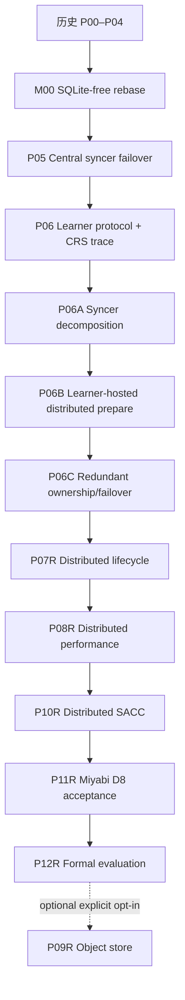

# DuraLoCo Codex Loop-Engineering Implementation Plans

> Forward-topology amendment (2026-07-13): D-0821 supersedes every executable
> C9/nine-node reference in P08R and later work. Current/future qualification,
> chaos, and formal runs use exactly eight learner nodes with no dedicated or
> idle ninth host. Older C9 text is historical design provenance only.

本目录定义 DuraLoCo 的 SQLite-free、event-sourced、dedicated-syncer-free 主线。当前
P00–P07（含 M00、P06A、P06B、P06C）均已完成；P07 verified implementation/Checker
commit 为 `c099adc`，独立 Checker PBS `2369002` 对 P07-A01–A24 给出 `PASS`。下一阶段
是 P08，必须从 P07 冻结的 lifecycle contract 顺序执行 profile-first performance work。

新的必需主线是：

```text
M00 → P05 → P06 → P06A → P06B → P06C → P07 → P08 → P10 → P11 → P12
```

P09 object-store backend 仍为 P12 后的显式可选扩展，不阻塞必需主线。

## 1. 最终目标

最终生产拓扑不分配专用 syncer 节点。每个 learner 节点同时运行：

1. GPU learner process；
2. 一个受资源限制的 Learner-Hosted Fragment Executor（LFE）；
3. 可选的 Floating Committer candidate。

LFE 根据 committed membership/ownership epoch 承担若干 fragment work orders。多个 LFE 可以对同一 work order 做重叠、延迟启动或 speculative execution；共享文件系统中的 immutable transition objects 与唯一 global head CAS 仍是 optimizer trajectory 的唯一 authority。执行可以 at-least-once，但逻辑 commit 必须 at-most-once。

本计划不把系统称为 fully decentralized、coordinator-free 或 exactly-once delivery。更准确的描述是：

> learner-hosted, fragment-sharded, redundantly executed synchronization with storage-mediated authority and a floating fenced committer.

## 2. 不可协商的架构边界

- 活跃代码、配置、CLI、脚本、测试和新 artifacts 中不允许 SQLite，也不允许以其他嵌入式数据库替代。
- 唯一持久 authority 是 immutable committed transition chain 加一个线性化 global head CAS；proposal、heartbeat、executor listing、prepared-object listing 都只用于 discovery 或 evidence。
- central syncer 在 P06 后保留为 Central Reference Syncer（CRS）：数值 oracle、故障基线和显式 fallback，不再是主线生产拓扑。
- learner 与 LFE 共置不改变故障模型：节点失效可以同时带走 learner 和 executor；correctness 只能依赖共享存储中的 committed state、immutable proposal、work order 和 prepared transition。
- LFE 默认只具有 prepare capability。只有当前持有 fenced commit lease 的 Floating Committer 可以发布 control transition 或执行 head CAS。
- parameter fragment 与对应 outer optimizer state 必须由同一 committed transition 原子引用；不得分别覆盖“最新文件”。
- membership revision与fragment ownership是committed control facts，且与committer fencing epoch分离。heartbeat/listing不能直接改变owner集合。
- duplicate execution 允许；同一 work-order identity 的不同结果 digest 是 fatal determinism violation，不得任选其一继续。
- P06B/P06C 必需路线继续使用单一 global committed history。per-fragment heads 不是默认实现，只能在 P10 后基于证据提出新的 protocol-generation ADR。
- `latest.json`、JSONL、CSV、heartbeats、运行报告和 monitoring metrics 都是派生或观测数据，不能驱动 correctness 决策。
- fresh open、takeover、CAS ambiguity、head jump、corruption suspicion 和 ownership epoch change 必须 empty-cache strict replay。

完整协议见 [`DISTRIBUTED_SYNCER_SYSTEM_DESIGN.md`](DISTRIBUTED_SYNCER_SYSTEM_DESIGN.md)。与相关工作的差异和 claim 边界见 [`RESEARCH_RELATED_WORK_AND_DIFFERENTIATION.md`](RESEARCH_RELATED_WORK_AND_DIFFERENTIATION.md)。

## 3. 阶段索引

| 阶段 | 定位 | 依赖 | 推荐分支 |
|---|---|---|---|
| [P00（历史）](01_P00_BASELINE_AND_RESEARCH_CONTRACT.md) | 冻结基线、研究契约与 Agent Spine | — | 已归档 |
| [P01（历史）](02_P01_PROTOCOL_V2_SCHEMAS_AND_VALIDATION.md) | Protocol v2 schema、身份与严格验证 | P00 | 已归档 |
| [P02（历史）](03_P02_REFERENCE_SIMULATOR_AND_IN_MEMORY_BACKEND.md) | 确定性参考模拟器与 in-memory backend | P01 | 已归档 |
| [P03（历史）](04_P03_STORAGE_ABSTRACTION_AND_POSIX_LUSTRE_CONTRACT.md) | 语义化 Storage API 与 POSIX/Lustre contract | P02 | 已归档 |
| [P04（历史）](05_P04_TRANSACTIONAL_FRAGMENT_LOG_AND_PREFIX_RECOVERY.md) | Transactional fragment log 与 prefix recovery | P03 | 已归档 |
| [M00（已完成）](06_M00_SQLITE_FREE_RUNTIME_REBASE_AND_P00_P04_REQUALIFICATION.md) | 删除 SQLite、建立 log-only runtime、重验 P00–P04 | P04 | 已归档 |
| [P05（已完成中心式参考）](07_P05_SYNCER_LEASE_FENCING_AND_FAILOVER.md) | Production syncer、lease/fencing 与 failover | M00 | 已归档 |
| [P06（已完成中心式生产阶段）](08_P06_LEARNER_INTERVALS_ADOPTION_AND_RECOVERY.md) | Learner interval、adoption、warm recovery；CRS characterization转交P06A | P05 | archive `06e3ca2` |
| [P06A（已完成）](08A_P06A_SYNCER_DECOMPOSITION_AND_REFERENCE_EQUIVALENCE.md) | 拆分 syncer kernel；冻结 CRS 数值/协议 oracle | P06 | 已归档 |
| [P06B（已完成）](08B_P06B_LEARNER_HOSTED_FRAGMENT_EXECUTORS_AND_DISTRIBUTED_PREPARE.md) | Learner-hosted executors、distributed prepare、floating commit；无专用 syncer | P06A | 已归档 |
| [P06C（已完成）](08C_P06C_REDUNDANT_FRAGMENT_OWNERSHIP_AND_FAILOVER.md) | 重叠 ownership、hedged execution、executor/committer failover | P06B | 已归档 |
| [P07R（已完成）](09_P07_COMPACTION_GC_ACKS_AND_LEARNER_CAPSULES.md) | 分散拓扑下的 compaction、reachability GC、acks 与 capsules | P06C | verified `c099adc` |
| [P08R（就绪）](10_P08_DIRECT_FRAGMENT_IO_STREAMING_REDUCER_AND_TELEMETRY.md) | LFE direct fragment I/O、streaming reducer、conditional bundling 与 interference telemetry | P07R | `codex/duraloco-p08-distributed-performance` |
| [P10R](11_P10_SACC_AND_ALGORITHM_SYSTEM_CODESIGN.md) | shadow-first、system-only-first Storage-Aware Controller | P08R | `codex/duraloco-p10-distributed-sacc` |
| [P11R](12_P11_MIYABI_INTEGRATION_CHAOS_AND_9NODE_ACCEPTANCE.md) | Miyabi chaos 与 dedicated-syncer-free D8 acceptance | P10R | `codex/duraloco-p11-distributed-acceptance` |
| [P12R](13_P12_FORMAL_EXPERIMENTS_ARTIFACT_AND_PAPER_EVIDENCE.md) | 正式实验、artifact、相关工作与 claim–evidence | P11R | `codex/duraloco-p12-distributed-evaluation` |
| [P09R（可选）](14_P09_OBJECT_STORE_BACKEND_AND_HYBRID_BASELINE_OPTIONAL.md) | Object-store backend 与 hybrid baseline | P12R + 显式选择 | `codex/duraloco-p09-distributed-object-store` |

## 4. 依赖图



P07R先冻结shared object identity、snapshot/reachability/GC/capsule interfaces，P08R再从
P07 verified commit顺序优化。当前仓库不并行演化两套尚未存在的shared schemas。P09R不
参与自动推进。

## 5. 拓扑与验证阶梯

P06 以前保留原中心式验证。P06B 以后采用以下命名：

| 代号 | 拓扑 | 用途 |
|---|---|---|
| C1/C2/C9 | dedicated Central Reference Syncer + learner(s) | 数值 oracle、历史兼容和比较基线 |
| D1 | 1 learner node；同节点 learner + LFE + bootstrap floating committer | 最小真实路径 |
| D2 | 2 learner nodes；无专用 syncer | ownership、committer、node failover |
| D8 | 8 learner nodes；8 learners + 8 LFEs；无专用 syncer | 主生产 acceptance |
| D8-R2 | D8，replication factor 2，primary/backup 或 hedge | 完整容错与研究配置 |

D8 的默认工作量与旧 C9 gate 对齐：GPT-2/WikiText-2、`inner_steps=50`、至少 10 committed outer transitions、目标 walltime 15 分钟。绝对时间是验收目标，不是可删除异常结果的理由；若机器或队列条件造成偏差，必须同时保存 matched-shape C9/D8 原始数据并解释。

## 6. 自动推进规则

每个阶段只有在以下条件同时成立时才可推进：

1. 全部 required acceptance IDs 有当前 clean commit 的证据；
2. 独立 Checker 给出 `PASS`，或 `PASS_WITH_FOLLOWUPS` 且无 required follow-up；
3. 双语 phase report、manifest、commands、raw traces、checksums 与 `STATE.yaml` 一致；
4. milestone commit 已创建但未自动 merge main；
5. 下一阶段的 dependency digest 与当前 verified commit 一致。

特别规则：

- P06 完成后，`next_action` 必须是 P06A；不得自动启动旧 P07/P08。
- P06A 未通过 CRS equivalence 前，不得把 execution 放到 learner hosts。
- P06B 未通过 D8 no-dedicated-syncer gate 前，不得实现 redundancy。
- P06C 未通过故障矩阵前，不得开始 destructive GC 或 controller enforcement。
- P07R完成后才启动P08R；P08R通过P07 regressions后才可进入P10R。
- P09R 只能由用户显式选择。

## 7. 全局 Gate

后续阶段必须持续证明：

1. active surface 的 SQLite/embedded-DB 扫描为零；
2. strict Protocol v2 validation、shared selection semantics 与 deterministic replay；
3. storage CAS、one-CAS transaction、prefix recovery 和 ancestry-aware response-loss reconciliation；
4. 删除全部 executor/committer 本地派生状态后只靠 committed log/head 恢复；
5. proposal interval 不重叠，boundary adoption 与 warm-recovery 契约不回归；
6. central reference与distributed execution的policy/control identity必须exact；同backend的
   parameter/outer-state/result content必须exact，跨CPU/GPU保留双方digest并通过冻结tolerance
   report，不把numeric equivalence冒充content identity；
7. prepare capability 与 commit capability 分离，stale executor/committer fencing fail closed；
8. committer fencing epoch、membership revision、ownership、work order、canonical prepared result、attempt evidence和final commit都可重放审计；
9. same-work-order duplicates 至多一个 logical commit，且 divergent digest 必须阻塞；
10. D1→D2→D8/D8-R2 分层验证，不在 Miyabi login 节点执行 runtime；
11. learner-host CPU interference、Lustre metadata/data I/O、publish→prepare→commit→adopt 延迟完整可观测；
12. P07R GC 不删除 live proposal、work order、prepared winner/loser grace roots、epoch/config、capsule、snapshot 或 replay pin；
13. P10R controller 的算法影响决策进入 committed evidence，shadow mode 先于 enforced mode；
14. P12R 的每项论文 claim 都有 immutable run IDs、原始数据、分析脚本和负结果。

## 8. 使用方式

Codex 每次恢复必须读取：根 `AGENTS.md`、`miyabi-development` skill、共同契约、两个系统设计、研究差异文档、当前阶段文件、`plans/duraloco/{STATE.yaml,DECISIONS.md,BLOCKERS.md}`、上一阶段报告及 Checker verdict。真实 HEAD 与计划基线不同，应保留现有改动并生成 drift report，不得强制 reset。

当前仓库应使用：

```text
P07 已完成且 Checker PASS。以 c099adc 为 verified planning basis 创建 P08 feature branch，
先读取 P07 phase/checker report 与 D-0709/D-0710，冻结 matched baseline 和 telemetry schema，
执行 targeted one-node profile，再按 D1→D2→D8/D8-R2 推进。不要在 profile gate 前实现 bundle，
也不要改变 single global head、strict replay、reachability/GC/capsule identity。
```

应用本计划包后，live `STATE.yaml` 应保持 P07 `completed`、P07-A01–A24、全部
checks/artifacts 与 Checker report，并把 `next_action` 指向从 verified P07 commit 启动 P08。
这不是新的 P07 runtime verdict，也不授权自动合并 `main`。

## 9. Artifact 与审批

证据写入 `artifacts/duraloco/<phase>/<run_id>/`。不得创建 `.db`、`.sqlite` 或替代数据库 dump。P07R destructive GC apply、超出既定 Miyabi 资源范围、公共云/真实凭据和公开发布仍需要明确批准。P09R 需要用户未来显式选择。

## 10. 文件校验

```bash
python3 scripts/agent/build_duraloco_master.py --check
(cd plans/duraloco/codex/DuraLoCo_Codex_Loop_Plans && sha256sum -c SHA256SUMS.txt)
```
