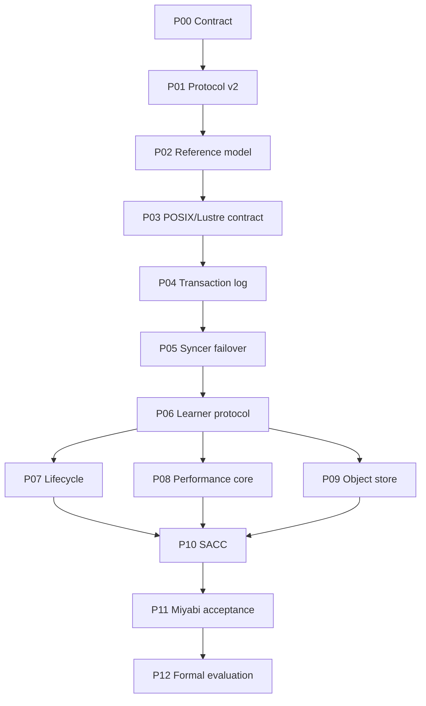

# DuraLoCo Codex Loop-Engineering Implementation Plans

本目录把 DuraLoCo 研究草稿拆成可交给 Codex 顺序执行的阶段计划。研究草稿原有 M0–M6 被展开为 P00–P12，以缩小每个 feature branch 的语义跨度，并为每个阶段提供：

- 明确的 research claim 与非目标；
- 预期代码布局和设计决策；
- `SPECIFY/RED → IMPLEMENT/GREEN → HARDEN → CHECK → PERSIST` 循环；
- machine-checkable acceptance gates；
- maker–checker 交接；
- Miyabi 本地→登录节点→1 节点→2 节点→9 节点验证阶梯；
- 人工审批与停止条件；
- 可直接复制给 Codex 的启动 prompt。

## 1. 规划基线

- 实现仓库：https://github.com/UnbearableFate/fs_based_decoupled_diloco
- 规划分支：`codex/fs-diloco-miyabi`
- 规划提交：`011e180980e90c500bcd479a594ba47e507bb5d1`
- Miyabi skill：https://github.com/UnbearableFate/miyabi-development
- 研究草稿：[`references/DuraLoCo_research_draft_zh.md`](references/DuraLoCo_research_draft_zh.md)

Codex 每个阶段都必须验证真实 HEAD。若仓库已前进，产生 drift report 并基于当前状态适配；不得强制回退或覆盖用户改动。

## 2. 阶段索引

| 阶段 | 目标 | 依赖 | 推荐分支 |
|---|---|---|---|
| [P00](01_P00_BASELINE_AND_RESEARCH_CONTRACT.md) | 冻结基线、研究契约与 Agent Spine | — | `codex/duraloco-p00-contract` |
| [P01](02_P01_PROTOCOL_V2_SCHEMAS_AND_VALIDATION.md) | Protocol v2 Schema、身份与严格验证 | P00 | `codex/duraloco-p01-protocol-v2` |
| [P02](03_P02_REFERENCE_SIMULATOR_AND_IN_MEMORY_BACKEND.md) | 确定性参考模拟器与 In-Memory Backend | P01 | `codex/duraloco-p02-reference-model` |
| [P03](04_P03_STORAGE_ABSTRACTION_AND_POSIX_LUSTRE_CONTRACT.md) | 语义化 Storage API 与 POSIX/Lustre Contract | P02 | `codex/duraloco-p03-posix-storage` |
| [P04](05_P04_TRANSACTIONAL_FRAGMENT_LOG_AND_PREFIX_RECOVERY.md) | Transactional Fragment Log 与 Prefix Recovery | P03 | `codex/duraloco-p04-transaction-log` |
| [P05](06_P05_SYNCER_LEASE_FENCING_AND_FAILOVER.md) | 生产 Syncer 集成、Lease/Fencing 与 Failover | P04 | `codex/duraloco-p05-syncer-failover` |
| [P06](07_P06_LEARNER_INTERVALS_ADOPTION_AND_RECOVERY.md) | Learner Contribution Intervals、Adoption 与 Warm Recovery | P05 | `codex/duraloco-p06-learner-protocol` |
| [P07](08_P07_COMPACTION_GC_ACKS_AND_LEARNER_CAPSULES.md) | Compaction、Reachability GC、Ack 与 Learner Capsules | P06 | `codex/duraloco-p07-lifecycle` |
| [P08](09_P08_DIRECT_FRAGMENT_IO_STREAMING_REDUCER_AND_TELEMETRY.md) | Direct Fragment I/O、Streaming Reducer 与 Telemetry | P06 | `codex/duraloco-p08-performance-core` |
| [P09](10_P09_OBJECT_STORE_BACKEND_AND_HYBRID_BASELINE.md) | S3-Compatible Backend、MinIO 与 Hybrid Baseline | P06 | `codex/duraloco-p09-object-store` |
| [P10](11_P10_SACC_AND_ALGORITHM_SYSTEM_CODESIGN.md) | Storage-Aware Commit Controller（SACC）与算法–系统协同 | P07, P08, P09 | `codex/duraloco-p10-sacc` |
| [P11](12_P11_MIYABI_INTEGRATION_CHAOS_AND_9NODE_ACCEPTANCE.md) | Miyabi 集成、Chaos Runner 与 9 节点 Acceptance | P10 | `codex/duraloco-p11-miyabi-acceptance` |
| [P12](13_P12_FORMAL_EXPERIMENTS_ARTIFACT_AND_PAPER_EVIDENCE.md) | 正式实验、Artifact 与论文 Claim–Evidence | P11 | `codex/duraloco-p12-evaluation` |

共同执行契约：[`00_CODEX_LOOP_OPERATING_CONTRACT.md`](00_CODEX_LOOP_OPERATING_CONTRACT.md)

## 3. 依赖图



P08 与 P09 在 P06 之后可以使用独立 worktree 并行开发，但不能由多个 agent 同时修改 `log/head/frontier/commit` 或 production syncer 核心。集成仍应由单 writer 完成。

## 4. 与研究里程碑的映射

| 研究草稿里程碑 | Codex 阶段 |
|---|---|
| M0 Research Contract | P00–P01 |
| M1 Reference Protocol | P02 |
| M2 POSIX DuraLoCo | P03–P06、P08 |
| M3 Object-Store DuraLoCo | P09 |
| M4 Recovery and Lifecycle | P07 |
| M5 Performance Controller | P10 |
| M6 Formal Evaluation | P11–P12 |

## 5. 如何使用

### 5.1 放入仓库

建议把本目录复制为：

```text
<repo>/plans/duraloco/codex/
```

把研究草稿保留为：

```text
<repo>/plans/duraloco/codex/references/DuraLoCo_research_draft_zh.md
```

### 5.2 第一次启动

先交给 Codex：

```text
读取 plans/duraloco/codex/README.md、00_CODEX_LOOP_OPERATING_CONTRACT.md 和 01_P00_BASELINE_AND_RESEARCH_CONTRACT.md。使用 miyabi-development skill，从 P00 开始。不要跳过 research contract，不要在 Miyabi 登录节点运行 runtime，不要自动 merge main。
```

### 5.3 后续阶段

每次只打开一个新的 Codex 实现会话，并提供：

- 当前阶段文件；
- 上一阶段 `PHASE_REPORT.md`；
- 最新 `STATE.yaml`；
- feature branch/commit；
- 已批准或拒绝的 decisions；
- 允许使用的 Miyabi/云资源范围。

不要用一个无限会话连续实现所有阶段。阶段边界既是代码审查边界，也是研究语义审批边界。

## 6. 全局禁止跳过的 Gate

在昂贵训练前，必须完成：

1. strict Protocol v2 validation；
2. deterministic reference model；
3. storage CAS contract；
4. one-CAS transactional fragment commit；
5. prefix recovery；
6. lease/fencing；
7. learner interval base freeze；
8. safe lifecycle/GC；
9. 1-node与2-node真实运行；
10. Miyabi 作业通过资源预检；单个作业不超过 16 节点且 walltime 不超过 2 小时。

任何阶段出现 proposal double logical inclusion、split-brain、fragment/outer-state unpaired、live-object deletion 或无法重建 authority state，后续性能/训练阶段全部阻塞。

## 7. Artifact 目录

本计划附带：

```text
templates/PHASE_STATE.yaml
templates/PHASE_REPORT.md
templates/BLOCKER.md
templates/RUN_MANIFEST.json
references/DuraLoCo_research_draft_zh.md
```

实现时应把模板复制到仓库实际 `plans/duraloco/` 和 `artifacts/duraloco/` 位置，而不是直接修改本计划模板作为运行状态。

## 8. 资源与审批摘要

- P00–P02：主要本地/reference；无需多节点。
- P03–P06：需要 Miyabi 1/2-node contract 和 E2E。
- P07：GC 默认 dry-run；apply 需要批准。
- P08：需要 1-node GPU profile 和 2-node pipeline。
- P09：MinIO；真实公共云需要凭据/预算批准。
- P10：controller 先 shadow；动态算法参数需要批准。
- P11：9-node acceptance 可由 agent 自主申请和执行，无需用户批准。
- P12：单个 Miyabi 作业在 `select<=16`、`walltime<=02:00:00` 范围内由 agent 自主决定，包括 9-node 和 multi-seed 作业；超限作业、公共云和 artifact 发布分别审批。

## 9. 最终研究完成条件

计划完成不等于论文一定成立。P12 必须允许得到以下三种结论之一：

1. **Supported**：存在明确 break-even region，DuraLoCo 在 matched quality 下提高 failure goodput，并减少独立 global checkpoint 开销；
2. **Bounded/conditional**：仅在特定 local interval、fragment size、failure rate 或 backend 下成立；
3. **Rejected/negative**：storage amplification/tail latency 抵消恢复收益。

三种结果都必须保留证据。不得通过删除不利实验或扩大未经验证的 claim 来制造成功。

## 10. 文件校验

本目录根部生成 `SHA256SUMS.txt`。交给 Codex 或上传仓库后可使用：

```bash
sha256sum -c SHA256SUMS.txt
```
