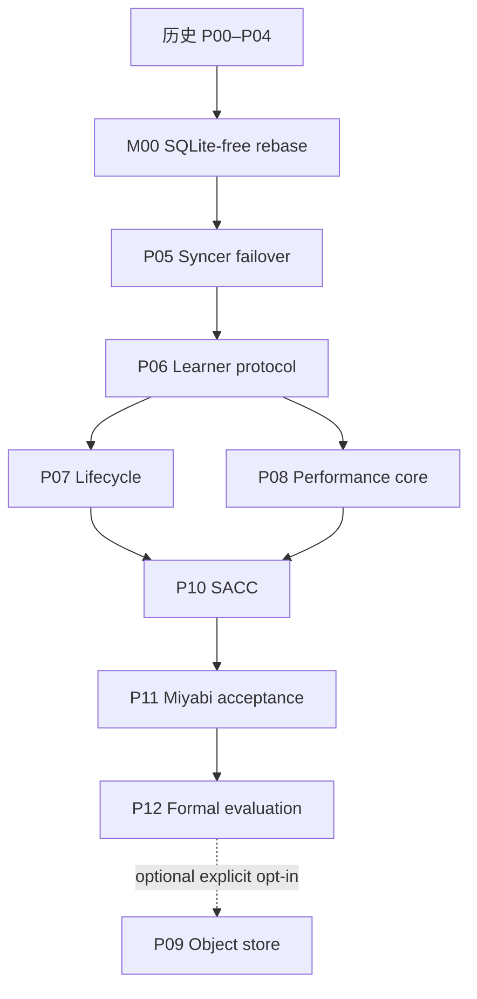

# DuraLoCo Codex Loop-Engineering Implementation Plans

本目录描述 SQLite-free 路线。P00–P04 是历史基线；M00 已完成并以 `PASS`/无 required follow-up 重新验收全部 41 个 P00–P04 acceptance IDs。当前执行起点是 P05，必须从 M00 corrected archival tip `89ae48aae5956b09fc6685074d3ea0eaea36b816` 或经 drift report 证明等价的后继 commit 开始。

必需主线是 `M00 → P05 → P06 → (P07, P08) → P10 → P11 → P12`。P09 object-store backend 保留在整体计划最后，默认不实现、不验证、不阻塞主线。

## 1. 不可协商的系统边界

- 活跃代码、配置、CLI、脚本、测试和新 artifacts 中不允许 SQLite，也不允许以 LMDB、DuckDB 或其他嵌入式数据库替代。
- 唯一持久 authority 是 immutable committed transition objects 加一个线性化 head CAS；proposal listing 只负责发现，不负责裁决。
- 本地查询状态是进程内、不可变的 `RuntimeView`，由 full replay 构建；P07 可增加经过 digest 等价验证的 snapshot+suffix replay，但不得新增数据库。
- `latest.json`、JSONL、CSV、heartbeats、运行报告和监控指标都是派生或观测数据，不能驱动 correctness 决策。
- 历史 SQLite run 保持只读；新系统不提供 SQLite reader、converter 或双写桥。若要复用 checkpoint，只能显式创建新 generation，语义是 warm-start，不是 exact continuation。
- M00 的 strict/memoized production replay 契约已成为后续基线；fresh open、takeover、CAS ambiguity、head jump 和 corruption suspicion 必须 empty-cache strict replay，memoization 不得持久或跨 owner。

详细设计见 [`SQLITE_FREE_SYSTEM_DESIGN.md`](SQLITE_FREE_SYSTEM_DESIGN.md)，M00 实际失败所得约束见 [`M00_IMPLEMENTATION_LESSONS.md`](M00_IMPLEMENTATION_LESSONS.md)，共同执行约束见 [`00_CODEX_LOOP_OPERATING_CONTRACT.md`](00_CODEX_LOOP_OPERATING_CONTRACT.md)。

## 2. 阶段索引

| 阶段 | 定位 | 依赖 | 推荐分支 |
|---|---|---|---|
| [P00（历史）](01_P00_BASELINE_AND_RESEARCH_CONTRACT.md) | 冻结基线、研究契约与 Agent Spine | — | 已归档 |
| [P01（历史）](02_P01_PROTOCOL_V2_SCHEMAS_AND_VALIDATION.md) | Protocol v2 Schema、身份与严格验证 | P00 | 已归档 |
| [P02（历史）](03_P02_REFERENCE_SIMULATOR_AND_IN_MEMORY_BACKEND.md) | 确定性参考模拟器与 In-Memory Backend | P01 | 已归档 |
| [P03（历史）](04_P03_STORAGE_ABSTRACTION_AND_POSIX_LUSTRE_CONTRACT.md) | 语义化 Storage API 与 POSIX/Lustre Contract | P02 | 已归档 |
| [P04（历史）](05_P04_TRANSACTIONAL_FRAGMENT_LOG_AND_PREFIX_RECOVERY.md) | Transactional Fragment Log 与 Prefix Recovery | P03 | 已归档 |
| [M00（已完成的第 0 里程碑）](06_M00_SQLITE_FREE_RUNTIME_REBASE_AND_P00_P04_REQUALIFICATION.md) | 删除 SQLite、建立 log-only runtime、重验 P00–P04 | P04 | `89ae48a` 已归档 |
| [P05](07_P05_SYNCER_LEASE_FENCING_AND_FAILOVER.md) | 生产 Syncer、Lease/Fencing 与 Failover | M00 | `codex/duraloco-p05-syncer-failover` |
| [P06](08_P06_LEARNER_INTERVALS_ADOPTION_AND_RECOVERY.md) | Learner Contribution Intervals、Adoption 与 Warm Recovery | P05 | `codex/duraloco-p06-learner-protocol` |
| [P07](09_P07_COMPACTION_GC_ACKS_AND_LEARNER_CAPSULES.md) | Compaction、Reachability GC、Ack 与 Learner Capsules | P06 | `codex/duraloco-p07-lifecycle` |
| [P08](10_P08_DIRECT_FRAGMENT_IO_STREAMING_REDUCER_AND_TELEMETRY.md) | Direct Fragment I/O、Streaming Reducer 与 Telemetry | P06 | `codex/duraloco-p08-performance-core` |
| [P10](11_P10_SACC_AND_ALGORITHM_SYSTEM_CODESIGN.md) | Storage-Aware Commit Controller 与协同优化 | P07, P08 | `codex/duraloco-p10-sacc` |
| [P11](12_P11_MIYABI_INTEGRATION_CHAOS_AND_9NODE_ACCEPTANCE.md) | Miyabi 集成、Chaos 与 9-node Acceptance | P10 | `codex/duraloco-p11-miyabi-acceptance` |
| [P12](13_P12_FORMAL_EXPERIMENTS_ARTIFACT_AND_PAPER_EVIDENCE.md) | 正式实验、Artifact 与 Claim–Evidence | P11 | `codex/duraloco-p12-evaluation` |
| [P09（可选，暂缓）](14_P09_OBJECT_STORE_BACKEND_AND_HYBRID_BASELINE_OPTIONAL.md) | S3-Compatible Backend、MinIO 与 Hybrid Baseline | P12 + 显式选择 | `codex/duraloco-p09-object-store` |

## 3. 依赖图



P07 与 P08 可以在独立 worktree 开发，但 shared log/head/frontier/commit 与 production syncer 仍由单 writer 集成。P09 不参与自动推进。

## 4. 研究里程碑映射

| 路线里程碑 | 阶段 |
|---|---|
| Historical foundation | P00–P04 |
| Milestone 0: SQLite-free foundation | M00 |
| POSIX DuraLoCo runtime | P05–P08 |
| Performance controller | P10 |
| Miyabi acceptance | P11 |
| Formal evaluation | P12 |
| Optional object-store extension | P09 |

## 5. 使用方式

### 5.1 每次恢复必读

Codex 必须读取根 `AGENTS.md`、`miyabi-development` skill、共同契约、SQLite-free 设计、[`P00_P04_IMPLEMENTATION_LESSONS.md`](P00_P04_IMPLEMENTATION_LESSONS.md)、[`M00_IMPLEMENTATION_LESSONS.md`](M00_IMPLEMENTATION_LESSONS.md)、`plans/duraloco/{STATE.yaml,DECISIONS.md,BLOCKERS.md}`、M00 最终报告和当前阶段文件。真实 HEAD 若与计划基线不同，应保留现有改动并生成 drift report，不得强制 reset。

### 5.2 当前启动点

```text
使用 miyabi-development skill 执行 P05。从 M00 corrected archival tip 89ae48aae5956b09fc6685074d3ea0eaea36b816 开始，读取共同契约、SQLITE_FREE_SYSTEM_DESIGN.md、P00_P04_IMPLEMENTATION_LESSONS.md、M00_IMPLEMENTATION_LESSONS.md、M00 最终报告/Checker 和 07_P05_SYNCER_LEASE_FENCING_AND_FAILOVER.md。保留 M00 的单 head-CAS、strict/memoized replay、marker-last publication 和分阶段 telemetry 契约，按 1→2→9 节点阶梯实现 lease/fencing/failover/authoritative stop；不要自动 merge main。
```

### 5.3 自动推进

每个阶段只有在所有 acceptance IDs 有当前实现证据、独立 Checker 通过、双语 phase report 和 milestone commit 完成后才可自动推进。P05 从 M00 corrected archival tip 开始；任何非 transient 9-node terminal 失败后必须暂停同 shape 重提，先做 review、targeted benchmark 和同 commit 1→2-node 重验收。

### 5.4 English milestone summary

P00–P04 are historical evidence. M00 is complete: all 41 remapped gates passed on the SQLite-free runtime, with one committed-log/head authority and strict/memoized replay equivalence. P05 is the current start point. P05–P12 must preserve the M00 replay, publication, validation, telemetry, and no-database contracts. P09 remains an optional post-P12 extension.

## 6. 全局 Gate

在后续阶段推进前必须持续证明：

1. active surface 的 SQLite/embedded-DB 扫描为零；
2. strict Protocol v2 validation、shared selection semantics 与 deterministic replay；
3. storage CAS、one-CAS transaction、prefix recovery 和 ancestry-aware response-loss reconciliation；
4. 删除全部本地派生状态后只靠 committed log/head 恢复；
5. full 与 fragment production tensor path 具有事务一致性；
6. lease/fencing、learner interval、safe lifecycle 和 performance controller 各阶段 gate；
7. 所有 mutation request identity；P05+ 的失败/取消/重试 manifest 使用 schema v2，
   具有稳定 `validation_shape`、scheduler/termination evidence 与 `parent_run_id` lineage；
8. Miyabi login 节点仅 control-plane，runtime 按 1→2→9 节点验证；
9. 从 M00 起每个 milestone 的 9-node GPT-2/WikiText-2、50 inner steps × 10 outer transitions terminal gate；
10. 最终干净 commit 上 tests、state、双语 report、checksums 与 Checker verdict 一致。
11. M00 反例持续通过：head jump/corrupt successor 不污染 memoization，takeover empty-cache strict replay，same-base flood 在 payload I/O 前拒绝；
12. 大对象一次验证结果在 transaction attempt 内复用，分阶段 telemetry 和 terminal retry review 齐全。

任何 SQLite 读写、第二 authority、durable `selected/pending/applied` 状态、proposal listing 决定 correctness、或无法仅凭 log 恢复的行为都会阻塞后续阶段。

## 7. Artifact 与审批

运行证据写入 `artifacts/duraloco/<phase>/<run_id>/`，至少包含 manifest、commands、checker report 和必要 raw traces；不得创建 `.db`、`.sqlite` 或 DB dump。P07 destructive GC apply、公共云/真实凭据、超出既定 Miyabi 资源范围和公开发布仍需要明确批准。P09 只有用户未来显式选择后才启动。

## 8. 最终完成条件

必需路线在 P12 完成，P09 不是完成条件。P12 可以得出 Supported、Bounded/conditional 或 Rejected/negative，三者都必须保存完整证据，不得通过删除不利结果制造成功。

## 9. 文件校验

```bash
python scripts/agent/build_duraloco_master.py --check
(cd plans/duraloco/codex/DuraLoCo_Codex_Loop_Plans && sha256sum -c SHA256SUMS.txt)
```
