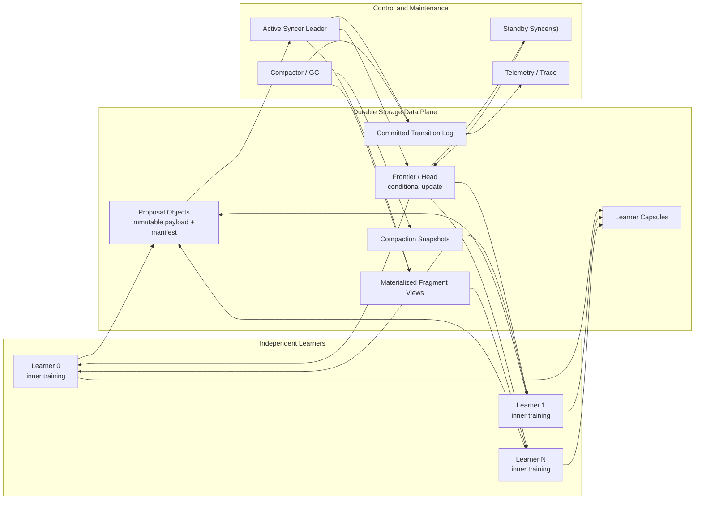
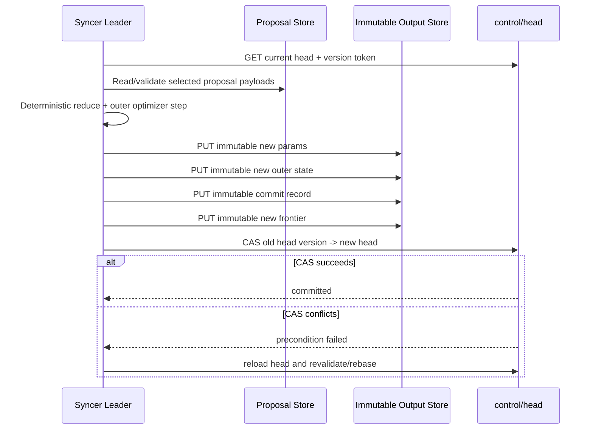
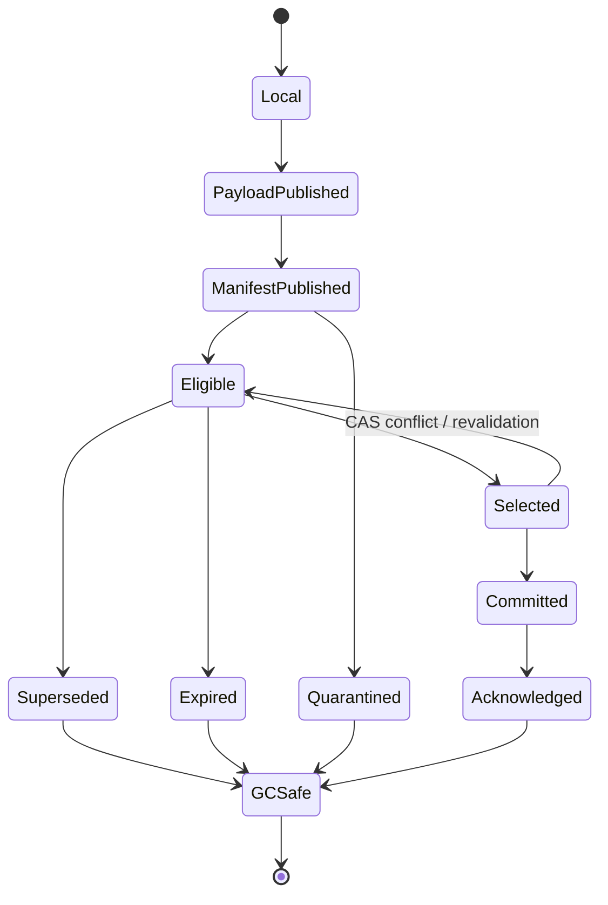
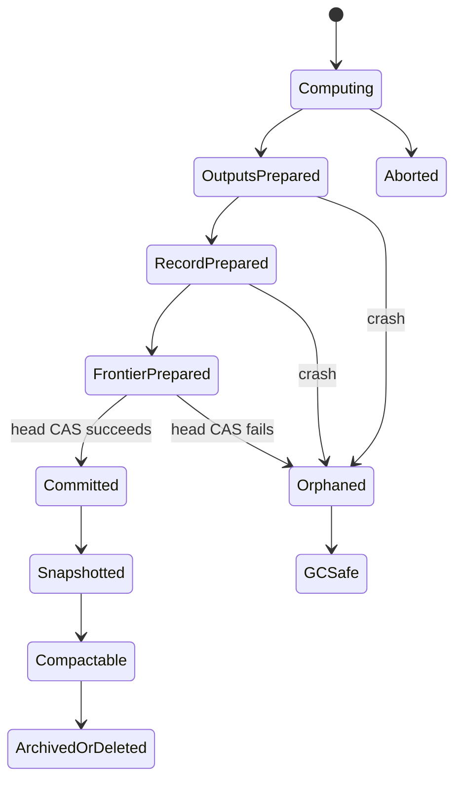

# DuraLoCo：An Event-Sourced Storage-Native Optimizer for Decoupled LLM Training

> **文档性质。** 本文是一份研究提案与未完成论文草稿，不包含尚未完成实验的虚构结果。文中所有“预期”“假设”“目标”均需通过后续实现和实验验证；表格中的结果占位符不得在投稿前作为事实引用。  
>
> **研究范围。** DuraLoCo 不试图替代 NCCL/RDMA 所服务的高频同步训练。它面向通信稀疏、异步、跨故障域、可接受有界陈旧性的 Decoupled DiLoCo 类训练。  
>
> **核心主张。** DuraLoCo 将 learner 产生的 fragment proposal、syncer 的 quorum 决策、outer optimizer 转移、全局 fragment 版本以及恢复边界统一到一个持久化事件日志中，使“通信数据面”和“全局 checkpoint 数据面”成为同一个可事务提交、可重放、可压缩的数据结构。

## 摘要

现代大模型预训练通常依赖紧耦合的 SPMD 执行和低延迟集合通信。一旦某个设备、网络链路或训练进程发生故障，整个训练作业往往需要暂停、重配置或从周期性 checkpoint 回滚。DiLoCo 通过在多个 learner 上执行大量本地优化步骤、仅周期性交换模型更新来显著降低通信频率；Decoupled DiLoCo 进一步使用异步 learner、parameter fragments、minimum quorum、adaptive grace window 和 token-weighted merge，降低 straggler 与故障对全局 goodput 的影响。然而，其通信和 checkpoint 仍可以被视为两条相对独立的数据路径：parameter-fragment 消息负责在线同步，一致性 checkpoint 负责极端故障后的全局恢复。

本文提出 **DuraLoCo**，一种面向 Decoupled LLM training 的事件溯源式 storage-native optimizer。DuraLoCo 将每个 learner update 表示为不可变的、内容寻址的 fragment proposal；将每次 quorum merge 表示为确定性的 outer-optimizer transition；并通过单个条件更新的 frontier manifest 作为逻辑提交点。已提交的 transition log 是全局参数 fragments、outer optimizer state、proposal consumption state 和恢复位置的权威来源。大对象在提交前写入持久化存储，metadata head 的 compare-and-swap 是唯一线性化点。由此，重复提交、客户端超时、syncer 崩溃和 leader 切换可以通过幂等重试与日志重放处理，而无需将 syncer-local 数据库视为权威状态。

DuraLoCo 区分三种恢复语义：全局优化器的精确前缀恢复、learner 的 warm restart，以及通过低频 learner capsule 实现的 exact learner restart。该区分避免了把单个 parameter fragment 误称为完整训练 checkpoint。系统同时支持 POSIX parallel filesystem 和 S3-compatible object storage，并通过 storage-aware commit controller 调整 local interval、fragment bundling、in-flight depth、grace window 与 compaction，以使持久化数据路径的尾延迟尽可能隐藏在本地训练之下。

计划中的评估包含四类核心证据：第一，使用确定性参考模型和逐阶段 crash injection 验证 exactly-once logical inclusion、prefix-recoverability、fencing 和安全 GC；第二，对 Lustre、MinIO 和至少一种真实公共对象存储进行端到端延迟、I/O amplification、对象数量和成本测量；第三，在 matched-token、matched-compute 条件下比较 network Decoupled DiLoCo、filesystem prototype、metadata-RPC hybrid、普通 checkpoint+restart 与 DuraLoCo；第四，在 learner/syncer failure、异构速度和存储尾延迟下测量模型质量、ML goodput、恢复时间和重复训练量。本文的目标不是证明持久化存储在所有训练场景中优于网络通信，而是确定其在低通信异步训练中的可行区间，并验证 communication–checkpoint fusion 是否能够在该区间显著改善故障下的总训练效率。

## Abstract

Modern large-model pre-training commonly relies on tightly coupled SPMD execution and latency-sensitive collectives. Failures and stragglers therefore stall or reconfigure an entire job, while periodic checkpoints introduce a separate persistence path and force a trade-off between checkpoint overhead and lost work. DiLoCo reduces communication by performing many local optimization steps between synchronizations, and Decoupled DiLoCo further introduces asynchronous learners, fragment-level synchronization, minimum quorums, adaptive grace windows, and token-aware merging.

We propose **DuraLoCo**, an event-sourced, storage-native optimizer for decoupled LLM training. DuraLoCo represents learner updates as immutable fragment proposals and each quorum merge as a deterministic outer-optimizer transition. A conditionally updated frontier manifest is the sole logical commit point, while the committed transition log is the authoritative source for global parameter fragments, outer-optimizer state, proposal-consumption state, and recovery boundaries. The design provides exactly-once logical proposal inclusion over at-least-once transport, prefix-consistent recovery after syncer failure, fenced leader failover, and storage-safe garbage collection. It distinguishes exact global-optimizer recovery from learner warm restart and exact learner recovery, the latter optionally supported by low-frequency learner capsules.

DuraLoCo targets POSIX parallel filesystems and S3-compatible object stores through a semantic storage interface based on immutable writes, conditional replacement, checksummed reads, and batched deletion. A storage-aware controller seeks to hide persistence tail latency beneath long local-compute intervals while bounding staleness, request cost, and storage amplification. We plan to evaluate protocol correctness under exhaustive crash injection, end-to-end training quality and goodput, backend portability, recovery efficiency, and the break-even region in which communication–checkpoint fusion outperforms separate ephemeral communication and periodic checkpointing.

**关键词：** Decoupled DiLoCo；异步分布式训练；事件溯源；对象存储；持久化日志；checkpoint；fault tolerance；outer optimizer；ML goodput


## 目录

1. [引言](#1-引言)
2. [背景与预备知识](#2-背景与预备知识)
3. [问题定义](#3-问题定义)
4. [相关工作与差异](#4-相关工作与差异)
5. [DuraLoCo 总体架构](#5-duraloco-总体架构)
6. [优化方法与状态表示](#6-优化方法与状态表示)
7. [Transactional Fragment Transition 协议](#7-transactional-fragment-transition-协议)
8. [一致性模型与正确性论证](#8-一致性模型与正确性论证)
9. [恢复设计](#9-恢复设计)
10. [Storage-Aware System–Algorithm Co-design](#10-storage-aware-systemalgorithm-co-design)
11. [从现有 FS Prototype 迁移到 DuraLoCo](#11-从现有-fs-prototype-迁移到-duraloco)
12. [实验设计](#12-实验设计)
13. [预期论文主张与证据矩阵](#13-预期论文主张与证据矩阵)
14. [可能的负面结果及其研究价值](#14-可能的负面结果及其研究价值)
15. [局限性](#15-局限性)
16. [Threats to Validity](#16-threats-to-validity)
17. [安全、隐私与成本](#17-安全隐私与成本)
18. [项目计划与里程碑](#18-项目计划与里程碑)
19. [论文写作结构建议](#19-论文写作结构建议)
20. [待完成的结果章节模板](#20-待完成的结果章节模板)
21. [结论](#21-结论)
22. [附录](#附录-a协议-schema-草案)
23. [参考文献](#参考文献)

---

# 1. 引言

## 1.1 背景

大规模语言模型训练通常将设备组织为紧耦合的 data、tensor、pipeline 或 sequence parallel group。每一步训练依赖集合通信和一致的全局执行进度。该结构能够提供清晰的同步优化语义，但会形成较大的故障 blast radius：一个设备失效、一个 rank 暂停或一个跨节点链路抖动，都可能阻塞整个 SPMD 作业。

DiLoCo 将训练划分为多个相对独立的 learner island。每个 learner 使用 inner optimizer 连续训练较多 local steps，之后才交换一次 pseudo-gradient 或模型差分，再由 outer optimizer 执行全局更新。原始工作表明，这类方法能够在保持有竞争力模型质量的同时显著降低跨岛通信量 [1]。Decoupled DiLoCo 进一步取消全局 lock-step，将参数划分为 fragments，并由 syncer 根据 minimum quorum、adaptive grace window 和动态 token 权重异步合并 learner updates [2]。该结构允许训练在部分 learner 失效或变慢时继续推进。

这种算法结构改变了通信系统的基本约束。对于同步 data parallel，通信延迟直接位于每一步 critical path；对于 Decoupled DiLoCo，通信对象较大但频率较低，且可以与下一段本地训练重叠。因此，通信 substrate 不一定必须提供微秒级延迟。只要它能够提供足够的吞吐、可接受的尾延迟、明确的一致性原语和可靠的故障恢复，持久化存储也可能承担更新交换任务。

## 1.2 核心观察

传统训练系统通常维护两条状态路径：

```text
在线通信路径:
  gradient / parameter update
  → collective / RPC / parameter server
  → 临时消息，消费后即丢弃

故障恢复路径:
  model + optimizer + scheduler + dataloader state
  → 周期性 checkpoint
  → filesystem / object store
```

对于低通信异步训练，learner proposal 已经包含大量恢复所需信息：

```text
learner identity
learner session and monotonic sequence
fragment identity
base fragment version
base frontier digest
local steps and token count
parameter delta or local end weight
payload hash, shape, dtype, and creation metadata
```

syncer 对这些 proposals 做出的 quorum selection、weighting 和 outer update 又足以确定新的全局 fragment 与 outer optimizer state。因此，**已提交的 optimizer transition 可以同时是同步结果和增量全局 checkpoint**。如果 transition 被持久化为不可变日志，系统可以从该日志恢复全局训练状态，而不必额外定期复制一次完整 global model 和 outer optimizer。

这一观察并不意味着“每个 learner update 都是完整 checkpoint”。单个 proposal 通常缺少 inner optimizer、RNG、dataloader cursor、scheduler 和尚未提交的 local state。DuraLoCo 因而把研究问题限定为：

> 能否把异步 fragment-level outer optimization 的已提交更新流变成全局训练状态的唯一权威日志，并在此基础上减少或消除独立的 full global checkpoint 路径？

## 1.3 研究问题

本文围绕以下主问题展开：

> **Can durable storage serve as the primary communication and global-recovery substrate for low-communication asynchronous LLM pre-training?**

进一步分解为八个研究问题：

- **RQ1 — Correctness：** 如何在 object/POSIX storage 的单对象原子性之上，实现 quorum merge 的 exactly-once logical inclusion 和 fragment/outer-state 原子可见性？
- **RQ2 — Recovery：** syncer 在任意提交阶段崩溃后，能否恢复到某个完整 committed prefix，而不重复或丢失已提交 update？
- **RQ3 — Fusion：** 将 optimizer transition log 作为 global checkpoint 后，能否降低周期性 checkpoint I/O、恢复时间和 failure 后重复训练量？
- **RQ4 — Performance：** 在什么 local interval、fragment size、quorum 和 storage latency 区间内，持久化 I/O 可以被本地训练隐藏？
- **RQ5 — Portability：** 同一协议能否在 Lustre/POSIX、MinIO/S3-compatible 和真实云对象存储上保持相同安全语义？
- **RQ6 — ML Quality：** bounded staleness、durable proposal selection 和恢复策略是否会影响 matched-token 条件下的收敛和下游质量？
- **RQ7 — Cost：** durability 带来的写放大、对象请求和跨区域费用是否低于 separate checkpoint 与故障回滚的总成本？
- **RQ8 — Scalability：** manifest、proposal index、compaction 和 GC 能否在长时间运行及较多 learners/fragments 下保持有界开销？

## 1.4 预期贡献

若实现和实验成立，本文计划形成以下贡献：

1. **Transactional Fragment Transition（TFT）。** 定义一个训练专用提交抽象，将 selected proposals、merge weights、new parameter fragment 和 new outer optimizer state 绑定为一个逻辑原子 transition。
2. **Event-Sourced Global Optimizer。** 将 committed transition log 设为全局参数、outer state、proposal-consumption frontier 和 checkpoint frontier 的权威来源；materialized fragments 只是可重建视图。
3. **Prefix-Consistent Recovery。** 在 at-least-once 存储访问、重复响应、客户端超时和 syncer 崩溃下，提供 exactly-once logical proposal inclusion、fenced leader failover 和 committed-prefix recovery。
4. **Storage-Native Data Plane。** 通过语义级 backend interface，在 POSIX parallel filesystem 和 S3-compatible object storage 上实现同一协议，而不依赖目录 listing 作为正确性条件。
5. **Storage-Aware System–Algorithm Co-design。** 基于存储尾延迟、local compute budget、staleness 和 request cost，自适应控制 fragment bundling、in-flight depth、grace、compaction，必要时在受控区间内调整 local interval。
6. **完整实证研究。** 用 crash-prefix correctness、真实 end-to-end LLM training、对象存储成本、failure schedules 和 paired event tapes 确定 DuraLoCo 的有效区间与失败边界。

## 1.5 非目标与非主张

DuraLoCo 明确不做以下主张：

- 不声称在高频同步训练中优于 NCCL、RDMA 或集合通信。
- 不声称一个 parameter fragment 等于完整 learner checkpoint。
- 不声称对象存储访问没有网络成本；它本质上仍消耗网络带宽、请求额度和持久化资源。
- 不依赖“exactly-once delivery”；底层传输允许 at-least-once，系统只保证 proposal 的 exactly-once **logical inclusion**。
- 不保证 Byzantine 或恶意 learner 场景；初版只处理 crash、omission、duplication、reordering、staleness 和可检测的数据损坏。
- 不假设所有模型规模、failure rate 或存储 backend 都能从 storage-native 方案获益。
- 不把 deterministic global optimizer replay 等同于 bitwise-identical full-training replay；后者还需要 learner 数据、RNG 与执行事件带。


# 2. 背景与预备知识

## 2.1 DiLoCo

设第 \(i\) 个 learner 在第 \(r\) 个 outer round 开始时获得全局参数 \(\theta^{(r)}\)。learner 使用 inner optimizer（原始 DiLoCo 主要采用 AdamW）执行 \(H\) 个本地步骤：

\[
\theta_{i,0}^{(r)} = \theta^{(r)},
\]

\[
\theta_{i,h+1}^{(r)}
=
\operatorname{InnerOpt}\left(
\theta_{i,h}^{(r)},
\nabla \ell_{i,h}
\right),\quad h=0,\ldots,H-1.
\]

本地训练结束后，learner 形成 pseudo-gradient：

\[
\Delta_i^{(r)}
=
\theta^{(r)}-\theta_{i,H}^{(r)}.
\]

同步器聚合多个 learners 的 pseudo-gradients，并使用 outer optimizer 更新全局模型：

\[
\bar{\Delta}^{(r)}
=
\sum_i \alpha_i^{(r)}\Delta_i^{(r)},
\qquad
\sum_i \alpha_i^{(r)}=1,
\]

\[
\left(
\theta^{(r+1)},o^{(r+1)}
\right)
=
\operatorname{OuterOpt}\left(
\theta^{(r)},o^{(r)},\bar{\Delta}^{(r)}
\right),
\]

其中 \(o^{(r)}\) 是 outer momentum、Adam moments 或其他全局优化器状态。DiLoCo 的关键性质是 \(H\) 较大，使跨 learner 通信频率远低于逐步 all-reduce [1]。

## 2.2 Decoupled DiLoCo

Decoupled DiLoCo 取消了 learners 之间的同步 outer-round barrier，并将参数划分为多个 fragments。learners 独立执行 local training，并异步发送 fragment updates。syncer 对每个目标 fragment：

1. 等待 minimum quorum；
2. 在 quorum 达到后继续等待 adaptive grace window；
3. 根据 learner 处理的 token 数、速度和 update 陈旧度分配权重；
4. 对选中的 fragment updates 执行 outer optimization；
5. 将新的 fragment 广播给 learners。

该方法将单个 learner 的故障隔离在局部，不再要求所有 learners 同步到达同一 outer step [2]。原工作还使用 vector clocks 进行状态协调，并通过 event tape 记录参与者集合、token 权重和 failure/recovery events；其一致性 checkpoint 采用 Chandy–Lamport 风格的分布式快照 [2, 11]。

这意味着 DuraLoCo 不能把“event tape”“一致性 checkpoint”或“learner recovery”本身作为独立新颖性。DuraLoCo 的差异在于：**它将已提交 optimizer transitions 直接设为权威 durable state，从而尝试消除与在线同步并行存在的 full global checkpoint 数据路径。**

## 2.3 Fragment-Level Outer Optimization

设模型被划分为 \(F\) 个互不重叠的参数 fragments：

\[
\theta
=
\left[
\theta_0,\theta_1,\ldots,\theta_{F-1}
\right].
\]

第 \(f\) 个 fragment 的状态为：

\[
X_f^{(v)}
=
\left(
\theta_f^{(v)},
o_f^{(v)},
v,
c_f^{(v)}
\right),
\]

其中：

- \(\theta_f^{(v)}\)：第 \(v\) 个 committed version 的参数；
- \(o_f^{(v)}\)：与其对应的 outer optimizer state；
- \(v\)：fragment version；
- \(c_f^{(v)}\)：生成该版本的 commit identifier。

如果 outer optimizer state 能按参数 fragment 独立分片，则不同 fragments 的数值更新可以独立计算；但 learner local training 仍可能依赖全模型的某个版本向量。因此 proposal 必须携带足够的因果 metadata，而不能只携带一个全局整数 step。

## 2.4 持久化存储提供的原语

DuraLoCo 不要求存储系统提供多对象事务。它只依赖以下最小语义：

- immutable object create；
- read-after-write visibility；
- 对小型 head/manifest 的 conditional replace 或等价 compare-and-swap；
- 可验证的对象读取；
- best-effort listing，用于发现和 GC，而不是 correctness；
- 批量删除或生命周期管理。

现代 S3 提供强一致读取及条件写入，`If-None-Match` 可用于 create-if-absent，`If-Match` 可按 ETag 对对象做条件替换 [13]。Google Cloud Storage 的对象创建、读取和 listing 也提供强一致性，并可通过 generation precondition 实现条件更新 [14]。POSIX filesystem 则可用同目录临时文件、`fsync`、原子 rename 和独占 lock/lease 模拟相同语义，但必须在目标 parallel filesystem 上验证实际行为。

DuraLoCo 不把 ETag 直接当作 payload 内容哈希。multipart upload、加密或 provider 实现可能使 ETag 不等于 MD5。所有 tensor payload 都携带独立的 SHA-256、size、shape、dtype 和 schema digest。

## 2.5 全局状态与 Learner 状态

训练状态应被明确分为两层。

### 全局优化器状态

```text
committed parameter fragments
per-fragment outer optimizer state
fragment/global version frontier
selected/consumed proposal identifiers
fragment scheduler state
commit and compaction metadata
```

这些状态能够由 DuraLoCo committed log 精确恢复。

### Learner 私有状态

```text
local model view
inner optimizer moments
scheduler and AMP scaler
Python / NumPy / Torch / CUDA RNG
dataset shard and cursor
local step and token counters
pending interval base
uncommitted proposal payloads
fragment adoption history
```

这些状态不能仅由单个 fragment proposal 完整恢复。DuraLoCo 因而定义：

- **Global exact recovery：** 精确恢复 committed global optimizer prefix；
- **Learner warm restart：** 从最新 global frontier 重建模型并重新初始化 learner 私有状态；
- **Learner exact restart：** 结合低频 learner capsule 恢复 inner optimizer、RNG、data cursor 等私有状态。

---

# 3. 问题定义

## 3.1 传统通信与 Checkpoint 的重复数据路径

设每个 outer merge 处理大小为 \(S_f\) 的 fragment，quorum 为 \(q\)。传统 Decoupled DiLoCo 可能通过网络传递 \(qS_f\) 字节的 proposal，生成新的 fragment，再在某个独立周期将全局模型与 outer state 写入 checkpoint。通信和 checkpoint 处理的是高度相关但分别序列化的数据。

DuraLoCo 的目标是将以下两种状态变更统一：

```text
在线优化语义:
  selected learner proposals
  + deterministic merge
  + outer optimizer transition

恢复语义:
  committed parameter fragment
  + corresponding outer optimizer state
  + proposal-consumption frontier
```

如果一次 commit 已经持久化了 transition 的输入、决策和输出，则额外 full global checkpoint 只需作为 log compaction 优化，而不是正确性必需的数据路径。

## 3.2 系统模型

系统包含：

- \(K\) 个独立 learners；
- 一个逻辑 syncer leader，可有多个 standby；
- \(F\) 个 parameter fragments；
- 一个提供最小原语的 durable storage backend；
- 可选的 compactor、garbage collector 和 telemetry service。

Learners 和 syncer 不共享内存，也不要求稳定双向连接。任意进程可崩溃并在之后重启。消息、请求和响应可能重复、乱序、超时或暂时失败。存储对象一旦成功写入，被假设为 durable，除非显式删除或发生超出模型范围的灾难性 provider failure。

## 3.3 故障模型

初版覆盖：

1. learner process/node crash；
2. syncer leader process/node crash；
3. standby takeover；
4. client 在成功写入后未收到响应；
5. duplicate PUT、GET、manifest observation；
6. proposal 乱序、stale 或来自未来版本；
7. 短暂 I/O error、throttling、timeout；
8. payload 截断或 checksum mismatch；
9. network partition；
10. compaction/GC 中途崩溃；
11. 两个 syncer 同时尝试提交；
12. learner session 重启后 sequence 重用风险。

初版不覆盖：

- Byzantine learner；
- storage provider 丢失已确认 durable 的对象；
- 凭证泄漏后的恶意覆盖；
- 无界时钟偏差；
- 模型代码、tokenizer 或 parameter layout 在同一 run 内被静默替换。

## 3.4 正确性目标

### Definition 1：Proposal identity

每个 proposal 具有全局唯一标识：

\[
p =
(\text{run\_id},
\text{learner\_id},
\text{session\_id},
\text{fragment\_id},
\text{sequence}).
\]

同一 identity 对应的 metadata 和 payload digest 必须唯一。若相同 identity 对应不同内容，系统将其视为 protocol violation 并隔离。

### Definition 2：Exactly-once logical inclusion

底层 proposal 可以被多次观察、读取和重试，但在 committed transition chain 中：

\[
\forall p,\quad
\#\{c\mid p\in c.\text{selected\_proposals}\}\leq 1.
\]

这不是 exactly-once delivery，而是 committed optimizer semantics 中的至多一次 inclusion。对满足 eligibility 且系统持续可用的 proposal，liveness policy 决定其最终被选中、被 supersede 或被明确 drop。

### Definition 3：Prefix-recoverability

对于任意 crash/restart execution，恢复后的权威状态必须等于某个已提交日志前缀的 fold：

\[
\operatorname{Recover}(L)
=
\operatorname{Fold}(L_{0:c}),
\]

其中 \(c\) 是恢复时 durable head 指向的最后一个 commit。系统不得恢复到包含部分 commit output 的状态。

### Definition 4：Atomic fragment transition

一次 committed transition 必须同时确定：

```text
new fragment parameters
new outer optimizer state
new fragment version
selected proposal set
merge weights
parent commit/frontier
fencing epoch
```

learner 不得观察到新参数与旧 outer state 组成的混合状态。

### Definition 5：Causal validity

proposal 的 base commit 必须是当前 committed history 的合法祖先，且：

\[
0 \leq
\operatorname{staleness}(p)
\leq S_{\max}.
\]

任何声明来自未来版本、未知 run generation、错误 parameter layout 或不兼容 optimizer schema 的 proposal 都不可进入 merge。

### Definition 6：Safe reclamation

任何能够从以下根集合到达的对象都不得被 GC：

```text
current committed head
latest durable compaction snapshot
active learner adoption cursors
pinned restore/replay points
eligible unconsumed proposals
in-progress committed compaction
```

## 3.5 性能目标

DuraLoCo 的首要性能条件是持久化路径不击穿 local-compute overlap window：

\[
Q_p(T_{\text{proposal-publish}}
+
T_{\text{selection}}
+
T_{\text{payload-read}}
+
T_{\text{merge}}
+
T_{\text{commit}})
\leq
H T_{\text{local-step}}
-\epsilon,
\]

其中 \(Q_p\) 是目标尾分位数，建议至少评估 P95 和 P99。

同时必须满足长期稳定性：

\[
\lambda_{\text{proposal}}
<
\mu_{\text{consume}},
\]

否则 proposal backlog、staleness 与存储占用会持续增长。

## 3.6 Goodput 定义

仅使用 tokens/s 会把失败后重算、重复 proposal 和不可恢复工作误算为有效进度。本文采用：

\[
\text{ML Goodput}
=
\frac{
\text{contributing unique target tokens}
}{
\text{wall-clock time}
},
\]

其中 contributing unique target tokens 指最终影响 committed model trajectory 的不重复训练 token。还需分别报告：

- raw processed tokens/s；
- committed contributing tokens/s；
- failure 后重复 token；
- 被 drop/supersede proposal 对应的 token；
- GPU active time 与有效训练时间。

## 3.7 核心可证伪假设

- **H1：** 在足够大的 local interval 下，storage commit P99 能被训练计算隐藏。
- **H2：** fused transition log 能显著降低 full global checkpoint 的额外写入量。
- **H3：** 在 syncer failure 下，DuraLoCo 的恢复时间和重复工作少于 separate checkpoint+restart。
- **H4：** DuraLoCo 在 matched tokens/FLOPs 下不会显著降低模型质量。
- **H5：** 使用 compaction、bundling 和 watermark GC 后，对象数量和存储占用保持有界。
- **H6：** 同一 protocol 能跨 POSIX 和 object storage 保持相同 safety invariants。
- **H7：** 存在一个可测量的 break-even region；在该区域外，network transport 或普通 checkpoint 明显更优。

任何实验如果否定这些假设，都应作为研究结论，而不是通过修改指标隐藏。

---

# 4. 相关工作与差异

## 4.1 DiLoCo 系列

**DiLoCo** 使用较大的 inner-step interval 和两层优化器显著降低跨 learner 通信频率 [1]。**OpenDiLoCo** 提供了开源复现与全球分布式训练实践 [15]。这些工作关注低通信优化，但原始训练流程仍以同步 outer round 为主。

**Decoupled DiLoCo** 引入异步 learners、parameter fragments、minimum quorum、adaptive grace window、动态 token weighting、vector clocks、event tapes、一致性分布式 checkpoint 和 learner recovery [2]。DuraLoCo 继承其算法框架，不把这些机制本身作为贡献。主要差异是：Decoupled DiLoCo 的在线消息系统与 checkpoint 协议在概念上仍可分离；DuraLoCo 把 committed optimizer transition log 设为全局参数和 outer state 的唯一权威来源。

**Streaming DiLoCo** 通过按序同步参数子集、重叠通信与计算并量化传输来降低峰值带宽 [18]；**Eager Updates** 进一步研究将 outer communication 与下一段 inner computation 更充分重叠 [19]。这些机制与 DuraLoCo 正交：它们主要改变何时以及如何传输 update，DuraLoCo 研究 update 一旦进入持久数据面后如何事务提交、恢复和回收。DuraLoCo 的实验应包含相同 overlap 策略，避免把既有通信重叠收益误记为 storage-native 收益。

**Scaling Laws for DiLoCo** 系统研究了模型规模、replica 数、token budget 和超参数之间的关系，并提示 DiLoCo 的最佳配置不能简单照搬 data parallel [20]。这项工作应指导 DuraLoCo 的主模型规模与 \(H\) sweep，但不解决 durable commit。**HeLoCo** 使用 outer momentum 方向信息修正异步、异构和 non-IID 条件下的 stale pseudo-gradients [21]。它属于可插拔的 outer-update/weighting 算法；DuraLoCo 应把它视为可选算法基线，而不是把 storage protocol 与某一种 staleness correction 绑定。

## 4.2 异步跨集群训练

**Di-PS** 使用 parameter-server paradigm 和系统—算法协同设计，支持异构、异步、容错的跨集群 LLM training，并在生产规模上验证 [6]。DuraLoCo 不主张首次实现异步跨集群训练。区别是：

- Di-PS 的权威在线状态主要位于常驻 parameter-server 系统；
- DuraLoCo 的权威状态位于 durable commit log；
- DuraLoCo 特别研究 optimizer transition 与 global checkpoint 的融合、无状态 syncer failover 以及 POSIX/object-store portability。

## 4.3 分布式 Checkpoint

**PyTorch Distributed Checkpoint** 支持多 rank 并行保存/加载以及 load-time resharding [7]。**TensorStore** 提供多 backend、异步 I/O、事务和分块数组访问，已用于大规模模型 checkpoint [8]。**ByteCheckpoint** 通过与并行策略解耦的表示、load-time resharding 和全栈 I/O 优化支持大模型生命周期 [9]。这些系统主要优化显式 checkpoint 的表示、保存和恢复；DuraLoCo 试图让全局 checkpoint 成为在线 optimizer log 的派生视图。

**DataStates-LLM**、**TierCheck** 等工作研究异步、多级或差分 checkpoint，以降低 checkpoint pause 和恢复时间 [10, 16]。这些方法仍保留“训练更新”和“checkpoint artifact”两种逻辑实体。DuraLoCo 的核心不是更快复制 checkpoint，而是让 global optimizer transition 本身成为持久恢复边界。

## 4.4 复用通信数据做 Checkpoint

**Checkmate** 观察到 data-parallel gradients 已经在网络中存在，因此将梯度复制到 CPU shadow cluster，并由 shadow 持续维护 checkpoint [3]。**LowDiff** 复用 compressed gradients 形成 differential checkpoints，并通过 batching 和动态 checkpoint 配置降低开销 [4]。这些工作已经覆盖“通信信息可以复用为 checkpoint”这一宽泛命题。

DuraLoCo 的差异在于：

1. update 是异步、fragment-level、quorum-selected 的 proposal，而非同步 data-parallel iteration 的完整 gradient；
2. proposal 可能 stale、重复、乱序、未入选或被 supersede；
3. outer optimizer state 必须与 fragment 参数一起事务演进；
4. 不同 learner proposals 依赖不同 base versions；
5. syncer 的 selection decision 本身是恢复语义的一部分；
6. committed log 是在线全局状态的权威来源，而不仅是额外 shadow checkpoint。

## 4.5 Object-Store-Native Training Data Plane

**BatchWeave** 使用 versioned manifests 和 conditional writes，在对象存储上实现 training batch 的事务可见性、exactly-once recovery、checkpoint-aligned lifecycle 和去中心化 commit 调节 [5]。它证明了 object store 可以承载 training-aware metadata protocol，但其对象是输入 batches，而不是非幂等的 optimizer transitions。

DuraLoCo 必须解决 BatchWeave 不需要处理的语义：

- proposal selection 不是简单按序消费；
- merge 会改变参数和 optimizer state；
- 同一 proposal 不可被两个 committed merges 重复包含；
- proposal 的 base version 影响合法性和权重；
- fragment transitions 形成因果 optimizer history；
- GC 必须考虑 replay、outer state 和 learner adoption frontier。

## 4.6 Event Log、Vector Clock 与分布式快照

Chandy–Lamport snapshot 和 vector clock 为一致性快照、因果关系和 channel state 提供经典基础 [11, 12]。Decoupled DiLoCo 已将这些机制用于 checkpoint 和 deterministic replay [2]。DuraLoCo 不取代完整的 learner event tape；它把全局 optimizer 的提交顺序显式编码为 durable commit chain，从而简化 syncer 恢复和全局状态重建。

## 4.7 差异总结

| 系统 | 主要对象 | 在线权威状态 | 通信与 checkpoint 是否融合 | 处理异步 quorum fragment | Outer optimizer 事务状态 | Storage-native commit | DuraLoCo 的主要差异 |
|---|---|---|---|---|---|---|---|
| DiLoCo [1] | pseudo-gradient | 同步 outer round | 否 | 否 | 有，但非持久事件日志 | 否 | 异步、持久化、可恢复 transition |
| Decoupled DiLoCo [2] | fragment message | syncer/message state | 部分；另有一致性 checkpoint | 是 | 是 | 非核心 | 以 commit log 取代独立 global checkpoint 路径 |
| Streaming/Eager/HeLoCo [18–21] | fragment/pseudo-gradient | worker/syncer runtime | 否 | 部分或是 | 依具体方法 | 否 | 其 overlap/staleness 算法可作为 DuraLoCo 上层策略 |
| Di-PS [6] | parameter/pseudo-gradient | parameter server | 非主要贡献 | 异步，但协议不同 | 是 | 否 | durable log 是 source of truth |
| Checkmate [3] | synchronous gradient | trainer + CPU shadow | 是 | 否 | shadow 重放 | 否 | 处理 stale/quorum/fragment 和 commit selection |
| LowDiff [4] | compressed gradient | training runtime | 是，作为 differential checkpoint | 否 | 通过 checkpoint 重建 | storage 是 checkpoint sink | transition log 直接驱动在线 global state |
| ByteCheckpoint [9] | model/optimizer checkpoint | checkpoint files | 否 | 否 | 保存完整状态 | 多 backend | DuraLoCo 减少独立 global save path |
| TierCheck [10] | base + differential checkpoints | 多层 checkpoint | 否 | 否 | 保存/重放 | 多层存储 | 在线 commit 与 global recovery 同构 |
| BatchWeave [5] | training batch | versioned manifest | 数据与 checkpoint lifecycle 联动 | 否 | 不涉及 | 是 | 提出 Transactional Fragment Transition |
| DuraLoCo | proposal + optimizer transition | durable commit log | 是 | 是 | 参数与 outer state 原子演进 | 是 | 本文方案 |

## 4.8 新颖性边界

本文最强且最窄的差异化表述应为：

> DuraLoCo is not merely a filesystem transport for DiLoCo, nor a generic differential checkpointing system. It is a transactional, event-sourced outer optimizer in which quorum-selected asynchronous fragment proposals, parameter updates, optimizer-state transitions, and global recovery boundaries are committed as one durable history.

以下表述应避免作为主要贡献：

- “首次用对象存储训练大模型”；
- “首次让通信消息作为 checkpoint”；
- “首次实现异步跨区域 LLM training”；
- “首次支持 deterministic replay”；
- “首次用 manifest 和 conditional write 实现 exactly-once”。

这些领域均已有直接相邻工作。


# 5. DuraLoCo 总体架构

## 5.1 设计原则

DuraLoCo 遵循七项原则：

1. **Durable log is authoritative。** 系统不使用 SQLite 或替代嵌入式数据库；目录发现结果和进程内索引都不是权威状态。
2. **Large objects are immutable。** tensor payload、outer state、commit record 和 compaction snapshot 一旦发布不再原位修改。
3. **One small CAS is the linearization point。** 多对象数据先写完，最后用一个小型 frontier/head 条件更新提交。
4. **Transport is at-least-once; semantics are idempotent。** 超时后允许重试和重复观察。
5. **Parameters and outer state move together。** 不允许只发布新参数而保留旧 outer state。
6. **Listing is not a correctness primitive。** listing 只用于 discovery、metrics 和 GC；已提交状态由显式引用形成。
7. **Recovery is a normal execution path。** crash recovery、leader takeover 和 replay 与 steady-state 使用同一日志折叠逻辑。

## 5.2 组件



### Learner

learner 负责：

- 加载一个 committed global frontier；
- 执行本地 inner optimization；
- 在不可变 base interval 上生成 fragment proposal；
- 异步上传 proposal payload 和 manifest；
- 轮询或订阅新的 committed frontier；
- 在定义好的 interval boundary 采用新 fragments；
- 发布 adoption acknowledgment；
- 可选地写 learner capsule。

### Syncer leader

syncer 负责：

- 发现、验证和索引 proposals；
- 按 fragment、quorum、grace、staleness 和公平策略选择 updates；
- 流式读取 payload；
- 计算聚合 pseudo-gradient；
- 执行 outer optimizer transition；
- 写入 immutable output objects 和 commit record；
- 通过 CAS 推进 frontier；
- 发布 metrics 和 drop/supersession decisions。

### Standby syncer

standby 不持有权威私有状态。它可以：

- 预热 proposal scan cache；
- 读取 committed head；
- 在 lease 过期后获取新 fencing epoch；
- 从 latest compaction snapshot + committed suffix 重建内存状态；
- 接管提交。

### Compactor / GC

compactor 定期把长 commit suffix 折叠为一个可快速加载的 snapshot。GC 根据 reachability、ack watermarks、pinned restore points 和 replay retention 删除或归档对象。

## 5.3 数据面与控制面

DuraLoCo 把大 tensor 和小 metadata 分离。

### 大对象数据面

```text
proposal payloads
materialized parameter fragments
outer optimizer state fragments
learner capsules
compaction snapshot shards
```

特征：

- immutable；
- content-addressed；
- 可并行读写；
- 带独立 checksum；
- 可跨 storage tier 迁移。

### 小对象控制面

```text
proposal manifests
commit records
frontier manifests
head pointer
lease/fencing record
ack watermarks
GC plans
```

特征：

- 小于数 KB 至数百 KB；
- 需要严格 schema；
- 条件更新或 create-if-absent；
- 是系统正确性的核心。

## 5.4 逻辑命名空间

建议的统一命名空间如下：

```text
runs/<run_id>/
  immutable/
    proposals/<learner_id>/<session_id>/<fragment_id>/<seq>/
      payload-<sha256>.safetensors
      manifest-<sha256>.json

    fragments/<fragment_id>/<version>/
      params-<sha256>.safetensors
      outer-state-<sha256>.safetensors

    commits/<commit_seq>-<commit_id>.json
    frontiers/<commit_seq>-<frontier_hash>.json

    learner-capsules/<learner_id>/<session_id>/<capsule_seq>/
      capsule-<sha256>.safetensors
      manifest-<sha256>.json

    snapshots/<snapshot_seq>-<snapshot_id>/
      manifest.json
      shards/...

  control/
    head.json
    lease.json
    run-manifest.json
    gc-head.json

  indices/
    proposal-buckets/...
    acknowledgments/<learner_id>.json
    quarantine/...

  telemetry/
    events/...
    metrics/...
```

对于 POSIX backend，目录结构可以映射为路径。对于 object storage，斜杠仅是 key prefix，不假设真实目录或 rename。

## 5.5 Run Manifest

每个 run 在启动时创建不可变 `run-manifest`，包含：

```yaml
protocol_version: 2
run_id: <uuid>
run_generation: 0
created_at: <timestamp>

code:
  git_commit: <sha>
  dirty_tree: false

model:
  architecture: <name>
  model_revision: <revision>
  tokenizer_revision: <revision>
  parameter_index_digest: <sha256>
  fragment_layout_digest: <sha256>

optimization:
  inner_optimizer_schema: <digest>
  outer_optimizer_schema: <digest>
  payload_kind: delta
  max_staleness: <int>

storage:
  backend_kind: posix | s3 | gcs
  backend_capability_digest: <sha256>

security:
  manifest_schema_version: 2
  checksum_algorithm: sha256
```

任何 proposal 或 commit 的 digest 与 run manifest 不一致时必须被拒绝。run 内不允许静默改变 parameter order、fragment layout、dtype contract 或 outer optimizer schema。

---

# 6. 优化方法与状态表示

## 6.1 Fragment 划分

初版采用 deterministic whole-tensor balanced partition：

1. 对 trainable parameter 按 fully-qualified name 排序；
2. 记录 shape、dtype、numel 和 flat offset；
3. 使用 deterministic bin-packing 把完整 tensors 分配到 \(F\) 个 fragments；
4. 生成 `parameter_index_digest` 和 `fragment_layout_digest`。

这样能避免 sub-tensor slicing 带来的复杂 metadata，并与现有 prototype 的方向一致。后续可以增加 sub-tensor fragmentation 作为独立性能优化，但不得改变同一 run 的 layout。

设映射：

\[
\pi(n) \rightarrow f
\]

将参数名 \(n\) 映射到 fragment \(f\)。每个 fragment 内参数顺序固定，从而能够进行 deterministic flatten、checksum 和重放。

## 6.2 不可变 Local Contribution Interval

对 learner \(i\) 和 fragment \(f\)，一个 local contribution interval 定义为：

\[
I_{i,f,k}
=
\left[
b_{i,f,k},
e_{i,f,k}
\right],
\]

其中 \(b\) 是采用 base fragment 后的起点，\(e\) 是 proposal 截止点。为避免同一 local work 被多个 proposals 重复表达，协议规定：

1. interval 开始时冻结 `base_commit_id` 和 `base_fragment_version`；
2. interval 未结束前，不允许对该 fragment 采用新 global version；
3. 如果系统允许 mid-interval global adoption，则必须先关闭当前 interval，形成 proposal 或明确 abort；
4. 同一 learner、fragment、session 内的 intervals 不重叠；
5. proposal sequence 单调递增；
6. proposal 记录前一 interval identity，形成 learner-local lineage。

对于全模型 inner training，可以允许其他 fragments 在边界上独立采用新版本，但必须记录 `base_frontier_digest`，以描述该 proposal 产生时 learner 的完整全局视图。

## 6.3 Proposal Payload

主方案使用相对明确 base 的 pseudo-gradient/delta：

\[
\Delta_{i,f,k}
=
\theta_{f}^{(b_{i,f,k})}
-
\theta_{i,f}^{(e_{i,f,k})}.
\]

与 absolute local end weight 相比，delta 具有以下优点：

- base identity 明确；
- 更容易检测错误 base；
- 可以直接表达 outer optimizer 输入；
- 可选压缩更自然；
- 日志 replay 不需要猜测 learner 当时使用的起点。

proposal metadata 至少包含：

```json
{
  "protocol_version": 2,
  "run_id": "uuid",
  "run_generation": 0,
  "proposal_id": "uuid-or-content-derived-id",

  "learner_id": "learner-003",
  "learner_session_id": "uuid",
  "sequence": 42,

  "fragment_id": 7,
  "base_commit_id": "c-001240",
  "base_commit_seq": 1240,
  "base_fragment_version": 31,
  "base_frontier_digest": "sha256:...",

  "previous_interval_proposal_id": "p-...",
  "local_steps_since_base": 500,
  "target_tokens_since_base": 1048576,

  "payload_kind": "pseudo_gradient",
  "tensor_key": "fragment_0007",
  "shape": [12345678],
  "dtype": "float32",
  "payload_size": 49382712,
  "payload_sha256": "...",

  "parameter_index_digest": "...",
  "fragment_layout_digest": "...",
  "inner_optimizer_policy": "preserve-until-boundary",

  "created_at": "..."
}
```

`created_at` 仅用于诊断和调度，不用于安全性判断。因果合法性由 commit ancestry、version 和 sequence 决定。

对象 digest 优先存放在 content-addressed key、引用它的上层 manifest 或 backend user metadata 中。若 schema 必须包含 self-digest，则 digest 只对“移除 self-digest 字段后的 canonical body”计算，避免递归哈希。初版建议不在对象正文中保存 self-digest。

## 6.4 Proposal Publication

在 eager durability 模式下：

1. learner 在 GPU 上形成目标 fragment delta；
2. 异步复制到 pinned CPU buffer；
3. 序列化为 safetensors；
4. 写 immutable payload；
5. 校验远端 size/metadata，必要时读回抽样；
6. 写 create-if-absent proposal manifest；
7. 只有 manifest 成功后，proposal 才被视为 discoverable。

manifest 是 proposal commit marker，但它本身不会改变 global optimizer state。

## 6.5 Eligibility

对于当前 committed head \(H_c\)，proposal \(p\) 合法需满足：

\[
p.\text{run\_generation}
=
H_c.\text{run\_generation},
\]

\[
p.\text{base\_commit}
\preceq
H_c.\text{commit},
\]

\[
0
\leq
H_c.\text{commit\_seq}
-
p.\text{base\_commit\_seq}
\leq
S_{\max}^{\text{global}},
\]

并且对目标 fragment：

\[
0
\leq
v_f(H_c)
-
p.\text{base\_fragment\_version}
\leq
S_{\max}^{f}.
\]

此外必须满足：

- proposal identity 未出现在 committed consumed set；
- session sequence 未回退；
- payload hash、size、shape、dtype 和 finite check 通过；
- base commit 可从当前 history 验证为祖先；
- fragment layout、model revision 和 optimizer policy 兼容；
- proposal 未被显式 supersede 或 quarantine。

“未来版本” proposal，即 base version 大于当前 committed version，必须直接拒绝，不能通过负 staleness 截断为零。

## 6.6 Quorum 与公平选择

对 fragment \(f\)，syncer 维护 eligible set：

\[
E_f(t)
=
\{p \mid p\ \text{eligible at time}\ t\}.
\]

当 distinct learner 数达到 \(q_{\min}\) 时启动 grace window。窗口结束或达到 \(q_{\max}\) 后，选择集合 \(Q_f\)。

为避免 learner ID 排序偏置，选择策略使用 fairness credit：

\[
\operatorname{score}(p)
=
\beta_1 \cdot \operatorname{age}(p)
+
\beta_2 \cdot \operatorname{fairnessCredit}(p.\text{learner})
-
\beta_3 \cdot \operatorname{staleness}(p)
+
\beta_4 \cdot \log(1+\operatorname{tokens}(p)).
\]

`fairnessCredit` 随 learner 连续未入选而增加，入选后下降。所有 score components 和 tie-break key 都写入 commit record，以确保 replay 可重复。

一个 commit 对同一 learner、fragment 默认最多选择一个 proposal。若同一 learner 有多个 eligible proposals，可采用：

- newest-nonoverlapping；
- oldest-first；
- superseding-latest；

初版建议 `oldest-first + explicit supersession`，避免最新 proposal 隐式包含较早 interval 的工作。

## 6.7 Staleness 与动态权重

定义 fragment staleness：

\[
s_{i,f}
=
v_f^{\text{current}}
-
v_{i,f}^{\text{base}}.
\]

基础权重：

\[
\tilde{\alpha}_{i,f}
=
\tau_{i,f}
\cdot
g(s_{i,f})
\cdot
r_{i,f},
\]

其中：

- \(\tau_{i,f}\)：该 interval 的有效 target tokens；
- \(g(s)\)：staleness decay；
- \(r_{i,f}\)：可选 reliability/fairness correction。

候选衰减函数：

\[
g_{\text{rational}}(s)
=
\frac{1}{1+\lambda s},
\]

或

\[
g_{\text{exp}}(s)
=
\exp(-\lambda s).
\]

归一化：

\[
\alpha_{i,f}
=
\frac{\tilde{\alpha}_{i,f}}
{\sum_{j\in Q_f}\tilde{\alpha}_{j,f}}.
\]

commit record 必须写入最终浮点权重的确定性表示，而不是只写公式参数。为提高跨平台 replay 稳定性，可采用 float64 计算权重、固定排序和规范化序列化。

## 6.8 聚合与 Outer Optimizer

聚合 pseudo-gradient：

\[
\bar{\Delta}_f
=
\sum_{i\in Q_f}
\alpha_{i,f}\Delta_{i,f}.
\]

使用 streaming reducer，避免同时保留所有 quorum payload：

```text
accumulator = zeros(fragment_shape, fp32)
weight_sum = 0

for proposal in deterministic_order(Q):
    delta = read_and_validate(proposal)
    accumulator += proposal.weight * delta
    weight_sum += proposal.weight

aggregate = accumulator / weight_sum
```

对于 Nesterov momentum，可表示为：

\[
m_f^{(v+1)}
=
\mu m_f^{(v)}
+
\bar{\Delta}_f,
\]

\[
\theta_f^{(v+1)}
=
\theta_f^{(v)}
-
\eta\left(
\mu m_f^{(v+1)}
+
\bar{\Delta}_f
\right),
\]

具体公式须与选定参考实现保持完全一致。对于 AdamW，需要记录每个 fragment 的一阶矩、二阶矩、step counter 及 weight-decay semantics。

outer transition 是纯函数：

\[
T_f:
\left(
\theta_f^{(v)},o_f^{(v)},Q_f,\alpha_f
\right)
\mapsto
\left(
\theta_f^{(v+1)},o_f^{(v+1)}
\right).
\]

在固定输入对象、排序、dtype 和实现版本下，transition 必须可确定性重算。

## 6.9 Fragment Schedule

当前 prototype 中 learner 和 syncer 可能分别按本地 update index 与 global merge event 选择 fragment，重启后容易漂移。DuraLoCo 将 schedule 纳入 committed state。

初版使用 committed round-robin ready set：

```text
scheduler_state:
  next_fragment_cursor
  active_fragment_set
  per_fragment_backlog
  per_fragment_last_commit_seq
```

每个 commit 更新 scheduler state。learners 可以为多个 fragments 产生 proposals，但 syncer 只从 committed ready set 中选择目标。后续可扩展为 backlog-aware 或 storage-aware scheduling。

## 6.10 Learner Adoption

learner 读取新的 frontier 后：

1. 比较本地 fragment version vector；
2. 只下载发生变化的 fragments；
3. 验证 object hash 和 frontier reference；
4. 在安全 interval boundary 执行 adoption；
5. 根据预先声明的 inner-optimizer policy 处理状态；
6. 持久化本地 adoption cursor；
7. 发布 acknowledgment。

inner optimizer policy 必须作为实验变量显式声明：

- `reset-all`：采用任意 fragment 后重建全部 inner optimizer；
- `reset-updated-fragment`：只重置对应参数的 moments；
- `preserve-all`：保留 moments，仅替换参数；
- `rebase-moments`：按参数变化对 moments 做实验性修正。

初版应至少实现前三种，并把 `reset-all` 仅作为兼容基线，而非默认研究结论。

## 6.11 Eager 与 Selected-Only Proposal 模式

### Eager durability

learner 完成 interval 后立即持久化完整 payload。

优点：

- learner 崩溃后 proposal 仍可被 syncer 使用；
- replay 和审计信息最完整；
- 协议简单。

缺点：

- 未入选 proposals 也产生完整写入；
- 当 \(K\gg q\) 时写放大明显。

### Selected-only materialization

learner 先发布小型 descriptor，syncer 选定后发出 durable grant，入选 learner 再上传 payload。

优点：

- 减少未使用 payload 写入；
- 降低对象存储成本。

缺点：

- 增加一轮控制交互；
- learner 必须保留对应 local snapshot；
- grant 后 learner 失败可能导致 quorum 失效；
- descriptor 不是完整 recoverable contribution。

本文将 eager 作为语义基线，selected-only 作为性能优化和 ablation。不能把两者混合后仍声称相同 RPO。

---

# 7. Transactional Fragment Transition 协议

## 7.1 Backend 语义接口

```python
class StorageBackend(Protocol):
    def put_immutable(
        self,
        key: str,
        data: bytes,
        *,
        sha256: str,
    ) -> ObjectVersion:
        """Create key iff absent; same key with different content is an error."""

    def get(
        self,
        key: str,
        *,
        expected_version: str | None = None,
    ) -> bytes:
        """Read a specific object version and verify transport integrity."""

    def head(self, key: str) -> ObjectMetadata:
        """Return size, version/generation, and user metadata."""

    def compare_and_swap(
        self,
        key: str,
        *,
        expected_version: str,
        new_data: bytes,
    ) -> ObjectVersion:
        """Replace only when the current version matches."""

    def create_if_absent(
        self,
        key: str,
        data: bytes,
    ) -> ObjectVersion:
        """Create a small control object iff absent."""

    def list_prefix(
        self,
        prefix: str,
        *,
        cursor: str | None = None,
    ) -> Page:
        """Discovery/GC only; not required for commit correctness."""

    def delete_batch(
        self,
        objects: list[ObjectRef],
    ) -> DeleteResult:
        """Best-effort deletion with per-object status."""
```

POSIX adapter 可用 lock + read-version + atomic rename 实现 CAS；S3 adapter 使用 `If-Match`/`If-None-Match`；GCS adapter 使用 generation-match。接口测试必须验证每个 backend 的实际行为，而不能只依赖文档假设。

## 7.2 Frontier

`frontier` 是某个 committed sequence 的完整全局视图：

```json
{
  "protocol_version": 2,
  "run_id": "...",
  "run_generation": 0,

  "commit_seq": 1241,
  "commit_id": "c-001241-...",
  "parent_frontier_sha256": "...",
  "fencing_epoch": 9,

  "fragments": {
    "0": {
      "version": 42,
      "params_ref": {"key": "...", "sha256": "..."},
      "outer_state_ref": {"key": "...", "sha256": "..."},
      "producing_commit_id": "..."
    },
    "1": {
      "version": 39,
      "params_ref": {"key": "...", "sha256": "..."},
      "outer_state_ref": {"key": "...", "sha256": "..."},
      "producing_commit_id": "..."
    }
  },

  "scheduler_state": {...},
  "consumption_index_ref": {...},
  "latest_snapshot_ref": {...},
  "frontier_sha256": "..."
}
```

`control/head.json` 是小型指针：

```json
{
  "run_id": "...",
  "fencing_epoch": 9,
  "commit_seq": 1241,
  "commit_id": "...",
  "frontier_ref": {
    "key": "...",
    "sha256": "..."
  }
}
```

head 的条件替换是整个 transition 的线性化点。

## 7.3 Commit Record

```json
{
  "protocol_version": 2,
  "run_id": "...",

  "commit_seq": 1241,
  "commit_id": "...",
  "parent_commit_id": "...",
  "parent_head_version": "...",
  "fencing_epoch": 9,

  "fragment_id": 7,
  "previous_fragment_version": 31,
  "new_fragment_version": 32,

  "selected_proposals": [
    {
      "proposal_id": "...",
      "learner_id": "learner-003",
      "session_id": "...",
      "sequence": 42,
      "base_commit_seq": 1232,
      "base_fragment_version": 30,
      "target_tokens": 1048576,
      "staleness": 1,
      "weight_fp64_hex": "..."
    }
  ],

  "aggregate_digest": "...",
  "outer_optimizer_impl_digest": "...",

  "new_params_ref": {
    "key": "...",
    "sha256": "...",
    "size": 49382712
  },
  "new_outer_state_ref": {
    "key": "...",
    "sha256": "...",
    "size": 98765424
  },

  "created_at": "..."
}
```

`created_at` 不参与 commit identity。commit ID 应由 parent、selected proposal IDs、weights、fragment ID、output digests、optimizer implementation digest 和 epoch 的规范化编码计算。

commit record 不反向引用 new frontier；new frontier 单向引用 commit record。这样避免 commit hash 与 frontier hash 形成循环依赖。

## 7.4 提交流程



详细步骤：

1. 获取当前 head 和 backend version token；
2. 验证自己持有的 fencing epoch 与 head 一致；
3. 从 proposal index 构造候选集合；
4. 按当前 head 重新验证 base ancestry、staleness 和 consumed status；
5. 确定 \(Q_f\)、排序和权重；
6. 流式读取并校验 payload；
7. 从 current frontier 获取 fragment 参数和 outer state；
8. 执行 deterministic transition；
9. 写 immutable new parameter object；
10. 写 immutable new outer-state object；
11. 写 immutable commit record；
12. 写 immutable new frontier；
13. CAS `control/head`；
14. CAS 成功后，transition 才成为 committed；
15. CAS 失败时，所有已写对象均为未引用 orphan；syncer 读取新 head，检查 proposal 是否已被其他 commit 消费，再重新选择或重算。

## 7.5 参考伪代码

```python
def try_commit_fragment(fragment_id: int) -> CommitOutcome:
    head, head_version = storage.read_head()
    lease = lease_manager.current_lease()

    if lease.epoch != head.fencing_epoch:
        return CommitOutcome.NOT_LEADER

    frontier = storage.read_and_verify(head.frontier_ref)
    candidates = proposal_index.eligible(
        fragment_id=fragment_id,
        frontier=frontier,
    )
    selected = selector.select(candidates, frontier)

    if len(distinct_learners(selected)) < config.quorum_min:
        return CommitOutcome.NO_QUORUM

    selected = revalidate_against_authoritative_log(
        selected,
        frontier=frontier,
    )

    aggregate, decision = streaming_reduce(selected)
    old_fragment = load_fragment(frontier, fragment_id)
    new_fragment, new_outer_state = outer_optimizer.transition(
        old_fragment.params,
        old_fragment.outer_state,
        aggregate,
    )

    params_ref = storage.put_content_addressed(new_fragment)
    outer_ref = storage.put_content_addressed(new_outer_state)

    commit = make_commit_record(
        parent=head,
        fragment_id=fragment_id,
        selected=selected,
        decision=decision,
        params_ref=params_ref,
        outer_ref=outer_ref,
        epoch=lease.epoch,
    )
    commit_ref = storage.put_immutable(commit.key, commit.bytes)

    new_frontier = frontier.advance(commit, commit_ref)
    frontier_ref = storage.put_immutable(
        new_frontier.key,
        new_frontier.bytes,
    )

    new_head = make_head(new_frontier, frontier_ref)

    try:
        storage.compare_and_swap(
            "control/head.json",
            expected_version=head_version,
            new_data=new_head.bytes,
        )
    except PreconditionFailed:
        return CommitOutcome.CONFLICT_RETRY

    local_cache.observe_committed(commit, new_frontier)
    return CommitOutcome.COMMITTED
```

## 7.6 为什么 CAS 是唯一提交点

在 CAS 之前：

- output objects 可能已经存在；
- commit record 可能已经存在；
- new frontier 可能已经存在；
- 但没有任何 committed head 引用它们。

因此它们只是 orphan，不会被 learner 采用，也不会进入 authoritative history。

CAS 成功后：

- head 指向经过 checksum 验证的 frontier；
- frontier 指向 commit record、new params 和 new outer state；
- transition 对所有读取 head 的参与者原子可见。

这把多对象事务转换为：

```text
prepare immutable objects
+ one conditional pointer swap
```

## 7.7 Crash Matrix

| Crash point | 可见状态 | 恢复动作 | 是否重复应用 |
|---|---|---|---|
| 读取 proposals 前 | 旧 head | 重新发现 proposals | 否 |
| 读取部分 payload 后 | 旧 head | 丢弃内存 accumulator，重算 | 否 |
| 写 new params 后 | 旧 head + orphan params | GC 后删除 | 否 |
| 写 outer state 后 | 旧 head + orphan outputs | GC 后删除 | 否 |
| 写 commit record 后 | 旧 head + prepared commit | 不可见；可重用或 GC | 否 |
| 写 frontier 后、CAS 前 | 旧 head + prepared frontier | 重新读 head 后决定重试 | 否 |
| CAS 成功但客户端超时 | 新 head 已 committed | 读取 head，按 commit ID 判定成功 | 否 |
| CAS 成功后、更新本地 DB 前 | 新 head 已 committed | 从日志重建 cache | 否 |
| metrics/ack 前 | 新 head 已 committed | telemetry 可补写 | 否 |

## 7.8 Proposal Consumption Index

直接扫描完整历史判断 proposal 是否已消费会随运行时间增长。DuraLoCo 维护两层索引：

1. **authoritative committed evidence：** commit records 中的 selected proposal IDs；
2. **materialized consumption index：** compaction snapshot 中的 per-learner/session high watermark 和 sparse exceptions。

对于严格单调、不重叠的 sequence，可以记录：

```text
(learner_id, session_id, fragment_id) -> highest_contiguously_consumed_seq
```

若存在明确 drop 或 out-of-order selection，再维护：

```text
consumed_sparse_set
dropped_sparse_set
superseded_sparse_set
```

materialized index 可以丢失并从 log 重建。它只优化查询，不决定事实。

## 7.9 Lease 与 Fencing

lease record：

```json
{
  "holder_id": "syncer-uuid",
  "epoch": 9,
  "renewal_counter": 314,
  "expires_at": "...",
  "lease_record_version": "..."
}
```

接管流程：

1. standby 读取 lease 和 head；
2. 只有 lease 过期后才尝试 CAS lease；
3. 成功获得 lease 后，准备一个不改变任何 parameter fragment 的 `EPOCH_BUMP` control commit；
4. 该 commit 生成新的 frontier，将 fencing epoch 从 \(e\) 提升到 \(e+1\)，并正常递增 commit sequence；
5. standby 通过 head CAS 提交该 control commit；若 CAS 冲突，则重新读取最新 head 后重试；
6. `EPOCH_BUMP` committed 后，新 leader 只提交 epoch \(e+1\) 的 optimizer commits；
7. 旧 leader 的任何 CAS 都基于旧 head version/epoch，因而失败；
8. 旧 leader写入但未提交的大对象是 orphan，不影响 safety。

使用显式 control commit 可避免 head 与 frontier 携带不同 epoch，也让 takeover 进入同一可审计历史。时钟只影响何时允许尝试 takeover，不决定最终 safety；head CAS 和 committed epoch 负责 fencing。实现仍需设置最大 clock skew、lease duration 和 renewal margin。

## 7.10 严格验证与 Quarantine

所有 manifest 进入 syncer 前必须通过：

- JSON schema 与字段类型验证；
- canonical encoding 与 manifest hash；
- run、generation、model、layout、optimizer digest；
- key path/prefix containment；
- payload size 和 SHA-256；
- safetensors key、shape、dtype；
- finite check；
- proposal identity uniqueness；
- session sequence monotonicity；
- base commit ancestry；
- future/staleness 检查；
- token/step count 范围；
- maximum object size；
- optional signature/HMAC。

失败对象进入 quarantine，并记录原因。validator 不得因一个坏 proposal 终止整个 syncer。

## 7.11 Acknowledgment

每个 learner 发布 adoption watermark：

```json
{
  "learner_id": "...",
  "session_id": "...",
  "adopted_commit_seq": 1241,
  "fragment_versions": {...},
  "pending_interval_bases": {...},
  "capsule_ref": {...},
  "updated_at": "..."
}
```

ack 是 GC 和性能分析的输入，不是 commit correctness 的前提。失联 learner 的 ack 在超过 retention lease 后可从 active set 移除；该 learner 再次加入时必须执行 warm/exact recovery。

## 7.12 Compaction

日志不能无限重放。每隔 \(C\) 个 commits 或达到大小阈值时生成 compaction snapshot：

```text
snapshot manifest
  current frontier
  materialized fragment refs
  materialized outer-state refs
  consumption watermarks
  scheduler state
  latest learner membership metadata
  parent commit seq
  implementation/schema digests
```

snapshot 生成流程也采用 prepare + pointer publication：

1. 读取某个 committed head \(h_c\)；
2. 生成 snapshot objects；
3. 写 immutable snapshot manifest；
4. 在后续 frontier 中引用该 snapshot；
5. snapshot 只有被 committed frontier 引用后才是 live。

恢复时：

\[
\text{state}
=
\operatorname{LoadSnapshot}(c_s)
+
\operatorname{Fold}(c_s+1,\ldots,c_h).
\]

## 7.13 Garbage Collection

GC 分为 mark、plan、delete 三阶段。

### Mark roots

```text
current head/frontier
latest committed snapshot
pinned historical snapshots
active learner ack/capsule refs
all commits after snapshot
eligible unconsumed proposals
prepared objects inside grace retention
research replay retention
```

### Plan

生成不可变 GC plan：

```json
{
  "gc_plan_id": "...",
  "based_on_head_seq": 1241,
  "roots_digest": "...",
  "objects_to_delete": [...],
  "not_before": "...",
  "plan_sha256": "..."
}
```

### Delete

在 grace period 后重新验证 current head 和 roots，再批量删除。删除必须幂等。无法确认 reachability 的对象宁可保留。

研究模式可将旧 proposals 和 commits 转移到低成本 cold tier，而不是永久删除，以支持 replay。

## 7.14 POSIX Backend 细节

POSIX 实现至少需要：

```text
write temp in same directory
flush + fsync(file)
rename(temp, final)
fsync(parent directory)
```

`control/head` 的 CAS 可通过独占 lock、读取 version、写 temp、rename 和 parent fsync 实现。必须在 Miyabi Lustre 上实测：

- rename 原子可见性；
- lock/lease 行为；
- metadata cache 延迟；
- node crash 后目录项持久性；
- `EIO`、`ESTALE`、quota 和 MDS 故障行为。

不能仅因为本地 ext4 测试通过就推断 parallel filesystem 语义。

## 7.15 Object Storage Backend 细节

对象存储没有 rename。协议使用：

- content-addressed immutable keys；
- create-if-absent；
- conditional `PUT`/generation-match 更新 head；
- explicit checksum；
- multipart upload 完成后再发布 manifest；
- timeout 后用 HEAD/GET 确认结果；
- listing 只做 discovery 和 GC。

对于 S3：

- `If-None-Match: *` 用于 immutable create；
- `If-Match: <etag>` 用于 head CAS；
- 409/412 触发重新读取与 retry；
- ETag 只作为 object version token，不作为 payload hash。

对于 GCS：

- 使用 object generation 作为 version token；
- `ifGenerationMatch` 实现条件创建/替换。

## 7.16 Manifest 扩展性

单一 frontier 包含 \(F\) 个 fragment refs，metadata 大小为 \(O(F)\)。对于初版 \(F\leq 256\) 通常可接受。若扩展到数千 fragments，可采用：

- persistent Merkle tree；
- sharded frontier pages；
- batch multiple fragment transitions per head CAS；
- commit-group manifest；
- cached range reads。

任何优化都必须保留一个明确的 committed root 和可验证 reachability。


# 8. 一致性模型与正确性论证

## 8.1 Safety Invariants

DuraLoCo 必须持续满足以下 invariants。

### I1：Committed-reference completeness

任何 `control/head` 指向的 frontier 所引用的 commit、parameter fragment 和 outer state 对象均已存在并通过 hash 验证。

### I2：Linear committed history

所有 committed heads 构成单一父链：

\[
c_0 \rightarrow c_1 \rightarrow \cdots \rightarrow c_n.
\]

每个 commit sequence 严格递增，且 parent commit 与 CAS 前读取的 head 一致。

### I3：Monotonic fencing

committed history 中 fencing epoch 单调不减。epoch 被提升后，旧 epoch 的 syncer 无法再推进 head。

### I4：Exactly-once logical proposal inclusion

任意 proposal ID 在 committed history 中至多出现一次。

### I5：Atomic parameter/outer-state pairing

frontier 中每个 fragment version 同时引用由同一 commit 生成的 parameter object 和 outer-state object。

### I6：Causal-base validity

每个 selected proposal 的 base commit 是其 consuming commit 的祖先，并满足 configured staleness bound。

### I7：Deterministic transition identity

相同 parent state、proposal payloads、排序、weights、optimizer implementation 和 numeric contract 生成相同 transition digest。

### I8：Safe reachability

被当前 head、live snapshot、active cursor、pinned replay point 或 eligible proposal 引用的对象不会被 GC。

## 8.2 Safety 论证草图

### Lemma 1：Head CAS 决定唯一可见 transition

假设 backend 对单个 head object 提供线性izable conditional replace。两个 syncers 从同一 head version 准备不同 commits 时，至多一个 CAS 成功。失败者生成的对象没有被 head 引用，因此不是 committed state。

### Lemma 2：Crash 不会暴露 partial transition

所有大对象和 frontier 在 head CAS 前完成 immutable write。CAS 前 crash 只产生 orphan；CAS 后 crash 时 head 已经引用完整对象集合。因此恢复只能看到旧 committed head 或新 committed head，而不会看到两者混合。

### Lemma 3：Proposal 不会被 committed 两次

任何候选 commit 在 CAS 前根据 authoritative parent history 检查 proposal consumption。若两个候选同时包含同一 proposal，它们基于同一或不同 parent：基于同一 parent 时只有一个 CAS 成功；基于不同 parent 时，后者重新验证 parent history 后会发现 proposal 已消费。该结论要求 rebase 路径不得复用旧 validation result。

### Lemma 4：恢复结果等于 committed prefix fold

head 唯一引用最后 committed frontier。frontier 指向 latest snapshot 和完整 suffix chain。所有 transition 是确定性的，且 fragment/outer-state refs 完整。因此加载 snapshot 并 fold suffix 得到与 head 对应的状态。

### Lemma 5：Fencing 防止旧 leader 提交

新 leader 提升 head epoch 会改变 head version。旧 leader 的 CAS 要么基于旧 version 失败，要么在重新读取后发现 epoch 不匹配并停止。因此旧 leader 的计算最多生成 orphan，不会进入 committed chain。

## 8.3 Liveness 条件

在以下条件下，系统应最终推进：

- durable storage 对 control object 可用；
- 当前 leader 能持续续租；
- 至少存在 quorum 个合法 proposals；
- retry 使用 bounded exponential backoff 和 jitter；
- compaction/GC 不长期占用提交锁；
- proposal arrival rate 不长期超过 consume capacity。

DuraLoCo 不保证在永久 storage partition、永远不足 quorum 或持续产生非法 proposal 时推进。

## 8.4 数值确定性边界

严格 bitwise replay 可能受到以下因素影响：

- GPU reduction 非确定性；
- 不同 CUDA/PyTorch 版本；
- BF16/FP16 rounding；
- parallel read/accumulation order；
- fused optimizer kernel；
- CPU/GPU 架构差异。

因此定义两种模式：

### Audit mode

- proposal 按 canonical order；
- 在 CPU/FP32 或固定 GPU kernel 上 reduce；
- 禁用非确定性算法；
- 记录 implementation digest；
- 目标为 bitwise 或极严格容差。

### Performance mode

- 使用 GPU streaming reduction 和 fused kernels；
- 保证 committed input/decision identity；
- replay 允许预定义数值容差；
- 比较 parameter/metric drift，而非强制跨硬件 bitwise identity。

论文必须明确报告使用哪种模式。

## 8.5 Replay 层级

DuraLoCo 区分：

1. **Global state replay：** 从 committed transitions 重建 global parameters 和 outer state；
2. **Decision replay：** 重放 proposal arrival、quorum selection、weights 和 commit order；
3. **Full training replay：** 还原 learner local steps、数据顺序、RNG、failure timing 和 adoption events。

第一层是核心保证；第二层用于系统实验；第三层需要与 Decoupled DiLoCo 风格的 event tape 和 learner capsules结合，不由 commit log 单独保证。

---

# 9. 恢复设计

## 9.1 Syncer Recovery

新 syncer 启动时：

1. 读取并验证 run manifest；
2. 获取或等待 lease；
3. 读取 authoritative head；
4. 加载 head 引用的 latest compaction snapshot；
5. fold snapshot 之后的 commits；
6. 重建 per-fragment state、consumption index 和 scheduler；
7. 重新扫描 proposal buckets；
8. 按 current head 重新验证 proposals；
9. 开始新的 commit。

扫描 cursor 和查询索引只存在于进程内 `RuntimeView`，并由 committed log/full replay 重建。P07 之后可用已提交 snapshot+suffix 加速重放，但不使用本地数据库。

## 9.2 Global Model Recovery

任意 learner、evaluator 或新 syncer 可以从 frontier 恢复 global model：

```text
read head
→ verify frontier
→ parallel fetch latest fragment objects
→ verify hashes/layout
→ assemble model view
```

由于 frontier 同时引用对应 outer states，syncer 恢复不会遇到“参数已更新但 momentum 未更新”的状态。

## 9.3 Learner Warm Restart

warm restart 流程：

1. 分配新的 `learner_session_id`；
2. 读取 latest committed frontier；
3. 拉取全部或缺失 fragments；
4. 重建模型；
5. 重新初始化 inner optimizer、scheduler 和 scaler；
6. 重新定位到一个新的数据 shard/cursor；
7. 从新 sequence 0 开始 proposal lineage；
8. 发布 membership/adoption ack。

warm restart 会丢失未提交 local work，并改变后续训练轨迹。它的优点是简单、恢复快、无需等待其他 learners。

## 9.4 Learner Exact Restart

learner capsule 记录：

```text
model view or sufficient fragment refs
inner optimizer state
scheduler state
AMP GradScaler
local/global step counters
per-fragment base commit/version
pending interval metadata
Python/NumPy/Torch/CUDA RNG
dataset shard, sample index, token offset
proposal sequence and last acknowledged proposal
code/config/layout digests
```

capsule 可独立异步写入，不要求所有 learners 同时 checkpoint。为了保证 capsule 与 global history 的关系，每个 capsule 标记：

```text
observed_frontier_commit_seq
adopted_fragment_version_vector
pending proposals
```

恢复后 learner 从 capsule 的 global view 开始，并应用其后 committed fragment updates。exact learner restart 是否需要保存完整 local model，取决于 inner optimizer/adoption policy；这一点必须通过设计和实验确定。

## 9.5 Learner Capsule 与 Fusion 主张的关系

DuraLoCo 不声称取消所有 checkpoint：

- full **global** model/outer-state checkpoint 可由 transition log 与 compaction snapshot取代；
- learner 私有状态仍可能需要低频 capsule；
- capsule 是 per-learner、异步、独立故障域，不要求全局 barrier；
- capsule 频率可远低于 global transitions。

因此更准确的主张是：

> DuraLoCo eliminates or greatly reduces the separate full-global-checkpoint path, while optional learner capsules preserve exact local recovery.

## 9.6 新 Learner 加入

新 learner 与 warm restart 相同：

1. 从 committed frontier 获取全局模型；
2. 初始化 inner state；
3. 获取唯一 learner/session identity；
4. 接收当前 scheduler policy；
5. 在完成最小 warm-up 后开始发布 proposals。

后续可实现 peer-assisted inner-state transfer，但它不是初版核心。

## 9.7 恢复语义表

| 场景 | 恢复来源 | 丢失工作 | 是否保持完全相同训练轨迹 |
|---|---|---:|---|
| syncer crash | committed log | 未提交 transition 的计算 | 全局 committed trajectory 保持 |
| learner short pause | 本地 state + 新 frontier | 通常无 | 取决于 timing |
| learner warm restart | latest global frontier | 未提交 local interval + inner state | 否 |
| learner exact restart | learner capsule + commit suffix | capsule 后未持久化 local work | 可接近；需 event/RNG 约束 |
| catastrophic run restart | compaction snapshot + log + capsules | 取决于 capsule/snapshot frontier | 全局状态精确；learner 视配置而定 |

---

# 10. Storage-Aware System–Algorithm Co-design

## 10.1 为什么只实现正确协议还不够

若 DuraLoCo 仅把 RPC 替换为 PUT/GET，可能产生：

- 高对象请求数；
- P99 latency 击穿 local compute window；
- 未入选 proposal 写放大；
- syncer 读放大；
- fragment 太细导致 metadata bottleneck；
- fragment 太大导致上传时间无法隐藏；
- compaction 和 GC 竞争带宽；
- backlog 使 staleness 不断增加。

因此系统需要在线控制 storage pipeline，而不是使用固定 fragment/grace 配置。

## 10.2 Storage-Aware Commit Controller（SACC）

SACC 周期性收集：

```text
learner local step-time distribution
proposal serialization and D2H time
publish P50/P95/P99
manifest visibility time
syncer read throughput
merge compute time
head CAS latency/conflict rate
per-fragment backlog
staleness distribution
selected/drop ratio
object/request rate
storage cost estimate
```

定义 overlap margin：

\[
M_f
=
H_f Q_{50}(T_{\text{step}})
-
Q_{99}(T_{\text{publish+consume+commit},f}).
\]

目标是在约束下最大化 goodput：

\[
\max_{\pi}
\quad
G(\pi)
-
\lambda_s S(\pi)
-
\lambda_c C(\pi)
-
\lambda_r R(\pi),
\]

其中：

- \(G\)：committed useful tokens/s；
- \(S\)：staleness penalty；
- \(C\)：storage bytes/request cost；
- \(R\)：recovery-risk 或未持久化 work；
- \(\pi\)：控制策略。

## 10.3 控制旋钮

SACC 可以按优先顺序调节：

1. **prefetch/in-flight depth**：增加并行但限制内存；
2. **proposal/fragment bundling**：减少请求数但增大单对象；
3. **streaming read concurrency**：适配 backend throughput；
4. **grace window**：在更多参与者与更低 commit latency之间权衡；
5. **quorum max**：防止过多 payload read；
6. **fragment schedule**：优先处理 backlog 或低 staleness fragment；
7. **compaction frequency**：平衡恢复长度和写放大；
8. **proposal mode**：eager 或 selected-only；
9. **local interval \(H\)**：仅在算法允许的上下界内缓慢调整；
10. **fragment coalescing**：在 run boundary 或明确 layout epoch 中执行。

初版不应在单个 run 内任意改变 fragment layout，因为会破坏 proposal compatibility。动态 coalescing 可通过 layout epoch 和 migration commit 实现，建议后置。

## 10.4 控制策略

一个简单的阈值控制器：

```python
if overlap_margin < lower_bound:
    increase_prefetch()
    increase_bundle_size()
    reduce_quorum_max_if_quality_allows()
    switch_to_selected_only_if_write_amplification_high()
    if still_negative and H < H_max:
        increase_local_interval()

elif overlap_margin > upper_bound:
    reduce_bundle_size_if_it_reduces_staleness()
    decrease_local_interval_if_quality_benefits()
    increase_quorum_or_grace_if_quality_benefits()
```

为了避免振荡：

- 使用 EMA/quantile window；
- 每 \(N\) 个 commits 才改变一次策略；
- 采用 hysteresis；
- 每次只改变一个旋钮；
- 把 policy change 写入 committed event log。

## 10.5 I/O Amplification 模型

设：

- \(K\)：learners 数；
- \(q\)：selected quorum；
- \(S\)：proposal fragment payload；
- \(P\)：new parameter fragment；
- \(O\)：outer-state fragment；
- \(A\)：采用新 fragment 的 learners 数。

eager 模式每次 commit 的粗略数据量：

\[
B_{\text{eager}}
\approx
KS
+
qS
+
P
+
O
+
AP.
\]

分别对应：

- 所有 learner proposal writes；
- syncer 读取 selected proposals；
- 写 new params；
- 写 outer state；
- learners 拉取 committed params。

selected-only 模式：

\[
B_{\text{selected}}
\approx
qS
+
qS
+
P
+
O
+
AP
+
B_{\text{control}},
\]

但增加 control round-trip 与 grant failure 风险。

存储放大：

\[
WA
=
\frac{
B_{\text{storage-read}}+B_{\text{storage-write}}
}{
\text{bytes of unique committed proposal contribution}
}.
\]

实验必须同时报告 bytes、request count 和货币成本，不能只报告吞吐。

## 10.6 Backpressure

当 backlog 或 staleness 超过阈值时：

- syncer 发布 per-fragment admission hints；
- learners 暂停为拥塞 fragment 生成新 proposal；
- supersede 规则必须显式，不能静默删除；
- eager 模式可切换到 descriptor-only；
- old proposals 在明确 drop decision 后进入 GC；
- learners 继续 local training的策略需作为算法变量评估。

backpressure state 写入 frontier，保证 learner 重启后不依赖易失控制消息。

## 10.7 Tail Latency 与 Grace Window

grace window 不应只依据固定秒数。对 fragment \(f\)：

\[
g_f
=
\operatorname{clip}
\left(
Q_{\rho}(T_{\text{arrival},f})
-
T_{\text{quorum},f}
+
\delta,
g_{\min},
g_{\max}
\right).
\]

SACC 同时考虑 storage read tail。若增加 participant 会导致额外 payload read 超出 overlap budget，应提前关闭 grace。最终参与者集合和关闭原因写入 commit record。

## 10.8 算法稳定性约束

系统优化不能无约束改变训练算法。需要设：

```text
H_min <= H <= H_max
q_min <= q <= q_max
staleness <= S_max
grace <= G_max
per-learner selection starvation <= J_max
```

任何自动策略必须在固定边界内运行，并通过 ablation 证明不会系统性降低模型质量。若无法证明，SACC 只调节纯系统参数，不调节 \(H\)、quorum 或 weighting。

---

# 11. 从现有 FS Prototype 迁移到 DuraLoCo

## 11.1 当前基础

现有 `fs_based_decoupled_diloco` prototype 已具备可复用基础：

- 独立 learner 与 syncer 进程；
- filesystem-based safetensors payload；
- JSON metadata commit marker；
- parameter index 与 deterministic fragmentation；
- full-vector 和 fragment merge 路径；
- explicit outer SGD/momentum/Nesterov/AdamW；
- 历史 syncer-local SQLite 索引（M00 删除）；
- `latest.json` 全局指针；
- synthetic tests、failure simulation、metrics 和 Miyabi launch scripts。

这些组件适合作为机制验证基础，但历史权威状态曾分散在 filesystem objects、`latest.json` 与本地 SQLite 中。M00 必须完全删除 SQLite，把 committed log/head 建立为唯一持久 authority。

## 11.2 关键替换

| 现有组件 | DuraLoCo 替换 |
|---|---|
| learner update JSON + payload | immutable proposal object + strict schema |
| syncer-local SQLite 状态机 | 完全删除；committed log/head 为唯一 authority，进程内 `RuntimeView` 由 replay 派生 |
| `control/latest.json` | CAS-protected head + immutable frontier |
| 多步 `selected → applied` 本地事务 | prepare immutable objects + one CAS |
| 单 syncer 假设 | lease、fencing、standby recovery |
| 整模型 flatten/scatter | direct fragment gather/scatter |
| quorum tensors 一次性载入 | streaming reducer |
| 基于文件数量 retention | ack/watermark/reachability GC |
| fragment resume 缺失 | snapshot + commit suffix recovery |
| POSIX 路径耦合 | semantic backend abstraction |
| fixed grace/fragment schedule | committed scheduler + optional SACC |

## 11.3 推荐代码结构

```text
fs_diloco/
  protocol/
    schemas.py
    canonical_json.py
    identities.py
    validation.py
    manifests.py
    invariants.py

  storage/
    base.py
    posix.py
    s3.py
    gcs.py
    fault_injection.py
    capability_probe.py

  log/
    head.py
    frontier.py
    commit.py
    proposal_index.py
    consumption_index.py
    replay.py
    compaction.py
    gc.py

  coordination/
    lease.py
    fencing.py
    scheduler.py
    quorum.py
    controller.py

  optimizer/
    fragments.py
    streaming_reduce.py
    outer.py
    deterministic_reference.py

  learner/
    runtime.py
    proposal.py
    adoption.py
    capsule.py
    data_cursor.py

  syncer/
    runtime.py
    recovery.py
    commit_pipeline.py

  testing/
    model_checker.py
    crash_matrix.py
    storage_contract.py
    reference_simulator.py
```

## 11.4 实施阶段

### Phase 0：冻结研究契约

输出：

- protocol version 2；
- proposal/commit/frontier JSON schema；
- safety invariants；
- failure assumptions；
- numeric contract；
- reference state machine。

完成标准：

- 不依赖生产代码即可用 deterministic simulator 验证状态机；
- 所有术语具有唯一含义；
- 明确 global exact、warm learner 和 exact learner recovery。

### Phase 1：单机参考实现

输出：

- in-memory backend；
- deterministic CPU reference outer optimizer；
- single learner/single syncer commit log；
- exhaustive crash-point tests；
- log replay 和 prefix verification。

完成标准：

- 任意 crash injection 后状态等于旧或新 committed prefix；
- zero double logical inclusion。

### Phase 2：POSIX Backend 与现有训练集成

输出：

- POSIX CAS/lease；
- parent-directory fsync；
- direct fragment I/O；
- streaming reducer；
- current prototype learner/syncer 适配。

完成标准：

- local filesystem 与 Miyabi Lustre contract tests；
- 8 learners + 1 syncer synthetic/LM smoke；
- syncer takeover。

### Phase 3：S3-Compatible Backend

输出：

- MinIO/S3 adapter；
- multipart upload；
- conditional head update；
- retry/throttling；
- public-cloud test harness。

完成标准：

- 同一 crash suite 跨 POSIX/MinIO 通过；
- protocol correctness 不依赖 listing。

### Phase 4：Compaction、GC 与 Learner Capsules

输出：

- snapshot/replay；
- reachability GC；
- pinned restore points；
- warm/exact learner recovery；
- long-running bounded-storage test。

### Phase 5：SACC 与性能优化

输出：

- telemetry；
- bundling/prefetch；
- eager/selected-only；
- adaptive grace；
- cost model；
- CUDA/pinned-memory optimization。

### Phase 6：正式实验与 artifact

输出：

- network/hybrid baselines；
- failure trace replay；
- end-to-end model runs；
- public scripts/configs；
- reproducibility manifest；
- paper figures/tables。

## 11.5 P0 阻断项

在进行昂贵训练前必须解决：

1. strict proposal validation；
2. future-version rejection；
3. immutable identity/content conflict detection；
4. committed head CAS；
5. crash-recoverable transition；
6. lease/fencing；
7. proposal exactly-once logical inclusion；
8. fragment/outer-state atomic pairing；
9. global stop/resume state machine；
10. ack-based retention 与安全 GC。

未完成这些项目时，大规模结果难以排除重复更新、split-brain、状态漂移和不可恢复中间态。


# 12. 实验设计

## 12.1 评估原则

实验必须区分以下因素：

1. **transport 是否持久化；**
2. **checkpoint 是否与通信融合；**
3. **算法是否相同；**
4. **故障调度是否相同；**
5. **训练 token/FLOP 是否匹配。**

不能只比较“我们的优化版本”和一个未经优化的 RPC prototype。所有主要对照应使用相同：

- model initialization；
- dataset shards；
- token budget；
- inner/outer optimizer；
- fragment layout；
- quorum/grace policy；
- failure event tape；
- precision 和 hardware allocation。

## 12.2 研究问题与实验映射

| RQ | 问题 | 主要实验 |
|---|---|---|
| RQ1 | 协议是否正确？ | model checking、crash injection、duplicate/future/corrupt proposals |
| RQ2 | 是否能可靠恢复？ | syncer failover、learner restart、catastrophic restart |
| RQ3 | fusion 是否降低 checkpoint 成本？ | 2×2 transport/checkpoint 对照、write volume、RPO/RTO |
| RQ4 | 何时 storage latency 可隐藏？ | sweep \(H\)、fragment size、RTT、tail latency、quorum |
| RQ5 | backend 是否可移植？ | local POSIX、Lustre、MinIO、真实 S3/GCS |
| RQ6 | 模型质量是否保持？ | matched-token multi-seed language-model training |
| RQ7 | 成本是否合理？ | request、storage、egress、GPU wasted-time accounting |
| RQ8 | 长期是否可扩展？ | 24–72h soak、manifest growth、compaction、GC、object count |

## 12.3 Baselines

### 12.3.1 2×2 因子化基线

| Baseline | Update transport | Global checkpoint | 目的 |
|---|---|---|---|
| E-S | ephemeral network | separate periodic checkpoint | 传统参考 |
| E-F | ephemeral network | fused update-derived global state | 分离 fusion 收益 |
| D-S | durable storage | separate periodic checkpoint | 分离 storage transport 开销 |
| D-F | durable storage | fused event-sourced optimizer | DuraLoCo 主方案 |

其中：

- `E-S` 可用 gRPC/TCP 或已有 network Decoupled DiLoCo 实现；
- `E-F` 在网络接收 proposal 后把 transition 写 durable log；
- `D-S` 通过 storage 交换 update，但仍周期性 full global checkpoint；
- `D-F` 是 DuraLoCo。

这组对照能回答性能变化究竟来自 storage transport 还是 checkpoint fusion。

### 12.3.2 具体系统基线

1. **Single learner AdamW**：模型质量和代码正确性下界；
2. **Synchronous data parallel**：matched-token 质量参考，规模允许时使用；
3. **Synchronous DiLoCo**：原始 low-communication baseline；
4. **Network Decoupled DiLoCo**：最重要的算法等价系统 baseline；
5. **Current FS prototype**：展示从 transport demo 到事务日志的增量；
6. **Metadata RPC + object payload hybrid**：评估小消息走 RPC、大 tensor 走 storage；
7. **PyTorch DCP + restart**：普通 periodic distributed checkpoint；
8. **DuraLoCo POSIX**；
9. **DuraLoCo MinIO/S3-compatible**；
10. **DuraLoCo public object store**。

Checkmate、LowDiff、ByteCheckpoint、TierCheck 若缺少可直接复用实现或算法语义不匹配，可作为相关工作而不是强行做不公平端到端对比。对于 checkpoint 子实验，可复现其核心策略的可比版本，但必须明确差异。

## 12.4 Storage Backends

### Backend A：Local POSIX

用途：

- 单机 correctness；
- 高速 reference；
- fault injection；
- 开发迭代。

### Backend B：Miyabi Lustre

用途：

- HPC shared filesystem；
- metadata pressure；
- node-scale并发；
- parent fsync、rename、lease semantics 验证。

需要记录：

```text
mount options
stripe count/size
MDS/OST information if available
job placement
filesystem load at experiment time
```

### Backend C：MinIO

部署两种配置：

1. 与 compute 同机房、低 RTT；
2. 通过 traffic control 注入较高 RTT、带宽限制和 tail latency。

用途：

- S3 API 与 conditional write；
- 可控 object-store experiments；
- request/object behavior。

### Backend D：真实 S3 或 GCS

至少选择一种真实公共云对象存储。若资源允许，选择两种 provider。部署模式：

- compute 与 bucket 同 region；
- compute 与 bucket 跨 region；
- 可选跨云。

必须报告：

- bucket region；
- compute region；
- measured RTT；
- request price；
- storage price；
- egress price；
- retries/throttling；
- encryption 和 multipart settings。

MinIO 不能替代真实 cloud tail/cost 证据。

## 12.5 Workloads

### 12.5.1 Correctness workload

- 2–4 层 tiny Transformer；
- 参数量 1M–20M；
- synthetic deterministic data；
- FP32；
- CPU reference outer optimizer；
- 2–8 learners；
- fragments 1–16；
- 固定 event tape。

目的不是模型质量，而是精确验证 state digest。

### 12.5.2 Small end-to-end workload

候选：

- GPT-2 124M；
- GPT-2 350M；
- sequence length 512/1024；
- C4/FineWeb 的固定可发布子集；
- WikiText-2 仅作 smoke test。

目的：

- 快速多 seed；
- failure matrix；
- backend sweep。

### 12.5.3 Main end-to-end workload

在当前单 GPU learner 架构与 8 learner + 1 syncer 的 Miyabi 资源约束下，现实主模型建议为：

- 1B–2B dense decoder-only model；
- 8 independent H100 learners；
- 1 syncer GPU 或 CPU+GPU；
- 10B–50B training tokens，具体取决于预算；
- sequence length 2048；
- bf16；
- matched token budget；
- 至少 3 seeds 的关键配置。

若预算不足以完成完整 scaling-law 训练，必须把主张限定为系统行为和中等规模质量保持，避免声称 frontier-scale convergence。

### 12.5.4 Tensor-only scale emulation

构造与以下模型规模等价的 parameter/outer-state fragments：

```text
7B
13B
30B
70B
```

不执行真实前向反向，只测：

- serialization；
- publish/read；
- merge；
- outer optimizer；
- commit；
- recovery；
- compaction；
- memory footprint。

该结果只能支持 data-plane scalability，不能替代真实模型质量实验。

## 12.6 模型质量指标

基础指标：

- validation cross-entropy；
- perplexity；
- loss vs unique committed tokens；
- loss vs wall-clock；
- loss vs total processed tokens；
- loss vs estimated FLOPs。

下游评估可选择：

- HellaSwag；
- PIQA；
- ARC-Easy / ARC-Challenge；
- WinoGrande；
- BoolQ；
- LAMBADA。

模型太小时下游分数噪声较大，应以 validation loss/perplexity 为主，并对下游结果报告置信区间。

## 12.7 训练效率指标

```text
raw tokens / second
unique committed target tokens / second
ML goodput
learner GPU active fraction
learner idle fraction
syncer utilization
proposal publish overlap ratio
commit pipeline overlap ratio
time-to-target-loss
time-to-fixed-token-budget
```

需要将 GPU active time 区分为：

- 有效 forward/backward；
- 失败后最终被丢弃的 local work；
- serialization/D2H 等待；
- global adoption stall；
- recovery；
- idle/no-quorum。

## 12.8 Storage 指标

```text
bytes written per unique committed token
bytes read per unique committed token
write/read amplification
objects created per commit
metadata operations per commit
PUT/GET/HEAD/LIST/DELETE count
P50/P95/P99/P99.9 publish latency
P50/P95/P99 visibility latency
P50/P95/P99 CAS latency
CAS conflict rate
retry rate
throttling rate
peak and steady-state object count
peak and steady-state storage footprint
compaction bandwidth and duration
GC scan/delete cost
estimated monetary cost
```

## 12.9 Fault-Tolerance 指标

```text
recovery point objective (RPO)
recovery time objective (RTO)
lost local steps/tokens
repeated local steps/tokens
duplicate-delivered proposal count
duplicate-logical-apply count
stale/drop/superseded ratio
leader takeover time
time to restore quorum
global downtime
per-learner downtime
corrupt proposal detection latency
orphan object count and reclamation delay
```

核心 safety 指标必须为零：

```text
double committed proposal inclusion
future-base proposal acceptance
corrupt payload committed
split-brain head advancement
reachable object deleted by GC
parameter/outer-state version mismatch
```

## 12.10 Correctness Experiments

### E1：Reference equivalence

配置：

- one learner；
- quorum = 1；
- fragment count = 1；
- FP32；
- no failure。

比较：

- serial reference；
- current full-vector path；
- DuraLoCo transition fold。

目标：

\[
\|\theta_{\text{DuraLoCo}}-\theta_{\text{reference}}\|_\infty
\leq \epsilon.
\]

### E2：Fragment-count-one equivalence

在相同 proposal stream 和 event tape 下比较：

- full-vector；
- fragment count = 1；
- committed log replay。

### E3：Multi-fragment reconstruction

随机更新不同 fragments，验证任意 committed frontier 重建出的全模型 digest 与在线 materialized model 一致。

### E4：Exhaustive crash-point injection

在以下操作前后注入 crash：

```text
proposal payload write
proposal manifest write
head read
payload read
aggregate complete
new params write
new outer state write
commit record write
frontier write
head CAS request
head CAS response
local cache update
ack update
snapshot write
snapshot publication
GC plan publication
each delete batch
```

每次恢复后检查 invariants I1–I8。

### E5：Duplicate and timeout

模拟：

- PUT 成功但客户端超时；
- CAS 成功但响应丢失；
- 同一 manifest 多次发现；
- 同一 proposal key 不同内容；
- retry storm。

### E6：Two-syncer split-brain

两个 syncers 同时获取旧 state 并准备不同 commits；随后强制 lease takeover。验证：

- 只有一个 head CAS 成功；
- epoch 单调；
- loser outputs 成为 orphan；
- proposal 未重复 inclusion。

### E7：Invalid proposal matrix

覆盖：

```text
wrong run
wrong generation
wrong model/layout digest
future base
unknown base
too stale
negative token count
shape mismatch
dtype mismatch
wrong safetensors key
truncated payload
wrong size
wrong SHA-256
NaN/Inf
path/key escape
sequence rollback
identity-content conflict
```

### E8：GC safety

生成随机 commit DAG/ref set，随机 pin snapshots、learner cursors 和 proposals，然后执行 GC；使用 reference reachability checker 验证零 live-object deletion。

### E9：Model-based testing

实现一个小型 state-machine model，随机生成：

```text
publish
commit
crash
restart
lease takeover
ack
snapshot
pin
unpin
gc
```

对数万至数百万随机 traces 检查 invariants。可考虑使用 Hypothesis stateful testing；若资源允许，再用 TLA+/PlusCal 描述 head/lease/commit 核心协议。

## 12.11 Failure-Free Performance Experiments

### E10：Local interval sweep

\[
H \in \{10, 50, 100, 250, 500, 1000\}
\]

测量 network、Lustre、MinIO 和 cloud backend 的：

- overlap ratio；
- goodput；
- staleness；
- time-to-loss；
- storage amplification。

目标是得到 break-even heatmap，而不是只选择对 DuraLoCo 有利的 \(H\)。

### E11：Fragment size/count sweep

候选 fragment sizes：

```text
16 MiB
32 MiB
64 MiB
128 MiB
256 MiB
512 MiB
1 GiB
2 GiB
```

或对应：

\[
F\in\{1,4,8,16,32,64,128,256\}.
\]

测量：

- throughput；
- request count；
- metadata pressure；
- peak memory；
- merge latency；
- imbalance；
- object count。

### E12：Quorum sweep

对 \(K=8\)：

\[
q_{\min}\in\{1,2,4,6,8\},
\quad
q_{\max}\in\{q_{\min},4,8\}.
\]

观察系统效率与模型质量权衡。

### E13：Backend comparison

在相同 model、event tape 和 bandwidth cap 下比较：

- POSIX local；
- Lustre；
- MinIO；
- public object store；
- network baseline。

必须分开报告平均值与尾延迟。

### E14：Streaming reducer

比较：

- load-all quorum tensors；
- streaming CPU reducer；
- streaming GPU reducer；
- bounded-concurrency reducer。

指标：

- peak RSS；
- peak VRAM；
- merge time；
- storage read throughput。

目标是把内存复杂度从 \(O(qS)\) 降到接近 \(O(S)\)。

### E15：Manifest/frontier scale

在 \(F=16\) 到 \(F=4096\) 和 commit history 10³ 到 10⁶ 的模拟环境中测：

- head/frontier size；
- CAS latency；
- cache rebuild；
- snapshot load；
- suffix replay；
- consumption lookup。

## 12.12 Checkpoint-Fusion Experiments

### E16：Separate checkpoint frequency sweep

对 `E-S` 和 `D-S`：

```text
checkpoint every 5 min
checkpoint every 15 min
checkpoint every 30 min
checkpoint every 60 min
```

比较 DuraLoCo：

- total durable bytes；
- checkpoint stall；
- expected lost work；
- actual failure recovery；
- end-to-end goodput。

### E17：Compaction frequency

\[
C\in\{10,100,1000,10000\}\ \text{commits}.
\]

测量：

- steady-state write amplification；
- restore latency；
- log size；
- snapshot cost；
- GC cost。

### E18：Global restart

杀死所有 syncers 和 learners，保留 durable storage。比较：

- periodic checkpoint baseline；
- DuraLoCo latest head；
- DuraLoCo compaction snapshot + suffix；
- exact learner capsules。

### E19：RPO/RTO frontier

通过改变 capsule/compaction 频率，绘制：

```text
additional persistence cost
vs
global RTO
vs
learner RPO
```

## 12.13 Failure Experiments

### E20：Learner crash

注入方式：

- crash before proposal；
- after payload before manifest；
- after manifest；
- after selected-only grant；
- during adoption；
- during capsule write。

failure rates：

```text
none
one failure/hour
one failure/30 min
one failure/10 min
burst failures
```

比较 warm 与 exact restart。

### E21：Syncer crash

在每个 commit phase 注入，并测：

- leader takeover；
- prefix recovery；
- orphan count；
- duplicate apply；
- commit latency spike；
- global downtime。

### E22：Storage tail latency

使用 trace replay 或注入：

```text
log-normal latency
Pareto tail
periodic 1–10 s spikes
throttling bursts
5xx errors
temporary partition
bandwidth collapse
```

比较 fixed policy 与 SACC。

### E23：Heterogeneous learners

learner speed ratios：

```text
1:1:1:1...
1:1:1:0.5...
1:1:0.5:0.25...
time-varying slowdowns
```

测量：

- selection fairness；
- staleness；
- committed token contribution；
- starvation；
- model quality；
- SACC behavior。

### E24：Failure trace replay

生成或采用同一 event tape，在所有 baselines 上重放完全相同的：

- learner failures；
- restarts；
- storage delays；
- proposal arrivals；
- speed changes。

这是公平比较 goodput 的关键。

## 12.14 ML Quality Experiments

### E25：No-failure quality

比较：

```text
single learner
synchronous data parallel
synchronous DiLoCo
network Decoupled DiLoCo
DuraLoCo POSIX
DuraLoCo object store
```

控制：

- unique token budget；
- initialization；
- data order；
- optimizer hyperparameters；
- fragment schedule；
- seeds。

### E26：Failure-injected quality

使用固定 failure tapes，比较：

- no failure；
- learner warm restart；
- learner exact restart；
- syncer failures；
- storage tail delay。

报告 loss vs unique tokens 和 loss vs wall-clock。

### E27：Recovery policy ablation

比较：

```text
reset-all inner optimizer
reset-updated-fragment
preserve-all
warm restart
exact learner capsule
```

这是现有 prototype 中 optimizer reset 混杂因素的关键消融。

### E28：Staleness weighting ablation

比较：

```text
uniform
token-only
rational decay
exponential decay
token × staleness
token × staleness × fairness correction
```

### E29：Proposal durability mode

比较 eager 与 selected-only：

- 模型质量；
- RPO；
- write amplification；
- grant failure；
- recovery；
- cost。

## 12.15 SACC Experiments

### E30：Fixed vs adaptive

基线：

- fixed \(H\)、fixed bundle、fixed grace；
- heuristic SACC；
- oracle policy（离线知道 latency trace）；
- no-control overload。

评估：

- goodput 与 oracle gap；
- staleness；
- object cost；
- policy oscillation；
- tail violation rate。

### E31：控制器消融

依次关闭：

```text
prefetch control
bundle control
grace control
backpressure
proposal-mode switching
local-interval adjustment
```

确定真正贡献性能的机制。

## 12.16 长时间与扩展性实验

### E32：24–72 小时 soak

持续运行并观察：

- object count；
- directory entries；
- `RuntimeView` memory、full/suffix replay 时间与 snapshot 大小；
- scanner CPU；
- memory leak；
- compaction cadence；
- GC lag；
- staleness drift；
- request rate。

要求 steady state 有界。

### E33：Trace-driven large-scale simulation

真实硬件规模有限时，使用从小规模实验测得的：

```text
step-time distribution
storage latency distribution
payload throughput
merge service time
failure traces
```

模拟：

```text
16 / 32 / 64 / 128 learners
64–4096 fragments
7B–70B equivalent state
multiple syncer shards
```

模拟结果必须明确标注，不得与真实 end-to-end 结果混合。

## 12.17 统计方法

- 关键模型质量实验至少 3 个 seeds，资源允许时 5 个；
- 报告 mean、standard deviation 和 95% confidence interval；
- failure/system 对比使用 paired event tapes；
- latency 报告分位数和 bootstrap CI；
- time-to-target-loss 使用 survival-style 或 censored analysis，避免未达到目标的 run 被忽略；
- 显著性检验之外同时报告 effect size；
- 所有异常 run 按预先定义规则处理，不能事后选择性删除。

## 12.18 预计图表

论文至少准备以下图表：

1. DuraLoCo architecture；
2. Transactional Fragment Transition sequence；
3. crash recovery state machine；
4. communication/checkpoint 2×2 design；
5. goodput vs local interval；
6. P99 storage pipeline vs compute overlap budget；
7. time-to-loss under failure；
8. recovery time and repeated tokens；
9. bytes/request cost per useful token；
10. object count and storage footprint over time；
11. model quality curves；
12. eager vs selected-only trade-off；
13. fixed vs SACC；
14. break-even phase diagram；
15. backend comparison；
16. failure-prefix correctness summary。

## 12.19 结果表模板

### 表：Failure-free training

| System | Backend | Tokens/s | Useful tokens/s | GPU active | P99 commit | Bytes/useful token | Val loss |
|---|---|---:|---:|---:|---:|---:|---:|
| Network DDiLoCo | TCP/RPC | TBD | TBD | TBD | TBD | TBD | TBD |
| FS prototype | Lustre | TBD | TBD | TBD | TBD | TBD | TBD |
| DuraLoCo | Lustre | TBD | TBD | TBD | TBD | TBD | TBD |
| DuraLoCo | MinIO | TBD | TBD | TBD | TBD | TBD | TBD |
| DuraLoCo | S3/GCS | TBD | TBD | TBD | TBD | TBD | TBD |

### 表：Failure recovery

| System | Failure | RTO | Repeated tokens | Lost committed updates | Double apply | Global downtime |
|---|---|---:|---:|---:|---:|---:|
| Periodic checkpoint | Syncer/job crash | TBD | TBD | 0 | 0 | TBD |
| DuraLoCo | Syncer crash | TBD | TBD | 0 expected | 0 required | TBD |
| DuraLoCo warm | Learner crash | TBD | TBD | 0 global | 0 required | 0 expected |
| DuraLoCo exact | Learner crash | TBD | TBD | 0 global | 0 required | 0 expected |

### 表：Correctness

| Test | Traces | Expected | Observed |
|---|---:|---:|---:|
| Crash-prefix validity | TBD | 100% | TBD |
| Double logical inclusion | TBD | 0 | TBD |
| Future proposal accepted | TBD | 0 | TBD |
| Corrupt payload committed | TBD | 0 | TBD |
| Split-brain commit | TBD | 0 | TBD |
| Live object deleted | TBD | 0 | TBD |

## 12.20 Go/No-Go 标准

### 必须满足的 safety 标准

- zero double logical inclusion；
- zero future/corrupt proposal commit；
- zero split-brain committed transition；
- zero parameter/outer-state mismatch；
- zero reachable-object GC；
- 任意 crash point 后恢复到合法 committed prefix；
- syncer-local DB 删除后仍能恢复。

任何一项失败都阻断正式训练结论。

### 性能目标

以下为内部目标，不是预设事实：

- 在目标低通信区间，failure-free goodput 相对 network Decoupled baseline 下降不超过约 5%–10%；
- 在有代表性的 failure schedule 下，总 goodput 高于 separate checkpoint baseline；
- storage pipeline P99 大部分时间低于 overlap budget；
- compaction/GC 后存储占用进入稳态；
- streaming merge peak memory 接近 \(O(S)\)。

### 研究价值标准

至少需要出现一个非狭窄、可解释的参数区域，使 DuraLoCo 同时实现：

1. 模型质量无显著下降；
2. failure-free overhead 可控；
3. failure 下 RTO 或 repeated work 有显著改善；
4. 总 durable I/O 或总训练成本低于 separate checkpoint；
5. 结果跨至少两种不同 storage semantics 成立。

若只在极端大 \(H\)、极小模型或本地 MinIO 中成立，应降低论文主张。


# 13. 预期论文主张与证据矩阵

## 13.1 主张 C1：DuraLoCo 提供事务化 fragment-level outer optimization

**所需证据：**

- protocol state machine；
- head CAS linearization argument；
- invariants 和 model-based tests；
- exhaustive crash injection；
- two-syncer fencing；
- cross-backend storage contract tests。

**不可接受的替代证据：**

- “测试运行没有报错”；
- 只展示 atomic rename；
- 仅依赖本地 SQLite transaction；
- 仅证明 manifest 文件不会半写。

## 13.2 主张 C2：Committed log 可以取代独立 full global checkpoint 路径

**所需证据：**

- 从 genesis/snapshot + suffix 重建 parameters 和 outer state；
- online state 与 replay state digest 一致；
- catastrophic restart；
- separate checkpoint 与 fused log 的 write volume、stall 和 RTO 对比；
- compaction 不改变 logical state。

**边界：**

- learner exact state 仍可能需要 capsule；
- full snapshot 可作为 compaction 优化，但不应是每次恢复的唯一依据。

## 13.3 主张 C3：Storage-native substrate 在低通信区间具有可行性

**所需证据：**

- \(H\)、fragment size、quorum、backend latency 的完整 sweep；
- P99 而非只报告均值；
- network baseline；
- break-even phase diagram；
- public object-store measurements；
- object/request/egress cost。

## 13.4 主张 C4：Failure 下总训练 goodput 改善

**所需证据：**

- paired failure tapes；
- matched model/token budget；
- repeated work 和 recovery time；
- ordinary checkpoint+restart baseline；
- learner 与 syncer failure 分开；
- warm 和 exact recovery 分开。

## 13.5 主张 C5：模型质量保持

**所需证据：**

- matched unique tokens/FLOPs；
- multiple seeds；
- no-failure 与 failure-injected；
- loss/perplexity；
- 关键下游任务；
- staleness、quorum、reset policy ablations。

## 13.6 主张 C6：协议跨 POSIX 和 object storage 可移植

**所需证据：**

- 同一 invariant suite；
- capability probe；
- provider-specific adapter 少量代码；
- correctness 不依赖 listing；
- POSIX crash durability 和 object conditional write 都经过实测。

---

# 14. 可能的负面结果及其研究价值

研究设计应允许以下结论成立。

## 14.1 Storage transport 只在很大的 \(H\) 下可行

这可能表明 DuraLoCo 的适用范围比预期窄。论文可转而提供一个 phase diagram，明确：

```text
network-preferred region
hybrid-preferred region
storage-native-preferred region
```

如果边界测量严谨，仍有系统研究价值。

## 14.2 Fusion 降低 checkpoint I/O，但 proposal 写放大抵消收益

这可能推动 selected-only materialization、bundling 或 tiered durability。需要量化 \(K/q\) 对 write amplification 的影响，而不是只报告一个有利配置。

## 14.3 Warm restart 影响模型质量

若 warm restart 的 inner-state reset 导致明显 degradation，则 learner capsules 或 peer transfer 可能成为必要组件。论文必须修正“fragment artifacts 足以恢复 learner”的主张。

## 14.4 Public object store 尾延迟过高

结果可能支持 metadata RPC + object payload hybrid，而不是纯 object-store control plane。研究仍可说明哪些 control operations 必须留在低延迟 service 中。

## 14.5 单 head CAS 成为瓶颈

若高 fragment commit rate 下冲突显著，可扩展为：

- batched commit groups；
- per-fragment chains + causally closed global frontier；
- hierarchical syncer；
- sharded manifest tree。

这会增加系统复杂度，应由测量驱动，而不是预先过度设计。

## 14.6 模型质量与原 Decoupled DiLoCo 不一致

若差异来自协议语义而非 storage 本身，需要检查：

- interval overlap；
- base freeze；
- inner optimizer reset；
- staleness weighting；
- fragment schedule；
- token accounting；
- adoption timing。

只有 algorithmically equivalent baseline 通过后，才可以把差异归因于 backend。

---

# 15. 局限性

1. **适用算法有限。** DuraLoCo 依赖低频、可碎片化、可接受 bounded staleness 的训练方法，不适用于每步严格同步的普通 data parallel。
2. **Durability 有成本。** 每个 proposal 和 commit 产生写入、请求、存储与可能的 egress 费用。
3. **Learner exact recovery 不免费。** inner optimizer 和 dataloader state 需要 learner capsule 或其他机制。
4. **单 control head 可能限制极高 commit rate。** 初版优先简单正确性，后续才做 sharding。
5. **对象存储不是全局事务数据库。** 协议依赖单对象 CAS 构建逻辑事务，跨 provider 行为需要持续测试。
6. **长期 replay 与 GC 冲突。** 保留完整研究 event log 会增加成本；必须在 audit 和 production retention 之间取舍。
7. **数值 replay 受硬件影响。** performance mode 不一定跨 GPU/software stack bitwise identical。
8. **安全模型有限。** 初版不处理 Byzantine learner、恶意 payload 或 compromised credentials，只做 schema、hash 和可选签名验证。
9. **真实超大模型证据可能有限。** 现有硬件适合中等规模 end-to-end 与大模型 tensor-only 测试，外推必须谨慎。
10. **对象存储 provider 变化。** API、价格、限流和一致性文档可能变化，投稿时需重新核验。

---

# 16. Threats to Validity

## 16.1 Internal validity

- Python implementation overhead 可能掩盖协议成本；
- network baseline 优化程度可能不公平；
- synthetic failure injection 未必代表生产故障；
- shared filesystem background load 可能影响结果；
- event tape replay 可能降低真实 nondeterminism；
- model quality 可能受 inner optimizer reset 等未控制变量影响。

缓解措施：

- 使用相同 serialization 和 reducer；
- 对 baseline 做 profiling；
- paired runs；
- 多时间段重复 Lustre 测试；
- 显式记录所有 policy；
- reference implementation 对照。

## 16.2 External validity

- Miyabi 的 Lustre 行为不代表所有 HPC filesystem；
- MinIO 不代表真实 S3/GCS tail latency；
- 1B–2B 模型不完全代表 70B；
- 8 learners 不代表上百 learner；
- C4/FineWeb 的结果不代表 vision、MoE 或 multimodal。

缓解措施：

- 多 backend；
- tensor-only scale emulation；
- trace-driven simulation；
- 限定结论；
- 公开 traces 和模型参数。

## 16.3 Construct validity

- raw tokens/s 不是 ML goodput；
- checkpoint frequency 不是恢复质量的充分指标；
- average latency 不能反映 tail；
- object count 不等于实际 request cost；
- validation loss 相同不代表所有 downstream quality 相同。

因此采用多维指标和明确的 unique committed token 定义。

---

# 17. 安全、隐私与成本

## 17.1 数据与模型机密性

跨机构或公共云部署时：

- payload 使用 TLS；
- at-rest encryption；
- least-privilege IAM；
- 每个 run 独立 prefix；
- 禁止 public bucket；
- access log；
- key rotation；
- 可选 client-side encryption。

## 17.2 完整性

SHA-256 检测非恶意损坏，但不能证明来源。跨信任域可加入：

- manifest signature；
- learner public-key identity；
- run-scoped capability token；
- commit signature；
- audit log。

## 17.3 成本控制

实验 harness 必须在运行前估计：

```text
payload PUT/GET requests
metadata requests
storage-month
inter-region egress
cross-cloud egress
orphan/retention overhead
```

提供 hard budget、生命周期规则和 cleanup command。任何 public-cloud 实验都应保存实际账单或 provider cost report。

## 17.4 研究数据发布

建议公开：

- protocol schemas；
- fault traces；
- storage latency traces（去除敏感信息）；
- experiment configs；
- commit/event logs；
- plotting scripts；
- correctness checker；
- 小规模 reproducible dataset split。

模型权重和训练数据的发布需遵守许可证。

---

# 18. 项目计划与里程碑

## M0：Research Contract

交付：

- 本文档；
- formal terminology；
- schema v2；
- failure model；
- invariant list；
- experiment plan。

退出标准：

- 所有团队成员对“checkpoint fusion”“exactly-once”“recovery”含义一致。

## M1：Reference Protocol

交付：

- in-memory backend；
- deterministic reference model；
- proposal/commit/frontier；
- crash tests；
- replay。

退出标准：

- 100% randomized traces 满足 invariants；
- proposal double inclusion 为零。

## M2：POSIX DuraLoCo

交付：

- POSIX backend；
- lease/fencing；
- existing learner/syncer integration；
- direct fragment I/O；
- streaming reducer。

退出标准：

- local + Miyabi smoke；
- syncer failover；
- no unbounded selected state。

## M3：Object-Store DuraLoCo

交付：

- MinIO/S3 backend；
- conditional head；
- multipart；
- retry；
- capability tests。

退出标准：

- 与 POSIX 相同 correctness suite；
- end-to-end small model。

## M4：Recovery and Lifecycle

交付：

- compaction；
- GC；
- warm restart；
- learner capsule；
- catastrophic restart。

退出标准：

- 72h soak；
- bounded storage；
- zero live deletion。

## M5：Performance Controller

交付：

- telemetry；
- SACC；
- eager/selected-only；
- bundling/prefetch；
- cost model。

退出标准：

- fixed-policy baseline；
- stability/no oscillation；
- break-even scan。

## M6：Formal Evaluation

交付：

- baselines；
- multi-seed runs；
- fault tapes；
- cloud backend；
- figures；
- artifact packaging。

退出标准：

- claim-evidence matrix 完整；
- 结果可由 clean environment 重现；
- 所有 negative results 被记录。

---

# 19. 论文写作结构建议

正式投稿时可压缩为以下结构：

1. Introduction
2. Background and Motivation
3. DuraLoCo Overview
4. Transactional Fragment Transition
5. Recovery, Compaction, and GC
6. Storage-Aware Controller
7. Implementation
8. Evaluation
9. Related Work
10. Discussion and Limitations
11. Conclusion

系统会议正文应突出：

- 一个强问题；
- 一个清晰 abstraction；
- 一条可论证 safety path；
- 一组能隔离因果的实验；
- 一个明确 break-even region。

不要让论文退化为功能清单。

---

# 20. 待完成的结果章节模板

> 本节仅作为投稿前填充模板。目前没有实验数据。

## 20.1 Implementation

计划报告：

```text
total lines of code
language split
backend-specific LOC
common protocol LOC
CUDA/C++ extensions
test count
supported model/framework versions
```

## 20.2 Protocol Correctness

待回答：

- 执行了多少随机 traces？
- 覆盖多少 crash points？
- 是否发生 double apply？
- two-syncer takeover 是否满足 fencing？
- GC 是否删除 live object？
- 不同 backend 是否一致？

## 20.3 Failure-Free Overhead

待回答：

- 相对 network baseline 的 overhead；
- local interval break-even；
- fragment size optimum；
- P99 是否被隐藏；
- storage/controller CPU 占用。

## 20.4 Recovery

待回答：

- syncer RTO；
- learner warm/exact RTO；
- repeated tokens；
- full job restart；
- compaction suffix 长度影响。

## 20.5 Model Quality

待回答：

- matched-token validation curves；
- seed variance；
- failure/no-failure；
- recovery policy；
- downstream tasks。

## 20.6 Storage Cost

待回答：

- bytes/useful token；
- request/useful token；
- provider cost；
- object count；
- eager vs selected-only；
- compaction/GC steady state。

## 20.7 Scale

待回答：

- learners；
- fragments；
- model-equivalent size；
- manifest growth；
- control-head contention；
- simulator vs real run 区别。

---

# 21. 结论

DuraLoCo 的研究价值不在于“用文件系统模拟 RPC”，而在于把异步 fragment-level outer optimization 重新表达为一个持久化事务日志。其关键抽象是 Transactional Fragment Transition：一组 quorum-selected proposals、确定性 merge、new parameter fragment、new outer optimizer state 和 consumption decision 通过一个 frontier CAS 共同提交。该 commit log 成为全局优化器状态的唯一权威来源，使 syncer 可以无状态接管，使 global checkpoint 可以由日志与 compaction snapshot 派生，并使失败后的恢复边界与正常在线同步边界一致。

该方向能否达到顶级系统会议标准，取决于四点：

1. 是否提供严格且经故障注入验证的 safety semantics；
2. 是否真正消除或显著减少 separate full global checkpoint 数据路径；
3. 是否通过公平 network/hybrid/checkpoint baselines 证明 failure 下的 end-to-end goodput 收益；
4. 是否清楚刻画 storage-native 方法的有效区间和失败边界。

现有 filesystem prototype 是合适的起点，但必须完全删除本地 SQLite 和松散权威状态，仅保留 durable commit log/head，并完成 backend abstraction、fencing、recovery、compaction、GC 和算法等价性验证。只有在这些基础上，Miyabi Lustre 实验才足以支撑“event-sourced storage-native optimizer”这一论文主张；object-store 实现保留为 P12 之后的可选扩展。

---

# 附录 A：协议 Schema 草案

## A.1 Proposal Manifest

```json
{
  "$schema": "https://json-schema.org/draft/2020-12/schema",
  "title": "DuraLoCo Proposal Manifest v2",
  "type": "object",
  "additionalProperties": false,
  "required": [
    "protocol_version",
    "run_id",
    "run_generation",
    "proposal_id",
    "learner_id",
    "learner_session_id",
    "sequence",
    "fragment_id",
    "base_commit_id",
    "base_commit_seq",
    "base_fragment_version",
    "base_frontier_digest",
    "local_steps_since_base",
    "target_tokens_since_base",
    "payload_kind",
    "shape",
    "dtype",
    "payload_size",
    "payload_sha256",
    "parameter_index_digest",
    "fragment_layout_digest"
  ],
  "properties": {
    "protocol_version": {"const": 2},
    "run_id": {"type": "string", "minLength": 1},
    "run_generation": {"type": "integer", "minimum": 0},
    "proposal_id": {"type": "string", "minLength": 1},
    "learner_id": {"type": "string", "minLength": 1},
    "learner_session_id": {"type": "string", "minLength": 1},
    "sequence": {"type": "integer", "minimum": 0},
    "fragment_id": {"type": "integer", "minimum": 0},
    "base_commit_id": {"type": "string", "minLength": 1},
    "base_commit_seq": {"type": "integer", "minimum": 0},
    "base_fragment_version": {"type": "integer", "minimum": 0},
    "base_frontier_digest": {
      "type": "string",
      "pattern": "^[0-9a-f]{64}$"
    },
    "local_steps_since_base": {"type": "integer", "minimum": 1},
    "target_tokens_since_base": {"type": "integer", "minimum": 1},
    "payload_kind": {
      "enum": ["pseudo_gradient", "local_end_weight"]
    },
    "shape": {
      "type": "array",
      "minItems": 1,
      "items": {"type": "integer", "minimum": 1}
    },
    "dtype": {
      "enum": ["float32", "bfloat16", "float16"]
    },
    "payload_size": {"type": "integer", "minimum": 1},
    "payload_sha256": {
      "type": "string",
      "pattern": "^[0-9a-f]{64}$"
    },
    "parameter_index_digest": {
      "type": "string",
      "pattern": "^[0-9a-f]{64}$"
    },
    "fragment_layout_digest": {
      "type": "string",
      "pattern": "^[0-9a-f]{64}$"
    }
  }
}
```

## A.2 Head Schema

```json
{
  "protocol_version": 2,
  "run_id": "uuid",
  "run_generation": 0,
  "fencing_epoch": 9,
  "commit_seq": 1241,
  "commit_id": "c-...",
  "frontier_ref": {
    "key": "runs/.../immutable/frontiers/...",
    "sha256": "...",
    "size": 12345
  }
}
```

## A.3 Drop Decision

所有未入选 update 不应静默消失：

```json
{
  "proposal_id": "...",
  "decision": "dropped | superseded | quarantined | expired",
  "reason": "too_stale | invalid_hash | newer_nonoverlap | run_mismatch | ...",
  "decided_at_commit_seq": 1241
}
```

---

# 附录 B：状态机

## B.1 Proposal 状态



其中 `Selected` 只是 syncer 内存中的 tentative decision，不是权威持久状态。CAS 未成功时，proposal 仍是 eligible 或需重新验证。这样避免现有多步数据库状态中永久卡在 `selected`。

## B.2 Commit 状态



---

# 附录 C：配置草案

```yaml
run:
  id: null
  generation: 0
  seed: 1234

protocol:
  version: 2
  payload_kind: pseudo_gradient
  max_global_staleness: 64
  max_fragment_staleness: 4
  strict_finite_check: true
  canonical_json: true

fragments:
  count: 32
  layout: balanced_whole_tensor
  schedule: committed_round_robin

quorum:
  min: 4
  max: 6
  fairness_policy: age_credit
  one_proposal_per_learner: true

grace:
  mode: adaptive
  min_seconds: 0.2
  max_seconds: 5.0
  quantile: 0.90

weighting:
  token_weight: true
  staleness_function: rational
  staleness_lambda: 0.2
  compute_dtype: float64

outer_optimizer:
  type: nesterov
  lr: 0.7
  momentum: 0.9
  weight_decay: 0.0
  implementation_digest: null

storage:
  backend: posix
  root: /shared/duraloco
  multipart_threshold_mb: 128
  max_inflight_reads: 4
  max_inflight_writes: 2
  verify_readback: sampled

lease:
  duration_seconds: 30
  renew_every_seconds: 10
  max_clock_skew_seconds: 2

compaction:
  every_commits: 1000
  max_suffix_bytes: 10737418240

gc:
  enabled: true
  orphan_grace_seconds: 3600
  inactive_learner_timeout_seconds: 1800
  keep_pinned_replay: true

learner_recovery:
  mode: warm
  capsule_every_local_steps: 5000
  inner_optimizer_adoption_policy: reset_updated_fragment

controller:
  enabled: true
  policy: heuristic_v1
  target_overlap_margin_seconds: 2.0
  max_storage_cost_per_million_tokens: null
  allow_adjust_local_interval: false
```

---

# 附录 D：最小测试清单

## D.1 Unit

- canonical JSON；
- content ID；
- schema validation；
- fragment layout；
- outer optimizer reference；
- staleness function；
- fairness scheduler；
- reachability；
- consumption watermark；
- lease epoch；
- backend conditional operations。

## D.2 Integration

- one learner/one syncer；
- two learners/quorum one；
- quorum multiple；
- multi-fragment；
- syncer restart；
- learner restart；
- MinIO；
- Lustre；
- compaction；
- GC；
- capsule。

## D.3 Chaos

- kill -9；
- node loss；
- response drop；
- timeout；
- duplicate；
- delay；
- corruption；
- quota/full disk；
- permission revoked；
- lease split；
- stale cache；
- list omission；
- CAS conflict；
- concurrent GC。

---

# 附录 E：Artifact Reproducibility Checklist

每个正式 run 保存：

```text
Git commit and dirty-tree state
container image digest
Python/PyTorch/CUDA/cuDNN versions
GPU model and driver
model/tokenizer revisions
dataset revision and shard list
full config and config digest
run manifest
parameter index and fragment layout
storage capability report
Lustre stripe/mount settings or bucket settings
hostnames and scheduler job IDs
all seeds and RNG policy
event/failure tape
head/frontier/commit logs
metrics schema version
evaluation command
cost report
```

Artifact 应提供：

- one-command local smoke；
- one-command MinIO deployment；
- deterministic correctness suite；
- figure regeneration；
- small public dataset configuration；
- clear cloud-cost guardrails；
- cleanup script；
- expected runtime 与 resource 说明。

---

# 附录 F：术语

| 术语 | 定义 |
|---|---|
| Proposal | learner 基于明确 base 产生的不可变 fragment contribution |
| Fragment | 模型参数的确定性子集及对应 outer state |
| Transition | 对一个 fragment 执行一次 quorum merge 与 outer optimizer step |
| Commit | transition 经 head CAS 成为权威历史的一部分 |
| Frontier | 某 committed sequence 下所有 fragment versions 的完整视图 |
| Head | 指向最新 committed frontier 的小型条件更新对象 |
| Fencing epoch | 阻止旧 syncer leader 提交的单调代数 |
| Logical inclusion | proposal 对 optimizer trajectory 的一次语义贡献 |
| Compaction snapshot | 对日志前缀的可验证 materialized fold |
| Learner capsule | 用于 exact learner recovery 的私有状态快照 |
| Warm restart | 只从 global frontier 重建 learner 并重置私有状态 |
| Prefix recovery | 恢复结果等于某个完整 committed log prefix |
| Orphan | 已写入但未被 committed head 可达的对象 |
| SACC | Storage-Aware Commit Controller |

---

# 参考文献

[1] Arthur Douillard et al. **DiLoCo: Distributed Low-Communication Training of Language Models.** arXiv:2311.08105, 2023/2024.  
https://arxiv.org/abs/2311.08105

[2] Arthur Douillard et al. **Decoupled DiLoCo for Resilient Distributed Pre-training.** arXiv:2604.21428, 2026.  
https://arxiv.org/abs/2604.21428

[3] Ankit Bhardwaj, Weiyang Wang, Jeremy Carin, Adam Belay, and Manya Ghobadi. **Checkmate: Zero Performance Overhead Model Checkpointing via Network Gradient Replication.** NSDI 2026.  
https://www.usenix.org/conference/nsdi26/presentation/bhardwaj

[4] Chenxuan Yao, Yuchong Hu, Feifan Liu, Zhengyu Liu, and Dan Feng. **Optimizing Frequent Checkpointing via Low-Cost Differential for Distributed Training Systems (LowDiff).** arXiv:2509.04084, 2025.  
https://arxiv.org/abs/2509.04084

[5] Ting Sun et al. **BatchWeave: A Consistent Object-Store-Native Data Plane for Large Foundation Model Training.** arXiv:2605.09994, 2026.  
https://arxiv.org/abs/2605.09994

[6] Shengwei Li et al. **Di-PS: System-Algorithm Co-Design for Asynchronous and Heterogeneous Cross-cluster LLM Training at Scale.** NSDI 2026.  
https://www.usenix.org/conference/nsdi26/presentation/li-shengwei

[7] PyTorch. **torch.distributed.checkpoint Documentation.**  
https://docs.pytorch.org/docs/stable/distributed.checkpoint.html

[8] Google. **TensorStore: High-Performance, Scalable Array Storage.**  
https://google.github.io/tensorstore/  
https://research.google/blog/tensorstore-for-high-performance-scalable-array-storage/

[9] Borui Wan et al. **ByteCheckpoint: A Unified Checkpointing System for Large Foundation Model Development.** NSDI 2025 / arXiv:2407.20143.  
https://arxiv.org/abs/2407.20143

[10] Shujie Han et al. **TierCheck: Tiered Checkpointing for Fault Tolerance in Large Language Model Training.** arXiv:2605.17821, 2026.  
https://arxiv.org/abs/2605.17821

[11] K. Mani Chandy and Leslie Lamport. **Distributed Snapshots: Determining Global States of Distributed Systems.** ACM Transactions on Computer Systems, 1985.  
https://doi.org/10.1145/214451.214456

[12] Friedemann Mattern. **Virtual Time and Global States of Distributed Systems.** Parallel and Distributed Algorithms, 1989.

[13] Amazon Web Services. **Amazon S3 Consistency and Conditional Writes.**  
https://docs.aws.amazon.com/AmazonS3/latest/userguide/Welcome.html  
https://docs.aws.amazon.com/AmazonS3/latest/userguide/conditional-writes.html

[14] Google Cloud. **Cloud Storage Consistency.**  
https://cloud.google.com/storage/docs/consistency

[15] Sami Jaghouar, Jack Min Ong, and Johannes Hagemann. **OpenDiLoCo: An Open-Source Framework for Globally Distributed Low-Communication Training.** arXiv:2407.07852, 2024.  
https://arxiv.org/abs/2407.07852

[16] Avinash Maurya, Robert Underwood, M. Mustafa Rafique, Franck Cappello, and Bogdan Nicolae. **DataStates-LLM: Lazy Asynchronous Checkpointing for Large Language Models.** arXiv:2406.10707, 2024.  
https://arxiv.org/abs/2406.10707

[17] UnbearableFate. **fs_based_decoupled_diloco — codex/fs-diloco-miyabi.** GitHub repository, accessed 2026-07-10.  
https://github.com/UnbearableFate/fs_based_decoupled_diloco/tree/codex/fs-diloco-miyabi

[18] Arthur Douillard et al. **Streaming DiLoCo with Overlapping Communication: Towards a Distributed Free Lunch.** arXiv:2501.18512, 2025.  
https://arxiv.org/abs/2501.18512

[19] Satyen Kale, Arthur Douillard, and Yanislav Donchev. **Eager Updates for Overlapped Communication and Computation in DiLoCo.** arXiv:2502.12996, 2025.  
https://arxiv.org/abs/2502.12996

[20] Zachary Charles et al. **Communication-Efficient Language Model Training Scales Reliably and Robustly: Scaling Laws for DiLoCo.** arXiv:2503.09799, 2025.  
https://arxiv.org/abs/2503.09799

[21] Abdullah Al Asif et al. **HeLoCo: Efficient Asynchronous Low-Communication Training under Data and Device Heterogeneity.** arXiv:2606.00271, 2026.  
https://arxiv.org/abs/2606.00271
