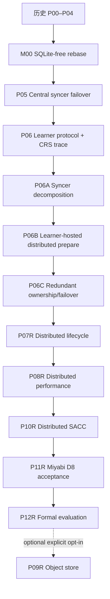

# DuraLoCo Codex Loop-Engineering Implementation Plans

本目录定义 DuraLoCo 的 SQLite-free、event-sourced、dedicated-syncer-free 主线。当前
仓库已在`main` commit `06e3ca2`归档完成P06；verified implementation为`2581a4d`，
Checker/persistence commit为`030129e`，权威验收范围是P06-A01–A20。计划包不得追溯追加
P06 gates。下一阶段是P06A，由它建立CRS characterization traces并拆分当前central syncer。

新的必需主线是：

```text
M00 → P05 → P06 → P06A → P06B → P06C → P07 → P08 → P10 → P11 → P12
```

P09 object-store backend 仍为 P12 后的显式可选扩展，不阻塞必需主线。

## 1. 最终目标

最终生产拓扑不分配专用 syncer 节点。每个 learner 节点同时运行：

1. GPU learner process；
2. 一个受资源限制的 Learner-Hosted Fragment Executor（LFE）；
3. 可选的 Floating Committer candidate。

LFE 根据 committed membership/ownership epoch 承担若干 fragment work orders。多个 LFE 可以对同一 work order 做重叠、延迟启动或 speculative execution；共享文件系统中的 immutable transition objects 与唯一 global head CAS 仍是 optimizer trajectory 的唯一 authority。执行可以 at-least-once，但逻辑 commit 必须 at-most-once。

本计划不把系统称为 fully decentralized、coordinator-free 或 exactly-once delivery。更准确的描述是：

> learner-hosted, fragment-sharded, redundantly executed synchronization with storage-mediated authority and a floating fenced committer.

## 2. 不可协商的架构边界

- 活跃代码、配置、CLI、脚本、测试和新 artifacts 中不允许 SQLite，也不允许以其他嵌入式数据库替代。
- 唯一持久 authority 是 immutable committed transition chain 加一个线性化 global head CAS；proposal、heartbeat、executor listing、prepared-object listing 都只用于 discovery 或 evidence。
- central syncer 在 P06 后保留为 Central Reference Syncer（CRS）：数值 oracle、故障基线和显式 fallback，不再是主线生产拓扑。
- learner 与 LFE 共置不改变故障模型：节点失效可以同时带走 learner 和 executor；correctness 只能依赖共享存储中的 committed state、immutable proposal、work order 和 prepared transition。
- LFE 默认只具有 prepare capability。只有当前持有 fenced commit lease 的 Floating Committer 可以发布 control transition 或执行 head CAS。
- parameter fragment 与对应 outer optimizer state 必须由同一 committed transition 原子引用；不得分别覆盖“最新文件”。
- membership revision与fragment ownership是committed control facts，且与committer fencing epoch分离。heartbeat/listing不能直接改变owner集合。
- duplicate execution 允许；同一 work-order identity 的不同结果 digest 是 fatal determinism violation，不得任选其一继续。
- P06B/P06C 必需路线继续使用单一 global committed history。per-fragment heads 不是默认实现，只能在 P10 后基于证据提出新的 protocol-generation ADR。
- `latest.json`、JSONL、CSV、heartbeats、运行报告和 monitoring metrics 都是派生或观测数据，不能驱动 correctness 决策。
- fresh open、takeover、CAS ambiguity、head jump、corruption suspicion 和 ownership epoch change 必须 empty-cache strict replay。

完整协议见 [`DISTRIBUTED_SYNCER_SYSTEM_DESIGN.md`](DISTRIBUTED_SYNCER_SYSTEM_DESIGN.md)。与相关工作的差异和 claim 边界见 [`RESEARCH_RELATED_WORK_AND_DIFFERENTIATION.md`](RESEARCH_RELATED_WORK_AND_DIFFERENTIATION.md)。

## 3. 阶段索引

| 阶段 | 定位 | 依赖 | 推荐分支 |
|---|---|---|---|
| [P00（历史）](01_P00_BASELINE_AND_RESEARCH_CONTRACT.md) | 冻结基线、研究契约与 Agent Spine | — | 已归档 |
| [P01（历史）](02_P01_PROTOCOL_V2_SCHEMAS_AND_VALIDATION.md) | Protocol v2 schema、身份与严格验证 | P00 | 已归档 |
| [P02（历史）](03_P02_REFERENCE_SIMULATOR_AND_IN_MEMORY_BACKEND.md) | 确定性参考模拟器与 in-memory backend | P01 | 已归档 |
| [P03（历史）](04_P03_STORAGE_ABSTRACTION_AND_POSIX_LUSTRE_CONTRACT.md) | 语义化 Storage API 与 POSIX/Lustre contract | P02 | 已归档 |
| [P04（历史）](05_P04_TRANSACTIONAL_FRAGMENT_LOG_AND_PREFIX_RECOVERY.md) | Transactional fragment log 与 prefix recovery | P03 | 已归档 |
| [M00（已完成）](06_M00_SQLITE_FREE_RUNTIME_REBASE_AND_P00_P04_REQUALIFICATION.md) | 删除 SQLite、建立 log-only runtime、重验 P00–P04 | P04 | 已归档 |
| [P05（中心式参考）](07_P05_SYNCER_LEASE_FENCING_AND_FAILOVER.md) | Production syncer、lease/fencing 与 failover | M00 | `codex/duraloco-p05-syncer-failover` |
| [P06（已完成中心式生产阶段）](08_P06_LEARNER_INTERVALS_ADOPTION_AND_RECOVERY.md) | Learner interval、adoption、warm recovery；CRS characterization转交P06A | P05 | archive `06e3ca2` |
| [P06A](08A_P06A_SYNCER_DECOMPOSITION_AND_REFERENCE_EQUIVALENCE.md) | 拆分 syncer kernel；冻结 CRS 数值/协议 oracle | P06 | `codex/duraloco-p06a-syncer-kernel` |
| [P06B](08B_P06B_LEARNER_HOSTED_FRAGMENT_EXECUTORS_AND_DISTRIBUTED_PREPARE.md) | Learner-hosted executors、distributed prepare、floating commit；无专用 syncer | P06A | `codex/duraloco-p06b-learner-hosted-sync` |
| [P06C](08C_P06C_REDUNDANT_FRAGMENT_OWNERSHIP_AND_FAILOVER.md) | 重叠 ownership、hedged execution、executor/committer failover | P06B | `codex/duraloco-p06c-redundant-fragment-executors` |
| [P07R](09_P07_COMPACTION_GC_ACKS_AND_LEARNER_CAPSULES.md) | 分散拓扑下的 compaction、reachability GC、acks 与 capsules | P06C | `codex/duraloco-p07-distributed-lifecycle` |
| [P08R](10_P08_DIRECT_FRAGMENT_IO_STREAMING_REDUCER_AND_TELEMETRY.md) | LFE direct fragment I/O、streaming reducer、conditional bundling 与 interference telemetry | P07R | `codex/duraloco-p08-distributed-performance` |
| [P10R](11_P10_SACC_AND_ALGORITHM_SYSTEM_CODESIGN.md) | shadow-first、system-only-first Storage-Aware Controller | P08R | `codex/duraloco-p10-distributed-sacc` |
| [P11R](12_P11_MIYABI_INTEGRATION_CHAOS_AND_9NODE_ACCEPTANCE.md) | Miyabi chaos 与 dedicated-syncer-free D8 acceptance | P10R | `codex/duraloco-p11-distributed-acceptance` |
| [P12R](13_P12_FORMAL_EXPERIMENTS_ARTIFACT_AND_PAPER_EVIDENCE.md) | 正式实验、artifact、相关工作与 claim–evidence | P11R | `codex/duraloco-p12-distributed-evaluation` |
| [P09R（可选）](14_P09_OBJECT_STORE_BACKEND_AND_HYBRID_BASELINE_OPTIONAL.md) | Object-store backend 与 hybrid baseline | P12R + 显式选择 | `codex/duraloco-p09-distributed-object-store` |

## 4. 依赖图



P07R先冻结shared object identity、snapshot/reachability/GC/capsule interfaces，P08R再从
P07 verified commit顺序优化。当前仓库不并行演化两套尚未存在的shared schemas。P09R不
参与自动推进。

## 5. 拓扑与验证阶梯

P06 以前保留原中心式验证。P06B 以后采用以下命名：

| 代号 | 拓扑 | 用途 |
|---|---|---|
| C1/C2/C9 | dedicated Central Reference Syncer + learner(s) | 数值 oracle、历史兼容和比较基线 |
| D1 | 1 learner node；同节点 learner + LFE + bootstrap floating committer | 最小真实路径 |
| D2 | 2 learner nodes；无专用 syncer | ownership、committer、node failover |
| D8 | 8 learner nodes；8 learners + 8 LFEs；无专用 syncer | 主生产 acceptance |
| D8-R2 | D8，replication factor 2，primary/backup 或 hedge | 完整容错与研究配置 |

D8 的默认工作量与旧 C9 gate 对齐：GPT-2/WikiText-2、`inner_steps=50`、至少 10 committed outer transitions、目标 walltime 15 分钟。绝对时间是验收目标，不是可删除异常结果的理由；若机器或队列条件造成偏差，必须同时保存 matched-shape C9/D8 原始数据并解释。

## 6. 自动推进规则

每个阶段只有在以下条件同时成立时才可推进：

1. 全部 required acceptance IDs 有当前 clean commit 的证据；
2. 独立 Checker 给出 `PASS`，或 `PASS_WITH_FOLLOWUPS` 且无 required follow-up；
3. 双语 phase report、manifest、commands、raw traces、checksums 与 `STATE.yaml` 一致；
4. milestone commit 已创建但未自动 merge main；
5. 下一阶段的 dependency digest 与当前 verified commit 一致。

特别规则：

- P06 完成后，`next_action` 必须是 P06A；不得自动启动旧 P07/P08。
- P06A 未通过 CRS equivalence 前，不得把 execution 放到 learner hosts。
- P06B 未通过 D8 no-dedicated-syncer gate 前，不得实现 redundancy。
- P06C 未通过故障矩阵前，不得开始 destructive GC 或 controller enforcement。
- P07R完成后才启动P08R；P08R通过P07 regressions后才可进入P10R。
- P09R 只能由用户显式选择。

## 7. 全局 Gate

后续阶段必须持续证明：

1. active surface 的 SQLite/embedded-DB 扫描为零；
2. strict Protocol v2 validation、shared selection semantics 与 deterministic replay；
3. storage CAS、one-CAS transaction、prefix recovery 和 ancestry-aware response-loss reconciliation；
4. 删除全部 executor/committer 本地派生状态后只靠 committed log/head 恢复；
5. proposal interval 不重叠，boundary adoption 与 warm-recovery 契约不回归；
6. central reference与distributed execution的policy/control identity必须exact；同backend的
   parameter/outer-state/result content必须exact，跨CPU/GPU保留双方digest并通过冻结tolerance
   report，不把numeric equivalence冒充content identity；
7. prepare capability 与 commit capability 分离，stale executor/committer fencing fail closed；
8. committer fencing epoch、membership revision、ownership、work order、canonical prepared result、attempt evidence和final commit都可重放审计；
9. same-work-order duplicates 至多一个 logical commit，且 divergent digest 必须阻塞；
10. D1→D2→D8/D8-R2 分层验证，不在 Miyabi login 节点执行 runtime；
11. learner-host CPU interference、Lustre metadata/data I/O、publish→prepare→commit→adopt 延迟完整可观测；
12. P07R GC 不删除 live proposal、work order、prepared winner/loser grace roots、epoch/config、capsule、snapshot 或 replay pin；
13. P10R controller 的算法影响决策进入 committed evidence，shadow mode 先于 enforced mode；
14. P12R 的每项论文 claim 都有 immutable run IDs、原始数据、分析脚本和负结果。

## 8. 使用方式

Codex 每次恢复必须读取：根 `AGENTS.md`、`miyabi-development` skill、共同契约、两个系统设计、研究差异文档、当前阶段文件、`plans/duraloco/{STATE.yaml,DECISIONS.md,BLOCKERS.md}`、上一阶段报告及 Checker verdict。真实 HEAD 与计划基线不同，应保留现有改动并生成 drift report，不得强制 reset。

当前仓库应使用：

```text
P06已经在archive commit 06e3ca2完成，不追溯修改P06 verdict。从该archive tip创建P06A feature branch，读取CURRENT_REPOSITORY_ALIGNMENT_REVIEW.md，并按08A计划先建立只读CRS characterization bundle，再复用现有ProposalCatalog/ProductionTransactionalLog/outer_optim边界拆分syncer。不要直接启动P07/P08。
```

应用本计划包后，只同步live `STATE.yaml`的route字段：保留P06 completed、A01–A20、全部
checks/artifacts和Checker report，把旧的“start P07 and P08 independently”改为“start P06A
from archive commit 06e3ca2”。这不是新的P06 runtime verdict。

## 9. Artifact 与审批

证据写入 `artifacts/duraloco/<phase>/<run_id>/`。不得创建 `.db`、`.sqlite` 或替代数据库 dump。P07R destructive GC apply、超出既定 Miyabi 资源范围、公共云/真实凭据和公开发布仍需要明确批准。P09R 需要用户未来显式选择。

## 10. 文件校验

```bash
python3 scripts/agent/build_duraloco_master.py --check
(cd plans/duraloco/codex/DuraLoCo_Codex_Loop_Plans && sha256sum -c SHA256SUMS.txt)
```

---

---
title: "DuraLoCo Codex Loop Operating Contract"
version: "3.0"
date: "2026-07-11"
repository: "https://github.com/UnbearableFate/fs_based_decoupled_diloco"
architecture_target: "learner-hosted distributed fragment syncer"
---

# DuraLoCo Codex Loop Operating Contract

本文件定义所有阶段共享的执行协议。阶段文件描述“做什么”，本文件描述 Codex 如何以可恢复、可审计的 loop-engineering 方式持续完成工作。任何实现捷径只要引入第二 authority、不可重放状态或无法验证的研究 claim，都必须视为 blocker。

## 1. Agent Loop

每个最小工作单元执行：

```text
ORIENT → SPECIFY/RED → IMPLEMENT/GREEN → HARDEN → CHECK → PERSIST
   ↑                                                       │
   └────────────── next smallest failing gap ───────────────┘
```

### ORIENT

先记录：

```bash
hostname
git status --short --branch
git rev-parse HEAD
git log -5 --oneline
```

然后读取根 `AGENTS.md`、当前阶段、上一阶段 report/checker、`STATE.yaml`、未关闭 ADR/blocker、`SQLITE_FREE_SYSTEM_DESIGN.md`、`DISTRIBUTED_SYNCER_SYSTEM_DESIGN.md`、实现经验文件和相关研究差异文档。P06A 以后还必须读取 CRS oracle trace schema 和最近一个 equivalence report。

### SPECIFY/RED

生产实现前，先建立至少一种会在旧实现或错误实现上失败的证据：

- state-machine trace 或 golden transition；
- unit/property test；
- crash/fencing failpoint；
- capability audit；
- storage contract test；
- topology manifest checker；
- numeric digest comparison；
- interference/latency baseline；
- reachability/GC counterexample。

测试必须能证明目标缺陷，而不是只覆盖新代码行。

### IMPLEMENT/GREEN

只做让当前最小失败证据通过的修改。P06A 后遵守：

- pure policy/kernel 不读取 process identity、wall clock、directory order 或 mutable global；
- executor 只 prepare，不能隐式升级为 committer；
- committer 只通过当前 fenced lease 和 head CAS 成为 authority；
- immutable object 先写、校验、再由 commit transition 引用；
- listing/heartbeat 只 discovery；
- executor local cache 可删除且不可影响结果；
- duplicate work order 必须 deterministic；
- 所有影响算法结果的 policy/config identity 进入 work order 与 transition digest。

### HARDEN

至少覆盖：response loss、duplicate delivery、partial publication、stale epoch、owner/committer crash、node co-failure、head advance、CAS ambiguity、corrupt object、listing omission、slow storage 和 cancellation。P06C 后每个新 mutation path 必须加入 fault matrix。

### CHECK

Maker 与 Checker 使用不同上下文。Checker 必须：

1. 从 invariant 和 diff 反推漏项；
2. 执行至少一个 Maker 未列出的反例；
3. 删除本地 runtime state 并验证恢复；
4. 检查 capability/authority surface；
5. 核对 acceptance ID、manifest、raw trace、commit 和报告；
6. 对性能 claim 检查 matched topology、资源预算和置信区间；
7. 只输出 `PASS`、`PASS_WITH_FOLLOWUPS` 或 `BLOCKED`。

### PERSIST

每个 loop 更新：

- `plans/duraloco/STATE.yaml`；
- `DECISIONS.md`/`BLOCKERS.md`；
- artifact manifest、commands、raw outputs；
- acceptance evidence map；
- 当前 clean commit；
- 下一项最小 failing gap。

会话结束不得是唯一进度保存点。

## 2. Authority 与 capability contract

### 2.1 唯一 authority

只有从 current global head 可达的 committed transition prefix 是 optimizer truth。以下均不是 authority：

- proposal listing；
- executor heartbeat；
- ownership cache；
- local queue/cursor；
- Fragment Work Order（在未 commit 前）；
- Prepared Fragment Transition；
- materialized latest model；
- telemetry、report、CSV/JSONL；
- Central Reference Syncer 的内存状态。

### 2.2 Capability separation

P06B 以后至少定义：

| capability | 允许操作 | 禁止操作 |
|---|---|---|
| learner | publish immutable proposal；读取 committed model/frontier | head CAS、ownership control、prepared winner decision |
| executor | 读取 committed parent/FWO；写 immutable PFT | head CAS、membership change、authoritative stop |
| committer | 计划/发布 FWO；验证 PFT；写 final transition；head CAS | 修改 learner local state；绕过 replay/validation |
| lifecycle worker | snapshot、reachability、dry-run GC；经审批 apply | 改写 committed history |
| CRS | reference execution、baseline、fallback | 在 distributed production run 中成为隐式第二 authority |

静态 import audit、runtime credential/path audit 和 fault test 必须共同证明 capability boundary。
该边界是当前非Byzantine failure model下的software/API least-authority边界，不是同一Unix
账号内对恶意Python代码的安全sandbox。LFE production entrypoint只能接收不含head key和
`conditional_replace`的restricted facade；source/import audit用于防止意外越权，论文和
报告不得声称OS级隔离。

### 2.3 Identity hierarchy

```text
run_generation
  ├── committer_fencing_epoch
  └── membership_revision
       └── ownership_digest
            └── work_order_id(parent_head, fragment, selection, policy, execution_backend)
                 ├── prepared_result_digest(work_order_id, input/output content)
                 └── attempt_envelope_id(result_digest, executor_session, attempt)
                      └── committed_transition_id(parent_head, work_order_id, result_digest)
```

同 identity/不同内容 fail closed；不同 identity/相同 payload 不得被误判为同一 request。

## 3. 阶段切换 contract

### P06 → P06A

当前仓库P06-A01–A20已经完成；完整CRS oracle trace不是其历史gate。P06A从P06 archive
tip建立只读characterization bundle，并只做decomposition/equivalence，不改变生产拓扑。

### P06A → P06B

只有 pure kernels、shared schemas、capability audit 和 central-vs-decomposed digests 全部通过，才允许 learner hosts 执行 prepare。

### P06B → P06C

P06B 以 replication factor 1 建立 no-dedicated-syncer D8 主路径；P06C 才引入 overlapping ownership、backup/hedge 和 reconfiguration。

### P06C → P07R → P08R

P06C failure matrix完成后先启动P07R并冻结lifecycle/object identity接口；P08R从P07
verified commit顺序启动。不得并行修改尚未存在或尚未冻结的shared schema/commit semantics。

## 4. Validation topology contract

- 本地：pure kernel、simulator、storage fake、property tests。
- Miyabi D1：单节点 learner + LFE + bootstrap/floating committer；真实 model/data 小步运行。
- Miyabi D2：两 learner 节点，无专用 syncer；kill executor、kill committer、kill whole node。
- Miyabi D8：八 learner 节点，无专用 syncer；主验收。
- Miyabi D8-R2：八节点、replication factor 2；重叠执行与故障验收。
- C9：八 learner + 一 dedicated CRS，只用于 reference/baseline 和 matched comparison。

禁止在 Miyabi login 节点运行 pytest、torch/transformers/datasets import、training、mpirun 或其他 runtime；login 节点仅做 git、文本检查、PBS submit/inspect 和 artifact 下载。

## 5. Determinism contract

相同 committed parent、work-order identity、proposal object digests、policy/config identity 和 implementation identity 必须生成相同：

1. selected proposal IDs 与 weights；
2. aggregate digest；
3. new parameter fragment digest；
4. new outer optimizer state digest；
5. final transition semantic digest。

同一FWO的LFE primary/backup和replay必须冻结相同execution backend/thread/reduction identity
并满足bitwise/content equivalence。当前GPU CRS与CPU LFE的跨backend比较必须保留双方
content digest并使用预注册tolerance report，不能声称digest相等；如需exact比较，offline
CRS必须使用同一backend。浮点nondeterminism不能通过“任选成功者”掩盖。

## 6. Failure handling contract

- crash before object marker：对象不可见，安全重试；
- crash after immutable PFT、before commit：PFT 是 orphan/evidence，可复用或回收，不能被 learner adopt；
- commit response loss：通过 request identity、head ancestry 和 committed transition reconciliation；
- stale membership/ownership：PFT 可保留但必须被 current committer拒绝；
- stale committer：P05 fencing + CAS 拒绝；
- duplicate same digest：可选择一个 winner，其他标记 loser；
- duplicate divergent digest：阻塞 run、保存两个 outputs 和 environment evidence；
- whole learner node loss：committed reconfiguration 后由新 owner 从共享存储重算，不迁移私有 optimizer state；
- storage ambiguity：strict replay，不基于 listing absence 宣告未提交；
- false failure suspicion：允许影响 latency/额外计算，不得影响 safety。

## 7. Performance and interference integrity

learner-hosted CPU 计算可能竞争 CPU cores、memory bandwidth、PCIe/NVLink path 和 Lustre I/O。每个 D8 性能结论必须报告：

- GPU step time/MFU 或可用等价指标；
- LFE CPU cores、affinity、NUMA、RSS、memory bandwidth proxy；
- proposal/PFT/transition bytes 与 metadata operations；
- publish→work-order→prepare→commit→adopt 分段延迟；
- executor queue、hedge rate、duplicate wasted CPU；
- C9 与 D8 的 node-hours、GPU-hours 和 useful-token goodput；
- training quality under matched tokens/compute。

不得只报告“节省一个节点”而忽略 learner GPU slowdown。

## 8. Terminal failure discipline

同一根因三次修复仍失败，写 blocker 并缩小问题，不扩大重构。非 transient D8/D8-R2 terminal failure 后禁止立即同 shape 重提；先完成 workflow review、targeted D1 benchmark、同 clean commit 的 D1→D2 重验收，再提交一次新 retry。所有失败、取消和重试保持 `parent_run_id` lineage。

## 9. Research integrity

计划值、目标值和实测值必须分开。相关工作中已有的单项机制——CPU syncer、parameter sharding、external storage communication、serverless aggregation、backup execution、logging/replay——不得被包装为独立首创。论文主张应聚焦经过证据支持的组合：storage-resident stateful outer optimizer authority、learner-hosted roleless executors、redundant prepare 与 single logical commit、ownership change without optimizer-state migration，以及 HPC no-dedicated-syncer resource trade-off。

---

# DuraLoCo 无 SQLite 系统设计

## 1. 设计结论

DuraLoCo 从 M00 开始不得导入、调用、生成、备份、恢复或要求
SQLite。也不得用另一个嵌入式数据库替换 SQLite 来保留同样的双重状态
模型。系统只有一个持久化权威：P04 建立的、由单一 head CAS 线性化的
committed transition log。

所有查询结构、scanner cursor、pending/eligible set、learner liveness、调度中间状态
和 metrics summary 都必须是以下两类之一：

1. 进程内可丢弃的 immutable/replace-on-write 视图；
2. 从 committed log、不可变 objects、heartbeats 或 append-only telemetry 重建的导出物。

丢失任意本地目录后，新进程仍必须仅依赖 shared storage 中的权威 log 和
其可达 objects 恢复到同一 committed state digest。

## 2. 权威数据模型

### 2.1 唯一可变权威

`control/head.json` 是唯一可变权威指针。它通过 backend
`conditional_replace` 推进，并指向 checksum-verified frontier。一个 optimizer
transition 只能在 head CAS 成功时成为 committed。

### 2.2 不可变 objects

以下内容在 head CAS 之前按 content identity 不可变发布：

- proposal manifest 与 payload object；
- fragment/full-vector params object；
- outer optimizer state object；
- commit record；
- frontier；
- drop/supersession/stop/lease decision object（对应阶段引入后）；
- P07 引入的 snapshot、pin 与 learner capsule。

prepared 但不可从 head 达到的 objects 只是 orphan evidence，不能影响选择、
恢复或终止判定。

### 2.3 完整 frontier

frontier 必须记录恢复和下一次决策所需的全部权威事实：

- commit sequence 与 parent lineage；
- 每个 fragment 的 version、params ref 和 outer-state ref；
- 已消费 proposal IDs 或其等价的已验证 compact summary；
- 已提交 drop/supersession decisions；
- deterministic scheduler cursor；
- 后续阶段引入的 fencing epoch、stop state、controller state 和 snapshot refs。

任何上述事实都不得仅存在于本地索引、JSONL telemetry、CSV 或 heartbeat。

## 3. 进程内 RuntimeView

### 3.1 启动构建

syncer 启动时调用 `replay_log` 并构建一个不可变 `RuntimeView`：

```text
RuntimeView
  head/frontier/commit lineage
  fragment params + outer-state refs
  consumed proposal IDs
  committed drop/supersession decisions
  learner/session/fragment last committed sequence
  scheduler cursor
  stop/fencing/controller state when available
```

M00 已验证两种同一语义 replay：fresh open、takeover、explicit verify、CAS
ambiguity、head jump 或 corruption suspicion 使用 empty-cache strict full replay；同一
process/owner 的 steady-state replay 仍完整验证 head 和 manifest/causal chain，但可对该
process 已成功验证的完整 ObjectRef `(key, sha256, size)` 跳过大 tensor
重读。memoization 只在完整 replay 成功后更新，不序列化、不跨 owner、不是
authority。P07 引入 snapshot + suffix replay 后可降低启动成本，但 snapshot 本身
也必须是 head-reachable 权威事实，并与 strict/memoized full replay digest 等价。

### 3.2 运行时更新

每次 head CAS 成功后，syncer 从已提交 commit/frontier 生成新的
`RuntimeView`，再原子替换进程内引用。不允许在 CAS 之前将 proposal 持久化为
`selected`。未提交选择只存在于当前调用栈/内存对象中。

进程崩溃会丢失该视图；新进程通过 replay 生成等价视图。视图不写入本地
持久化存储。

## 4. Proposal discovery 与选择

1. learner 先发布 content-addressed immutable payload，最后发布 discovery marker/Protocol v2 manifest；learner 可 immutable put，但不得拥有 head-CAS surface；
2. scanner listing 只用于发现 candidate key，可以重复、漏项或重排；
3. syncer 对每个 candidate 执行 P01 full validation 和 immutable-byte snapshot；
4. 使用 `RuntimeView` 在 payload I/O 前排除已消费 interval/base、已 drop、错误 epoch、rollback 或超 staleness proposal，production tensor 使用 typed vectorized validation；
5. 调用与 P02 reference/replay 共用的 deterministic selection kernel；
6. CAS conflict 后丢弃内存 selection，对新 head 完整 replay/revalidate/reselect。

scanner cursor 只能是内存 hint。重启时允许从头扫描；正确性不依赖 cursor 持久化。
一次 transaction attempt 内 scan/load/publish 复用 typed validated result，不对同一 ObjectRef
重复 read/hash/finite-check/fsync。候选可并发验证，但最终 selection order 和 quarantine
结果必须确定。

## 5. 生产 tensor transition

M00 将现有 full-vector/fragment `safetensors` 与 outer optimizer state 发布接入
P04 transaction：

- payload 保持大对象编码，commit/frontier 只保存 ObjectRef 和实现 digest；
- reducer/outer-step 必须在 P02 numeric contract 内与 reference 等价；
- `latest.json`、materialized full weights 和人类可读 summaries 可保留为兼容导出，
  但它们必须从 committed frontier 生成，不参与权威判定；
- update 的 pending/selected/applied/dropped 状态通过“candidate 可见性 + committed
  selection/drop decisions”推导，不存在独立状态表。

## 6. 恢复、停止与 liveness

- **Global recovery**：从 head 完整 replay 或 P07 snapshot+suffix replay。
- **Response loss**：以 request identity 和 committed ancestry 识别原操作是否已成功。
- **Liveness**：heartbeat files 和进程内计时器只提供观测/调度信号，不是权威。
- **Stop**：M00 至少从权威 log 恢复 terminal fact；P05 完成 stop/lease/fencing
  state machine。
- **Learner recovery**：P06 提供 warm restart，P07 capsule 提供 exact learner restart。

任何恢复路径都不读取 DB dump、本地数据库或未受权威 log 绑定的状态快照。

## 7. Telemetry 与 analysis

- 运行事件以 append-only JSONL 记录，每条包含 run/actor/event/request/commit IDs；
- 高频 metrics 可使用 CSV/JSONL，并绑定 schema/version/config digest；
- analysis CLI 直接 fold committed log + telemetry + manifests；
- 生成的 summaries/plots 是可删除导出物，不得反向影响 protocol；
- P08 如需加速扫描，只能使用内存索引、key sharding 和 committed watermark，
  不引入本地数据库。

## 8. 旧 run 与配置迁移

旧 SQLite-backed run 保持不可变历史 artifact，但新代码不提供 DB reader、恢复或
就地转换。如需延续权重，必须在移除前的已验证 commit 上完成权重/外优化器
checkpoint 导出，然后使用 M00 `bootstrap-new-generation` 在新 run generation 中导入
这些不可变 objects。

该 bootstrap：

- 不读取旧 DB；
- 不保留 pending/selected/applied history；
- 不声称 exact continuation；
- 记录 source checkpoint digests、新 run/generation ID 和显式 warm-start 语义。

以下配置/CLI 字段必须删除并 fail closed：

```text
sqlite_local_dir
resume_db_dump
db_dump_every_versions
keep_last_db_dumps
--sqlite-local-dir
--db
```

## 9. 必须删除的代码和 artifacts

- `fs_diloco/sqlite_store.py`；
- `fs_diloco/schema.sql`；
- `fs_diloco/log/cache.py` 及 `rebuild-cache` CLI；
- Python `sqlite3` imports；
- `db_dumps/` path、retention、backup/restore 代码；
- SQLite-specific tests、PBS variables、shell helpers 和 evidence validators；
- 默认或隐式兼容的 SQLite config keys。

历史 phase reports/artifacts 可继续包含该词，但不得被当作当前 runtime 依赖。

## 10. 不变量

1. 除单一 head CAS 外没有 committed transition mutation。
2. 本地持久化状态全部删除后，committed state digest 不变。
3. 没有 durable `selected`、pending 或 applied 中间状态。
4. proposal 只能出现在一个 committed selection 中。
5. params 和 outer state 始终由同一 frontier 成对引用。
6. listing、heartbeat、JSONL、CSV、`latest.json` 和内存视图都不是权威。
7. 恢复、takeover、analysis 和 Checker 都不需要 SQLite 或其他本地数据库。
8. 旧 DB-backed run 不在新 generation 中静默恢复或混用权威。

## 11. 阶段边界

- **M00**：实现无数据库生产运行时，删除 SQLite 全部表面，重跑
  P00–P04 审核标准。
- **P05**：在 M00 运行时上增加 lease/fencing/failover/stop，不再负责数据库迁移。
- **P06**：完成 learner v2 publication/adoption/warm recovery。
- **P07**：以 head-reachable snapshot + suffix replay 提供有界恢复与 lifecycle。
- **P08/P10–P12**：只使用 committed log、内存视图、JSONL/manifests 和可达 snapshots。
- **可选 P09**：对象存储 backend 必须通过同一无数据库 contract。

---

---
title: "DuraLoCo Distributed Syncer System Design"
version: "1.1"
date: "2026-07-11"
status: "normative for P06A+"
---

# DuraLoCo Distributed Syncer System Design

## 1. Purpose

本文件定义 P06 之后从 dedicated central syncer 迁移到 learner-hosted distributed syncer 的规范语义。它不删除 syncer 的逻辑职责，而是把职责分为：

- **data plane**：proposal validation、fragment aggregation、outer optimizer、prepared output publication；
- **control/authority plane**：membership/ownership、work-order planning、winner validation、final transition commit、head CAS、authoritative stop。

Data plane 分散到 learner 节点 CPU。Control plane 由任一 learner host 上的短期 Floating Committer 执行，但其 authority 只来自 P05 lease/fencing 和共享存储 head CAS。

### 1.1 当前仓库边界

P06 archive commit `06e3ca2`已经提供`ProposalCatalog`、`RuntimeView`、
`ProductionTransactionalLog`、`outer_optim`、reference adapter、fragment/parameter index和
storage contract。P06A/P06B必须复用这些边界。当前`head-fenced-v1` run generation没有
membership/FWO/PFT字段，因此distributed prepare从新run generation与新coordination
protocol开始；不得把未知control transition原地写入P06 generation。

## 2. Terminology

- **CRS — Central Reference Syncer**：P05/P06 中心式实现，P06A 后作为 oracle、baseline 和 fallback。
- **LFE — Learner-Hosted Fragment Executor**：运行在 learner 节点 CPU 上，只执行 prepare 的进程/sidecar。
- **Floating Committer**：可以在 learner hosts 间迁移的、持有短期 fenced commit lease 的 planner/committer。
- **Membership Revision**：新distributed generation中committed active executor candidates 与 session identities 的版本。它与P05 fencing epoch是两个不同概念；前者决定eligible executors，后者fence唯一committer。
- **Ownership Map**：由 membership epoch、fragment ID、replication factor 和确定性 hash 算法派生并记录 digest 的 owner 集合。
- **FWO — Fragment Work Order**：固定 parent、fragment、selected proposal IDs/weights 和 policy identities 的 immutable deterministic execution request。
- **PFT — Prepared Fragment Transition**：LFE 对 FWO 的不可变计算结果；不是 authority。
- **Final Transition**：committer 验证 winner PFT 后生成的 committed optimizer transition。
- **D8/D8-R2**：八 learner 节点的无专用 syncer拓扑，后者 replication factor 2。

LFE的prepare-only是非Byzantine crash/omission模型下的software capability boundary：其
production entrypoint只注入immutable read/write facade，不注入head key、lease manager或
`conditional_replace`。因为Miyabi进程通常共享同一Unix账号，这不是抵抗恶意代码的OS
sandbox；静态audit只能防止实现误接线，不能扩大安全主张。

## 3. Authority model

系统始终保持一个 global committed history：

```text
head_v → transition_v → transition_v-1 → ... → genesis
```

每个 transition 可以包含一个 fragment update，也可以在 P08 以后包含一个经过 serial-equivalence 验证的 fragment bundle。只有 head CAS 成功后，transition 及其引用的 parameter/outer-state objects 才是 authoritative。

FWO 和 PFT 的目的分别是固定输入与保存可替换执行结果。它们允许在不改变 committed history 的情况下重试、并行和容错。

## 4. Object model

### 4.1 Proposal

P06 proposal 至少绑定：

```text
run_generation
learner_session_id
sequence
base_frontier_digest
fragment_id
local_interval_start/end
processed_token_count
payload_object_ref + digest
implementation/numeric identities
```

Proposal immutable、marker-last、request-ID idempotent。Listing 只负责发现；是否被选择由 deterministic policy 和 committed parent 决定。

### 4.2 MembershipControlTransition

记录：

```text
epoch
previous_epoch
candidate learner/executor session IDs
eligibility and capability digests
replication_factor
ownership_algorithm/version
activation_reason
```

Heartbeat 只提出 evidence。只有 committed MembershipControlTransition 改变 owner eligibility。

### 4.3 Fragment Work Order

FWO identity 由 canonical content 计算。所有浮点权重使用规范化后的`float.hex`字符串，
不得把JSON decimal float直接放入identity：

```text
work_order_id = H(
  run_generation,
  parent_head,
  parent_frontier_digest,
  fragment_id or ordered bundle,
  membership_revision,
  ownership_digest,
  selected proposal IDs and weights,
  aggregation/outer-optimizer policy identity,
  dtype/layout/implementation identity
)
```

FWO 必须完整到使 CRS 和所有 LFE 无需重新做 policy decision 即可得到同一结果。任何使用 local wall clock、directory enumeration order 或 process-specific random seed 的字段都禁止进入执行语义。

### 4.4 Prepared Fragment Transition

PFT分成两层：canonical prepared result和attempt envelope。canonical result至少包含：

```text
work_order_id
parent_head
validated input digests
aggregate digest
new parameter object ref + digest
new outer-state object ref + digest
numeric/implementation digest
```

attempt envelope另外记录`executor_id`、`executor_session_id`、`attempt_id`、membership
revision、resource/latency evidence refs和publication marker。canonical result identity排除
这些observational/arrival字段。同一FWO的等价attempt必须得到相同result digest和content
refs。PFT本身不消费proposal、不前进frontier、不授权adoption。

### 4.5 Final Transition

Final transition 引用 FWO 和 canonical prepared result，并记录：

```text
parent_head
work_order_id
prepared_result_digest
selected proposals and logical consumption facts
parameter + outer-state pair
new frontier/scheduler cursor
epoch/fencing token
stop/control facts if any
```

Committer 使用existing one-CAS transaction protocol将它线性化。Final transition identity
不得绑定first-finish、winner executor/attempt、telemetry或listing order；attempt/loser
lineage是审计evidence，不是optimizer state identity。

### 4.6 Numeric identity and equivalence

- 同一FWO必须冻结device/backend、Torch/BLAS实现、dtype、thread/reduction order；
- same-FWO redundant attempts必须使用相同backend并产生相同content/result digest，任何
  divergence在真实run中fail closed；
- current CRS使用GPU，而目标LFE默认使用CPU。跨CPU/GPU比较不要求虚假的bitwise/content
  digest相等；必须保留双方content digest，并按预注册`atol/rtol`产生numeric comparison
  report；
- 如需跨拓扑exact digest comparison，必须让offline CRS使用与LFE完全相同的execution
  backend identity。

## 5. Role placement

```text
Learner node i
├── GPU learner process
├── LFE_i (CPU, bounded cores/RSS/I/O)
└── committer candidate client

Shared filesystem
├── committed log/head
├── proposals
├── membership/ownership controls
├── work orders
├── prepared transitions
├── parameter + outer-state objects
└── snapshots/capsules/telemetry
```

CRS 运行在专用节点仅用于 C9 reference/baseline，或用户显式 fallback。Distributed production run 中 CRS 不得同时写同 generation。

## 6. Normal protocol

1. Learners 从 committed frontier 开始 non-overlapping intervals 并发布 proposals。
2. 当前 Floating Committer strict-replays head，读取 committed membership revision与自身fencing epoch。
3. Committer 使用 shared deterministic selector 选择 fragment、quorum、weights，发布 FWO。
4. Ownership map 指定 primary 和可选 backup/hedge LFE。
5. LFE 验证 FWO、parent 和 inputs，streaming reduce，执行 pure outer step，marker-last 发布 PFT。
6. Committer 验证 PFT capability、membership revision、fencing context、parent、input/output digests 和 duplicate consistency。
7. Committer选择合法canonical result，创建不依赖attempt arrival的final transition，并执行fenced head CAS。
8. Learners只从 committed frontier/boundary adopt；PFT never directly adopted。
9. Loser PFT 进入可解释 grace/reachability，随后由 P07R GC。

## 7. Deployment migration

### P06：freeze semantics

保持 dedicated central syncer并完成learner protocol。当前仓库P06-A01–A20已经PASS；完整
CRS characterization trace不是P06历史gate，由P06A从archive tip补建。

### P06A：decomposition without topology change

把 current syncer 拆为 pure kernels 与 orchestration adapters。所有 production calls 仍从 CRS 发起；要求 old-vs-decomposed bitwise/semantic equivalence。

### P06B：distributed prepare, replication factor 1

以新distributed run generation在learner hosts启动LFEs；Floating Committer也位于learner
host。保留single global head，默认同一时刻最多一个active FWO，先证明D8无专用syncer
正确运行。CRS只shadow或离线复算，P06 generation保持只读。

为避免“先有membership才能选committer、先有committer才能提交membership”的循环，
operator/launcher在初始化前生成logical member/session IDs；原子genesis把revision-0
membership/capability digests与run spec一起冻结。只有该集合中的candidate可竞争P05 lease
并提交首个committer fencing epoch bump；之后的membership变化才走committed control
transition。

### P06C：redundancy and failover

committed ownership map 使用 replication factor ≥2。primary 正常执行；backup warm-standby 或在 hedge delay 后执行。节点 loss 触发 committed reconfiguration。重复计算不增加 logical proposal inclusion。

### P08：bounded concurrency/bundling

只有在 P06C safety 稳定后，才允许多个 independent PFT concurrently prepare。最终仍通过 single CAS serial commit；可选 `CommitBundlePlan` 必须证明与 canonical serial order 等价。

## 8. Ownership algorithm

建议使用 rendezvous hashing：

```text
score(fragment, member, membership_revision) = H(run_generation, membership_revision, fragment, member_session)
owners(fragment) = top_r(score)
```

但算法版本、tie-break、candidate ordering 和 replication factor 必须进入 committed control transition。不同节点只要看到同一 membership revision 就必须得到同一 ownership digest。

Owner 是执行责任而不是状态所有权。Owner change 不迁移 optimizer state；新 owner 读取 committed parent 和 immutable inputs。

## 9. Safety properties

1. **Single authority**：只有 current head 可达 prefix。
2. **Paired state**：parameter fragment 与 outer state 同 transition。
3. **At-most-one logical commit per work order**：CAS 和 parent check 保证。
4. **At-most-one logical proposal inclusion**：consumption facts 在 committed ancestry 中验证。
5. **At-least-once execution allowed**：PFT 可重复。
6. **Deterministic duplicates**：同 FWO 的 semantic digest 必须一致。
7. **Two-dimensional fencing**：stale membership/ownership result不能被采用，stale committer fencing epoch不能commit；两者不可混为一个epoch。
8. **No local authority**：删除所有 local state 后可恢复。
9. **Boundary adoption**：learner 不读取 uncommitted/PFT state。
10. **Committed reconfiguration**：heartbeat/listing 不能单独改变 owner。

## 10. Failure matrix

| Failure | Required behavior |
|---|---|
| primary LFE before PFT | backup/reassigned owner 重算；无 commit |
| primary after PFT before notify | committer通过 listing/reference发现并验证；或 backup生成同 digest |
| duplicate PFT same digest | 任选一个 object identity 作为 winner；其余为 loser evidence |
| duplicate PFT different digest | fatal determinism blocker；不得 commit |
| committer before FWO publication | new committer strict replay and re-plan with same deterministic selection |
| committer after FWO before final commit | new committer验证/reuse PFT，或重算 |
| committer after CAS before response | ancestry reconciliation；不得重复逻辑 commit |
| learner+LFE whole node failure | remaining learner持续；committed epoch change 后重assign |
| stale executor returns | membership revision/ownership validation rejects result；可只做丢弃/diagnostic |
| stale committer returns | P05 owner token/fencing epoch rejects head mutation |
| listing omission | 延迟 discovery，不证明 object/commit absent |
| partial object publication | marker-last keeps invisible；GC grace protects payload |
| head advances while prepare | PFT stale；committer rebase/replan，不把它套到新 parent |
| storage corruption | strict verification, quarantine, stop or safe fallback |

## 11. Concurrency policy

P06B首先选择safety-first模式：一个active parent/FWO，多个executor可以并行或冗余计算，
但final transitions严格串行。P08只有在profile gate触发且新schema/ADR通过时才可增加：

- bounded number of prepared FWOs based on same head；
- disjoint fragments；
- canonical bundle order；
- one-CAS bundle transition；
- conflict/cancellation and memory bounds。

未触发gate时bundle验收项以有Checker证据的`not_applicable`关闭。不允许在没有
serializability proof的情况下让多个independent heads同时成为authority。

## 12. Resource isolation

LFE 必须配置：CPU core set、thread count、NUMA policy、RSS budget、in-flight I/O、prefetch depth 和 process priority。默认以 GPU learner goodput 为优先，超预算时 backpressure 或延迟 hedge，而不是抢占 learner critical path。

## 13. Lifecycle

P07R reachability roots 至少包括：current head/prefix、latest safe snapshot、active FWO、合法 PFT winner candidates、loser grace window、membership epochs、learner capsules、pinned experiments 和 response-loss reconciliation records。Prepared output 不因“未 commit”立即删除。

## 14. Explicit non-goals

- 不声称没有逻辑协调；
- 不在必需主线实现 per-fragment heads；
- 不让 learner 直接写 head；
- 不把 local executor queue 作为 durable scheduler；
- 不在 P06B 同时更改 learner proposal semantics；
- 不用 payload equality 替代 request identity；
- 不把 warm recovery 误称 bitwise exact learner continuation。

---

---
title: "DuraLoCo Distributed-Syncer Plans — Current Repository Alignment Review"
version: "1.0"
date: "2026-07-11"
repository_head_at_review: "06e3ca2299d5eb1a720c1d8f9107af5223095525"
review_scope: "08A and every required/optional successor plan"
status: "normative correction record"
---

# 当前仓库适配审查与修订结论

## 1. 审查基线

本次审查以当前仓库而不是计划包生成时的假设为准：

- 当前 `main`/`origin/main`：`06e3ca2299d5eb1a720c1d8f9107af5223095525`（P06 archive commit）；
- P06 verified Maker implementation：`2581a4d6286c7d0666f76aa3cc9d8122e66f6d25`；
- P06 Checker/persistence commit：`030129e045c4e5a2abb80eb100a0e28fb78d384d`；
- `plans/duraloco/STATE.yaml`：P06 `completed`，实际验收 ID 为 `P06-A01`–`P06-A20`；
- 当前生产入口仍为 `fs_diloco.syncer` 和 `fs_diloco.learner`；
- 已有可复用边界包括 `ProposalCatalog`、`RuntimeView`、
  `ProductionTransactionalLog`、`outer_optim`、`optimizer.reference_adapter`、
  `fragment_codec`、`fragment_index`、`param_index` 与 storage contract；
- 当前 head/frontier/control schema 只实现 P05/P06 的 fenced owner、optimizer commit 和 stop；
  尚无 membership、FWO、PFT、snapshot 或 capsule authority schema。

P06 的已归档报告和 Checker 只证明 A01–A20。原计划包把尚未实现的 CRS trace
要求追加入 P06-A21–A25，并把它们当作 P06A 前置条件；这会把已完成阶段变成无法满足的
历史重验门，和当前 `STATE.yaml`、phase report、Checker verdict 冲突。修订后，这些工作
成为 P06A Loop 1 的 bootstrap/characterization gate，不追溯修改 P06 verdict。

## 2. 发现的问题与处理

| 问题 | 对渐进实现的影响 | 修订 |
|---|---|---|
| P06A 依赖不存在的 P06-A21–A25 和 oracle bundle | P06A 无合法起点 | 只依赖已通过的 A01–A20；P06A 从 archive commit 建立 characterization bundle |
| P06A 计划新建一套 selection/optimizer/log adapter，忽略现有模块 | 容易复制语义并产生 drift | 先复用现有 `ProposalCatalog`、`ProductionTransactionalLog`、`outer_optim` 等，只抽取 `syncer.py` 中仍重复的 orchestration/numeric glue |
| P06A 允许用旧 P06 terminal run 替代新代码 C9 | 重构后的 production path 未被真实验证 | P06A 改动 production orchestration 后必须在同一 clean implementation commit 走 C1→C2→C9；旧 P06 只作 baseline |
| P06B 试图在当前 generation 原地加入 membership/FWO/PFT | 当前 Protocol-v2/P05 frontier/control schema无法表达，且冻结 identity 会被破坏 | P06A 冻结 inactive schema；P06B 以新的 run generation/coordination protocol bootstrap，不原地续写 P06 generation |
| CPU LFE 与当前 GPU CRS 被要求 tensor/content digest 完全相同 | 跨 CPU/GPU 浮点结果通常无法保证 bitwise 相同 | 区分 exact identity equivalence 与 tolerance-based numeric equivalence；FWO 冻结 execution backend，same-FWO duplicates 必须同 backend 且 exact |
| PFT identity混入executor/attempt/telemetry，final transition又引用winner PFT | 不同完成顺序会改变 authoritative transition identity | 分离 canonical prepared-result digest 与 attempt envelope；final transition identity绑定 work order + canonical result，不绑定winner到达顺序或telemetry |
| P07/P08从P06C并行修改log/schema/codec | 当前代码边界尚未冻结，合并风险高且不利于单步验收 | required route改为 P06C→P07→P08→P10；P07先冻结lifecycle接口，P08再优化 |
| P07把snapshot、destructive GC、exact capsule和D8-R2 soak作为一个不可分割实现 | 失败定位和回滚困难 | 明确 P07.1 replay/snapshot、P07.2 reachability/dry-run、P07.3 synthetic apply、P07.4 capsule、P07.5 D8 集成子门 |
| P08 bundle gates看似必需，但bundle只应由profile触发 | 可能为未出现的瓶颈引入新commit语义 | 未触发时必须以 evidence-qualified `not_applicable` 关闭；触发时需新 schema/ADR 和独立 serial-equivalence gate |
| P10同时强制系统调优和算法语义调优 | local interval/quorum/fairness会改变proposal与trajectory，不能仅靠telemetry本地决定 | 先完成 shadow + system-only actions；算法影响 actions 需 committed policy、新 generation 和质量证据，可形成受限/negative结论 |
| 包内README仍称“P05完成、P06待完成” | 应用到当前仓库后执行指令错误 | 更新为P06已完成，P06A为下一阶段，并记录三个P06 commit角色 |

## 3. 可执行的渐进路线

修订后的 required route 为：

```text
P06 archive (06e3ca2)
  → P06A characterization + decomposition on unchanged C topology
  → P06B new-generation factor-1 D1 → D2 → D8
  → P06C exact duplicate identity + R2 D1 → D2 → D8
  → P07 replay/reachability/GC/capsule subgates
  → P08 measured performance work; bundle only if triggered
  → P10 shadow first, system-only enforcement first
  → P11 acceptance
  → P12 preregistered evaluation
```

每个阶段继续遵守 current project 的 `ORIENT → SPECIFY/RED → IMPLEMENT/GREEN →
HARDEN → CHECK → PERSIST`，并从1节点开始，再到2节点，最后才运行主拓扑。任何修改
production orchestration、protocol generation、numeric backend或PBS launcher的阶段，
不得复用旧 runtime pass 作为新实现 pass。

## 4. 当前可直接开始的 P06A 最小切片

1. 从 `06e3ca2` archive tip 建立新 feature branch，同时记录 verified implementation
   `2581a4d` 和 Checker evidence `030129e`；
2. 只读 characterise 当前 `fs_diloco.syncer`，把 selected IDs、hex weights、aggregate
   bytes/digest、parameter/outer-state refs、prepared transition和committed view写入测试
   trace；
3. 先复用现有 `ProposalCatalog.select`、`normalized_weights`、`outer_optimizer_step`、
   `ProductionTransactionalLog.prepare_transition/commit_prepared`，不新建第二套policy；
4. 抽取一个 transaction-attempt kernel/input-output边界，再让现有 `run_syncer` 调用；
5. local/static与dependency-complete tests通过后，在Miyabi按C1→C2→C9验证同一clean
   implementation commit；
6. 只有P06A Checker PASS后才冻结distributed generation schema并进入P06B。

应用计划包时还必须做一次非运行时的route reconciliation：当前`STATE.yaml.next_action`
仍写着“start P07 and P08 independently”。保留P06 `completed`、A01–A20、checks、artifacts和
Checker report不变，只把`current_goal`/`next_action`更新为从`06e3ca2`启动P06A，并明确
这是plan-route handoff，不是新的P06 pass。

该切片不需要提前实现membership、LFE、FWO/PFT publication、redundancy、GC或controller，
因此可以在当前代码基础上安全渐进，而不是一次重写整个syncer。

---

---
title: "DuraLoCo Related Work and Differentiation"
version: "1.0"
date: "2026-07-11"
status: "research positioning; update before submission"
---

# DuraLoCo 与相关研究的差异、创新边界和证据计划

## 1. 定位结论

DuraLoCo 不应把“CPU syncer”“fragment sharding”“共享存储通信”“serverless/on-demand aggregation”“backup execution”或“logging/replay”中的任一项单独声明为首创。这些机制分别已有直接先例。

本项目更有研究价值的组合是：

> 将有状态、低频、fragment-wise outer optimizer 的权威状态放入共享存储中的 committed transition history；把原本持久的 syncer 服务改为 learner-hosted、可替换、可重复执行的 fragment tasks；允许 at-least-once prepare 和 overlapping ownership，同时通过 fenced single-head commit 保证 at-most-once logical inclusion 和 parameter/outer-state pair consistency。

截至 2026-07-11 的定向检索，没有发现一项工作同时覆盖上述全部组合。不过这只是当前相关工作调查结论，不应在论文中写“first”而不做更完整的系统性检索。

## 2. 相关研究矩阵

| 方向/代表工作 | 已覆盖的核心思想 | DuraLoCo 不应声称的新颖点 | DuraLoCo 的差异 |
|---|---|---|---|
| Decoupled DiLoCo | 异步 learners、minimum quorum、adaptive grace、token weighting、fragment-wise outer optimizer；syncer 在 CPU-only replicas 上分片；vector clocks、event tape、consistent checkpoint | fragment-wise sync、CPU-only/sharded syncer、异步 learner、本身的算法框架 | 原方案的 syncer worker/shards 是持续存在的 global model/outer-state holders；DuraLoCo 把权威状态移到 storage-resident committed log，并让 executor 进入 learner failure domain且可替换 |
| Parameter Server | parameter shards、异步 updates、elasticity、fault tolerance | sharded server、worker/server co-location、异步 parameter update | DuraLoCo 的更新是绑定 parent/quorum/outer-state 的低频 transition；server memory 不是 authority；owner change 不迁移 optimizer state |
| ZeRO/FSDP/CPU offload | optimizer/gradient/parameter state sharding；CPU 执行 optimizer compute | 把 optimizer 放 CPU、按参数切分状态 | DuraLoCo 不按每一步 collective；learner独立，outer transition低频且可重复 prepare；commit由 durable history裁决 |
| LambdaML/λ-FL | 使用外部存储/缓存在 serverless workers 间交换梯度；reduce/reduce-scatter | 共享存储代替 RPC | DuraLoCo 的存储对象构成 optimizer authority、recovery log 和 lifecycle graph，而非只作为通信中介 |
| LIFL、AdaFed | event-driven/on-demand、elastic serverless aggregation | 不保留 always-on aggregator、动态聚合资源 | DuraLoCo 使用已分配 learner 节点 CPU，并处理参数+有状态 outer optimizer 的成对 transition 与 committed ancestry |
| GradsSharding | 按模型/gradient 轴把聚合拆到独立 serverless functions；FedAvg element-wise sharding；per-function memory O(|θ|/M) | fragment mini-aggregator、serverless sharded aggregation | GradsSharding 主要是 stateless FedAvg shard aggregation；DuraLoCo 固定 parent、quorum、outer optimizer state、duplicate determinism、fencing 与 logical commit |
| Backup workers/speculative execution | 启动额外 worker、采用先完成结果以缓解 straggler | overlap/backup/hedged execution | DuraLoCo 冗余执行的是有因果依赖的 stateful optimizer transition；loser不能改变 consumption，divergent duplicate必须阻塞 |
| SWIFT 等训练恢复 | logging、replication、replay、failure recovery | 用日志恢复训练 | DuraLoCo 中 durable transition 不是辅助恢复日志；durable commit 本身定义正常执行的权威状态 |
| BatchWeave | client-side object-store-native data plane；immutable objects、versioned manifest/OCC、exactly-once batch semantics、checkpoint-aligned lifecycle、无 server-side process | immutable object + conditional manifest、无专用服务、storage-mediated commit/lifecycle | BatchWeave管理 training data batches，不执行 stateful outer optimizer；DuraLoCo 的 object graph包含proposal、参数、outer state、quorum、ownership、PFT和optimizer ancestry |
| FLStore/其他 FL storage | FL update storage、cache/locality、非训练任务 | data/compute plane 与存储集成 | DuraLoCo 关注 pretraining outer optimizer authority、learner-host co-failure 和 committed transition semantics |
| Eager/Streaming DiLoCo | fragment communication 与 local compute overlap | overlap communication/compute | DuraLoCo 研究执行角色、耐久 authority 和 failover，而不是只调整通信时序 |

## 3. 最接近的基线：Decoupled DiLoCo

原始 Decoupled DiLoCo 的系统已经：

- 将模型按 fragment 执行 outer optimization；
- 由 central syncer 异步聚合 learner；
- 将 syncer worker 分成 CPU-only shards；
- 让 learner暂时缺席时对应 syncer shard仍持续存在；
- 在 syncer 中维护 global parameters 与 outer optimizer state；
- 用 vector clocks、event logging/replay 和一致 checkpoint 支撑恢复。

因此 DuraLoCo 的关键对照不是“central unsharded syncer vs sharded syncer”，而是：

```text
persistent stateful syncer shards
              versus
storage-resident optimizer state machine
+ replaceable learner-hosted executors
```

研究问题应明确为：把 syncer 放入 learner failure domain 后，能否依靠 durable state、redundancy 和 fencing，消除专用稳定 syncer 资源而不损失正确性、goodput 和模型质量？

## 4. 最接近的 fragment 聚合工作：GradsSharding

GradsSharding 按 gradient tensor 轴切成 M 个 shards，每个 serverless function 从全部 clients 聚合一个 shard。因为 FedAvg 是 element-wise，论文能够主张与 tree-based full-gradient averaging bit-identical，并将单 function memory 限制到 O(|θ|/M)。

DuraLoCo 必须展示额外问题：

1. outer optimizer state 如 momentum/Adam moments 与 parameter fragment 成对演进；
2. 每个 transition 有 parent head 与 consumed proposal set；
3. 两个 replicas 可能在不同时间观察 proposals，因此由 FWO 预先固定 selection；
4. duplicate execution 不能导致 duplicate logical inclusion；
5. stale ownership/committer 被 fencing 拒绝；
6. committed prefix 是恢复接口；
7. learner adoption 只读取 final committed frontier。

论文中可用术语：**stateful optimizer-transition sharding**，与 GradsSharding 的 **stateless gradient-aggregation sharding** 区分。

## 5. 最接近的 storage-native control plane：BatchWeave

BatchWeave 说明：client-side producers 可以写 immutable objects，再通过 conditional manifest commit 实现 atomic visibility、consistent ordering、failure recovery 和 checkpoint-driven lifecycle，而无需 server-side dispatcher。它是 DuraLoCo 必须认真对照的近期工作。

差异不在 storage primitive，而在所线性化的语义：

- BatchWeave 线性化 training-ready global batches 和 producer offsets；
- DuraLoCo 线性化有状态 outer optimizer transitions，包括参数、outer state、quorum、consumption、ownership 和 numerical identity。

因此 DuraLoCo 不应声称“首次用 immutable objects + conditional commit 构建无服务训练数据面”。更稳妥的主张是：将类似 storage-native transactional pattern应用到 asynchronous low-communication pretraining 的 optimizer authority，并解决 learner-hosted redundant computation 的状态一致性。

## 6. 创新强度分层

### 较弱，不能单独作为主贡献

- 把 syncer 放到 CPU；
- 把模型/gradient/optimizer 分片；
- 用共享文件系统或 object store交换更新；
- 让聚合任务按需启动；
- 同一任务配置 backup/hedge；
- 用日志或 checkpoint恢复；
- 让 worker 和 aggregator 共置。

### 中等，需要系统化证据

- 在 HPC GPU learner 节点复用附带 CPU，消除专用 syncer node allocation；
- fragment owner 通过 committed membership epoch 和 rendezvous hashing 弹性变化；
- direct fragment I/O、streaming reducer 和 bounded CPU interference；
- single global head 下 distributed prepare 与 bundle commit。

### 较强，适合组成核心贡献

1. **Storage-resident outer optimizer authority**：任何 executor 内存都不是不可替代状态。
2. **Roleless/replaceable sync execution**：syncer从常驻服务变成 learner hosts 上的临时任务。
3. **Stateful FWO/PFT protocol**：固定 parent、selection、numeric identity，并把参数与 outer state成对准备。
4. **At-least-once execution with at-most-once logical commit**：冗余执行但唯一 proposal consumption/optimizer trajectory。
5. **Ownership migration without optimizer-state transfer**：新 owner只读取 committed parent，无 server replica promotion/state copy。
6. **Failure-domain inversion**：主动把 executor放入 learner co-failure domain，再用存储和冗余恢复。
7. **Communication/checkpoint/replay unification**：proposal和transition同时是通信对象、optimizer input、checkpoint ancestry与审计证据。

## 7. 建议研究问题

- **RQ1 Correctness**：在 executor、committer或 whole learner node任意 crash，重复 prepare和ownership切换下，是否保持 paired state、at-most-once logical inclusion和deterministic replay？
- **RQ2 Resource efficiency**：D8相对C9是否减少allocated node-hours/GPU-hours，同时保持learner GPU goodput？
- **RQ3 Performance**：fragment parallelism、streaming reduce和bundling是否抵消Lustre metadata/data开销？
- **RQ4 Fault tolerance**：D8-R2相对P05 active/standby syncer的RTO、RPO、lost/repeated work和fault goodput如何？
- **RQ5 Algorithmic fidelity**：central reference和distributed path在matched proposal trace上是否产生相同trajectory，长训练是否保持matched-token model quality？
- **RQ6 Redundancy policy**：warm standby、fixed active-active和hedged execution在failure rate/straggler分布下的成本收益边界是什么？

## 8. Claim–evidence map

| 候选 claim | 必需证据 | 主要反例/威胁 |
|---|---|---|
| no dedicated syncer allocation | C9 vs D8 matched workload、node/GPU allocation logs | learner CPU interference导致总时间上升 |
| equivalent optimizer semantics | CRS/decomposed/LFE duplicate digest suites；long-run quality | floating point/order nondeterminism |
| executor failover without state transfer | kill owner；空local state接管；storage-only replay | hidden local cursor/cache authority |
| at-most-once logical inclusion | duplicate/response-loss/head-race state-machine tests | same proposal被不同work order消费 |
| redundancy improves fault goodput | D8 vs D8-R2 under controlled fault tapes | duplicate CPU/I/O cost超过收益 |
| storage growth bounded safely | reachability proof、dry-run/apply、restore after GC | listing omission、loser PFT premature deletion |
| controller co-optimizes system and algorithm | shadow replay、guarded enforced ablation | policy改变quality或无法复现 |

## 9. 建议贡献表述

较稳妥的四项贡献：

1. A dedicated-syncer-free architecture that executes sharded outer-optimizer tasks on learner-host CPUs while preserving a storage-resident authoritative trajectory.
2. A deterministic work-order/prepared-transition protocol that pairs every parameter fragment with its outer-optimizer state and separates at-least-once execution from a fenced logical commit.
3. A redundant ownership and failover mechanism that reassigns fragment execution without optimizer-state migration and contains learner–executor co-failures.
4. A Miyabi evaluation quantifying correctness, GPU interference, shared-filesystem load, resource allocation, recovery and model-quality trade-offs against central and active/standby baselines.

避免使用：`fully decentralized`、`coordinator-free`、`exactly-once delivery`、`checkpoint-free`、`first sharded syncer`。可使用：`dedicated-syncer-free`、`storage-mediated authority`、`learner-hosted fragment executors`、`redundant prepare`、`at-most-once logical commit`。

## 10. 参考文献与链接

1. Decoupled DiLoCo Team. *Decoupled DiLoCo for Resilient Distributed Pre-training*. arXiv:2604.21428, 2026. https://arxiv.org/abs/2604.21428
2. Li et al. *Scaling Distributed Machine Learning with the Parameter Server*. OSDI 2014. https://www.usenix.org/conference/osdi14/technical-sessions/presentation/li_mu
3. Ren et al. *ZeRO-Offload: Democratizing Billion-Scale Model Training*. USENIX ATC 2021 / arXiv. https://arxiv.org/abs/2101.06840
4. Jiang et al. *Towards Demystifying Serverless Machine Learning Training* (LambdaML). arXiv:2105.07806, 2021. https://arxiv.org/abs/2105.07806
5. Qi, Ramakrishnan, Lee. *LIFL: A Lightweight, Event-driven Serverless Platform for Federated Learning*. MLSys 2024. https://arxiv.org/abs/2405.10968
6. Jayaram et al. *Adaptive Aggregation For Federated Learning* (AdaFed). arXiv:2203.12163, 2022. https://arxiv.org/abs/2203.12163
7. Barrak. *Shard the Gradient, Scale the Model: Serverless Federated Aggregation via Gradient Partitioning*. arXiv:2604.22072, 2026. https://arxiv.org/abs/2604.22072
8. Chen et al. *Revisiting Distributed Synchronous SGD*. Backup workers analysis. https://arxiv.org/abs/1702.05800
9. *SWIFT: Expedited Failure Recovery for Large-Scale DNN Training*. https://arxiv.org/abs/2302.06173
10. *BatchWeave: A Consistent Object-Store-Native Data Plane for Large Foundation Model Training*. arXiv:2605.09994, 2026. https://arxiv.org/abs/2605.09994
11. Kale, Douillard, Donchev. *Eager Updates For Overlapped Communication and Computation in DiLoCo*. arXiv:2502.12996. https://arxiv.org/abs/2502.12996

提交论文前应再次检索 2026-07-11 之后发表的工作，并检查每项 claim 的优先权和术语。

---

# DuraLoCo Plan Rewrite Changelog

## Purpose

本次改写把 P06 后的路线从“继续强化 dedicated central syncer”改为“先冻结中心式 reference semantics，再迁移到 learner-hosted distributed fragment syncer”。历史 P00–P06 verdict保留；P07–P12 和可选 P09 按分散式拓扑重写。

## v3.1 current-repository audit corrections

审查时当前仓库已在`main` `06e3ca2`归档P06，实际验收只有P06-A01–A20。
v3.0把CRS trace追加为P06-A21–A25会与STATE/report/Checker冲突，现已撤销；P06A从
archive tip负责characterization。新增`CURRENT_REPOSITORY_ALIGNMENT_REVIEW.md`记录完整
审查依据。

同时完成以下修订：

- P06A复用现有`ProposalCatalog`、`ProductionTransactionalLog`、`outer_optim`等边界，
  并要求改动后的同commit C1→C2→C9，不再复用旧terminal pass；
- P06B以新run generation/protocol引入membership/FWO/PFT，不原地升级P06 generation；
- 分离PFT canonical result与attempt/telemetry identity，避免arrival order进入authority；
- 区分same-backend exact content identity与CPU/GPU tolerance-based numeric equivalence；
- required route改为P06C→P07→P08→P10，避免P07/P08并行修改尚未冻结的shared schemas；
- P07增加五个顺序子门，P08 bundle改为profile-triggered conditional gate；
- P10改为shadow-first、system-only enforcement first；algorithm-affecting actions需要新
  generation/committed identity/quality evidence，允许诚实`not_qualified`结论。

## Route change

旧路线：

```text
M00 → P05 → P06 → (P07, P08) → P10 → P11 → P12
```

新路线：

```text
M00 → P05 → P06 → P06A → P06B → P06C → P07R → P08R → P10R → P11R → P12R
```

## New stages

- **P06A**：拆分 syncer orchestration 与 pure kernels；central reference equivalence。
- **P06B**：learner-hosted LFE、FWO/PFT、floating committer、replication factor 1；D8 无专用 syncer。
- **P06C**：在P06B committed membership/ownership上增加replication factor 2、hedged execution、reconfiguration及owner/committer/whole-node failover。

## Rewritten stages

- **P07R**：reachability/GC 增加 FWO、PFT winner/loser、ownership epoch、response-loss evidence roots。
- **P08R**：优化对象从 central syncer改为LFE pipeline；新增 CPU/NUMA/GPU interference、bounded concurrency和bundle-equivalence。
- **P10R**：SACC扩展为同时控制quorum/grace、in-flight/bundle、hedge、replication activation和learner-host资源。
- **P11R**：主验收由C9（1S+8L）改为D8/D8-R2（8 learner nodes，无专用syncer）；C9只作reference baseline。
- **P12R**：正式实验必须比较C9、P05 active/standby、D8、D8-R2和controller modes，并报告node/GPU allocation、interference、fault goodput和quality。
- **P09R**：若未来启用object-store backend，也必须沿FWO/PFT和D8主路径实现。

## Normative additions

- `DISTRIBUTED_SYNCER_SYSTEM_DESIGN.md`
- `RESEARCH_RELATED_WORK_AND_DIFFERENTIATION.md`
- 更新后的 templates 与 build script

## Applying to repository

1. 用本包中的 `DuraLoCo_Codex_Loop_Plans/` 替换仓库同名目录；保留仓库外部的 `plans/duraloco/STATE.yaml`、`DECISIONS.md`、`BLOCKERS.md` 实际运行状态。
2. 用 `repo_patch/scripts/agent/build_duraloco_master.py` 替换仓库对应构建脚本。
3. 运行：

```bash
python3 scripts/agent/build_duraloco_master.py
python3 scripts/agent/build_duraloco_master.py --check
(cd plans/duraloco/codex/DuraLoCo_Codex_Loop_Plans && sha256sum -c SHA256SUMS.txt)
```

4. 当前仓库P06已完成，不追加或重跑P06-A21–A25。从archive commit `06e3ca2`启动P06A；
   先完成characterization/decomposition，不要直接进入P07/P08。
5. 不要自动merge main；按现有Maker–Checker和Miyabi纪律创建新milestone commit。

---

# P00–P04 实施经验与后续阶段强化约束

本文从 `plans/duraloco/phases/P00_PHASE_REPORT.md`至
`P04_PHASE_REPORT.md`、`P04_DRIFT_REPORT.md`、阶段状态、独立 Checker
报告以及 `artifacts/duraloco/P00`至`P04` 的 manifests/运行记录中
提取已由实际失败和修复验证的经验。M00 及后续阶段必须把
这些经验当作必需 gate，而不是可选建议。

## 1. 幂等性必须绑定请求身份

P03 曾把“相同 expected version + 相同 bytes”的独立调用错误归类为
丢响应重试，导致多个 CAS winner。修复后，只有持久化的相同
`request_id` 才可识别为 after-effect retry。因此：

- lease acquire/renew/release、proposal publication、head CAS、delete、multipart
  complete/abort 等每个可重试 mutation 都必须有稳定 request identity；
- 必须同时测试“同 ID 同内容”、“不同 ID 同内容”和“同 ID 不同内容”；
- 不允许用 payload equality、当前可见状态或调用者推测替代 request identity。

## 2. 恢复必须检查权威历史，不只检查当前 head

P04 曾在 successor 已推进 head 后无法识别很晚到达的 CAS 成功
丢响应重试。修复通过验证 prepared commit/frontier 是否已在权威
ancestry 中解决。因此后续 reconciliation 必须：

- 区分当前 head equality、已提交 ancestry、未提交 orphan 和真正 conflict；
- 覆盖“响应丢失 → 后续成功推进 → 原请求延迟重试”的反例；
- 重启、takeover、stop、adoption 和 lifecycle 操作都不得只从可变 cache
  或最新指针推断结果。

## 3. 一种语义只能有一个可执行实现路径

P02 曾出现 `select_quorum` 遵守 oldest-first，而 trace replay 使用另一套
lexical-first 逻辑的偏差。后续阶段必须：

- simulator、runtime、replay、recovery 和 Checker 共用同一 policy kernel，或用
  双向 equivalence/mutant tests 证明两个实现一致；
- 新增 fairness、adoption、GC roots 或 controller policy 时，必须保留一个
  可最小化的确定性反例和稳定 replay digest；
- 不得用“正常顺序下结果一致”替代 adversarial ordering/interleaving。

## 4. fail-closed 边界必须包围整个操作

P01 在 deep JSON/header、host-language container/type、nested mutability 和 byte
snapshot 上曾出现缺口；P03 的 temp/parent/lock setup 与 cleanup 曾泄漏原始
`OSError`。因此：

- typed error/retryability 翻译必须覆盖 validation、setup、publication、lock、
  cleanup 和 inspect/recovery，不只是 happy-path 核心调用；
- 做决策时使用一个 immutable byte/state snapshot，防止验证与使用之间变化；
- 每个外部边界都要注入 retryable/non-retryable infrastructure errors、
  malformed/deep input 和 cleanup failure。

## 5. 证据生命周期是 correctness gate 的一部分

P04 的首次独立 Checker 虽未发现事务安全缺陷，仍因当前测试/
状态/双语报告不同步和 retry lineage 缺失而 `BLOCKED`。P00 也曾修复
stale evidence references、bundle checksum 和 missing retry parent。因此：

- 每次已提交的 PBS/本地尝试，包括 fail、inconclusive、排队后取消和
  未分配节点的尝试，都必须有不可变 manifest 和结果/取消原因；
- 同一 validation shape 的重试使用新 `run_id`，并用 `parent_run_id`
  指向前一尝试；不得仅在报告散文中提到失败前任；
- 实现、回归测试、`STATE.yaml`、双语 report、acceptance mapping 和
  checksums 必须在同一个最终目标提交上同步为绿；
- 机器可读的 manifest/state 字段是主验证面；双语报告保留人类可审计
  摘要，不应使用只存在于自由文本的脆弱标记替代结构化证据。

## 6. 最终 Checker 必须针对最终干净提交重放当前套件

早期的通过证据不能替代最终 target 的验证。每个后续 phase 必须：

- Maker 在最终干净 commit 上重跑受影响的最小套件和必需 1/2/9-node
  shape，不得把旧 commit 的成功结果直接冒充新 commit 证据；
- Checker 必须从最终 commit 运行当前持久化套件，重跑至少一个
  历史失败的精确反例和一个新反例；
- 仅当 Checker 的结构化 verdict 无 required-gate follow-up，且最终
  report/state/manifest 已持久化时才允许 `checking -> completed`。

## 7. 真实 backend 证据必须同时记录 capability 和 non-claim

P03 验证了 Lustre 上的 directory fsync、advisory lock、atomic replace 和
两节点 race，但明确不将结论扩大到 permanent provider loss、所有 MDS/
controller failure 或物理介质保证。后续阶段必须：

- 记录 mount/filesystem/stripe/module/capability probe 与 fail-closed downgrade；
- 把 mock、memory、POSIX/Lustre、MinIO 和 public cloud 证据分层；
- 在 checker report 和论文 evidence 中同时写明 supported claim 和 non-claim。

## 8. PBS 排队与取消也是可复现执行记录

P04 的首个 9-node regular-queue 作业因预计等待超过一小时而在分配前
取消，随后在不放宽 commit/config/walltime/assertions 的前提下切换到
`debug-g` 完成。后续计划必须：

- 保存 submission host、queue、job ID、请求资源、观测的排队状态、
  取消原因与是否获得 allocation；
- 切换 queue 或重提交时保持相同 verified commit/config/gates，并建立
  `parent_run_id` lineage；
- 资源等待不得被写成 runtime failure，runtime failure 也不得被排队切换
  掩盖。

## 9. 与后续阶段的对应

| 经验 | 必须落地的阶段 |
|---|---|
| request identity 与 response-loss 辨识 | M00、P05、P06、P07、可选 P09 |
| ancestry-aware reconciliation | M00、P05、P06、P07、P11 |
| 单 policy kernel/replay equivalence | P06、P08、P10、P12 |
| 全边界 typed failure 与 immutable snapshot | P05–P08、P10–P12、可选 P09 |
| manifest retry lineage、state/report 同步、最终 commit Checker | M00 及所有后续阶段 |
| backend capability/non-claim | P05、P07、P08、P11、P12、可选 P09 |
| queue/cancel/resubmit provenance | 所有 Miyabi runtime 阶段 |

---

---
plan_id: "P00"
title: "冻结基线、研究契约与 Agent Spine"
status: "planned"
date: "2026-07-10"
repository: "https://github.com/UnbearableFate/fs_based_decoupled_diloco"
planning_basis_branch: "codex/fs-diloco-miyabi"
planning_basis_commit: "afc50a1e179c64321645b278b2497ea3ab3fe24d"
target_branch: "codex/duraloco-p00-contract"
depends_on:
  []
required_skill: "miyabi-development"
execution_mode: "single-writer maker + independent checker"
automatic_progression: true
agent_decision_gates:
  - "research contract、failure model、恢复语义和协议 P0 不变量由 agent 冻结并经独立 Checker 复核；通过后自动进入 P01。"
human_approval_gates: []
---

# P00 — 冻结基线、研究契约与 Agent Spine

> **历史计划声明（2026-07-11）：** 本阶段已按旧系统完成，文中 SQLite/DB 相关内容只记录当时基线与证据。活跃路线由 M00 的 SQLite-free 设计取代；不得从本文恢复、保留或新建 SQLite 依赖。

> 本文件是可直接交给 Codex 执行的阶段计划，不是背景说明。执行前必须同时读取：
>
> 1. 仓库根目录 `AGENTS.md`；
> 2. `00_CODEX_LOOP_OPERATING_CONTRACT.md`；
> 3. `miyabi-development` skill 的 `SKILL.md`；
> 4. P00 没有上一阶段输入；若 `plans/duraloco/STATE.yaml` 等运行状态不存在，则从本 bundle 的模板初始化；若已存在，则先校验并按持久化状态恢复；
> 5. `references/DuraLoCo_research_draft_zh.md` 中与本阶段对应的章节。
>
> 计划基于 `codex/fs-diloco-miyabi` 的 `afc50a1e179c64321645b278b2497ea3ab3fe24d` 编写。Codex 必须在执行开始时验证真实基线；若仓库已经前进，先产生 drift report，不得为了匹配本文而强制 reset 或丢弃用户改动。

## 1. 阶段使命

把“当前 prototype 是什么”“DuraLoCo 要保证什么”“Codex 如何记录进度和证据”固定为可执行契约。在此阶段不改变 learner/syncer 的训练语义；目标是建立后续所有工作可依赖的基线、术语、状态文件和回归证据。

### 1.1 本阶段支撑的研究主张

该阶段本身不支撑性能或容错论文 claim。它确保后续任何 correctness、goodput 和 model-quality 结论都能够追溯到冻结的代码、配置、环境、failure assumptions 与数值语义。

### 1.2 完成后的系统增量

仓库获得 DuraLoCo 持久化 agent spine、research contract、baseline inventory、可重复的现有 full/fragment smoke 以及 phase-gate 工具。

## 2. 前置条件

- [ ] 确认能读取规划基线分支；
- [ ] 确认计划 bundle 位于 `plans/duraloco/codex/DuraLoCo_Codex_Loop_Plans/`；
- [ ] 确认 DuraLoCo 研究草稿位于 bundle 的 `references/`，并在运行期文档中记录该路径。

## 3. 范围

### 3.1 必须完成

- [ ] 盘点当前模块、配置、tests、PBS scripts、文件布局和所有权威状态；
- [ ] 冻结术语：proposal、commit、frontier、head、logical inclusion、global exact recovery、warm restart、exact learner restart；
- [ ] 定义 failure model、linearization assumptions 和非目标；
- [ ] 定义参数/outer optimizer 的 numeric contract；
- [ ] 建立 STATE、DECISIONS、BLOCKERS、TRACEABILITY 和 artifact manifest；
- [ ] 记录现有 full-vector、fragment、resume、retention 和 Miyabi smoke 的基线行为；
- [ ] 更新 `AGENTS.md`，让后续 Codex 会话自动发现 phase 规则。

### 3.2 明确不做

- 不实现 Protocol v2；
- 不修改现有 update 选择或 outer optimizer 数值；
- 不宣称现有系统满足 exactly-once、prefix recovery 或 syncer failover；
- 不提交 9 节点训练。

## 4. 预期仓库变更

建议新增：

```text
plans/duraloco/
  STATE.yaml
  DECISIONS.md
  BLOCKERS.md
  TRACEABILITY.md
  phases/
  references/
docs/duraloco/
  research_contract.md
  failure_model.md
  invariants.md
  numeric_contract.md
  baseline_inventory.md
  migration_map.md
scripts/agent/
  capture_baseline.py
  check_phase_state.py
  create_run_manifest.py
tests/
  test_agent_state_contract.py
  test_baseline_compatibility.py
```

允许更新：根 `AGENTS.md`、README 的开发入口、`.gitignore`。不得移动现有 `fs_diloco/*.py` 或改变 runtime default。

## 5. 需要先冻结的设计决策

- [ ] D-0001：authority model——现阶段如实记录 filesystem、`latest.json`、SQLite 的分散状态；目标模型为 commit log 单一权威；
- [ ] D-0002：failure model 是否覆盖 process kill、node loss、storage timeout、data corruption、MDS/object-store availability；
- [ ] D-0003：数值可重复性等级：bitwise、digest-stable metadata、或 tolerance-based tensor equivalence；
- [ ] D-0004：三种 recovery guarantee 的边界；
- [ ] D-0005：研究不主张替代 NCCL/RDMA 高频同步。

每项决策必须写入 `plans/duraloco/DECISIONS.md`，包含：上下文、候选方案、所选方案、拒绝方案、兼容性影响和可逆性。不得把未决语义隐藏在实现细节中。

## 6. Codex 执行循环

### Loop 1 — 基线与漂移清单

**目标。** 固定真实代码基线并识别计划与仓库现状的偏差。

**先产生的失败证据或规范。**

- [ ] 建立一个会在 branch/commit、脏工作树或关键路径缺失时失败的 baseline capture test。

**实现任务。**

- [ ] 记录目录树、依赖、配置、CLI、现有 protocol path、SQLite schema、PBS scripts；
- [ ] 把此前审查发现映射为可复现 issue IDs，不把审查文本当作已自动证明；
- [ ] 生成 `baseline_inventory.md` 与 `migration_map.md`。

**本循环验证。**

- [ ] `capture_baseline.py` 在干净树生成 manifest；
- [ ] 修改任一关键配置后 digest 检查会失败。

**本循环持久化输出。**

- [ ] baseline manifest；
- [ ] drift report（若需要）；
- [ ] 模块/测试/PBS 对照表。

**停止条件。** 上述验证全部通过，且未引入未记录的行为变化。

### Loop 2 — 研究契约与不变量

**目标。** 把论文词汇变成工程可测试的定义。

**先产生的失败证据或规范。**

- [ ] 为缺少必填术语、不变量 ID 重复或 claim 无证据映射编写静态失败检查。

**实现任务。**

- [ ] 编写 failure model；
- [ ] 定义 I-001 至少包括 committed-prefix、one logical inclusion、causal base、fragment/outer-state pairing、fencing、safe GC；
- [ ] 定义 global exact、warm learner、exact learner；
- [ ] 定义 numeric contract 与允许误差。

**本循环验证。**

- [ ] 文档链接和 invariant IDs 由脚本检查；
- [ ] TRACEABILITY 中每个 P0 claim 都指向未来 test owner。

**本循环持久化输出。**

- [ ] research contract；
- [ ] invariant catalog；
- [ ] numeric contract；
- [ ] traceability seed。

**停止条件。** 上述验证全部通过，且未引入未记录的行为变化。

### Loop 3 — Agent spine 与 phase gate

**目标。** 让新 Codex 会话可以从磁盘恢复工作状态。

**先产生的失败证据或规范。**

- [ ] `check_phase_state.py` 对缺字段、非法状态转换、无证据 PASS 返回非零。

**实现任务。**

- [ ] 创建 state/template/artifact 目录；
- [ ] 实现 run manifest 创建与 checksum；
- [ ] 把共同执行契约摘要加入 AGENTS；
- [ ] 定义 phase 状态转换。

**本循环验证。**

- [ ] 模板可解析；
- [ ] 无 checker report 时不能标记 completed 或自动推进；
- [ ] 脏树和缺 commit 被 manifest 标记。

**本循环持久化输出。**

- [ ] STATE、DECISIONS、BLOCKERS、TRACEABILITY；
- [ ] phase gate scripts；
- [ ] AGENTS 更新。

**停止条件。** 上述验证全部通过，且未引入未记录的行为变化。

### Loop 4 — 现有实现回归基线

**目标。** 在不改变 runtime 语义的情况下保存现有可运行证据。

**先产生的失败证据或规范。**

- [ ] 先定义期望产物、日志事件和有限 loss 检查；若当前路径不满足，记录为 baseline limitation，不在本阶段偷修。

**实现任务。**

- [ ] 运行依赖可用环境中的现有 unit tests；
- [ ] 运行 local tiny synthetic smoke；
- [ ] 在前置 gate 通过且资源可用时走 Miyabi 1-node 现有 debug 路径；该范围内资源无需用户批准；
- [ ] 保存 run roots、日志和 digests。
- [ ] 将已有 `runs/` 视为 legacy evidence：只选择代表性 run 读取 control/config/log/DB 摘要和关键 artifact digest，不递归哈希或复制全部历史 tensor；新的最小 smoke 必须产生不可变 manifest。

**本循环验证。**

- [ ] 现有 tests 结果完整记录；
- [ ] smoke 的 `latest.json`、weights、DB dump、日志事件被 evidence checker 验证。

**本循环持久化输出。**

- [ ] baseline test report；
- [ ] baseline smoke manifest；
- [ ] 已知缺陷列表。
- [ ] legacy run 采样清单及未纳入强证据的理由。

**停止条件。** 上述验证全部通过，且未引入未记录的行为变化。

## 7. 不变量与失败注入

### 7.1 本阶段必须维护的不变量

- [ ] P00 不改变训练、merge、selection、resume 和 retention 的默认行为；
- [ ] 所有基线结果绑定 commit/config/environment；
- [ ] 计划目标和观察结果分栏记录；
- [ ] 未运行的 Miyabi 验证不得标为 PASS。

### 7.2 必须覆盖的故障与反例

- [ ] 脏工作树；
- [ ] 规划基线与实际分支漂移；
- [ ] 缺配置或脚本；
- [ ] run manifest 缺 commit/config digest；
- [ ] STATE 非法跳转到 completed/下一 phase。

## 8. 验收标准

以下条件是阶段 gate，不是建议。Maker 必须给出命令、退出码和 artifact 路径；Checker 必须逐项复核。

- [ ] P00-A01：`baseline_inventory.md` 覆盖当前 package、tests、configs、scripts、data/control state；
- [ ] P00-A02：research contract 明确定义三种 recovery、logical exactly-once、commit point 和 non-claims；
- [ ] P00-A03：每个核心不变量拥有唯一 ID 和 future test owner；
- [ ] P00-A04：phase state checker 可拒绝缺证据的完成状态；
- [ ] P00-A05：所有现有可运行 tests/smokes 结果被保存，失败项有最小复现；
- [ ] P00-A06：runtime 默认行为未改变；
- [ ] P00-A07：Checker 复核 baseline 和研究契约；
- [ ] P00-A08：独立 Checker 复核并接受 research contract；通过后自动进入 P01，无需用户批准。

## 9. 验证矩阵

| 层级 | 本阶段要求 | 说明 |
|---|---|---|
| 本地静态 | 必须 | Markdown/link/schema/state checks；shell syntax。 |
| 本地 runtime | 条件必须 | 依赖完整时运行现有 tests 和 tiny smoke。 |
| Miyabi login static | 需要同步时必须 | `bash -n`、配置和 branch/commit 检查；不得 pytest。 |
| Miyabi 1-node | 推荐为基线证据 | 使用现有 `run_1node_debug.pbs` 或等价 interactive real path。 |
| Miyabi 2-node | 本阶段不要求 | 不为基线契约消耗多节点。 |
| Miyabi 9-node | 禁止 | 尚无 correctness foundation。 |

## 10. Maker–Checker 交接

### Maker 必须提交

- 只包含本阶段范围的 feature branch；
- 实现、测试、文档和迁移说明；
- `plans/duraloco/STATE.yaml` 的最新状态；
- `artifacts/duraloco/<phase>/<run_id>/manifest.json`；
- 每条验收标准对应的证据路径；
- 已知限制、跳过的验证及原因；
- `git status --short --branch` 与 `git rev-parse HEAD` 输出。

### Checker 必须独立检查

- 从 diff 和规范反向推导是否有漏项，而不是只运行 Maker 提供的 happy-path 命令；
- 至少增加或执行一个 Maker 未列出的反例；
- 检查测试是否会在回退实现时真正失败；
- 检查是否存在静默兼容性破坏、权威状态双写、错误的故障假设或不可复现结果；
- 输出 `artifacts/duraloco/<phase>/<run_id>/checker_report.md`，结论只能是 `PASS`、`PASS_WITH_FOLLOWUPS` 或 `BLOCKED`。

Checker 不得直接修改 Maker 的工作树。发现问题后，由 Maker 在原阶段分支修复并重新提交验证。

## 11. 自动推进与 Agent 决策门

- [ ] research contract、failure model、恢复语义和协议 P0 不变量由 agent 冻结并写入 DECISIONS；独立 Checker 通过后，P00 标记 `completed` 并自动进入 P01。
- [ ] P00→P01 不需要人工审核；本阶段没有外部风险审批门。

## 12. 阻塞与停止规则

- 同一根因连续三次修复后仍未通过同一 gate：写入 `BLOCKERS.md` 并停止扩大改动。
- 若实现当前目标需要调整 research contract、failure model、协议线性化点或数值语义：agent 选择最小可逆方案，记录 ADR 和影响，经 Checker 复核后继续；只有 materially 超出用户授权研究目标时才停止请求决策。
- 需要在 Miyabi 登录节点运行被禁止的 runtime 命令：停止，转为 PBS allocation。
- 单个 Miyabi 作业可由 agent 自主决定并提交（`select<=16`、`walltime<=02:00:00`，包括 9 节点）；超出该范围或需要付费公共云资源时停止并取得明确批准。
- 发现基础分支包含未合并的用户改动或基线漂移：保留改动，生成 drift report，不得覆盖。

## 13. 阶段完成报告模板

```text
P00 status:
actual baseline:
research-contract checker verdict:
existing tests: pass/fail/skipped
local smoke run ID:
Miyabi 1-node run ID or reason skipped:
open P0 defects:
next phase gate: P01 allowed / blocked
```

## 14. 可直接复制给 Codex 的启动指令

```text
使用 miyabi-development skill 执行 P00。

仓库：https://github.com/UnbearableFate/fs_based_decoupled_diloco
规划基线：codex/fs-diloco-miyabi @ afc50a1e179c64321645b278b2497ea3ab3fe24d
目标分支：codex/duraloco-p00-contract
阶段计划：plans/duraloco/codex/DuraLoCo_Codex_Loop_Plans/01_P00_BASELINE_AND_RESEARCH_CONTRACT.md
共同契约：plans/duraloco/codex/DuraLoCo_Codex_Loop_Plans/00_CODEX_LOOP_OPERATING_CONTRACT.md

先执行 hostname、git status --short --branch、git rev-parse HEAD，并读取 AGENTS.md、共同契约、当前阶段文件和相关研究草稿。P00 没有上一阶段报告；从 bundle 模板初始化运行状态。若基线漂移，先写 drift report；不要 reset 用户改动。

按阶段文件中的 Loop 顺序工作。每个 Loop 都要先建立失败测试或可执行规范，再做最小实现，随后运行分层验证和独立 checker。持续更新 plans/duraloco/STATE.yaml；不要自动合并 main；不要在 Miyabi 登录节点运行 pytest、torch/transformers/datasets 导入、训练、mpirun 或其他 runtime 工作。

结束时在全部必需 gate 有证据且 Checker 通过时标记 completed，并按依赖图自动启动下一个可执行 goal/phase，不等待用户审核；否则输出 BLOCKED，并给出最小复现、已尝试方案和下一项决策。
```

## 15. 参考输入

- `references/DuraLoCo_research_draft_zh.md`
- 现有实现：`https://github.com/UnbearableFate/fs_based_decoupled_diloco/tree/codex/fs-diloco-miyabi`
- Miyabi skill：`https://github.com/UnbearableFate/miyabi-development`

---

---
plan_id: "P01"
title: "Protocol v2 Schema、身份与严格验证"
status: "planned"
date: "2026-07-10"
repository: "https://github.com/UnbearableFate/fs_based_decoupled_diloco"
planning_basis_branch: "codex/fs-diloco-miyabi"
planning_basis_commit: "afc50a1e179c64321645b278b2497ea3ab3fe24d"
target_branch: "codex/duraloco-p01-protocol-v2"
depends_on:
  - "P00"
required_skill: "miyabi-development"
execution_mode: "single-writer maker + independent checker"
automatic_progression: true
agent_decision_gates:
  - "若需要调整 P00 冻结的 proposal identity、payload kind、recovery 或 numeric contract，agent 记录 ADR 与兼容性影响，经独立 Checker 复核后继续。"
human_approval_gates: []
---

# P01 — Protocol v2 Schema、身份与严格验证

> **历史计划声明（2026-07-11）：** 本阶段已按旧系统完成，文中 SQLite/DB 相关内容只记录当时基线与证据。活跃路线由 M00 的 SQLite-free 设计取代；不得从本文恢复、保留或新建 SQLite 依赖。

> 本文件是可直接交给 Codex 执行的阶段计划，不是背景说明。执行前必须同时读取：
>
> 1. 仓库根目录 `AGENTS.md`；
> 2. `00_CODEX_LOOP_OPERATING_CONTRACT.md`；
> 3. `miyabi-development` skill 的 `SKILL.md`；
> 4. 上一阶段的 `PHASE_REPORT.md`、`STATE.yaml` 和未关闭的决策记录；
> 5. `references/DuraLoCo_research_draft_zh.md` 中与本阶段对应的章节。
>
> 计划基于 `codex/fs-diloco-miyabi` 的 `afc50a1e179c64321645b278b2497ea3ab3fe24d` 编写。Codex 必须在执行开始时验证真实基线；若仓库已经前进，先产生 drift report，不得为了匹配本文而强制 reset 或丢弃用户改动。

## 1. 阶段使命

建立 DuraLoCo Protocol v2 的机器可验证数据边界：canonical manifests、content identities、严格因果验证、payload 完整性和 quarantine。修复当前协议会接受 future base、路径越界、错误 hash/size/shape/dtype/NaN 等问题的根因。

### 1.1 本阶段支撑的研究主张

DuraLoCo 的任何 crash consistency 与 exactly-once 结论都以前置输入验证为条件。本阶段提供“只有完整、同 run、因果合法且内容一致的 proposal 才能进入选择集合”的可测保证。

### 1.2 完成后的系统增量

新增独立 `protocol` package 和 v1→v2 只读迁移适配器；现有 runtime 可在 feature flag 下调用 validator，但尚不切换 commit path。

## 2. 前置条件

- [ ] P00 research contract 已冻结并通过独立 Checker；
- [ ] 参数索引与 fragment layout digest 生成规则已有基线；
- [ ] agent 评估是否新增 jsonschema/pydantic 依赖并记录 ADR；若收益不足，使用标准库实现。

## 3. 范围

### 3.1 必须完成

- [ ] Proposal、Commit、Frontier、Head、ObjectRef、DropDecision schema；
- [ ] canonical JSON 与稳定 digest；
- [ ] learner session + sequence + content identity；
- [ ] run/generation/model/index/layout/base/frontier 因果验证；
- [ ] payload path containment、size、SHA-256、safetensors key/shape/dtype/finite 验证；
- [ ] future-version/stale/conflicting-identity 拒绝；
- [ ] 错误分类、quarantine 和审计记录；
- [ ] v1 manifest read-only adapter。

### 3.2 明确不做

- 不实现 head CAS；
- 不改变 syncer commit pipeline；
- 不实现 S3；
- 不让 v1 和 v2 写入同一 authority namespace。

## 4. 预期仓库变更

建议新增：

```text
fs_diloco/protocol/
  __init__.py
  schemas.py
  canonical_json.py
  identities.py
  manifests.py
  validation.py
  errors.py
  invariants.py
  v1_adapter.py
tests/protocol/
  test_canonical_json.py
  test_identities.py
  test_schema_roundtrip.py
  test_validation_matrix.py
  test_quarantine.py
  golden/
```

可能小幅修改 `param_index.py`、`fragment_index.py` 以提供稳定 digest API；旧调用保持兼容。

## 5. 需要先冻结的设计决策

- [ ] D-0101：identity-bearing manifest 中是否禁止 JSON float；推荐禁止或使用规范 decimal string；
- [ ] D-0102：proposal ID 的精确定义及自引用规避；
- [ ] D-0103：payload_kind 初版选择 `pseudo_gradient`、`local_end_weight` 或二者；
- [ ] D-0104：finite check 是全量还是可配置抽样；correctness suite 必须全量；
- [ ] D-0105：quarantine object layout 与保留策略；
- [ ] D-0106：v1 adapter 是仅解析、仅导入，还是允许迁移工具重写。

每项决策必须写入 `plans/duraloco/DECISIONS.md`，包含：上下文、候选方案、所选方案、拒绝方案、兼容性影响和可逆性。不得把未决语义隐藏在实现细节中。

## 6. Codex 执行循环

### Loop 1 — Canonical encoding 与 ID

**目标。** 相同逻辑内容在所有 host/backend 上生成相同 bytes 和 digest。

**先产生的失败证据或规范。**

- [ ] 为 key order、Unicode、hex 大小写、NaN/Inf、额外字段、float 表示、重复 identity 制作 golden tests。

**实现任务。**

- [ ] 实现 canonical JSON；
- [ ] 定义 ObjectRef 和各类 content IDs；
- [ ] 生成跨进程 golden vectors；
- [ ] 禁止隐式时间戳进入 content identity。

**本循环验证。**

- [ ] golden bytes/digests 稳定；
- [ ] 随机 key order 不改变 digest；
- [ ] 非法数值和 unknown fields 被拒绝。

**本循环持久化输出。**

- [ ] canonical spec；
- [ ] golden vector fixtures；
- [ ] identity API。

**停止条件。** 上述验证全部通过，且未引入未记录的行为变化。

### Loop 2 — Schema types

**目标。** 让协议对象具有显式、不可变、可 round-trip 的类型。

**先产生的失败证据或规范。**

- [ ] 缺字段、错误类型、额外字段、范围错误和未知 enum 均有失败用例。

**实现任务。**

- [ ] 实现 Proposal/Commit/Frontier/Head/ObjectRef/DropDecision；
- [ ] 分离 identity fields 与 observational fields；
- [ ] 增加 protocol_version/run_generation。

**本循环验证。**

- [ ] round-trip 保持 canonical bytes；
- [ ] schema version mismatch 返回 typed error；
- [ ] 所有 required fields 有测试。

**本循环持久化输出。**

- [ ] protocol schemas；
- [ ] JSON examples；
- [ ] schema documentation。

**停止条件。** 上述验证全部通过，且未引入未记录的行为变化。

### Loop 3 — 分层 validator

**目标。** 将 metadata、causal 和 payload 验证分层并可审计。

**先产生的失败证据或规范。**

- [ ] 复现 path escape、错误 hash/size、wrong key/shape/dtype、NaN、future base、wrong run/layout；
- [ ] 验证不会因 KeyError 终止 scanner。

**实现任务。**

- [ ] 实现 fast metadata validation；
- [ ] 实现 current frontier 上下文的 causal validation；
- [ ] 实现 payload read/verify；
- [ ] 错误映射到 retryable/quarantine/fatal categories。

**本循环验证。**

- [ ] 完整恶意/损坏矩阵；
- [ ] future base 永不 eligible；
- [ ] shared root 外路径永不读取。

**本循环持久化输出。**

- [ ] validator；
- [ ] error taxonomy；
- [ ] validation report object。

**停止条件。** 上述验证全部通过，且未引入未记录的行为变化。

### Loop 4 — Quarantine 与兼容适配

**目标。** 错误 proposal 不崩溃 syncer且不会悄然消失。

**先产生的失败证据或规范。**

- [ ] 同一坏 manifest 多次发现；冲突 proposal_id；v1 缺 v2 字段。

**实现任务。**

- [ ] 实现 quarantine record；
- [ ] 保证重复 quarantine 幂等；
- [ ] 实现 v1 read-only adapter 和显式 compatibility mode；
- [ ] 增加 inspect CLI。

**本循环验证。**

- [ ] 重复扫描无重复副作用；
- [ ] 冲突 identity 被升级为 fatal protocol conflict；
- [ ] 默认 v2 namespace 不接受 v1。

**本循环持久化输出。**

- [ ] quarantine module；
- [ ] migration docs；
- [ ] CLI evidence。

**停止条件。** 上述验证全部通过，且未引入未记录的行为变化。

## 7. 不变量与失败注入

### 7.1 本阶段必须维护的不变量

- [ ] 只有 validator 返回 `VALID` 的 proposal 才能进入 eligibility；
- [ ] proposal_id 对应唯一 canonical identity 和 payload hash；
- [ ] `base_version <= current_version`；
- [ ] 路径不能逃逸 backend namespace；
- [ ] manifest 不一致不会导致进程级未捕获异常；
- [ ] v1/v2 authority namespace 不混写。

### 7.2 必须覆盖的故障与反例

- [ ] truncated JSON；
- [ ] unknown fields；
- [ ] duplicate keys（parser 策略需定义）；
- [ ] payload missing/short/extra bytes；
- [ ] checksum mismatch；
- [ ] wrong safetensors key；
- [ ] shape/dtype mismatch；
- [ ] NaN/Inf；
- [ ] future/stale base；
- [ ] same proposal ID different content；
- [ ] wrong run/generation/layout/index。

## 8. 验收标准

以下条件是阶段 gate，不是建议。Maker 必须给出命令、退出码和 artifact 路径；Checker 必须逐项复核。

- [ ] P01-A01：所有 protocol objects 有 canonical encoding 和 stable digest golden tests；
- [ ] P01-A02：future base、path escape、wrong hash/size/key/shape/dtype、NaN/Inf 均被拒绝；
- [ ] P01-A03：坏输入被 typed quarantine，不使 scanner/syncer crash；
- [ ] P01-A04：同一 identity 不允许映射到不同内容；
- [ ] P01-A05：v1 adapter 默认不写 v2 authority；
- [ ] P01-A06：validator 不依赖目录 listing 或 filename 提供关键字段；
- [ ] P01-A07：现有非协议 tests 无回归；
- [ ] P01-A08：Checker 增加至少一个 malformed manifest 反例并通过。

## 9. 验证矩阵

| 层级 | 要求 | 核心命令/证据 |
|---|---|---|
| 本地静态 | 必须 | compile、schema examples、golden fixture check。 |
| 本地 unit | 必须 | `tests/protocol/` 全部通过；随机 malformed corpus。 |
| Miyabi login | 仅静态 | `bash -n`、`py_compile`；不得运行 pytest。 |
| Miyabi 1-node | 条件 | 仅在本地缺少 safetensors/torch 运行环境时跑 payload validator tests。 |
| 多节点 | 不要求 | 协议输入边界不需要多节点。 |

## 10. Maker–Checker 交接

### Maker 必须提交

- 只包含本阶段范围的 feature branch；
- 实现、测试、文档和迁移说明；
- `plans/duraloco/STATE.yaml` 的最新状态；
- `artifacts/duraloco/<phase>/<run_id>/manifest.json`；
- 每条验收标准对应的证据路径；
- 已知限制、跳过的验证及原因；
- `git status --short --branch` 与 `git rev-parse HEAD` 输出。

### Checker 必须独立检查

- 从 diff 和规范反向推导是否有漏项，而不是只运行 Maker 提供的 happy-path 命令；
- 至少增加或执行一个 Maker 未列出的反例；
- 检查测试是否会在回退实现时真正失败；
- 检查是否存在静默兼容性破坏、权威状态双写、错误的故障假设或不可复现结果；
- 输出 `artifacts/duraloco/<phase>/<run_id>/checker_report.md`，结论只能是 `PASS`、`PASS_WITH_FOLLOWUPS` 或 `BLOCKED`。

Checker 不得直接修改 Maker 的工作树。发现问题后，由 Maker 在原阶段分支修复并重新提交验证。

## 11. 自动推进与 Agent 决策门

- [ ] 既定研究目标内的 proposal identity、payload kind、recovery 或 numeric contract 调整由 agent 选择最小可逆方案，记录 ADR，经 Checker 复核后生效。
- [ ] P01 必需 gate 通过后自动进入 P02，无需人工审核。

## 12. 阻塞与停止规则

- 同一根因连续三次修复后仍未通过同一 gate：写入 `BLOCKERS.md` 并停止扩大改动。
- 若实现当前目标需要调整 research contract、failure model、协议线性化点或数值语义：agent 记录 ADR、兼容性与证据，经 Checker 复核后继续；只有 materially 超出用户授权研究目标时才停止请求决策。
- 需要在 Miyabi 登录节点运行被禁止的 runtime 命令：停止，转为 PBS allocation。
- 单个 Miyabi 作业可由 agent 自主决定并提交（`select<=16`、`walltime<=02:00:00`，包括 9 节点）；超出该范围或需要付费公共云资源时停止并取得明确批准。
- 发现基础分支包含未合并的用户改动或基线漂移：保留改动，生成 drift report，不得覆盖。

## 13. 阶段完成报告模板

记录 schema version、golden digest 集、malformed case 数、quarantine 分类、v1 compatibility decision、未决协议语义。

## 14. 可直接复制给 Codex 的启动指令

```text
使用 miyabi-development skill 执行 P01。

仓库：https://github.com/UnbearableFate/fs_based_decoupled_diloco
规划基线：codex/fs-diloco-miyabi @ afc50a1e179c64321645b278b2497ea3ab3fe24d
目标分支：codex/duraloco-p01-protocol-v2
阶段计划：plans/duraloco/codex/DuraLoCo_Codex_Loop_Plans/02_P01_PROTOCOL_V2_SCHEMAS_AND_VALIDATION.md
共同契约：plans/duraloco/codex/DuraLoCo_Codex_Loop_Plans/00_CODEX_LOOP_OPERATING_CONTRACT.md

先执行 hostname、git status --short --branch、git rev-parse HEAD，并读取 AGENTS.md、共同契约、当前阶段文件、上一阶段报告和相关研究草稿。若基线漂移，先写 drift report；不要 reset 用户改动。

按阶段文件中的 Loop 顺序工作。每个 Loop 都要先建立失败测试或可执行规范，再做最小实现，随后运行分层验证和独立 checker。持续更新 plans/duraloco/STATE.yaml；不要自动合并 main；不要在 Miyabi 登录节点运行 pytest、torch/transformers/datasets 导入、训练、mpirun 或其他 runtime 工作。

结束时在全部必需 gate 有证据且 Checker 通过时标记 completed，并按依赖图自动启动下一个可执行 goal/phase，不等待用户审核；否则输出 BLOCKED，并给出最小复现、已尝试方案和下一项决策。
```

## 15. 参考输入

- `references/DuraLoCo_research_draft_zh.md`
- 现有实现：`https://github.com/UnbearableFate/fs_based_decoupled_diloco/tree/codex/fs-diloco-miyabi`
- Miyabi skill：`https://github.com/UnbearableFate/miyabi-development`

---

---
plan_id: "P02"
title: "确定性参考模拟器与 In-Memory Backend"
status: "planned"
date: "2026-07-10"
repository: "https://github.com/UnbearableFate/fs_based_decoupled_diloco"
planning_basis_branch: "codex/fs-diloco-miyabi"
planning_basis_commit: "afc50a1e179c64321645b278b2497ea3ab3fe24d"
target_branch: "codex/duraloco-p02-reference-model"
depends_on:
  - "P01"
required_skill: "miyabi-development"
execution_mode: "single-writer maker + independent checker"
automatic_progression: true
agent_decision_gates:
  - "outer optimizer 数学、quorum selection 或 staleness weighting 的参考语义调整由 agent 记录 ADR 和 oracle 证据，经独立 Checker 复核。"
human_approval_gates: []
---

# P02 — 确定性参考模拟器与 In-Memory Backend

> **历史计划声明（2026-07-11）：** 本阶段已按旧系统完成，文中 SQLite/DB 相关内容只记录当时基线与证据。活跃路线由 M00 的 SQLite-free 设计取代；不得从本文恢复、保留或新建 SQLite 依赖。

> 本文件是可直接交给 Codex 执行的阶段计划，不是背景说明。执行前必须同时读取：
>
> 1. 仓库根目录 `AGENTS.md`；
> 2. `00_CODEX_LOOP_OPERATING_CONTRACT.md`；
> 3. `miyabi-development` skill 的 `SKILL.md`；
> 4. 上一阶段的 `PHASE_REPORT.md`、`STATE.yaml` 和未关闭的决策记录；
> 5. `references/DuraLoCo_research_draft_zh.md` 中与本阶段对应的章节。
>
> 计划基于 `codex/fs-diloco-miyabi` 的 `afc50a1e179c64321645b278b2497ea3ab3fe24d` 编写。Codex 必须在执行开始时验证真实基线；若仓库已经前进，先产生 drift report，不得为了匹配本文而强制 reset 或丢弃用户改动。

## 1. 阶段使命

在不依赖 filesystem、GPU、训练模型或生产 syncer 的情况下，建立 DuraLoCo 状态机的 executable specification。通过 deterministic simulator、in-memory backend、随机 trace 与 crash enumeration 固定安全语义。

### 1.1 本阶段支撑的研究主张

后续 POSIX、S3 和 production runtime 不是自行定义正确性，而是必须 refinement 到同一个 reference transition system。本阶段是 prefix recovery 和 exactly-once logical inclusion 的 oracle。

### 1.2 完成后的系统增量

新增纯 CPU/标准库可运行的 backend、state machine、reference outer optimizer、trace grammar、model checker 和 replay tool。

## 2. 前置条件

- [ ] P01 schema、identity 与 validator 已冻结；
- [ ] P00 numeric contract 已冻结并通过独立 Checker；
- [ ] 确定 reference compute dtype、rounding 和 proposal ordering。

## 3. 范围

### 3.1 必须完成

- [ ] InMemoryStorageBackend 的语义操作；
- [ ] proposal publication、eligibility、quorum selection、prepare、CAS commit、drop/supersede 状态；
- [ ] single global head + per-fragment frontier reference model；
- [ ] deterministic SGD/momentum/Nesterov/AdamW transition；
- [ ] 随机合法/非法 trace generator；
- [ ] 每个逻辑操作前后的 crash injection；
- [ ] replay、state digest、prefix verifier；
- [ ] reference vs legacy fragment_count=1 对照。

### 3.2 明确不做

- 不追求生产性能；
- 不实现真实 POSIX locking；
- 不接入 HF model；
- 不实现 controller；
- 不把 Python 调度偶然顺序当协议语义。

## 4. 预期仓库变更

```text
fs_diloco/storage/memory.py
fs_diloco/testing/
  reference_simulator.py
  deterministic_reference.py
  trace.py
  model_checker.py
  crash_matrix.py
  oracles.py
fs_diloco/log/model.py
tests/reference/
  test_reference_transitions.py
  test_random_traces.py
  test_crash_prefixes.py
  test_double_inclusion.py
  test_reference_outer_optim.py
  golden_traces/
```

## 5. 需要先冻结的设计决策

- [ ] D-0201：初版使用 single global head 对所有 fragment commits 全序化；
- [ ] D-0202：CAS 失败后的 proposal 是否立即重新 eligible；
- [ ] D-0203：同 learner/session/base 多 proposal 的 supersession 规则；
- [ ] D-0204：quorum tie-break 和公平性基础规则；
- [ ] D-0205：reference tensor representation 与 tolerance。

每项决策必须写入 `plans/duraloco/DECISIONS.md`，包含：上下文、候选方案、所选方案、拒绝方案、兼容性影响和可逆性。不得把未决语义隐藏在实现细节中。

## 6. Codex 执行循环

### Loop 1 — In-memory storage contract

**目标。** 提供无 I/O 干扰的 immutable put、put-if-absent、conditional replace、get/head/delete 语义。

**先产生的失败证据或规范。**

- [ ] 重复 immutable key 不同 bytes、错误 expected version、missing key、stale CAS。

**实现任务。**

- [ ] 实现版本 token；
- [ ] 实现 operation trace；
- [ ] 支持注入 timeout-before/after-effect；
- [ ] 禁止 listing 参与 commit correctness。

**本循环验证。**

- [ ] contract tests 对所有返回状态穷举；
- [ ] after-effect timeout 重试保持幂等。

**本循环持久化输出。**

- [ ] memory backend；
- [ ] operation history。

**停止条件。** 上述验证全部通过，且未引入未记录的行为变化。

### Loop 2 — Reference transition system

**目标。** 将 proposal→commit→frontier/head 表达为纯函数状态转换。

**先产生的失败证据或规范。**

- [ ] 为非法 base、重复 inclusion、outer state mismatch、wrong parent 建立 failing traces。

**实现任务。**

- [ ] 定义 immutable SystemState；
- [ ] 实现 eligible/select/prepare/commit/recover；
- [ ] 定义 drop decisions；
- [ ] 输出 state digest。

**本循环验证。**

- [ ] 每个 transition 检查 invariants；
- [ ] 相同 trace 产生相同 digest。

**本循环持久化输出。**

- [ ] reference state machine；
- [ ] transition spec。

**停止条件。** 上述验证全部通过，且未引入未记录的行为变化。

### Loop 3 — Deterministic optimizer oracle

**目标。** 固定 quorum merge 与 outer optimizer 数值语义。

**先产生的失败证据或规范。**

- [ ] 与 torch reference 的 SGD/momentum/Nesterov/AdamW 对照；
- [ ] fragment_count=1 与 full-vector 对照。

**实现任务。**

- [ ] 实现 float64 CPU reducer/outer step；
- [ ] 明确 weight normalization、staleness 和 token count；
- [ ] 保存 golden tensor digests。

**本循环验证。**

- [ ] 预定义 tolerance 内一致；
- [ ] 输入次序变化不改变 canonical selected order 下结果。

**本循环持久化输出。**

- [ ] optimizer oracle；
- [ ] golden results。

**停止条件。** 上述验证全部通过，且未引入未记录的行为变化。

### Loop 4 — Trace/model checking

**目标。** 自动探索重复、乱序、crash 和 failover interleavings。

**先产生的失败证据或规范。**

- [ ] 加入一个有意 double-apply 的 mutant，确认 checker 必须失败。

**实现任务。**

- [ ] 定义 trace grammar；
- [ ] 生成 seeded randomized traces；
- [ ] 枚举 crash point 和 restart；
- [ ] 比较恢复状态与合法 committed prefix；
- [ ] 输出最小化失败 trace。

**本循环验证。**

- [ ] 快速 suite 至少覆盖 1,000 seeded traces；
- [ ] 显式/nightly suite 至少 10,000 tiny traces；
- [ ] mutant tests 能检测破坏。

**本循环持久化输出。**

- [ ] model checker CLI；
- [ ] failure minimizer；
- [ ] trace corpus。

**停止条件。** 上述验证全部通过，且未引入未记录的行为变化。

## 7. 不变量与失败注入

### 7.1 本阶段必须维护的不变量

- [ ] committed head 链无分叉；
- [ ] 恢复状态等于某个 committed prefix 的 fold；
- [ ] 每个 proposal 最多一次 logical inclusion；
- [ ] fragment output 与 outer state 由同一 commit 引用；
- [ ] 未成功 CAS 的 prepared objects 不可见为 committed；
- [ ] 相同 trace 与 seed 产生相同 state digest。

### 7.2 必须覆盖的故障与反例

- [ ] crash before/after each storage effect；
- [ ] response lost after successful CAS；
- [ ] duplicate publish；
- [ ] stale CAS；
- [ ] two tentative syncers；
- [ ] wrong parent commit；
- [ ] proposal reorder；
- [ ] recovery from every prefix。

## 8. 验收标准

以下条件是阶段 gate，不是建议。Maker 必须给出命令、退出码和 artifact 路径；Checker 必须逐项复核。

- [ ] P02-A01：reference simulator 不依赖 torch、HF、filesystem 或网络；
- [ ] P02-A02：每个 transition 自动检查 invariant catalog；
- [ ] P02-A03：所有 crash traces 恢复到旧或新合法 prefix；
- [ ] P02-A04：double logical inclusion 为零；
- [ ] P02-A05：故意注入的 double-apply、wrong-parent、state-pairing mutants 被测试捕获；
- [ ] P02-A06：外部 optimizer reference 与 legacy fragment_count=1 在 numeric contract 内一致；
- [ ] P02-A07：失败 trace 可稳定复现并最小化；
- [ ] P02-A08：Checker 独立构造一个 interleaving 反例。

## 9. 验证矩阵

| 层级 | 要求 |
|---|---|
| 本地 unit/reference | 必须；本阶段的主要 gate。 |
| Miyabi login | 只做静态同步检查。 |
| Miyabi 1-node | 不要求 GPU；若本地缺依赖，可在 compute node 运行完整 reference suite。 |
| 多节点 | 不要求；并发由 deterministic trace 模拟。 |

## 10. Maker–Checker 交接

### Maker 必须提交

- 只包含本阶段范围的 feature branch；
- 实现、测试、文档和迁移说明；
- `plans/duraloco/STATE.yaml` 的最新状态；
- `artifacts/duraloco/<phase>/<run_id>/manifest.json`；
- 每条验收标准对应的证据路径；
- 已知限制、跳过的验证及原因；
- `git status --short --branch` 与 `git rev-parse HEAD` 输出。

### Checker 必须独立检查

- 从 diff 和规范反向推导是否有漏项，而不是只运行 Maker 提供的 happy-path 命令；
- 至少增加或执行一个 Maker 未列出的反例；
- 检查测试是否会在回退实现时真正失败；
- 检查是否存在静默兼容性破坏、权威状态双写、错误的故障假设或不可复现结果；
- 输出 `artifacts/duraloco/<phase>/<run_id>/checker_report.md`，结论只能是 `PASS`、`PASS_WITH_FOLLOWUPS` 或 `BLOCKED`。

Checker 不得直接修改 Maker 的工作树。发现问题后，由 Maker 在原阶段分支修复并重新提交验证。

## 11. 自动推进与 Agent 决策门

- [ ] 参考语义调整由 agent 记录 ADR、golden trace 和兼容性影响，经 Checker 复核后生效。
- [ ] P02 必需 gate 通过后自动进入 P03，无需人工审核。

## 12. 阻塞与停止规则

- 同一根因连续三次修复后仍未通过同一 gate：写入 `BLOCKERS.md` 并停止扩大改动。
- 若实现当前目标需要调整 research contract、failure model、协议线性化点或数值语义：agent 记录 ADR 和 oracle 证据，经 Checker 复核后继续；只有 materially 超出用户授权研究目标时才停止请求决策。
- 需要在 Miyabi 登录节点运行被禁止的 runtime 命令：停止，转为 PBS allocation。
- 单个 Miyabi 作业可由 agent 自主决定并提交（`select<=16`、`walltime<=02:00:00`，包括 9 节点）；超出该范围或需要付费公共云资源时停止并取得明确批准。
- 发现基础分支包含未合并的用户改动或基线漂移：保留改动，生成 drift report，不得覆盖。

## 13. 阶段完成报告模板

报告 trace 数、event/crash point 覆盖、mutant kill rate、reference digests、任何无法满足的 invariant。

## 14. 可直接复制给 Codex 的启动指令

```text
使用 miyabi-development skill 执行 P02。

仓库：https://github.com/UnbearableFate/fs_based_decoupled_diloco
规划基线：codex/fs-diloco-miyabi @ afc50a1e179c64321645b278b2497ea3ab3fe24d
目标分支：codex/duraloco-p02-reference-model
阶段计划：plans/duraloco/codex/DuraLoCo_Codex_Loop_Plans/03_P02_REFERENCE_SIMULATOR_AND_IN_MEMORY_BACKEND.md
共同契约：plans/duraloco/codex/DuraLoCo_Codex_Loop_Plans/00_CODEX_LOOP_OPERATING_CONTRACT.md

先执行 hostname、git status --short --branch、git rev-parse HEAD，并读取 AGENTS.md、共同契约、当前阶段文件、上一阶段报告和相关研究草稿。若基线漂移，先写 drift report；不要 reset 用户改动。

按阶段文件中的 Loop 顺序工作。每个 Loop 都要先建立失败测试或可执行规范，再做最小实现，随后运行分层验证和独立 checker。持续更新 plans/duraloco/STATE.yaml；不要自动合并 main；不要在 Miyabi 登录节点运行 pytest、torch/transformers/datasets 导入、训练、mpirun 或其他 runtime 工作。

结束时在全部必需 gate 有证据且 Checker 通过时标记 completed，并按依赖图自动启动下一个可执行 goal/phase，不等待用户审核；否则输出 BLOCKED，并给出最小复现、已尝试方案和下一项决策。
```

## 15. 参考输入

- `references/DuraLoCo_research_draft_zh.md`
- 现有实现：`https://github.com/UnbearableFate/fs_based_decoupled_diloco/tree/codex/fs-diloco-miyabi`
- Miyabi skill：`https://github.com/UnbearableFate/miyabi-development`

---

---
plan_id: "P03"
title: "语义化 Storage API 与 POSIX/Lustre Contract"
status: "planned"
date: "2026-07-10"
repository: "https://github.com/UnbearableFate/fs_based_decoupled_diloco"
planning_basis_branch: "codex/fs-diloco-miyabi"
planning_basis_commit: "afc50a1e179c64321645b278b2497ea3ab3fe24d"
target_branch: "codex/duraloco-p03-posix-storage"
depends_on:
  - "P02"
required_skill: "miyabi-development"
execution_mode: "single-writer maker + independent checker"
automatic_progression: true
agent_decision_gates:
  - "若 Lustre 实测无法支持计划中的 CAS/locking 语义，agent 基于 contract evidence 选择最小替代设计，记录 ADR，经独立 Checker 复核。"
human_approval_gates: []
---

# P03 — 语义化 Storage API 与 POSIX/Lustre Contract

> **历史计划声明（2026-07-11）：** 本阶段已按旧系统完成，文中 SQLite/DB 相关内容只记录当时基线与证据。活跃路线由 M00 的 SQLite-free 设计取代；不得从本文恢复、保留或新建 SQLite 依赖。

> 本文件是可直接交给 Codex 执行的阶段计划，不是背景说明。执行前必须同时读取：
>
> 1. 仓库根目录 `AGENTS.md`；
> 2. `00_CODEX_LOOP_OPERATING_CONTRACT.md`；
> 3. `miyabi-development` skill 的 `SKILL.md`；
> 4. 上一阶段的 `PHASE_REPORT.md`、`STATE.yaml` 和未关闭的决策记录；
> 5. `references/DuraLoCo_research_draft_zh.md` 中与本阶段对应的章节。
>
> 计划基于 `codex/fs-diloco-miyabi` 的 `afc50a1e179c64321645b278b2497ea3ab3fe24d` 编写。Codex 必须在执行开始时验证真实基线；若仓库已经前进，先产生 drift report，不得为了匹配本文而强制 reset 或丢弃用户改动。

## 1. 阶段使命

把当前对 `Path`、glob、rename 的直接依赖替换为语义化 storage contract，并在本地 POSIX 与 Miyabi Lustre 上验证 immutable write、conditional replace、durability、visibility 与并发行为。

### 1.1 本阶段支撑的研究主张

DuraLoCo 的 correctness 依赖一小组明确 storage primitives，而不是依赖“共享目录通常能工作”。本阶段刻画 POSIX/Lustre 能提供和不能提供的语义边界。

### 1.2 完成后的系统增量

新增 backend-neutral API、POSIX implementation、capability probe、fault-injection wrapper 和跨进程 contract suite；尚不迁移 production commit path。

## 2. 前置条件

- [ ] Reference backend contract 通过；
- [ ] 确认 Miyabi 可使用的共享 run root；
- [ ] 所有 contract tests 使用隔离 prefix；
- [ ] 明确 parent fsync 与 Lustre durability 仅在所声明 failure model 内解释。

## 3. 范围

### 3.1 必须完成

- [ ] `put_immutable`、`put_if_absent`、`conditional_replace`、`get`、`head`、`range_get`、`delete_batch`；
- [ ] ObjectRef/version token/error taxonomy；
- [ ] POSIX temp write、file fsync、rename/link/O_EXCL、parent directory fsync；
- [ ] CAS/lock 实现与 stale lock 恢复；
- [ ] listing 只作 discovery/GC；
- [ ] fault injection：before-effect/after-effect timeout、short read、corruption、EIO；
- [ ] capability probe 与报告；
- [ ] 本地多进程和 Miyabi 2-node Lustre contract tests。

### 3.2 明确不做

- 不接入 syncer commit；
- 不实现 S3；
- 不声称 fsync 等于所有节点/存储故障下的物理持久性；
- 不在共享非测试 prefix 执行 delete。

## 4. 预期仓库变更

```text
fs_diloco/storage/
  __init__.py
  base.py
  errors.py
  object_ref.py
  posix.py
  fault_injection.py
  capability_probe.py
  layout.py
tests/storage/
  contract.py
  test_memory_contract.py
  test_posix_contract.py
  test_posix_multiprocess.py
  test_fault_injection.py
scripts/miyabi/
  run_storage_contract_1node.pbs
  run_storage_contract_2node.pbs
```

保留 `atomic_io.py` 作为 legacy adapter；新代码不得继续扩散直接 Path 操作。

## 5. 需要先冻结的设计决策

- [ ] D-0301：POSIX conditional replace 的版本 token 与锁策略；
- [ ] D-0302：目录 fsync 不支持时的 capability downgrade；
- [ ] D-0303：读后校验频率与 always-verify correctness mode；
- [ ] D-0304：namespace/object layout 与 key normalization；
- [ ] D-0305：对 EIO/ESTALE/ENOENT visibility race 的重试分类。

每项决策必须写入 `plans/duraloco/DECISIONS.md`，包含：上下文、候选方案、所选方案、拒绝方案、兼容性影响和可逆性。不得把未决语义隐藏在实现细节中。

## 6. Codex 执行循环

### Loop 1 — Backend interface 与 conformance suite

**目标。** 先以 memory backend 固定所有操作的可观察语义。

**先产生的失败证据或规范。**

- [ ] 定义 duplicate immutable put、stale CAS、after-effect timeout、delete missing 等 contract cases。

**实现任务。**

- [ ] 实现 Protocol/ABC；
- [ ] 定义 typed results/errors；
- [ ] 编写可对任意 backend 重用的 contract suite。

**本循环验证。**

- [ ] memory backend 全部 conformance tests；
- [ ] 调用方不需要检查 backend 类型。

**本循环持久化输出。**

- [ ] storage base API；
- [ ] contract test harness。

**停止条件。** 上述验证全部通过，且未引入未记录的行为变化。

### Loop 2 — POSIX durable object operations

**目标。** 实现 immutable object 与可校验读取。

**先产生的失败证据或规范。**

- [ ] 并发 put same/different bytes；
- [ ] kill between write/fsync/rename/dir-fsync；
- [ ] short/corrupt read。

**实现任务。**

- [ ] 同目录 temp；
- [ ] file fsync；
- [ ] atomic publish；
- [ ] parent fsync capability；
- [ ] checksum/size verification；
- [ ] safe key-to-path mapping。

**本循环验证。**

- [ ] 多进程 tests；
- [ ] path traversal 被拒；
- [ ] after-effect timeout 可幂等重试。

**本循环持久化输出。**

- [ ] PosixBackend；
- [ ] durability notes。

**停止条件。** 上述验证全部通过，且未引入未记录的行为变化。

### Loop 3 — Conditional head operation

**目标。** 在声明的 failure model 下提供单 key compare-and-swap。

**先产生的失败证据或规范。**

- [ ] 两个进程/节点用同 expected version 并发 replace；必须只有一个成功。

**实现任务。**

- [ ] 实现 lock/fencing token；
- [ ] 处理 stale lock；
- [ ] 返回新 version；
- [ ] 不依赖 mtime 作为唯一版本。

**本循环验证。**

- [ ] 本地多进程 race；
- [ ] Miyabi 2-node race；
- [ ] 100+ rounds 无双成功。

**本循环持久化输出。**

- [ ] conditional replace；
- [ ] CAS evidence。

**停止条件。** 上述验证全部通过，且未引入未记录的行为变化。

### Loop 4 — Capability probe 与 fault wrapper

**目标。** 使 runtime 在 backend 不满足要求时 fail closed。

**先产生的失败证据或规范。**

- [ ] 模拟不支持 dir fsync、非原子 rename、list 延迟、EIO。

**实现任务。**

- [ ] 实现 probe CLI；
- [ ] 生成 JSON capability report；
- [ ] 实现 deterministic fault schedule wrapper；
- [ ] 配置 required capabilities。

**本循环验证。**

- [ ] 不满足 required capability 时 startup 非零退出；
- [ ] fault schedule 可 replay。

**本循环持久化输出。**

- [ ] probe report；
- [ ] fault wrapper；
- [ ] Miyabi run scripts。

**停止条件。** 上述验证全部通过，且未引入未记录的行为变化。

## 7. 不变量与失败注入

### 7.1 本阶段必须维护的不变量

- [ ] commit correctness 不依赖 listing；
- [ ] immutable key 不可被不同 bytes 覆盖；
- [ ] 同 expected version 的 competing CAS 最多一个成功；
- [ ] 任何读取返回内容都经过 size/hash 验证或显式标记未验证；
- [ ] backend capability 不足时 fail closed；
- [ ] 测试删除只作用于 run-isolated prefix。

### 7.2 必须覆盖的故障与反例

- [ ] process kill at every publication step；
- [ ] two-process/two-node CAS race；
- [ ] stale lock；
- [ ] after-effect timeout；
- [ ] short read/corruption；
- [ ] delayed list visibility；
- [ ] EIO/ESTALE/permission/full quota；
- [ ] path traversal。

## 8. 验收标准

以下条件是阶段 gate，不是建议。Maker 必须给出命令、退出码和 artifact 路径；Checker 必须逐项复核。

- [ ] P03-A01：memory 与 POSIX 通过同一 conformance suite；
- [ ] P03-A02：immutable key 冲突被检测；
- [ ] P03-A03：本地和 Miyabi 2-node CAS race 每轮最多一个 winner；
- [ ] P03-A04：listing omission 不影响 head read/commit；
- [ ] P03-A05：parent fsync/capability 结果被记录，不做超出证据的 durability claim；
- [ ] P03-A06：fault wrapper 可按 seed/replay schedule 复现；
- [ ] P03-A07：legacy runtime 未被默认切换；
- [ ] P03-A08：Checker 审查 lock/CAS failure window。

## 9. 验证矩阵

| 层级 | 要求 |
|---|---|
| 本地 unit | 必须：memory/posix contract、multiprocess race、fault wrapper。 |
| Miyabi login | 必须：脚本 `bash -n`、路径/config review；不得运行 contract pytest。 |
| Miyabi 1-node | 必须：真实 Lustre prefix 的 immutable/read/durability probe。 |
| Miyabi 2-node | 必须：CAS race、visibility 和 stale-lock takeover；最大 10 分钟。 |
| 9-node | 不要求。 |

每个 Lustre run 记录 filesystem path、mount/stripe 可观察信息、两个 hostname、PBS job ID 和 operation trace。

## 10. Maker–Checker 交接

### Maker 必须提交

- 只包含本阶段范围的 feature branch；
- 实现、测试、文档和迁移说明；
- `plans/duraloco/STATE.yaml` 的最新状态；
- `artifacts/duraloco/<phase>/<run_id>/manifest.json`；
- 每条验收标准对应的证据路径；
- 已知限制、跳过的验证及原因；
- `git status --short --branch` 与 `git rev-parse HEAD` 输出。

### Checker 必须独立检查

- 从 diff 和规范反向推导是否有漏项，而不是只运行 Maker 提供的 happy-path 命令；
- 至少增加或执行一个 Maker 未列出的反例；
- 检查测试是否会在回退实现时真正失败；
- 检查是否存在静默兼容性破坏、权威状态双写、错误的故障假设或不可复现结果；
- 输出 `artifacts/duraloco/<phase>/<run_id>/checker_report.md`，结论只能是 `PASS`、`PASS_WITH_FOLLOWUPS` 或 `BLOCKED`。

Checker 不得直接修改 Maker 的工作树。发现问题后，由 Maker 在原阶段分支修复并重新提交验证。

## 11. 自动推进与 Agent 决策门

- [ ] 若 Lustre 无法支持原 CAS/locking 语义，agent 在 single-writer namespace、external lock service 或 head sharding 中选择有证据的最小可逆替代方案，写入 ADR，经 Checker 复核后继续。
- [ ] P03 必需 gate 通过后自动进入 P04，无需人工审核。

## 12. 阻塞与停止规则

- 同一根因连续三次修复后仍未通过同一 gate：写入 `BLOCKERS.md` 并停止扩大改动。
- 若实现当前目标需要调整 research contract、failure model、协议线性化点或数值语义：agent 记录 ADR、contract evidence 和兼容性影响，经 Checker 复核后继续；只有 materially 超出用户授权研究目标时才停止请求决策。
- 需要在 Miyabi 登录节点运行被禁止的 runtime 命令：停止，转为 PBS allocation。
- 单个 Miyabi 作业可由 agent 自主决定并提交（`select<=16`、`walltime<=02:00:00`，包括 9 节点）；超出该范围或需要付费公共云资源时停止并取得明确批准。
- 发现基础分支包含未合并的用户改动或基线漂移：保留改动，生成 drift report，不得覆盖。

## 13. 阶段完成报告模板

报告每项 storage capability、支持/降级状态、2-node CAS winner 统计、故障窗口、未覆盖的 physical failure assumptions。

## 14. 可直接复制给 Codex 的启动指令

```text
使用 miyabi-development skill 执行 P03。

仓库：https://github.com/UnbearableFate/fs_based_decoupled_diloco
规划基线：codex/fs-diloco-miyabi @ afc50a1e179c64321645b278b2497ea3ab3fe24d
目标分支：codex/duraloco-p03-posix-storage
阶段计划：plans/duraloco/codex/DuraLoCo_Codex_Loop_Plans/04_P03_STORAGE_ABSTRACTION_AND_POSIX_LUSTRE_CONTRACT.md
共同契约：plans/duraloco/codex/DuraLoCo_Codex_Loop_Plans/00_CODEX_LOOP_OPERATING_CONTRACT.md

先执行 hostname、git status --short --branch、git rev-parse HEAD，并读取 AGENTS.md、共同契约、当前阶段文件、上一阶段报告和相关研究草稿。若基线漂移，先写 drift report；不要 reset 用户改动。

按阶段文件中的 Loop 顺序工作。每个 Loop 都要先建立失败测试或可执行规范，再做最小实现，随后运行分层验证和独立 checker。持续更新 plans/duraloco/STATE.yaml；不要自动合并 main；不要在 Miyabi 登录节点运行 pytest、torch/transformers/datasets 导入、训练、mpirun 或其他 runtime 工作。

结束时在全部必需 gate 有证据且 Checker 通过时标记 completed，并按依赖图自动启动下一个可执行 goal/phase，不等待用户审核；否则输出 BLOCKED，并给出最小复现、已尝试方案和下一项决策。
```

## 15. 参考输入

- `references/DuraLoCo_research_draft_zh.md`
- 现有实现：`https://github.com/UnbearableFate/fs_based_decoupled_diloco/tree/codex/fs-diloco-miyabi`
- Miyabi skill：`https://github.com/UnbearableFate/miyabi-development`

---

---
plan_id: "P04"
title: "Transactional Fragment Log 与 Prefix Recovery"
status: "planned"
date: "2026-07-10"
repository: "https://github.com/UnbearableFate/fs_based_decoupled_diloco"
planning_basis_branch: "codex/fs-diloco-miyabi"
planning_basis_commit: "afc50a1e179c64321645b278b2497ea3ab3fe24d"
target_branch: "codex/duraloco-p04-transaction-log"
depends_on:
  - "P03"
required_skill: "miyabi-development"
execution_mode: "single-writer maker + independent checker"
automatic_progression: true
agent_decision_gates:
  - "初版默认 single global head；如证据要求多 head/分片事务，agent 记录 ADR、reference proof 和迁移影响，经独立 Checker 复核。"
human_approval_gates: []
---

# P04 — Transactional Fragment Log 与 Prefix Recovery

> **历史计划声明（2026-07-11）：** 本阶段已按旧系统完成，文中 SQLite/DB 相关内容只记录当时基线与证据。活跃路线由 M00 的 SQLite-free 设计取代；不得从本文恢复、保留或新建 SQLite 依赖。M00 将重新执行 P00–P04 gate，其新证据才能授权 P05。

> 本文件是可直接交给 Codex 执行的阶段计划，不是背景说明。执行前必须同时读取：
>
> 1. 仓库根目录 `AGENTS.md`；
> 2. `00_CODEX_LOOP_OPERATING_CONTRACT.md`；
> 3. `miyabi-development` skill 的 `SKILL.md`；
> 4. 上一阶段的 `PHASE_REPORT.md`、`STATE.yaml` 和未关闭的决策记录；
> 5. `references/DuraLoCo_research_draft_zh.md` 中与本阶段对应的章节。
>
> 计划基于 `codex/fs-diloco-miyabi` 的 `afc50a1e179c64321645b278b2497ea3ab3fe24d` 编写。Codex 必须在执行开始时验证真实基线；若仓库已经前进，先产生 drift report，不得为了匹配本文而强制 reset 或丢弃用户改动。

## 1. 阶段使命

实现 DuraLoCo 核心：proposal、output fragment、outer optimizer state、commit record、frontier 和 head。所有大对象先不可变写入，唯一 head CAS 共同提交 selected proposals、new fragment 与 outer state。

### 1.1 本阶段支撑的研究主张

已提交 log 是 global optimizer 的唯一权威来源；任意 syncer crash 后可恢复到合法 committed prefix；proposal 在 at-least-once transport 下最多一次 logical inclusion。

### 1.2 完成后的系统增量

在 memory/POSIX backend 上运行完整 transactional commit、replay、inspect 和 cache rebuild；尚未把现有 learner/syncer 默认切到 v2。

## 2. 前置条件

- [ ] P03 CAS contract 在目标 backend 通过；
- [ ] P02 reference state machine 和 optimizer oracle 通过；
- [ ] P01 schemas 已冻结；
- [ ] single global head 决策已记录并通过独立 Checker；

## 3. 范围

### 3.1 必须完成

- [ ] 不可变 proposal/commit/frontier/snapshot object layout；
- [ ] global head schema 与 CAS；
- [ ] prepared outputs/outer state；
- [ ] selected proposal consumption set；
- [ ] one-CAS commit algorithm；
- [ ] startup replay、prefix verification、orphan detection；
- [ ] SQLite/materialized index 从 log 重建；
- [ ] inspect/verify/replay CLI；
- [ ] 每个 commit stage crash injection。

### 3.2 明确不做

- 不实现 leader lease；CAS 防止双提交，但不提供高效 single leader；
- 不实现 learner adoption；
- 不实现 compaction/GC；
- 不优化大 tensor I/O。

## 4. 预期仓库变更

```text
fs_diloco/log/
  __init__.py
  layout.py
  head.py
  frontier.py
  proposal_index.py
  consumption_index.py
  commit.py
  replay.py
  verify.py
  cache.py
  inspect_cli.py
fs_diloco/optimizer/
  transition.py
  reference_adapter.py
tests/log/
  test_commit_happy_path.py
  test_commit_crash_matrix.py
  test_cas_conflict.py
  test_replay_prefix.py
  test_cache_rebuild.py
  test_orphans.py
```

## 5. 需要先冻结的设计决策

- [ ] D-0401：head CAS 是唯一 commit point；
- [ ] D-0402：frontier 包含 per-fragment commit/version/object refs 和 global scheduler state；
- [ ] D-0403：outer optimizer state 是 per-fragment immutable object；
- [ ] D-0404：proposal consumption 记录在 commit 还是独立 index；
- [ ] D-0405：commit selection/weights 使用哪些 canonical representations；
- [ ] D-0406：orphan 的定义和最小保留期。

每项决策必须写入 `plans/duraloco/DECISIONS.md`，包含：上下文、候选方案、所选方案、拒绝方案、兼容性影响和可逆性。不得把未决语义隐藏在实现细节中。

## 6. Codex 执行循环

### Loop 1 — Object layout 与 genesis

**目标。** 建立可验证的 run generation、genesis commit/frontier/head。

**先产生的失败证据或规范。**

- [ ] wrong run/generation、missing genesis object、head ref hash mismatch。

**实现任务。**

- [ ] 定义 key layout；
- [ ] 创建 idempotent run initialization；
- [ ] 验证 model/index/layout digests；
- [ ] 禁止复用非空 generation。

**本循环验证。**

- [ ] 重复 init same config 幂等；
- [ ] 不同 config 冲突失败；
- [ ] genesis fold 可恢复。

**本循环持久化输出。**

- [ ] layout/genesis API；
- [ ] run init CLI。

**停止条件。** 上述验证全部通过，且未引入未记录的行为变化。

### Loop 2 — Prepare transition

**目标。** 从合法 proposals 确定性地产生 output fragment、outer state、commit/frontier objects。

**先产生的失败证据或规范。**

- [ ] proposal input order shuffled；
- [ ] selected duplicate；
- [ ] wrong base；
- [ ] outer state step mismatch。

**实现任务。**

- [ ] 调用 reference-compatible reducer/outer step；
- [ ] canonical selection/weight record；
- [ ] 写 immutable outputs 和 commit/frontier；
- [ ] prepare 不改变 head。

**本循环验证。**

- [ ] 相同 logical input 产生相同 commit ID/digests；
- [ ] prepared orphan 对 reader 不可见为 committed。

**本循环持久化输出。**

- [ ] prepare pipeline；
- [ ] transition artifacts。

**停止条件。** 上述验证全部通过，且未引入未记录的行为变化。

### Loop 3 — CAS commit 与 exactly-once inclusion

**目标。** 通过单一 head CAS 线性化整个 optimizer transition。

**先产生的失败证据或规范。**

- [ ] 两个 writers 基于同 parent；
- [ ] CAS 成功响应丢失后重试；
- [ ] 同 proposal 在后继 commit 再次出现。

**实现任务。**

- [ ] 实现 commit_head；
- [ ] CAS conflict 后重读/revalidate；
- [ ] 消费集合检查；
- [ ] response-loss idempotency。

**本循环验证。**

- [ ] competing writer 只有一个 commit；
- [ ] 成功响应丢失后能识别已提交；
- [ ] double inclusion 被拒。

**本循环持久化输出。**

- [ ] transactional commit API；
- [ ] CAS/conflict logs。

**停止条件。** 上述验证全部通过，且未引入未记录的行为变化。

### Loop 4 — Replay、verify 与 cache rebuild

**目标。** 只凭 durable log 恢复 global optimizer state 和派生索引。

**先产生的失败证据或规范。**

- [ ] 删除 SQLite/cache；
- [ ] 截断到每个 prefix；
- [ ] 注入 dangling/orphan/bad ref。

**实现任务。**

- [ ] fold commit chain；
- [ ] 校验 parent、seq、hash、frontier；
- [ ] 重建 proposal consumption/cache；
- [ ] inspect 与 verify CLI。

**本循环验证。**

- [ ] 每个 prefix digest 与 reference model 相同；
- [ ] cache 删除后结果不变；
- [ ] orphan 不进入 committed view。

**本循环持久化输出。**

- [ ] replay/verify CLI；
- [ ] cache rebuild；
- [ ] crash matrix report。

**停止条件。** 上述验证全部通过，且未引入未记录的行为变化。

## 7. 不变量与失败注入

### 7.1 本阶段必须维护的不变量

- [ ] head 是唯一可变权威指针；
- [ ] commit_seq 单调且 parent 链连续；
- [ ] head 可达的所有 refs 存在并校验；
- [ ] proposal 最多一次出现在 committed selected set；
- [ ] fragment 与 outer state 由同一 commit/frontier 原子引用；
- [ ] 删除所有缓存后可恢复相同 state digest；
- [ ] prepared/orphan objects 不影响 committed state。

### 7.2 必须覆盖的故障与反例

- [ ] crash before/after each immutable put；
- [ ] crash before/after head CAS；
- [ ] CAS success response lost；
- [ ] two writers same parent；
- [ ] missing/corrupt referenced object；
- [ ] cache loss/corruption；
- [ ] orphan proliferation；
- [ ] replay every prefix。

## 8. 验收标准

以下条件是阶段 gate，不是建议。Maker 必须给出命令、退出码和 artifact 路径；Checker 必须逐项复核。

- [ ] P04-A01：head CAS 是代码中唯一 committed transition 线性化点；
- [ ] P04-A02：所有 crash points 恢复为旧或新合法 prefix；
- [ ] P04-A03：CAS response loss 不造成 double commit；
- [ ] P04-A04：proposal double logical inclusion 为零；
- [ ] P04-A05：fragment/outer state pairing 不可部分可见；
- [ ] P04-A06：SQLite/cache 删除后可完全重建；
- [ ] P04-A07：memory 与 POSIX 产生相同 committed state digest；
- [ ] P04-A08：inspect/verify CLI 能定位首个损坏 commit；
- [ ] P04-A09：Checker 审核 one-CAS proof path。

## 9. 验证矩阵

| 层级 | 要求 |
|---|---|
| 本地 reference/unit | 必须：完整 crash matrix、two-writer threads/processes。 |
| Miyabi 1-node | 必须：Lustre commit/replay 与 cache rebuild。 |
| Miyabi 2-node | 必须：two-writer same-parent CAS、response-loss/takeover simulation。 |
| Miyabi 9-node | **必须**：以 `qsub` 提交且 `walltime=00:15:00`；真实 `gpt2` + WikiText-2，1 syncer + 8 learners，`inner_steps=50`，恰好 10 个 global outer transitions；在同一 verified commit 上运行 P04 commit/replay/cache/orphan/CLI assertions 并保存 manifest。15 分钟未完成视为失败信号。 |

## 10. Maker–Checker 交接

### Maker 必须提交

- 只包含本阶段范围的 feature branch；
- 实现、测试、文档和迁移说明；
- `plans/duraloco/STATE.yaml` 的最新状态；
- `artifacts/duraloco/<phase>/<run_id>/manifest.json`；
- 每条验收标准对应的证据路径；
- 已知限制、跳过的验证及原因；
- `git status --short --branch` 与 `git rev-parse HEAD` 输出。
- terminal 9-node GPT-2 50×10 run 的 PBS job、9 hosts、config digest、finite-loss、10-transition、checkpoint 和 P04 feature assertion 证据。

### Checker 必须独立检查

- 从 diff 和规范反向推导是否有漏项，而不是只运行 Maker 提供的 happy-path 命令；
- 至少增加或执行一个 Maker 未列出的反例；
- 检查测试是否会在回退实现时真正失败；
- 检查是否存在静默兼容性破坏、权威状态双写、错误的故障假设或不可复现结果；
- 输出 `artifacts/duraloco/<phase>/<run_id>/checker_report.md`，结论只能是 `PASS`、`PASS_WITH_FOLLOWUPS` 或 `BLOCKED`。

Checker 不得直接修改 Maker 的工作树。发现问题后，由 Maker 在原阶段分支修复并重新提交验证。

## 11. 自动推进与 Agent 决策门

- [ ] 初版 single global head 由 agent 按 P02/P03 evidence 冻结；如需多 head/分片事务，必须有 ADR、reference proof 和迁移计划并通过 Checker。
- [ ] P04 必需 gate 通过后自动进入 P05，无需人工审核。

## 12. 阻塞与停止规则

- 同一根因连续三次修复后仍未通过同一 gate：写入 `BLOCKERS.md` 并停止扩大改动。
- 若实现当前目标需要调整 research contract、failure model、协议线性化点或数值语义：agent 记录 ADR、proof obligation 和兼容性影响，经 Checker 复核后继续；只有 materially 超出用户授权研究目标时才停止请求决策。
- 需要在 Miyabi 登录节点运行被禁止的 runtime 命令：停止，转为 PBS allocation。
- 单个 Miyabi 作业可由 agent 自主决定并提交（`select<=16`、`walltime<=02:00:00`，包括 9 节点）；超出该范围或需要付费公共云资源时停止并取得明确批准。
- 发现基础分支包含未合并的用户改动或基线漂移：保留改动，生成 drift report，不得覆盖。

## 13. 阶段完成报告模板

报告 crash point 数、prefix digests、double inclusion count、CAS conflict/retry、orphan 数、cache rebuild 证据和线性化点审查。

## 14. 可直接复制给 Codex 的启动指令

```text
使用 miyabi-development skill 执行 P04。

仓库：https://github.com/UnbearableFate/fs_based_decoupled_diloco
规划基线：codex/fs-diloco-miyabi @ afc50a1e179c64321645b278b2497ea3ab3fe24d
目标分支：codex/duraloco-p04-transaction-log
阶段计划：plans/duraloco/codex/DuraLoCo_Codex_Loop_Plans/05_P04_TRANSACTIONAL_FRAGMENT_LOG_AND_PREFIX_RECOVERY.md
共同契约：plans/duraloco/codex/DuraLoCo_Codex_Loop_Plans/00_CODEX_LOOP_OPERATING_CONTRACT.md

先执行 hostname、git status --short --branch、git rev-parse HEAD，并读取 AGENTS.md、共同契约、当前阶段文件、上一阶段报告和相关研究草稿。若基线漂移，先写 drift report；不要 reset 用户改动。

按阶段文件中的 Loop 顺序工作。每个 Loop 都要先建立失败测试或可执行规范，再做最小实现，随后运行分层验证和独立 checker。持续更新 plans/duraloco/STATE.yaml；不要自动合并 main；不要在 Miyabi 登录节点运行 pytest、torch/transformers/datasets 导入、训练、mpirun 或其他 runtime 工作。

结束时在全部必需 gate 有证据且 Checker 通过时标记 completed，并按依赖图自动启动下一个可执行 goal/phase，不等待用户审核；否则输出 BLOCKED，并给出最小复现、已尝试方案和下一项决策。
```

## 15. 参考输入

- `references/DuraLoCo_research_draft_zh.md`
- 现有实现：`https://github.com/UnbearableFate/fs_based_decoupled_diloco/tree/codex/fs-diloco-miyabi`
- Miyabi skill：`https://github.com/UnbearableFate/miyabi-development`

---

---
plan_id: "M00"
title: "无 SQLite 运行时重构与 P00–P04 再验收"
status: "completed"
date: "2026-07-11"
repository: "https://github.com/UnbearableFate/fs_based_decoupled_diloco"
planning_basis_branch: "codex/duraloco-p04-transaction-log"
planning_basis_commit: "a655413cea6ebe9bc368b5827318efd766683b5a"
target_branch: "codex/duraloco-m00-sqlite-free-rebase"
depends_on:
  - "P04"
required_skill: "miyabi-development"
execution_mode: "single-writer maker + independent checker"
automatic_progression: true
agent_decision_gates:
  - "无数据库 RuntimeView、production tensor ObjectRef codec 和 warm-start generation 格式由 agent 依据 P00–P04 contracts 冻结并经独立 Checker 复核。"
human_approval_gates: []
verified_implementation: "c052438a3cfe5e16c3b154fc842f32dcd61ec6ff"
corrected_archival_tip: "89ae48aae5956b09fc6685074d3ea0eaea36b816"
checker_verdict: "PASS; required_gate_followups: none"
---

# M00 — 无 SQLite 运行时重构与 P00–P04 再验收

> **完成声明（2026-07-11）：** M00-A01–A12、全部 41 个 P00–P04 重映射 gate、1/2/9-node ladder 和独立 Checker 均已通过。执行证据以 `plans/duraloco/phases/M00_PHASE_REPORT.md` 和 `M00_IMPLEMENTATION_LESSONS.md` 为准；本文保留为已完成 milestone 的原始执行契约，当前路线从 P05 开始。

> M00 是 P00–P04 之后的新路线第 0 milestone，已取代原计划
> “P05 内把 SQLite 降级为 cache”的方案并完成。P05 现已获得启动授权。

执行前必须同时读取：

1. 仓库根目录 `AGENTS.md`；
2. `00_CODEX_LOOP_OPERATING_CONTRACT.md`；
3. `SQLITE_FREE_SYSTEM_DESIGN.md`；
4. `P00_P04_IMPLEMENTATION_LESSONS.md`；
5. `miyabi-development` skill 的 `SKILL.md`；
6. `plans/duraloco/STATE.yaml`、`DECISIONS.md`、`BLOCKERS.md`；
7. P00–P04 的 phase reports/states、P04 drift report 和所有最终/失败 Checker 记录；
8. P00–P04 阶段计划与 research draft 相关章节。

## 1. 阶段使命

在当前 P04 实现上构建一个完整无 SQLite/无本地数据库的生产运行时，
将 full-vector 与 fragment syncer 的 discovery、selection、merge、outer step、publish、
resume 和 analysis 迁移到“committed log + 进程内 RuntimeView + append-only telemetry”
模型，然后在最终干净 commit 上重新通过 P00–P04 的全部审核等级。

### 1.1 必须实现的结果

- 源码、运行配置、scripts、tests 和当前 evidence tooling 中不存在 SQLite
  import、schema、DB dump、CLI 或 config dependency；
- production syncer 只从 committed log 恢复权威状态；
- pending/eligible/selected 仅存在进程内，applied/dropped 由 committed decisions 推导；
- 当前 full-vector 与 fragment 两种运行路径都通过同一 head-CAS transaction；
- 恢复、takeover 演练、analysis 和 evidence checker 不需要任何 DB；
- 旧 DB-backed run 不就地恢复；只允许显式 checkpoint warm-start 新 generation。

### 1.2 明确不做

- 不保留 SQLite 只读兼容层、converter 或可选 extra；
- 不引入 LMDB、DuckDB、LevelDB、Redis 或另一个持久化数据库替代；
- 不将 JSONL、CSV、heartbeats、`latest.json` 或内存 RuntimeView 提升为权威；
- 不在 M00 实现 lease/fencing、learner v2 adoption、GC 或 SACC；
- 不修改 P00–P04 历史 artifacts 来伪造无 SQLite 证据。

## 2. 前置条件与基线

- [ ] 基于已完成 P04 verified implementation `a655413...`，不回退到 planning basis；
- [ ] 保留 P00–P04 reports/artifacts 为历史审计证据；
- [ ] 生成 M00 drift report，列出当前实际 branch/commit 和未提交用户改动；
- [ ] 冻结无 SQLite 设计 ADR 和 P00–P04 acceptance 重映射；
- [ ] 未提交用户工作不被 reset、覆盖或混入证据 commit。

## 3. 预期代码重构

```text
fs_diloco/
  runtime_view.py              # replay-derived immutable process view
  proposal_catalog.py          # listing-as-discovery + P01 validation
  syncer.py                    # one sqlite-free dispatcher/runtime
  analysis.py                  # committed-log + JSONL/manifests fold
  log/
    replay.py
    commit.py
    production_codec.py        # safetensors/ObjectRef bridge
    bootstrap.py               # new-generation warm start, no DB reader
    inspect_cli.py              # verify/replay/orphans, no rebuild-cache

removed:
  fs_diloco/sqlite_store.py
  fs_diloco/schema.sql
  fs_diloco/log/cache.py
  scripts/miyabi/dump_sqlite.sh
```

同时删除配置、paths、retention、analysis、PBS/local scripts、evidence validators 和 tests
中的 DB dump/SQLite 表面。

## 4. 需要先冻结的决策

- [ ] D-M0001：RuntimeView 字段、不变性和 CAS 后替换时机；
- [ ] D-M0002：production full/fragment tensor ObjectRef codec 与实现 digest；
- [ ] D-M0003：proposal discovery 重扫、重复、漏项和 quarantine 语义；
- [ ] D-M0004：JSONL/CSV telemetry schema 与 analysis deterministic fold；
- [ ] D-M0005：旧 checkpoint 到新 generation 的 warm-start 语义和显式 non-claim；
- [ ] D-M0006：旧 SQLite config/CLI 字段的 fail-closed 错误和删除时点。

## 5. Codex 执行循环

### Loop 1 — 规范、静态禁止项与接口重构

**先产生的失败证据。**

- [ ] 静态 checker 在 active source/config/script/test 中发现 `sqlite3`、`sqlite_store`、
  `schema.sql`、`db_dump`、`resume_db_dump`、`sqlite_local_dir` 或旧 CLI 时失败；
- [ ] 旧 config/CLI keys 被传入时 fail closed，不静默忽略；
- [ ] 删除本地 runtime 目录后，旧 syncer 恢复测试必须先失败。

**实现任务。**

- [ ] 建立 `RuntimeView`、proposal catalog 和接口协议；
- [ ] 将 liveness、selection、analysis 从 `SQLiteStore` 类型解耦；
- [ ] 删除 SQLite source/schema/config/path/retention/CLI/evidence code；
- [ ] 替换 SQLite tests 为 runtime-view/replay/catalog/telemetry tests；
- [ ] 更新 README、design、user guide、runbook 和配置示例。

**本循环 gate。**

- [ ] active runtime 静态 forbidden-surface checker 通过；
- [ ] package import/CLI/config static checks 通过；
- [ ] 无 DB 时 unit fixtures 可构造 full/fragment runtime state。

### Loop 2 — 无数据库 discovery、selection 与 RuntimeView

**先产生的失败证据。**

- [ ] listing duplicate/omission/reorder；scanner restart；malformed/future/stale proposal flood；
- [ ] 同 lineage rollback；newer ID 排在 older proposal 之前；CAS conflict 后旧 selection 重用；
- [ ] 进程内 view 丢失后重启。

**实现任务。**

- [ ] replay 构建 RuntimeView；
- [ ] 全量可重入 scanner + P01 validator/quarantine；
- [ ] 复用 P02 selection kernel，禁止独立 runtime policy；
- [ ] CAS conflict 后 replay/revalidate/reselect；
- [ ] commit 成功后才生成新 RuntimeView。

**本循环 gate。**

- [ ] restart 前后 eligible/consumed/drop/lineage digest 一致；
- [ ] 无 durable selected，每个 proposal 最多一次 logical inclusion；
- [ ] listing 行为不改变 committed state。

### Loop 3 — Production tensor transition 与无 DB resume

**先产生的失败证据。**

- [ ] full/fragment params 与 outer-state 部分发布；
- [ ] crash before/after every immutable object 与 head CAS；
- [ ] CAS 成功响应丢失后 successor 继续推进；
- [ ] 删除所有本地状态和 compatibility exports 后重启；
- [ ] warm-start 试图伪装 exact continuation。

**实现任务。**

- [ ] 将现有 safetensors/outer-state 发布绑定到 P04 commit/frontier ObjectRefs；
- [ ] `latest.json` 改为 committed frontier 的导出物；
- [ ] full-vector 与 fragment syncer 都通过同一 transaction API；
- [ ] 实现 log-only resume 和 `bootstrap-new-generation`；
- [ ] response-loss 以 request identity + ancestry 解析；
- [ ] metrics/analysis 改为 committed log + JSONL/manifests fold。

**本循环 gate。**

- [ ] 从空本地目录恢复后 params/outer-state/consumption/scheduler digest 相同；
- [ ] memory/POSIX 与 production full/fragment path 在 numeric contract 内一致；
- [ ] 旧 DB-backed run 只能显式 warm-start 新 generation。

### Loop 4 — P00–P04 完整再验收

**本地/静态。**

- [ ] P00 contract/state/evidence/checksum/PBS static suite；
- [ ] P01 strict schemas/validation/quarantine/goldens 和独立反例；
- [ ] P02 reference/crash/model-check/mutants/numeric oracle，包括显式 10,000 traces；
- [ ] P03 memory/POSIX conformance、fault schedule、error taxonomy 与 capability checker；
- [ ] P04 transaction/crash/CAS/replay/orphan/inspect 套件，将 cache gate 改为“空本地目录恢复”。

**Miyabi 阶梯。**

- [ ] login node 只运行 `bash -n`、checksum、static checker；
- [ ] 1-node：全量 dependency-complete tests + real Lustre log-only recovery + full/fragment tiny path；
- [ ] 2-node：100 轮 backend race + 20 轮 transaction same-parent race + 无 DB process takeover；
- [ ] 9-node terminal：真实 GPT-2/WikiText-2，1 syncer + 8 learners，`inner_steps=50`，
  恰好 10 outer transitions，15 分钟硬 walltime，full SQLite-free runtime 断言；
- [ ] 最终独立 Checker 在最终干净 commit 上重跑当前套件、P00–P04 历史反例
  和至少一个新反例。

## 6. 原 P00–P04 审核标准重映射

| 原阶段 | M00 必须重新证明的内容 | 有意的语义变更 |
|---|---|---|
| P00 | contracts、invariants、state/evidence validators、clean manifests、full/fragment real baseline | P00-A06 的 legacy compatibility 改为 SQLite-free CLI/config 兼容；旧 DB keys 必须显式拒绝 |
| P01 | A01–A08 全部 schema/canonical/validation/quarantine/v1-read-only 反例 | v1 adapter 不得读取或输出 DB 状态 |
| P02 | A01–A08 reference、crash prefix、double inclusion、mutants、numeric oracle、deterministic replay | 无 |
| P03 | A01–A08 memory/POSIX contract、single winner、listing independence、capability、fault/error matrix | 无 |
| P04 | A01–A05/A07–A09 one-CAS、crash、response loss、pairing、backend equality、inspect/checker | P04-A06 改为删除所有本地派生状态后从 committed log 精确恢复，不再构建 DB cache |

原始 reports 和 artifacts 保留原结果。M00 不得把过去含 SQLite 的 PASS 直接当作
新结构的证据；所有重映射 gate 必须产生新 run IDs 和新 Checker report。

## 7. M00 验收标准

- [ ] M00-A01：active source/config/scripts/tests/evidence tooling 中无 SQLite/DB-dump dependency，静态 forbidden-surface checker fail closed；
- [ ] M00-A02：唯一 committed transition 路径是 P04 head CAS，`latest.json`/telemetry/heartbeats 都为导出或观测；
- [ ] M00-A03：RuntimeView 可从 full replay 确定性构建，丢失进程/本地目录后 digest 不变；
- [ ] M00-A04：full/fragment syncer 都无 durable selected/pending/applied state，proposal double inclusion 为零；
- [ ] M00-A05：production safetensors params/outer state 成对进入 commit/frontier，部分发布不可见为 committed；
- [ ] M00-A06：无 DB resume、successor 后 response-loss 和新 generation warm-start 的语义与证据完整；
- [ ] M00-A07：analysis/evidence checker 只 fold committed log + JSONL/manifests，缺失/损坏导出不影响权威；
- [ ] M00-A08：P00–P04 所有可适用 acceptance IDs 在最终干净 commit 上产生新 PASS 证据，两个显式重映射项经 Checker 批准；
- [ ] M00-A09：Miyabi 1-node full suite/log-only recovery/full+fragment tiny real path 通过；
- [ ] M00-A10：Miyabi 2-node races/takeover 无 split-brain、double winner、double inclusion 或本地持久化依赖；
- [ ] M00-A11：9-node GPT-2/WikiText-2 50×10 terminal gate 在无 SQLite 代码/配置/artifact 条件下通过；
- [ ] M00-A12：独立 Checker 验证删除面、单权威 proof、P00–P04 mapping、历史失败回归和 attempt lineage，`required_gate_followups: none`。

## 8. 证据与 Maker–Checker 交接

Maker 必须提交：

- M00 feature branch 和最终干净 verified commit；
- SQLite surface 删除 inventory 与 forbidden checker output；
- P00–P04 acceptance mapping JSON/Markdown；
- 1/2/9-node manifests、PBS job IDs、hosts、config digests、qstat 和 parent lineage；
- crash/response-loss/restart/takeover 最小 traces；
- 双语 `plans/duraloco/phases/M00_PHASE_REPORT.md` 和 `M00_STATE.yaml`；
- 已知 non-claims、warm-start 限制和后续 P05 输入。

Checker 必须独立：

- 从最终 commit 反向审计所有 SQLite/import/config/path/script/artifact 表面；
- 删除本地目录并在新进程中恢复；
- 重跑 P02 oldest-first divergence、P03 identical-payload distinct-request CAS、P04 delayed
  response-loss ancestry 和 corrupt-local-state 等历史反例；
- 增加至少一个“工作目录无任何 DB 但有 listing omission + process kill”新反例；
- 审核 M00-A01–A12 和所有重映射 P00–P04 gates。

## 9. 自动推进与停止规则

- M00 全部 gate 通过、独立 Checker `PASS`、双语报告/状态持久化并完成
  archival commit 后，自动进入 P05；
- 任何 SQLite 代码/配置/运行 artifact 在 active path 中仍被要求，M00 必须阻塞；
- 任何绕过 committed log 的本地持久化权威或 durable selected 必须阻塞；
- 同一根因连续三次修复仍未通过同一 gate，按共同契约记录 blocker；
- 不得在 Miyabi login node 运行 runtime；先 1-node，再 2-node，最后 9-node。

## 10. 可直接复制给 Codex 的启动指令

```text
使用 miyabi-development skill 执行 M00 SQLite-free runtime rebase。

基线：已完成 P04 verified implementation a655413cea6ebe9bc368b5827318efd766683b5a
目标分支：codex/duraloco-m00-sqlite-free-rebase
阶段计划：plans/duraloco/codex/DuraLoCo_Codex_Loop_Plans/06_M00_SQLITE_FREE_RUNTIME_REBASE_AND_P00_P04_REQUALIFICATION.md
系统设计：plans/duraloco/codex/DuraLoCo_Codex_Loop_Plans/SQLITE_FREE_SYSTEM_DESIGN.md
共同契约：plans/duraloco/codex/DuraLoCo_Codex_Loop_Plans/00_CODEX_LOOP_OPERATING_CONTRACT.md

先读取 AGENTS.md、共同契约、无 SQLite 设计、P00–P04 经验、当前 STATE/DECISIONS/BLOCKERS、
P00–P04 reports/states/checker artifacts 和 M00 计划。保留用户改动，不 reset，不 merge main。

按 ORIENT -> SPECIFY/RED -> IMPLEMENT/GREEN -> HARDEN -> CHECK -> PERSIST 执行。删除所有 SQLite/本地数据库运行表面，不建兼容 reader 或替代数据库。在最终干净 commit 上按顺序完成静态、1-node、2-node、9-node 验证和独立 Checker。只有 M00-A01–A12 以及重映射 P00–P04 gates 均有新证据且 Checker 无 required-gate follow-up 时才标记 completed 并进入 P05。
```

---

# M00 实施经验与后续强制约束

本文件从 M00 双语阶段报告、八次 9-node 失败历史、production replay workflow
review、最终 Maker ladder、独立 Checker 反例和当前实现中提取后续阶段必须执行的
工程约束。它不是背景总结；P05 及之后每个阶段都必须把相关条目映射到 acceptance
ID、测试和 artifact。

## 1. 已验证基线

- 路线基线：M00 corrected archival tip `89ae48aae5956b09fc6685074d3ea0eaea36b816`；
- verified implementation：`c052438a3cfe5e16c3b154fc842f32dcd61ec6ff`；
- corrected persistence/checker commit：`c4753d4eea0be58f68b3f888c83212778fff3a3f`；
- final Checker：PBS `2359355.opbs`，`PASS`，`required_gate_followups: none`；
- terminal baseline：GPT-2/WikiText-2，1 syncer node + 8 learner nodes，50×10，
  7m24s；strict CPU replay 6.177s，strict GPU replay 6.875s，process-local
  memoized replay 0.013s，steady-state post-CAS replay 4.835–4.940s。

这些值是 observed baseline，不是永久阈值。后续 phase 必须在相同 workload shape
下报告相对变化，不得把 M00 的通过直接复用为新功能的通过。

## 2. Schema、identity 与语义一致性

M00 发现并修复了三类“局部实现看似合理、组合后违反协议”的错误：

1. outer optimizer state 合法包含 `I64` step tensor，而 proposal payload 仍只能使用
   冻结的浮点 dtype；parser 必须按对象语义验证，不能用一个 dtype allowlist 覆盖所有对象；
2. 缺失的 optional identity field 必须从 canonical body 中省略，不能写成 `null`；
3. same-base interval overlap 必须在 reference、catalog、production prepare 和 replay
   全部执行同一语义，不能只在事后 replay 才发现。

因此后续阶段必须：

- schema change 同时覆盖 absent/null/unknown/conflicting 字段和对象类型特定 dtype；
- identity-bearing optional field 使用唯一 canonical omission 规则；
- reference/runtime/prepare/replay/recovery 调用共享 policy kernel，或用 adversarial
  digest/mutant 证明等价；
- cheap committed interval/epoch/base rejection 必须发生在大 payload 读取之前，prepare
  时再次验证，CAS conflict/epoch change 后完整 revalidate/reselect。

## 3. Learner publication 与 backpressure

真实 9-node 运行证明，小型 fixture 会隐藏 proposal flood 和 multi-GB payload 延迟。
learner 在提交一个 interval 后若只等待一次短 scan，会从同一 committed base 连续产生
proposal。正确约束是：

- learner 可先发布 content-addressed immutable payload，再发布 discovery marker；marker
  是 publication 的最后一步；
- learner 不得拥有 `conditional_replace`、head key 或任何 head-CAS 能力；测试应检查这条
  权限边界，而不是禁止 learner 使用 storage backend；
- publication 后必须等待 committed successor、authoritative stop 或明确 no-progress policy，
  不得因为一次空 listing/短 timeout 就开始重叠 interval；
- M00 的 bfloat16 proposal transport 与 float32 aggregation/committed params 是已验证组合；
  改变 dtype 必须有新 implementation identity、numeric evidence 和 I/O 对照；
- P07 GC 必须把“payload 已发布、marker 尚未发布”的对象视为 in-flight/grace candidate，
  不能立即删除。

## 4. 大对象验证与 replay

M00 的主要性能失败不是算法，而是同一 immutable tensor 被反复读取、hash、finite-check、
重新发布和 replay。后续不得回退到这种路径：

- bounded/reference fixture 可用 dependency-free scalar validator；production tensor 必须走
  vectorized validator。路由依据 workload/object type，不只依据文件扩展名；
- 每个 candidate 的 read/SHA/structural/finite validation 应产生 typed validated result，
  scan/load/publish 在一次事务尝试中复用它，不得重复读取；
- 独立 candidate 可并发验证，但 quarantine 写入和最终 selection order 必须确定；
- learner-side immutable publication 已经是合法 authority preparation；syncer 对同一
  ObjectRef 只验证/观察，不得串行重写和 fsync 新副本；
- process-local memoization key 必须是完整 ObjectRef `(key, sha256, size)`，只在完整 replay
  成功后更新，永不序列化、永不成为 authority；
- fresh open、takeover、explicit verify、CAS conflict/response ambiguity、head jump、cache
  清空或 corruption suspicion 必须从 empty cache 做 strict replay；
- memoized 与 strict replay 对每个 prefix 必须 digest 相等。corruption test 必须创建新的
  content-addressed ObjectRef，不能原地修改已缓存 identity 来制造不可能场景。

## 5. Coordination 对 M00 replay 的约束

P05 引入 lease/fencing 时，不能把 verified-object cache 或未提交 selection 跨 ownership
边界继承。standby takeover 的第一步必须是 empty-cache strict replay；只有完成 head、完整
manifest/causal chain 和所有新 ObjectRef 验证后，才可进入 memoized steady state。

TTL/renew/takeover 预算必须显式考虑 M00 observed strict replay（约 6–7s）、steady-state
post-CAS replay（约 5s）和真实 storage tail；这些值只能用于初始测量假设，不能替代 clock
skew/safety proof。fencing safety 必须来自单调 epoch 和 head-CAS，不得依赖“通常 replay
比 TTL 快”。

## 6. Telemetry 与昂贵重试纪律

单一 `global_interval_seconds` 曾把 catalog、validation、publication、CAS、replay 和 export
混在一起，导致连续局部猜测。后续每次 transaction/coordination 必须至少记录：

- catalog/cheap rejection；
- proposal observation/read/SHA/validation；
- aggregation 与 outer step；
- successor immutable publication；
- lease acquire/renew/fence/control transition；
- head CAS；
- strict/memoized post-CAS replay；
- materialized export/adoption/stop observation。

任何必需 9-node terminal attempt 因非 transient 根因失败后，不得立即用另一处局部修改
重提同 shape 作业。必须先：

1. 保留 authority timeline、stage timing、qstat 和完整失败 manifest；
2. 写 workflow/root-cause review，区分 confirmed 与 unknown；
3. 用最小 1-node benchmark 或 preserved-prefix replay 证伪/证实瓶颈；
4. 在同一 clean commit 重新通过 1-node 和 2-node 资格验证；
5. 只提交一次新的 9-node terminal retry。

若新 retry 再次失败，重复 review，而不是扩大并发重试。所有 deliberate operator
termination 也必须记录真实 exit status、有效 committed prefix 和 `parent_run_id`。

## 7. 后续阶段映射

| 经验 | 强制落地阶段 |
|---|---|
| head jump 后 empty-cache strict replay、cache 不跨 owner | P05、P11 |
| committed-successor backpressure、same-base interval | P05、P06 |
| marker-last immutable publication 与 in-flight grace | P06、P07 |
| strict/memoized/snapshot+suffix digest 等价 | P05、P07、P08、P11 |
| typed validated result、无重复大对象 I/O | P05、P06、P08 |
| object-type dtype 与 canonical optional identity | P05–P08、可选 P09 |
| 分阶段 telemetry 与 terminal retry review | P05–P12、可选 P09 |
| distinct ObjectRef corruption fixture | P05、P07、P11 |
| bfloat16 transport/float32 committed state non-regression | P06、P08、P10、P12 |

## 8. Checker 必须保留的 M00 反例

后续 Checker 至少选择与本阶段相关的一项重放：

- writer 在 immutable publication 中被 kill，下一次 listing omission，恢复后 proposal
  仍恰好 logical inclusion 一次；
- stale process 持有旧 verified cache，观察 head jump 与损坏 successor 时 fail closed，
  cache 不被污染，恢复后 strict/memoized digest 相等；
- same-base proposal flood 在 payload read 前被拒绝；
- absent optional identity field 与显式 `null` 不产生相同 canonical identity；
- learner 可 immutable publish，但无法调用 head CAS；
- distinct successor outer-state corruption 在 fresh strict replay 中被检测。

---

---
plan_id: "P05"
title: "生产 Syncer 集成、Lease/Fencing 与 Failover"
status: "planned"
date: "2026-07-11"
repository: "https://github.com/UnbearableFate/fs_based_decoupled_diloco"
planning_basis_branch: "codex/duraloco-m00-sqlite-free-rebase"
planning_basis_commit: "89ae48aae5956b09fc6685074d3ea0eaea36b816"
target_branch: "codex/duraloco-p05-syncer-failover"
depends_on:
  - "M00"
required_skill: "miyabi-development"
execution_mode: "single-writer maker + independent checker"
automatic_progression: true
agent_decision_gates:
  - "M00 已将 SQLite-free runtime 设为唯一路径；P05 只在 lease/fencing 和 1/2/9-node gates 通过后推进。"
human_approval_gates:
  - "任何 destructive lifecycle 操作需要批准；历史 SQLite run 不转换。"
---

# P05 — 生产 Syncer 集成、Lease/Fencing 与 Failover

> 本文件是可直接交给 Codex 执行的阶段计划，不是背景说明。执行前必须同时读取：
>
> 1. 仓库根目录 `AGENTS.md`；
> 2. `00_CODEX_LOOP_OPERATING_CONTRACT.md`；
> 3. `miyabi-development` skill 的 `SKILL.md`；
> 4. 上一阶段的 `PHASE_REPORT.md`、`STATE.yaml` 和未关闭的决策记录；
> 5. `P00_P04_IMPLEMENTATION_LESSONS.md`；
> 6. `SQLITE_FREE_SYSTEM_DESIGN.md` 和 M00 最终报告；
> 7. `M00_IMPLEMENTATION_LESSONS.md` 和 `plans/duraloco/reviews/M00_PRODUCTION_REPLAY_WORKFLOW_REVIEW.md`；
> 8. `references/DuraLoCo_research_draft_zh.md` 中与本阶段对应的章节。
>
> P05 必须以 M00 corrected archival tip `89ae48aae5956b09fc6685074d3ea0eaea36b816` 为基线，其 verified runtime implementation 为 `c052438a3cfe5e16c3b154fc842f32dcd61ec6ff`。执行开始时必须证明 target branch 包含该 archival tip；现有 P05 branch 若落后，仅做保留历史的 fast-forward/正常集成，不得 reset 或丢弃用户改动。

## 1. 阶段使命

在 M00 已验证的 `fs_diloco.syncer`、`ProductionTransactionalLog`、`RuntimeView` 和 `ProposalCatalog` 上增量加入 lease/fencing、standby takeover、启动 reconciliation 和 authoritative stop。不重建并行 `syncer_v2` runtime；必须保留 M00 的 strict/memoized replay、marker-last publication、typed production validation 和分阶段 telemetry。

### 1.1 本阶段支撑的研究主张

syncer 不再是持有不可恢复本地状态的单点；在进程崩溃或 leader 切换后，新实例仅凭 durable log 恢复，并且旧 leader 无法以低 epoch 推进 head。

### 1.2 完成后的系统增量

在唯一 SQLite-free syncer runtime 上支持 synthetic production path、双 syncer chaos 和 failover；不保留数据库版 runtime 或双写开关。

## 2. 前置条件

- [ ] M00 全部 gate 和 P00–P04 重验收通过；
- [ ] P03 Miyabi CAS contract 通过；
- [ ] 明确 lease 时钟/TTL failure assumptions；
- [ ] active config/CLI forbidden-surface 扫描中 SQLite/embedded DB 为零。
- [ ] M00 corrected final Checker、41-ID mapping、real-prefix replay benchmark 和 7m24s terminal baseline 都可读；
- [ ] P05 branch ancestry 包含 `89ae48a`，并记录 M00 observed strict replay 6.177/6.875s 与 steady-state post-CAS replay 4.835–4.940s 作为 TTL/RTO 初始测量输入，而非安全假设。

## 3. 范围

### 3.1 必须完成

- [ ] syncer ingest 使用 P01 validator/quarantine；
- [ ] quorum selection 与 commit pipeline 解耦；
- [ ] lease acquisition/renewal、monotonic fencing epoch；
- [ ] lease/commit/stop mutation 使用持久化 request ID，区分丢响应重试与独立的相同调用；
- [ ] head commit 检查 epoch；
- [ ] standby startup full replay/`RuntimeView` rebuild；
- [ ] response-loss reconciliation 查询 committed ancestry，不只比较当前 head；
- [ ] 取消持久 `selected` 状态；
- [ ] stop/request/terminal 状态通过 log 提交；
- [ ] 可控 failpoints；
- [ ] 对应 M00 单一 runtime config namespace，不新增 DB 兼容开关。
- [ ] takeover 必须 empty-cache strict replay，verified ObjectRef memoization 不跨 owner/session；
- [ ] epoch/owner 变更后丢弃旧的未提交 selection/validated bytes，重做 cheap rejection、validation 和 selection；
- [ ] lease/renew/fence/takeover/stop 独立 stage telemetry，不混入单一 global interval。

### 3.2 明确不做

- 不完成 learner v2 publication/adoption；可用 test producer；
- 不实现 compaction/GC；
- 不实现 SACC；
- 不读取、迁移或转换旧 SQLite run；历史 checkpoint 只能按 M00 的新 generation warm-start 流程使用。

## 4. 预期仓库变更

```text
fs_diloco/syncer.py                 # 保留现有公共 runtime/entrypoint
fs_diloco/log/production.py         # epoch/owner-aware transactional commit
fs_diloco/log/replay.py             # strict/memoized ownership-bound replay
fs_diloco/log/model.py              # lease/fence/stop control schemas
fs_diloco/runtime_view.py           # committed coordination/stop projection
fs_diloco/proposal_catalog.py       # epoch/base cheap rejection + typed validation
fs_diloco/coordination/
  __init__.py
  lease.py
  fencing.py
  clock.py
  state_machine.py
tests/coordination/
  test_reference_state_machine.py
  test_ingest_quarantine.py
  test_commit_pipeline.py
  test_lease_fencing.py
  test_takeover.py
  test_stop_recovery.py
  test_replay_cache_ownership.py
scripts/chaos/
  run_dual_syncer.py
scripts/miyabi/
  run_duraloco_p05_1node.pbs
  run_duraloco_p05_2node.pbs
```

不得创建与现有 `fs_diloco.syncer` 并行的 runtime/policy/replay 实现。可以从现有文件中抽取纯 coordination module，但公共 entrypoint、selection kernel、production transaction 和 replay 契约必须保持单一。

## 5. 需要先冻结的设计决策

- [ ] D-0501：lease 使用 backend conditional object，epoch 如何单调分配；
- [ ] D-0502：clock skew 假设和 lease safety/liveness 分界；
- [ ] D-0503：旧 leader 在 lease 过期后如何被 head CAS fencing；
- [ ] D-0504：stop 作为 commit event 还是 head metadata；
- [ ] D-0505：M00 runtime 的 run/generation namespace 隔离，以及禁止历史 DB run 原地续跑的 fail-closed 语义。
- [ ] D-0506：lease/commit/stop request identity 的持久化位置、conflict 语义和 retry 结果；
- [ ] D-0507：response-loss 在 successor head 已推进时的 ancestry-aware reconciliation 界限。
- [ ] D-0508：fencing epoch/owner 如何由单一 head-CAS 可线性化地生效，避免 lease-object 与 optimizer head 之间的 TOCTOU 双权威；
- [ ] D-0509：control-only transition 与 optimizer transition 的 sequence/count/replay 语义，确保 50×10 中“10”只计 optimizer transitions；
- [ ] D-0510：owner/session 变更时 strict replay、memoization invalidation、uncommitted selection discard 和 corruption fallback；
- [ ] D-0511：TTL/renew margin/takeover RTO 如何从实测 strict replay、storage tail 和 clock-skew envelope 推导；clock 只影响 liveness，不得承担 fencing safety。

每项决策必须写入 `plans/duraloco/DECISIONS.md`，包含：上下文、候选方案、所选方案、拒绝方案、兼容性影响和可逆性。不得把未决语义隐藏在实现细节中。

## 6. Codex 执行循环

### Loop 1 — Coordination 参考状态机与权威边界

**目标。** 在修改 production runtime 前，用纯状态机冻结 acquire/renew/expire/takeover/release/stop 与 optimizer commit 的唯一线性化语义。

**先产生的失败证据或规范。**

- [ ] 双 contender、clock skew、acquire/renew response loss、owner pause/resume、control transition crash 的 model traces；
- [ ] 反例必须能杀死“仅检查 lease file”、“仅检查 wall clock”和“旧 epoch 仍可 CAS”的 mutant。

**实现任务。**

- [ ] 实现 dependency-free coordination reference state machine 和 canonical traces；
- [ ] 冻结 owner/session/epoch/request identity 和 control-only transition schema；
- [ ] 明确 lease observational object 与 head-anchored fencing fact 的边界；
- [ ] 确定 optimizer transition count 不被 renew/control transition 污染。

**本循环验证。**

- [ ] exhaustive bounded interleavings 中最多一个 epoch/owner 可 commit；
- [ ] safety 在极端 clock skew 下仍成立，只有 liveness 受影响；
- [ ] reference control replay 不依赖 listing、telemetry 或本地状态。

**本循环持久化输出。**

- [ ] coordination schema/reference model/goldens；
- [ ] M00 authority/replay compatibility matrix。

**停止条件。** 上述验证全部通过，且未引入未记录的行为变化。

### Loop 2 — Lease 与 fencing

**目标。** 在两个 syncer 存活时只有当前 epoch 可以推进 head。

**先产生的失败证据或规范。**

- [ ] 双实例同时 acquire；旧 leader pause 后恢复；lease renew response lost。

**实现任务。**

- [ ] 实现 acquire/renew/release；
- [ ] 为每个 mutation 生成并持久化 request ID；
- [ ] epoch 写入 lease、commit、head；
- [ ] commit 前后验证 fencing；
- [ ] 记录 owner/session。
- [ ] 所有 head mutation 继续通过一个可审计 transactional head-CAS API；
- [ ] epoch/owner 改变时废弃旧 selection 和 typed validated result，重做 cheap base/epoch filter 后再读大对象。

**本循环验证。**

- [ ] 双 syncer 至多一个 active writer；
- [ ] 旧 epoch CAS 永远失败；
- [ ] standby 最终可 takeover。
- [ ] 同 ID/同内容 retry 幂等；不同 ID/同内容只有一个 winner；同 ID/不同内容 fail closed。

**本循环持久化输出。**

- [ ] lease/fencing module；
- [ ] dual-syncer trace。

**停止条件。** 上述验证全部通过，且未引入未记录的行为变化。

### Loop 3 — Crash-recoverable runtime

**目标。** 在每个 syncer pipeline stage kill 后自动 reconcile。

**先产生的失败证据或规范。**

- [ ] kill ingest/compute/output/record/frontier/pre/post CAS；
- [ ] 删除全部进程本地派生状态。
- [ ] stale owner 持有 memoized genesis 时观察 head jump + distinct corrupt successor；
- [ ] acquire 成功后、fencing fact 生效前/后、strict replay 前/后的 crash matrix。

**实现任务。**

- [ ] fresh start/takeover 以 empty-cache strict replay 启动；
- [ ] 识别已提交 response-loss；
- [ ] 在 successor commit 已推进 head 后仍能从权威 ancestry 识别原操作；
- [ ] 忽略/记录 orphan；
- [ ] 从 committed log 重建 metrics/`RuntimeView`；
- [ ] 去除 selected-stuck state。
- [ ] 只在完整 strict replay 成功后建立新 owner 的 process-local ObjectRef memoization；
- [ ] 保留 M00 stage timings，新增 acquire/renew/fence/takeover/replay RTO 分段。

**本循环验证。**

- [ ] 所有 kill points 无永久 selected；
- [ ] 恢复后 state digest 与 reference 一致；
- [ ] 下一 commit 可继续。
- [ ] setup/lock/publish/cleanup/replay 的 retryable 与 non-retryable 错误都转换为 typed outcome。
- [ ] strict/memoized digest 一致，失败 replay 不污染 cache，memoization 不跨 owner/session。

**本循环持久化输出。**

- [ ] recovery path；
- [ ] failpoint suite。

**停止条件。** 上述验证全部通过，且未引入未记录的行为变化。

### Loop 4 — Stop 与操作 CLI

**目标。** 使停止、完成、故障和 operator shutdown 可区分、可恢复。

**先产生的失败证据或规范。**

- [ ] stop commit 前后 crash；本地 budget 与 global stop 冲突。

**实现任务。**

- [ ] 定义 stop event/state；
- [ ] 实现 request/observe/ack；
- [ ] 增加 inspect/takeover CLI；
- [ ] 日志中打印 epoch/head/run。
- [ ] 将现有 `stop.json` 降为 committed stop 的派生导出，learner 以 committed/replayed stop fact 为最终判定。

**本循环验证。**

- [ ] 重启后 stop 不丢失；
- [ ] 未授权旧 leader 不能覆盖 stop；
- [ ] 状态原因明确。

**本循环持久化输出。**

- [ ] stop state machine；
- [ ] operator commands。

**停止条件。** 上述验证全部通过，且未引入未记录的行为变化。

## 7. 不变量与失败注入

### 7.1 本阶段必须维护的不变量

- [ ] 任何 head advance 的 fencing_epoch 不低于当前 lease epoch；
- [ ] 过期/旧 leader 不能 commit；
- [ ] 不存在本地持久化状态；清空进程内 view 不改变 authority；
- [ ] 没有 durable `selected` 中间状态；
- [ ] stop 状态可从 log 恢复；
- [ ] 所有 proposal 先验证再选择。
- [ ] lease/renew 时钟只影响 liveness；单调 epoch + owner/session + head CAS 承担 safety；
- [ ] takeover 不继承旧 process memoization 或 selection，首个可写状态必须来自 empty-cache strict replay；
- [ ] learner/standby 无 head-CAS surface；所有 head mutation 经过唯一 audited API；
- [ ] control transitions 不计入 outer optimizer transition count；derived `stop.json` 不是 authority。

### 7.2 必须覆盖的故障与反例

- [ ] two syncers simultaneous start；
- [ ] leader pause beyond TTL then resume；
- [ ] renew response loss；
- [ ] leader kill every stage；
- [ ] process restart 和空本地目录；
- [ ] SQLite/embedded-DB forbidden-surface mutant；
- [ ] bad/future proposal flood；
- [ ] stop before/after CAS crash。
- [ ] acquire/renew/fence/control-event 每个 prepare/publish/CAS/response-loss point；
- [ ] stale owner + head jump + distinct corrupt successor；
- [ ] strict replay 超过 renew margin、clock forward/backward jump、lease object 丢失/损坏；
- [ ] same-base/future-epoch flood 在 payload read 前被拒绝。

## 8. 验收标准

以下条件是阶段 gate，不是建议。Maker 必须给出命令、退出码和 artifact 路径；Checker 必须逐项复核。

- [ ] P05-A01：production syncer 的 optimizer/control apply 全部通过单一 audited transactional head-CAS API；
- [ ] P05-A02：清空全部本地派生状态后，仅凭 committed log/head 重建 `RuntimeView` 并继续；
- [ ] P05-A03：双 syncer 测试无 split-brain；
- [ ] P05-A04：旧 epoch commit 全部被拒；
- [ ] P05-A05：每个 failpoint 后无永久 selected 更新；
- [ ] P05-A06：stop reason 与 terminal state 可重启恢复；
- [ ] P05-A07：公共 syncer entrypoint 只进入 SQLite-free runtime，旧 DB flags/config keys 明确 fail closed；
- [ ] P05-A08：Miyabi 2-node takeover 有 run artifact；
- [ ] P05-A09：Checker 审查 lease/fencing 的 clock assumptions，并独立复核 D-M0010–D-M0012 的 M00 evidence attribution；复核通过后这些决策才成为 P05+ 规范约束。
- [ ] P05-A10：`fs-diloco-syncer` 和 `python -m fs_diloco.syncer` 一致进入 SQLite-free runtime，并通过入口兼容测试。
- [ ] P05-A11：lease/commit/stop response-loss 测试证明 request identity 可区分原请求重试和独立的相同调用；
- [ ] P05-A12：successor 已推进后的延迟重试从 committed ancestry 得到唯一、可重放的结果；
- [ ] P05-A13：最终干净 commit 的 1/2-node Maker 与 Checker 证据均使用 run-manifest schema v2，具有完整 validation shape、attempt manifests/retry lineage，当前 suite、state 和双语 report 同步为绿。
- [ ] P05-A14：active source/config/CLI/scripts/tests/new artifacts 的 SQLite/embedded-DB forbidden-surface 扫描为零。
- [ ] P05-A15：9-node GPT-2/WikiText-2 terminal run 使用 1 个 syncer node + 8 个 learner node、`inner_steps=50`、10 outer transitions，在 15 分钟 walltime 内通过，并覆盖 lease/fencing/takeover 断言；syncer node 的进程拓扑由 P05-A20 定义。
- [ ] P05-A16：coordination reference/model-checker 覆盖 acquire/renew/expire/takeover/release/stop 与 crash/response-loss，并杀死 wall-clock-only、lease-file-only 和 stale-epoch mutants；
- [ ] P05-A17：takeover 以 empty-cache strict replay 开始，旧 owner memoization/selection 不被继承；stale-cache + head-jump + distinct-corrupt-successor 反例 fail closed 且恢复后 strict/memoized digest 一致；
- [ ] P05-A18：TTL/renew/takeover 报告绑定 M00 observed replay baseline、当前 storage tail 和 clock-skew envelope，并证明 safety 不依赖时间预测；
- [ ] P05-A19：authoritative stop/control replay 与 optimizer count 分离，`stop.json` 删除/损坏后可重建，50×10 仍恰好计 10 个 optimizer transitions；
- [ ] P05-A20：terminal run 在第 9 个 syncer node 上运行 active + standby 两个 syncer process，注入一次 active kill/pause 后 standby 接管，仍在 15 分钟内完成 8 learners + 10 outer transitions，零 split-brain/double inclusion。

## 9. 验证矩阵

| 层级 | 要求 |
|---|---|
| 本地 | unit、dual process、kill matrix 必须。 |
| Miyabi login | branch/config/script static only。 |
| Miyabi 1-node | 当前 production syncer + test producers；strict/memoized replay、coordination state machine 与实际 GPU outer path targeted。 |
| Miyabi 2-node | 必须：leader/standby、kill/takeover、旧 leader 恢复；≤10 分钟。 |
| 9-node | 必须：8 learner nodes + 1 syncer node；syncer node 同时运行 active/standby 两进程并注入一次 takeover；50×10、15 分钟、零 split-brain/double inclusion。 |

## 10. Maker–Checker 交接

### Maker 必须提交

- 只包含本阶段范围的 feature branch；
- 实现、测试、文档和历史 run warm-start 说明；
- `plans/duraloco/STATE.yaml` 的最新状态；
- `artifacts/duraloco/<phase>/<run_id>/manifest.json`；
- 每条验收标准对应的证据路径；
- 已知限制、跳过的验证及原因；
- `git status --short --branch` 与 `git rev-parse HEAD` 输出。

### Checker 必须独立检查

- 从 diff 和规范反向推导是否有漏项，而不是只运行 Maker 提供的 happy-path 命令；
- 至少增加或执行一个 Maker 未列出的反例；
- 检查测试是否会在回退实现时真正失败；
- 检查是否存在静默兼容性破坏、权威状态双写、错误的故障假设或不可复现结果；
- 输出 `artifacts/duraloco/<phase>/<run_id>/checker_report.md`，结论只能是 `PASS`、`PASS_WITH_FOLLOWUPS` 或 `BLOCKED`。

Checker 不得直接修改 Maker 的工作树。发现问题后，由 Maker 在原阶段分支修复并重新提交验证。

## 11. 自动推进与外部风险审批门

- [ ] lease/fencing、1/2/9-node 和 Checker gates 通过后，在 M00 的唯一 runtime 上自动推进；
- [ ] 历史 DB run 保持不变，不存在 migration/conversion gate。
- [ ] P05 必需 gate 通过后自动进入 P06。

## 12. 阻塞与停止规则

- 同一根因连续三次修复后仍未通过同一 gate：写入 `BLOCKERS.md` 并停止扩大改动。
- 若实现当前目标需要调整 research contract、failure model、协议线性化点或数值语义：agent 记录 ADR、migration impact 和 failover evidence，经 Checker 复核后继续；只有 materially 超出用户授权研究目标或需要 destructive migration 时才停止请求决策。
- 需要在 Miyabi 登录节点运行被禁止的 runtime 命令：停止，转为 PBS allocation。
- 单个 Miyabi 作业可由 agent 自主决定并提交（`select<=16`、`walltime<=02:00:00`，包括 9 节点）；超出该范围或需要付费公共云资源时停止并取得明确批准。
- 发现基础分支包含未合并的用户改动或基线漂移：保留改动，生成 drift report，不得覆盖。
- 任何 non-transient 9-node terminal 失败后：立即停止同 shape 重提，先保留 authority/stage/lease timeline 并写 workflow review，用 targeted 1-node benchmark 验证 root cause，再在同 clean commit 重跑 1→2-node 后只允许一次新 terminal retry。

## 13. 阶段完成报告模板

报告 epoch/owner/session sequence、control vs optimizer transition counts、leader changes、head commits、kill points、clock-skew envelope、TTL/renew margin、strict replay 与 memoized replay、takeover RTO（observed，不预设）、double/split count、cache invalidation、stop replay 和分阶段 critical path。

## 14. 可直接复制给 Codex 的启动指令

```text
使用 miyabi-development skill 执行 P05。

仓库：https://github.com/UnbearableFate/fs_based_decoupled_diloco
规划基线：M00 corrected archival tip 89ae48aae5956b09fc6685074d3ea0eaea36b816（verified runtime c052438a3cfe5e16c3b154fc842f32dcd61ec6ff）
目标分支：codex/duraloco-p05-syncer-failover
阶段计划：plans/duraloco/codex/DuraLoCo_Codex_Loop_Plans/07_P05_SYNCER_LEASE_FENCING_AND_FAILOVER.md
共同契约：plans/duraloco/codex/DuraLoCo_Codex_Loop_Plans/00_CODEX_LOOP_OPERATING_CONTRACT.md
系统设计：plans/duraloco/codex/DuraLoCo_Codex_Loop_Plans/SQLITE_FREE_SYSTEM_DESIGN.md
M00 经验：plans/duraloco/codex/DuraLoCo_Codex_Loop_Plans/M00_IMPLEMENTATION_LESSONS.md

先执行 hostname、git status --short --branch、git rev-parse HEAD，并读取 AGENTS.md、共同契约、当前阶段文件、上一阶段报告和相关研究草稿。若基线漂移，先写 drift report；不要 reset 用户改动。

按阶段文件中的 Loop 顺序工作。每个 Loop 都要先建立失败测试或可执行规范，再做最小实现，随后运行分层验证和独立 checker。持续更新 plans/duraloco/STATE.yaml；不要自动合并 main；不要在 Miyabi 登录节点运行 pytest、torch/transformers/datasets 导入、训练、mpirun 或其他 runtime 工作。

结束时在全部必需 gate 有证据且 Checker 通过时标记 completed，并按依赖图自动启动下一个可执行 goal/phase，不等待用户审核；否则输出 BLOCKED，并给出最小复现、已尝试方案和下一项决策。
```

## 15. 参考输入

- `references/DuraLoCo_research_draft_zh.md`
- 现有实现：M00 corrected archival tip `89ae48aae5956b09fc6685074d3ea0eaea36b816`
- Miyabi skill：`https://github.com/UnbearableFate/miyabi-development`

---

---
plan_id: "P06"
title: "Learner Contribution Intervals、Adoption 与 Warm Recovery"
status: "completed_in_repository"
date: "2026-07-11"
repository: "https://github.com/UnbearableFate/fs_based_decoupled_diloco"
planning_basis_branch: "codex/duraloco-p05-syncer-failover"
planning_basis_commit: "419577899a64a12cc602870d059a092f9319bed1"
target_branch: "codex/duraloco-p06-learner-protocol"
verified_implementation_commit: "2581a4d6286c7d0666f76aa3cc9d8122e66f6d25"
checker_persistence_commit: "030129e045c4e5a2abb80eb100a0e28fb78d384d"
archive_commit: "06e3ca2299d5eb1a720c1d8f9107af5223095525"
depends_on:
  - "P05"
required_skill: "miyabi-development"
execution_mode: "single-writer maker + independent checker"
automatic_progression: true
agent_decision_gates:
  - "inner optimizer adoption policy 默认值由 agent 基于 numeric/recovery evidence 决定并经独立 Checker 复核；"
  - "SQLite-free learner/syncer 路径在兼容性和 1/2/9-node gates 通过后由 agent 自动推进。"
human_approval_gates: []
---

# P06 — Learner Contribution Intervals、Adoption 与 Warm Recovery

> 本文件是可直接交给 Codex 执行的阶段计划，不是背景说明。执行前必须同时读取：
>
> 1. 仓库根目录 `AGENTS.md`；
> 2. `00_CODEX_LOOP_OPERATING_CONTRACT.md`；
> 3. `miyabi-development` skill 的 `SKILL.md`；
> 4. 上一阶段的 `PHASE_REPORT.md`、`STATE.yaml` 和未关闭的决策记录；
> 5. `P00_P04_IMPLEMENTATION_LESSONS.md`；
> 6. `SQLITE_FREE_SYSTEM_DESIGN.md`；
> 7. `M00_IMPLEMENTATION_LESSONS.md`；
> 8. `references/DuraLoCo_research_draft_zh.md` 中与本阶段对应的章节。
>
> P06 必须以 P05 双语报告记录的 verified commit 为基线。执行开始时验证真实 commit；若仓库已经前进，先产生 drift report，不得强制 reset 或丢弃用户改动。

## 1. 阶段使命

在 M00 已验证的 marker-last immutable publication、committed-successor backpressure、bfloat16 proposal transport 和 P05 authoritative stop/fencing 上，完成 learner session/sequence、interval base freeze、boundary-only adoption、warm restart 与数据/RNG cursor hooks。不重建并行 `learner_v2` runtime。

### 1.1 本阶段支撑的研究主张

DuraLoCo 的 selected proposal 表示一段唯一 local work，而不是可能重复包含已应用训练进展的任意参数快照；learner crash 最多损失未提交 interval，并能从 committed frontier warm restart。

### 1.2 完成后的系统增量

现有 `fs_diloco.learner` 增量获得可重放 interval/session 语义、boundary adoption 和 warm recovery，并与 P05 production syncer 完成 end-to-end run；公共 entrypoint 和 authority path 保持单一。

> **当前仓库对齐说明（2026-07-11）。** P06 已由 archive commit `06e3ca2`
> 完成，权威验收范围是 `P06-A01`–`P06-A20`，Checker verdict 为 `PASS`。
> 本计划包不得追溯追加 P06-A21–A25 或改写该 verdict。分散路线所需的 CRS
> characterization/oracle trace 由 P06A Loop 1 从 P06 archive tip 建立；旧 P06
> 1/2/9-node artifacts是baseline，不是尚未执行的P06A实现证据。

## 2. 前置条件

- [ ] P05 production syncer lease/fencing/authoritative-stop path 已通过；
- [ ] proposal payload kind 已冻结；
- [ ] fragment schedule 初版定义；
- [ ] warm restart 的非精确性已在 research contract 中明确。
- [ ] M00/P05 forbidden-surface gate 仍证明没有 SQLite 或替代嵌入式数据库。
- [ ] M00 marker-last publication、learner no-head-CAS、same-base flood rejection、bfloat16 transport/float32 committed-state 反例仍通过。

## 3. 范围

### 3.1 必须完成

- [ ] learner_session_id 与 durable monotonic sequence；
- [ ] interval base/frontier freeze；
- [ ] local work token/step accounting；
- [ ] proposal payload/content publication；
- [ ] response-loss/idempotent retry；
- [ ] publication request ID 持久化，不以 payload equality 推断 retry；
- [ ] global adoption 仅在 interval boundary；
- [ ] per-fragment base vector/cursor；
- [ ] warm restart；
- [ ] global stop 优先级；
- [ ] inner optimizer adoption policies 与实验标记；
- [ ] RNG/data cursor 抽象 hooks。
- [ ] publication 后持续等待 committed successor、authoritative stop 或明确 no-progress outcome，不以单次空 listing/短 timeout 开始重叠 interval；
- [ ] absent optional identity field 使用 canonical omission，不写 `null`；
- [ ] typed validated publication result 在当次 attempt 内复用，不重复 read/hash/finite-check/publish 大对象。

### 3.2 明确不做

- 不实现 exact learner capsule；
- 不实现 lazy streaming dataset 完整重构，除非为 cursor 正确性所需；
- 不实现 SACC 动态 local interval；
- 不保证 warm restart bitwise continuation。
- 不为 session、sequence、cursor 或 adoption 引入本地数据库；持久事实必须是 immutable object/commit，查询状态必须由 replay 派生。

## 4. 预期仓库变更

```text
fs_diloco/learner.py
fs_diloco/learner_protocol/
  session.py
  interval.py
  publication.py
  adoption.py
  recovery.py
  data_cursor.py
  rng_state.py
tests/learner_protocol/
  test_interval_base_freeze.py
  test_sequence_idempotency.py
  test_boundary_adoption.py
  test_warm_restart.py
  test_stop_priority.py
  test_inner_optimizer_policy.py
```

不得建立与现有 `fs_diloco.learner` 并行的 runtime/default path。可抽取无冲突的纯 policy/state modules，但公共 entrypoint、publication 和 adoption 路径必须唯一。

## 5. 需要先冻结的设计决策

- [ ] D-0601：proposal 是 pseudo-gradient 还是 local end weight；
- [ ] D-0602：同 session/base 的 superseding proposal 是否允许；
- [ ] D-0603：fragment schedule 是 committed round-robin、acceptable set 还是 learner-local cursor；
- [ ] D-0604：inner optimizer reset-all/reset-fragment/preserve 的默认策略；
- [ ] D-0605：target token 计数定义；
- [ ] D-0606：session sequence 在 immutable publication/request object 中的 durable identity，以及如何从 log/listing 恢复；不得使用数据库 counter。
- [ ] D-0607：publication/adoption request identity 与 committed-ancestry reconciliation；
- [ ] D-0608：reference、runtime 与 replay 共用的 interval/adoption policy kernel 边界。
- [ ] D-0609：M00 bfloat16 proposal transport 与 float32 aggregation/committed params 的 implementation identity 如何在 interval/adoption manifest 中冻结；
- [ ] D-0610：committed-successor/no-progress/authoritative-stop 等待状态机，以及 P05 epoch/owner 变更时如何重新绑定 base；
- [ ] D-0611：optional predecessor identity 的 canonical omission 和 cross-session 边界。

每项决策必须写入 `plans/duraloco/DECISIONS.md`，包含：上下文、候选方案、所选方案、拒绝方案、兼容性影响和可逆性。不得把未决语义隐藏在实现细节中。

## 6. Codex 执行循环

### Loop 1 — Session、sequence 与 interval

**目标。** 每段 local work 具有唯一、持久、不可重叠身份。

**先产生的失败证据或规范。**

- [ ] learner restart 后 seq 重用；interval 中途采用 global；同一 tokens 被两个 proposal 声明。

**实现任务。**

- [ ] 实现 session state；
- [ ] freeze base frontier/vector；
- [ ] 记录 start/end token cursor；
- [ ] proposal identity 绑定 interval。

**本循环验证。**

- [ ] restart 创建新 session 或安全继续 seq；
- [ ] interval boundaries 不重叠；
- [ ] base 在 interval 内不可变。

**本循环持久化输出。**

- [ ] session/interval modules；
- [ ] lineage log。

**停止条件。** 上述验证全部通过，且未引入未记录的行为变化。

### Loop 2 — Proposal publication

**目标。** payload + manifest 在 timeout/重复提交下幂等。

**先产生的失败证据或规范。**

- [ ] payload 成功响应丢失；manifest 重发；same ID conflicting payload。
- [ ] 不同 request ID 但相同 payload 的并发 publication。

**实现任务。**

- [ ] 使用 storage API immutable puts；
- [ ] 先 payload 后 manifest；
- [ ] 用 immutable publication/request identity 恢复重试，不保存本地持久化 publication state；
- [ ] 冲突 fail closed。
- [ ] 复用 M00 marker-last publication 和 typed validated bytes/result；
- [ ] publication 后进入 committed-successor/stop/no-progress 等待状态，新 epoch/head 到达前不开始重叠 interval。

**本循环验证。**

- [ ] 任意 publication crash 重启后最多一个 canonical proposal；
- [ ] syncer 可验证/消费。
- [ ] payload 发布后 marker 前 crash 留下的 orphan 不可见为 proposal，恢复可重用同 ObjectRef；
- [ ] absent optional predecessor 不以 `null` 进入 identity，显式 `null`/conflict fail closed。

**本循环持久化输出。**

- [ ] publication pipeline；
- [ ] crash tests。

**停止条件。** 上述验证全部通过，且未引入未记录的行为变化。

### Loop 3 — Boundary adoption 与 optimizer policy

**目标。** 采用 committed fragments 不污染正在形成的 proposal 因果边界。

**先产生的失败证据或规范。**

- [ ] inner step polling 时 head 变化；多个 fragment 版本变化；optimizer state policy 差异。

**实现任务。**

- [ ] 只在 boundary adopt；
- [ ] 记录 adopted frontier；
- [ ] 实现并标记 reset-all/reset-updated-fragment/preserve；
- [ ] scheduler/scaler hooks。

**本循环验证。**

- [ ] interval metadata 与实际 base digest 一致；
- [ ] 未更新 fragment state 策略符合配置；
- [ ] 策略进入 run manifest。
- [ ] interval/adoption 选择调用与 reference/replay 相同的 policy kernel；

**本循环持久化输出。**

- [ ] adoption module；
- [ ] policy ablation hooks。

**停止条件。** 上述验证全部通过，且未引入未记录的行为变化。

### Loop 4 — Warm restart 与 stop

**目标。** learner crash 后从 committed global state 恢复，不误称 exact continuation。

**先产生的失败证据或规范。**

- [ ] kill before/after proposal publish/adoption；global stop 与 local budget 冲突。

**实现任务。**

- [ ] 恢复 model/frontier/session metadata；
- [ ] 丢弃或重发未完成 interval 的明确规则；
- [ ] global stop 优先；
- [ ] 记录 lost/repeated token estimate。

**本循环验证。**

- [ ] warm restart 可继续提交；
- [ ] stop 后不继续无界训练；
- [ ] 报告恢复语义和 lost work。

**本循环持久化输出。**

- [ ] warm recovery；
- [ ] stop tests；
- [ ] 1/2-node E2E。

**停止条件。** 上述验证全部通过，且未引入未记录的行为变化。


## 7. 不变量与失败注入

### 7.1 本阶段必须维护的不变量

- [ ] 一个 proposal 对应一个不可变 base 和一个非重叠 interval；
- [ ] session+sequence 不重复映射到不同内容；
- [ ] adoption 不发生在 interval 内部；
- [ ] global stop 优先于本地 max step；
- [ ] warm restart 不宣称恢复 inner optimizer/RNG/data exact state；
- [ ] proposal token count 使用冻结定义。
- [ ] learner restart 只从 committed frontier 与 immutable publication facts 恢复，本地 `RuntimeView` 丢失不影响 correctness。

### 7.2 必须覆盖的故障与反例

- [ ] crash before/after payload、manifest、ack；
- [ ] restart sequence reuse；
- [ ] head changes mid-interval；
- [ ] multiple fragment updates；
- [ ] global stop race；
- [ ] same ID conflicting payload；
- [ ] slow learner stale proposal。
- [ ] 单次 listing omission/短 timeout 后的 committed-successor backpressure；
- [ ] payload-before-marker crash 与 marker response loss；
- [ ] epoch/owner 在 interval 中切换；
- [ ] bfloat16 proposal 与 float32 committed state numeric/identity 回归。

## 8. 验收标准

以下条件是阶段 gate，不是建议。Maker 必须给出命令、退出码和 artifact 路径；Checker 必须逐项复核。

- [ ] P06-A01：interval base freeze 有自动测试；
- [ ] P06-A02：session/sequence 在 restart 下无冲突；
- [ ] P06-A03：proposal publication 对 response loss 幂等；
- [ ] P06-A04：adoption 只发生于 boundary；
- [ ] P06-A05：三种 optimizer policy 行为被测试并写入 manifest；
- [ ] P06-A06：global stop 在设置 local budget 时仍生效；
- [ ] P06-A07：warm restart 能继续训练且明确记录 lost/repeated work；
- [ ] P06-A08：fragment_count=1 与 full/reference 在 numeric contract 内一致；
- [ ] P06-A09：Miyabi 1-node real path ≤10 step finite；
- [ ] P06-A10：2-node learner + P05 production syncer E2E。
- [ ] P06-A11：`fs-diloco-learner` 和 `python -m fs_diloco.learner` 一致使用 SQLite-free authority，旧 DB flags/config keys 明确 fail closed。
- [ ] P06-A12：publication response-loss 以 request identity 辨识，并覆盖同 ID/同内容、不同 ID/同内容和同 ID/冲突内容；
- [ ] P06-A13：reference/runtime/replay 在 adversarial proposal order、restart 与 cross-session boundary 上生成相同 adoption digest；
- [ ] P06-A14：最终 1/2-node 证据包含失败/取消/重试 manifests 和 `parent_run_id` lineage，当前 state/report/tests 一致。
- [ ] P06-A15：active source/config/CLI/scripts/tests/new artifacts 中没有 SQLite/embedded-DB 依赖，session/sequence 可在空本地目录下恢复且不重用。
- [ ] P06-A16：9-node GPT-2/WikiText-2 terminal run 以 1 syncer + 8 learners、`inner_steps=50`、10 outer transitions 在 15 分钟 walltime 内通过，且 interval/adoption/warm-restart 断言全部成立。
- [ ] P06-A17：重放 M00 same-base flood 反例，publication 后的空 listing/短 timeout 不产生重叠 interval，并在 payload read 前拒绝已消费 base；
- [ ] P06-A18：marker-last publication 的 payload/marker crash-response-loss matrix 通过，learner 包含 immutable publication 能力但静态和 runtime audit 均证明无 head-CAS surface；
- [ ] P06-A19：absent optional predecessor 采用 canonical omission，`null`/unknown/conflicting field 的 identity tests fail closed；
- [ ] P06-A20：M00 bfloat16 proposal transport/float32 aggregation 与 committed state 在 full/fragment、restart、adoption 中的 numeric/implementation digest 不回归，且一次 attempt 不重复大对象 I/O/验证。

## 9. 验证矩阵

| 层级 | 要求 |
|---|---|
| 本地 | interval/publication/restart tests；tiny synthetic E2E。 |
| Miyabi 1-node | 必须：真实 model/data ≤10 optimizer steps，finite loss，至少一个 production commit/boundary adoption。 |
| Miyabi 2-node | 必须：syncer 与 learner 分节点，proposal→commit→adopt→stop。 |
| 9-node | 必须：GPT-2/WikiText-2 1S+8L、50×10、15 分钟 terminal gate，包含 interval/adoption/warm-restart 断言。 |

## 10. Maker–Checker 交接

### Maker 必须提交

- 只包含本阶段范围的 feature branch；
- 实现、测试、文档和迁移说明；
- `plans/duraloco/STATE.yaml` 的最新状态；
- `artifacts/duraloco/<phase>/<run_id>/manifest.json`；
- 每条验收标准对应的证据路径；
- 已知限制、跳过的验证及原因；
- `git status --short --branch` 与 `git rev-parse HEAD` 输出。

### Checker 必须独立检查

- 从 diff 和规范反向推导是否有漏项，而不是只运行 Maker 提供的 happy-path 命令；
- 至少增加或执行一个 Maker 未列出的反例；
- 检查测试是否会在回退实现时真正失败；
- 检查是否存在静默兼容性破坏、权威状态双写、错误的故障假设或不可复现结果；
- 输出 `artifacts/duraloco/<phase>/<run_id>/checker_report.md`，结论只能是 `PASS`、`PASS_WITH_FOLLOWUPS` 或 `BLOCKED`。

Checker 不得直接修改 Maker 的工作树。发现问题后，由 Maker 在原阶段分支修复并重新提交验证。

## 11. 自动推进与 Agent 决策门

- [ ] inner optimizer adoption policy 默认值由 agent 按 numeric/recovery evidence 决定，记录 ADR 和 manifest，经 Checker 复核后生效；
- [ ] SQLite-free learner/syncer 兼容性和 1/2/9-node gates 通过后由 agent 自动推进；
- [ ] 当前仓库中的P06已完成；计划包应用后的唯一下一阶段是P06A。该handoff是路线修订，不追溯改变P06-A01–A20 verdict；可选P09不在此处启动。

## 12. 阻塞与停止规则

- 同一根因连续三次修复后仍未通过同一 gate：写入 `BLOCKERS.md` 并停止扩大改动。
- 若实现当前目标需要调整 research contract、failure model、协议线性化点或数值语义：agent 记录 ADR、numeric/recovery evidence 和兼容性影响，经 Checker 复核后继续；只有 materially 超出用户授权研究目标时才停止请求决策。
- 需要在 Miyabi 登录节点运行被禁止的 runtime 命令：停止，转为 PBS allocation。
- 单个 Miyabi 作业可由 agent 自主决定并提交（`select<=16`、`walltime<=02:00:00`，包括 9 节点）；超出该范围或需要付费公共云资源时停止并取得明确批准。
- 发现基础分支包含未合并的用户改动或基线漂移：保留改动，生成 drift report，不得覆盖。
- 非 transient 9-node terminal 失败后禁止立即同 shape 重提；必须先完成 workflow review、targeted 1-node benchmark 和同 clean commit 1→2-node 重验收，再只提交一次新 retry。

## 13. 阶段完成报告模板

报告 sessions、interval lineage、proposal IDs、adopted frontiers、warm restart lost/repeated tokens、optimizer policy、1/2-node run IDs。

## 14. 可直接复制给 Codex 的启动指令

```text
使用 miyabi-development skill 执行 P06。

仓库：https://github.com/UnbearableFate/fs_based_decoupled_diloco
规划基线：P05 双语报告中的 verified commit（执行时解析）
目标分支：codex/duraloco-p06-learner-protocol
阶段计划：plans/duraloco/codex/DuraLoCo_Codex_Loop_Plans/08_P06_LEARNER_INTERVALS_ADOPTION_AND_RECOVERY.md
共同契约：plans/duraloco/codex/DuraLoCo_Codex_Loop_Plans/00_CODEX_LOOP_OPERATING_CONTRACT.md
系统设计：plans/duraloco/codex/DuraLoCo_Codex_Loop_Plans/SQLITE_FREE_SYSTEM_DESIGN.md
M00 经验：plans/duraloco/codex/DuraLoCo_Codex_Loop_Plans/M00_IMPLEMENTATION_LESSONS.md

先执行 hostname、git status --short --branch、git rev-parse HEAD，并读取 AGENTS.md、共同契约、当前阶段文件、上一阶段报告和相关研究草稿。若基线漂移，先写 drift report；不要 reset 用户改动。

按阶段文件中的 Loop 顺序工作。每个 Loop 都要先建立失败测试或可执行规范，再做最小实现，随后运行分层验证和独立 checker。持续更新 plans/duraloco/STATE.yaml；不要自动合并 main；不要在 Miyabi 登录节点运行 pytest、torch/transformers/datasets 导入、训练、mpirun 或其他 runtime 工作。

本文件保留为已完成P06的执行规范。当前仓库不要重跑或改写P06 verdict；从archive commit `06e3ca2`按08A计划开始P06A characterization/decomposition，不要直接启动P07/P08。
```

## 15. 参考输入

- `references/DuraLoCo_research_draft_zh.md`
- 现有实现：`https://github.com/UnbearableFate/fs_based_decoupled_diloco/tree/codex/fs-diloco-miyabi`
- Miyabi skill：`https://github.com/UnbearableFate/miyabi-development`

---

---
plan_id: "P06A"
title: "Syncer Decomposition、Pure Kernels 与 Central Reference Equivalence"
status: "planned"
date: "2026-07-11"
repository: "https://github.com/UnbearableFate/fs_based_decoupled_diloco"
planning_basis_branch: "codex/duraloco-p06-learner-protocol"
planning_basis_commit: "06e3ca2299d5eb1a720c1d8f9107af5223095525"
verified_dependency_implementation: "2581a4d6286c7d0666f76aa3cc9d8122e66f6d25"
verified_dependency_checker_commit: "030129e045c4e5a2abb80eb100a0e28fb78d384d"
target_branch: "codex/duraloco-p06a-syncer-kernel"
depends_on:
  - "P06"
required_skill: "miyabi-development"
execution_mode: "single-writer maker + independent checker"
automatic_progression: true
next_phase: "P06B"
agent_decision_gates:
  - "模块边界、pure-kernel API和canonical semantic digest可由agent依据现有代码与oracle traces决定，经Checker复核。"
human_approval_gates: []
---

# P06A — Syncer Decomposition、Pure Kernels 与 Central Reference Equivalence

> 执行前读取根`AGENTS.md`、共同契约、两个系统设计、P06最终报告/Checker、
> `CURRENT_REPOSITORY_ALIGNMENT_REVIEW.md`、当前`STATE.yaml`与未关闭ADR。
> 当前P06 artifacts没有被A01–A20要求为完整CRS oracle trace bundle；P06A Loop 1必须
> 从archive tip建立该bundle，不能把它伪装成P06已经通过的gate。P06A不得改变生产拓扑：
> 所有authoritative commits仍由dedicated CRS完成。

## 1. 阶段使命

把当前集中在1100余行`fs_diloco/syncer.py`中的orchestration与仍内联的aggregation/
transaction-attempt glue拆成边界明确的模块，使data-plane计算可被CRS、未来LFE和offline
replay共同调用。不得重新实现仓库已经存在的`ProposalCatalog` selection、
`ProductionTransactionalLog` commit/replay、`outer_optim`、`optimizer.reference_adapter`、
`fragment_codec`、`fragment_index`、`param_index`或`RuntimeView`语义；应先为它们建立typed
adapter，再只抽取缺失的pure boundary。

本阶段只改变代码结构和可验证接口，不改变learner协议、selection semantics、scheduler order、lease/fencing、global head线性化点或C9生产拓扑。

### 1.1 研究主张

后续distributed route不是重新实现另一个optimizer，而是复用与CRS相同的selection、numeric和transition kernels；拓扑变化可以通过相同trace的digest equivalence独立验证。

### 1.2 完成后的系统增量

- `syncer.py`变为薄orchestrator；
- pure kernels不访问storage listing、wall clock、process identity或mutable globals；
- orchestration adapters显式注入storage、clock、lease和capabilities；
- P06 archive path、decomposed CRS与offline replay对P06A characterization traces等价；
- FWO/PFT schema以inactive形式冻结，但不启动LFE。

## 2. 前置条件

- [ ] 当前`plans/duraloco/STATE.yaml`、P06 report和Checker证明P06-A01–A20全部通过；
- [ ] P06 archive commit `06e3ca2`、verified implementation `2581a4d`和Checker commit `030129e`的角色已记录，P06A不从裸implementation commit丢失归档证据；
- [ ] P06A Loop 1将建立C1/C2/C9 characterization bundles；它们不是伪造的P06前置证据；
- [ ] P05 lease/fencing和head-CAS fault matrix可重跑；
- [ ] 当前clean commit、dependency digest和P06 report一致；
- [ ] 没有并行P07/P08 worktree修改shared syncer/log schemas。

## 3. 范围

### 3.1 必须完成

- [ ] 建立最小`syncer_core`或等价package，并保留现有public CLI；
- [ ] 复用`ProposalCatalog.scan/select`，只抽取其显式cutoff/planning输入或缺失pure policy；
- [ ] 抽取fragment/scheduler planning；
- [ ] 抽取streaming-compatible aggregation interface；
- [ ] 以`outer_optim.outer_optimizer_step`和`optimizer.reference_adapter`为既有数值实现/参考，不复制第三套outer optimizer；
- [ ] 抽取prepared transition semantic input builder，并继续由`ProductionTransactionalLog.prepare_transition/commit_prepared`唯一执行authority mutation；
- [ ] 只为现有log/replay/materialization调用建立薄adapter，不包装出第二套事务状态机；
- [ ] 为所有kernel定义typed input/output与canonical digest；
- [ ] immutable archive-checkout-vs-new differential harness；
- [ ] static/runtime capability audit；
- [ ] 预先冻结FWO/PFT schemas和versioning，不在production发布；
- [ ] CRS继续通过C1/C2/C9。

### 3.2 明确不做

- 不在learner节点启动executor；
- 不移动commit lease；
- 不引入overlapping ownership或membership epoch；
- 不并行处理多个authoritative transitions；
- 不优化性能到改变reduction order；
- 不删除CRS legacy adapter，直到P06B/P06C gates完成；
- 不实现per-fragment heads。

## 4. 预期仓库变更

```text
fs_diloco/syncer.py                         # thin CRS orchestrator
fs_diloco/syncer_core/
  types.py
  planning.py
  aggregation.py
  transaction_attempt.py
  semantic_digest.py
  capabilities.py
fs_diloco/protocol/
  work_order_v1.py                          # inactive schema
  prepared_transition_v1.py                 # inactive schema
tests/syncer_decomposition/
  test_oracle_trace_equivalence.py
  test_kernel_purity.py
  test_capability_surface.py
  test_old_new_differential.py
  test_fwo_pft_schema.py
```

实际目录可按现有仓库结构调整。优先扩展现有`proposal_catalog.py`、`log/production.py`、
`optimizer/`与`outer_optim.py`的typed接口；只有存在真实新边界时才增加文件。必须保留
“pure policy/numeric kernel”到“side-effect orchestration”的单向依赖，禁止为了目录
对称而复制现有实现。

## 5. 先冻结的设计决策

- [ ] D-06A01：kernel/module boundary与dependency direction；
- [ ] D-06A02：分别定义byte/content digest、state semantic digest和numeric comparison report，禁止用一个“semantic hash”掩盖浮点差异；
- [ ] D-06A03：同backend/同reduction order要求bitwise/content identity；跨CPU/GPU只允许声明的`atol/rtol`numeric equivalence并保留双方content digest；
- [ ] D-06A04：selection input中wall-clock/grace-window如何转成显式committed/planned fields；
- [ ] D-06A05：transition builder与commit adapter的边界；
- [ ] D-06A06：FWO/PFT schema version、unknown-field和canonical omission规则；
- [ ] D-06A07：CRS fallback adapter保留期限和deprecation gate；
- [ ] D-06A08：static capability scanner覆盖的imports、symbols和storage paths。

## 6. Codex执行循环

### Loop 1 — Characterization与red differential harness

**目标。** 在重构前固定当前CRS可观察语义。

**RED。** 在只读archive worktree `06e3ca2`运行characterization harness，生成golden
selected IDs、`float.hex` weights、aggregate bytes/content digest、parameter/outer-state
refs/content digests、frontier和transition identity；加入乱序listing、duplicate candidates、
stale base、grace边界和response-loss traces。不要修改或重新打标P06 artifacts。

**GREEN。** 建立只读characterization harness，不改production行为；trace同时记录
archive commit、run spec digest、payload codec、device/backend、Torch版本和reduction order。

**HARDEN。** 删除local cache、改变directory order、重启process，golden结果仍稳定；若现有代码暴露真正 nondeterminism，先写ADR并修复到P06 contract，而不是在新kernel复制缺陷。

**CHECK/PERSIST。** Checker抽取至少一个未列trace；保存old-path baseline和environment identity。

**停止条件。** 所有规范输入都有可重放expected output，未知差异被ADR解释。

### Loop 2 — Selection与planning pure kernels

**目标。** 把candidate validation、quorum/weight selection和fragment scheduling从I/O/orchestration中分离。

**RED。** 测试kernel若读取wall clock、directory order、global random、process ID或storage listing则失败；same canonical input必须same output。

**GREEN。** 输入显式包含parent/frontier、已由`ProposalCatalog`验证的candidate metadata、
cutoff/grace facts、scheduler state和policy identity；输出只包含selected proposals、
hex weights、fragment plan和diagnostics。不得重新读取payload或绕过现有causal validation。

**HARDEN。** adversarial order、duplicate object refs、unknown fields、canonical omission、epoch/head changes。

**CHECK/PERSIST。** 保存selection digest matrix和purity audit。

**停止条件。** CRS调用新kernel且P06 traces无变化。

### Loop 3 — Numeric aggregation与outer-step kernels

**目标。** 形成可由CRS/LFE共同调用的确定性fragment computation。

**RED。** full-vs-fragment、archive-vs-new、多dtype/layout、input order、momentum/Nesterov/AdamW state tests；parameter和outer state错误配对、outer-state `I64 step`被浮点allowlist拒绝或错误cast必须失败。

**GREEN。** typed validated inputs进入aggregation；outer step只接受显式parent fragment/state、aggregate和policy；输出parameter/state pair及digests。

**HARDEN。** NaN/Inf、corrupt payload、empty/insufficient quorum、overflow、bfloat16 transport/float32 accumulation、cancel mid-read。

**CHECK/PERSIST。** numeric oracle report、working-set和I/O计数基线。

**停止条件。** old/new numeric digests在contract内完全等价。

### Loop 4 — Transition/commit adapters与capability separation

**目标。** side effects显式化，为P06B prepare-only executor做准备。

**RED。** pure kernel import storage/lease/head-CAS时失败；模拟executor capability调用commit应fail closed；commit adapter绕过fencing或strict replay应失败。

**GREEN。** 建立transition builder、commit/recovery/materialization adapters；CRS orchestration依次调用pure kernels和authoritative adapter。

**HARDEN。** crash before/after immutable-object publication、CAS ambiguity、head jump、stale lease、response loss、corrupt successor。

**CHECK/PERSIST。** static import graph、runtime capability matrix、P05 regression evidence。

**停止条件。** `syncer.py`不再包含重复policy/numeric实现，authority路径仍唯一。

### Loop 5 — FWO/PFT inactive schemas与end-to-end equivalence

**目标。** 冻结P06B所需protocol objects，但不启用分散执行。

**RED。** same ID/conflicting content、unknown fields、missing implementation identity、parameter/state ref mismatch、stale parent/epoch schema tests。

**GREEN。** 实现canonical serialization/validation/digest；提供CRS trace到FWO/PFT的offline转换器，仅用于test/artifact。

**HARDEN。** forward/backward schema rejection、payload marker crash、content-address collisions simulation。

**CHECK/PERSIST。** 同一clean P06A implementation commit依次运行C1、C2、C9
decomposed CRS；与archive characterization逐字段比较并生成P06A handoff bundle。P06旧C9
只能作为baseline，不能替代改动后的production orchestration C9。

**停止条件。** production拓扑未变，decomposed CRS通过全部old gates和new equivalence gates。

## 7. 不变量与故障注入

- [ ] global head CAS仍是唯一线性化点；
- [ ] dedicated CRS仍是本阶段唯一committer；
- [ ] old and new paths不能在同generation双写；
- [ ] kernels无I/O、clock、lease和process-local authority；
- [ ] parameter/outer-state pair不可拆分；
- [ ] same canonical input产生same semantic digest；
- [ ] inactive FWO/PFT不能被learner adopt或GC误当committed；
- [ ] P05 takeover从empty-cache strict replay恢复。

故障注入覆盖：payload/marker crash、candidate order、CAS response loss、stale lease、head advance、partial materialization、kernel exception和process restart。

## 8. 验收标准

- [ ] P06A-A01：archive commit `06e3ca2`有只读old-path characterization baseline，且不改写P06 verdict；
- [ ] P06A-A02：selection/planning kernel纯度测试通过；
- [ ] P06A-A03：numeric/outer-step kernels对全部P06 traces等价；
- [ ] P06A-A04：parameter/outer-state pair mismatch fail closed；
- [ ] P06A-A05：content digest、state semantic digest、same-backend exact与cross-backend tolerance contract分别写入ADR/schema；
- [ ] P06A-A06：`syncer.py`成为薄orchestrator，无重复selection/outer-step policy；
- [ ] P06A-A07：现有`ProductionTransactionalLog`/lease/replay/materialization边界明确且没有第二事务实现；
- [ ] P06A-A08：static import audit证明pure kernels无side-effect dependency；
- [ ] P06A-A09：runtime test证明受限prepare facade没有head key/conditional_replace，static audit防止LFE production modules误引authority API；报告明确这不是同Unix账号下的Byzantine sandbox；
- [ ] P06A-A10：FWO/PFT v1 canonical validation、same-ID conflict、unknown-field tests通过；
- [ ] P06A-A11：P05 lease/fencing/takeover/CAS ambiguity regression通过；
- [ ] P06A-A12：C1 ≤10-step real path通过；
- [ ] P06A-A13：C2 failover path通过；
- [ ] P06A-A14：修改production orchestration后的同一clean implementation commit按C1→C2→C9通过50×10 terminal；旧P06 run仅作baseline；
- [ ] P06A-A15：old/decomposed CRS selected/aggregate/parameter/outer-state/transition digests一致；
- [ ] P06A-A16：删除所有local cache后strict replay结果一致；
- [ ] P06A-A17：active surface仍无SQLite/embedded DB；
- [ ] P06A-A18：本阶段没有learner-hosted executor、membership/ownership mutation或第二authority；
- [ ] P06A-A19：双语report、checker、manifest、checksums和clean commit一致；
- [ ] P06A-A20：`STATE.yaml.next_action=P06B`并记录archive baseline、kernel/schema、numeric backend与trace bundle digests。

## 9. 验证矩阵

| 层级 | 必需验证 |
|---|---|
| local | purity、schema、differential、numeric、capability、fault/property tests |
| C1 | decomposed CRS + learner真实小步 |
| C2 | CRS lease/fencing/takeover regression |
| C9 | matched central reference terminal/equivalence |
| static | import graph、authority/capability、SQLite scan、master/checksum |

## 10. Maker–Checker交接

Maker提交diff、module map、oracle comparison、capability audit、C1/C2/C9 manifests和每个acceptance evidence。Checker必须从旧`syncer.py`反查是否仍有隐藏policy或head mutation，并手工构造一个same-input divergent environment反例。

## 11. 自动推进

全部A01–A20通过后自动创建P06B分支。不得先实现redundancy，也不得删除CRS。若equivalence不能成立，停留P06A并修复/记录numeric contract，不能用“distributed path更合理”绕过。

## 12. 可复制给Codex的启动指令

```text
使用miyabi-development skill执行P06A。基线为P06最终verified commit。先读取P06 oracle traces、共同契约和DISTRIBUTED_SYNCER_SYSTEM_DESIGN.md。只做syncer decomposition和central reference equivalence，不改变生产拓扑，不启动learner-hosted executor。按Loop 1→5建立red differential evidence、pure kernels、side-effect adapters、inactive FWO/PFT schemas和C1/C2/C9等价。全部gate通过后将next_action设为P06B；不要启动P07/P08或删除CRS。
```

---

---
plan_id: "P06B"
title: "Learner-Hosted Fragment Executors、Distributed Prepare 与 Floating Commit"
status: "planned"
date: "2026-07-11"
repository: "https://github.com/UnbearableFate/fs_based_decoupled_diloco"
planning_basis_branch: "codex/duraloco-p06a-syncer-kernel"
planning_basis_commit: "resolve_from_P06A_verified_report"
target_branch: "codex/duraloco-p06b-learner-hosted-sync"
depends_on:
  - "P06A"
required_skill: "miyabi-development"
execution_mode: "single-writer maker + independent checker"
automatic_progression: true
next_phase: "P06C"
agent_decision_gates:
  - "LFE process/sidecar packaging、CPU预算和bootstrap committer选举细节由agent依据Miyabi profile决定，经Checker复核。"
human_approval_gates: []
---

# P06B — Learner-Hosted Fragment Executors、Distributed Prepare 与 Floating Commit

## 1. 阶段使命

在不改变single global head和P05 fencing语义的前提下，把fragment validation/
aggregation/outer-step/immutable preparation放到learner节点受限CPU资源上的LFE。任一
learner host可以成为短期Floating Committer；系统以replication factor 1完成
D1→D2→D8，无专用syncer节点。

Membership、FWO和PFT不是当前P06 `head-fenced-v1` run spec/frontier/control schema中的
字段。P06B必须以新的run generation和新的`coordination_protocol`/schema digest启动，
不得向已完成P06 generation原地追加未知control transition，也不得把P06 archive称为
exact continuation。新generation使用相同初始化模型/config做matched comparison；任何
checkpoint bootstrap仍遵守D-M0003的warm/new-generation语义。

CRS保留为C9 oracle和offline/shadow comparison，不参与distributed generation的写入。

### 1.1 研究主张

persistent syncer service可被storage-resident optimizer history与replaceable learner-hosted executors替代；owner/executor本地状态全部丢失后，系统仍能从共享文件系统恢复并继续。

### 1.2 完成后的系统增量

- learner节点启动受限LFE；
- 新protocol generation中的committed membership revision与deterministic ownership factor 1；
- Floating Committer发布FWO、验证PFT并执行现有head CAS；
- D8 8 learner nodes完成50×10且`dedicated_syncer_nodes=0`；
- central-vs-distributed trace/digest equivalence；
- executor/committer crash和response-loss安全恢复。

## 2. 前置条件

- [ ] P06A-A01–A20通过；
- [ ] pure kernels、FWO/PFT schemas和capability audit冻结；
- [ ] CRS C9 oracle baseline可用；
- [ ] P05 lease/fencing适配成floating committer lease的ADR完成；
- [ ] Miyabi learner节点CPU/NUMA/Lustre baseline已记录。
- [ ] P06A冻结的新run-spec/frontier/control schema upgrade与bootstrap/rollback规则已经Checker复核；

## 3. 范围

### 3.1 必须完成

- [ ] LFE CLI/process lifecycle与learner launch integration；
- [ ] LFE CPU/RSS/thread/I/O budgets；
- [ ] MembershipControlTransition v1；
- [ ] 新run generation/bootstrap manifest，冻结distributed coordination protocol、execution backend和capability digests；
- [ ] deterministic ownership map v1，replication factor 1；
- [ ] Floating Committer lease/fencing/bootstrap/takeover；
- [ ] FWO authoritative planning/publication；
- [ ] LFE prepare-only execution与marker-last PFT；
- [ ] committer winner validation/final transition/head CAS；
- [ ] response-loss、head advance、stale epoch和orphan PFT handling；
- [ ] learner只adopt committed final transition；
- [ ] CRS offline/shadow equivalence；
- [ ] D1/D2/D8 no-dedicated-syncer gates；
- [ ] topology/capability/authority manifests。

### 3.2 明确不做

- 不做overlapping owners、backup或hedge；
- 不做dynamic replication；
- 不让多个independent final transitions并行CAS；
- 不做per-fragment heads；
- 不删除CRS；
- 不做destructive GC；
- 不让heartbeat直接改变membership；
- 不把LFE local queue/cursor持久化为authority。

## 4. 预期仓库变更

```text
fs_diloco/distributed_syncer/
  membership.py
  ownership.py
  work_order_store.py
  prepared_store.py
  executor.py
  committer.py
  bootstrap.py
  recovery.py
  topology_manifest.py
fs_diloco/distributed_syncer/cli.py              # module subcommands; do not shadow fs_diloco.cli
scripts/miyabi/
  run_duraloco_p06b_d1.pbs
  run_duraloco_p06b_d2.pbs
  run_duraloco_p06b_d8.pbs
tests/distributed_syncer/
  test_membership_commit.py
  test_ownership_r1.py
  test_executor_prepare_only.py
  test_floating_committer.py
  test_work_order_pft_commit.py
  test_crash_response_loss.py
  test_storage_only_recovery.py
```

## 5. 先冻结的设计决策

- [ ] D-06B01：LFE是learner同process thread、separate process还是sidecar；默认优先separate process以隔离GIL/故障；
- [ ] D-06B02：floating committer默认复用P05 conditional lease与head-committed owner token；如新增role字段必须属于新protocol generation且不能产生第二lease authority；
- [ ] D-06B03：新generation bootstrap避免选举循环：operator/launcher先生成logical member与session IDs，原子genesis同时冻结revision-0 membership和run spec；只有该集合中的committer candidates可竞争P05 lease并提交首个owner epoch bump。后续membership变化才使用control transition；同时冻结P06 matched initialization/warm bootstrap边界；
- [ ] D-06B04：membership eligibility与learner/executor session绑定；
- [ ] D-06B05：ownership rendezvous hash canonicalization；
- [ ] D-06B06：FWO发布和final commit的request identity/response-loss reconciliation；
- [ ] D-06B07：PFT发现、validation、reuse和stale classification；
- [ ] D-06B08：D8默认CPU affinity/RSS/in-flight I/O budget；
- [ ] D-06B09：CRS shadow/offline comparison不能获得distributed generation write capability；
- [ ] D-06B10：单active FWO或bounded planning window；本阶段默认一个active authoritative FWO。
- [ ] D-06B11：CPU LFE execution backend、Torch/BLAS/thread/reduction-order identity；same-FWO duplicates只允许同一冻结backend，C9 GPU oracle比较使用明确tolerance而非伪造content-digest相等；
- [ ] D-06B12：canonical prepared-result identity排除executor/attempt/timing，attempt envelope与result digest分离，final transition identity不依赖listing/first-finish顺序。

## 6. Codex执行循环

### Loop 1 — Topology、membership与capability foundation

**目标。** 先建立“谁可执行/谁可commit”的committed facts和fail-closed capability。

**RED。** heartbeat-only owner change、stale session、duplicate member ID、executor尝试head CAS、CRS误入distributed generation写入必须失败。

**GREEN。** 扩展`RunSpec`、frontier/replay与control schema并启动全新distributed
generation；原子genesis冻结revision-0 membership/capabilities，bootstrap committer只能从
该集合竞争P05 lease并提交首个owner epoch bump；定义后续MembershipControlTransition；
ownership map factor 1从committed facts确定性派生；manifest记录role placement。旧reader
遇到新protocol必须fail closed，新reader仍能只读验证P06 archive。

**HARDEN。** partial membership publication、epoch response loss、stale heartbeat、clock skew、same ID/conflicting capability digest。

**CHECK/PERSIST。** capability static/runtime audit，membership replay digest。

**停止条件。** 删除所有local membership cache后得到同一owner map，heartbeat不具authority。

### Loop 2 — LFE process与prepare-only path

**目标。** learner host CPU可安全执行FWO并发布PFT。

**RED。** LFE读取未commit parent、改变selection、写head、超CPU/RSS预算、crash mid-payload/PFT marker。

**GREEN。** separate LFE process读取canonical FWO和validated inputs，调用P06A kernels，
marker-last写content-addressed parameter/state、canonical prepared-result和attempt envelope；
不持有commit credential/path。CPU backend/thread/reduction order必须进入FWO implementation identity。

**HARDEN。** cancellation、SIGKILL、learner process crash但LFE存活、LFE crash但learner存活、whole node loss、corrupt input/output、diskless restart。

**CHECK/PERSIST。** local simulator和D1 raw traces，resource counters。

**停止条件。** PFT可由CRS离线重算得到同digest，未commit PFT不会被learner采用。

### Loop 3 — Floating Committer与single authoritative commit

**目标。** 把planner/committer从dedicated节点迁移到任一learner host，同时保留P05安全性。

**RED。** 双committer、stale fencing、CAS response loss、head advance while prepare、same FWO conflicting PFT、committer crash各阶段。

**GREEN。** committer strict replay→select/plan→FWO→validate PFT→final transition→head CAS；
lease可在learner hosts间takeover。final transition只绑定canonical work-order/result digest和
content refs；executor ID、attempt ID、timing与first-finish顺序只属于evidence envelope，
不得改变optimizer transition identity。

**HARDEN。** kill before/after FWO、after PFT validation、before/after CAS、before ack；new committer复用合法PFT或replan，不重复logical inclusion。

**CHECK/PERSIST。** D1/D2 committer failover和ancestry reconciliation报告。

**停止条件。** dedicated syncer进程缺席时系统持续commit，双committer不能形成两个successors。

### Loop 4 — Learner integration与storage-only recovery

**目标。** 新distributed generation的final transitions成为learner唯一adoption source。

**RED。** learner误读PFT/latest derived file、adopt mid-interval、executor local state丢失、committer local state丢失、all processes restart。

**GREEN。** launcher在每个learner node启动learner+LFE；learner boundary读取committed frontier；所有control/data local caches可重建。

**HARDEN。** restart order permutation、listing omission、slow Lustre、materialization lag、authoritative stop、warm learner recovery。

**CHECK/PERSIST。** 删除local dirs后的D1/D2 recovery；P06 interval/adoption regressions。

**停止条件。** shared storage是唯一不可替代状态，distributed run不依赖CRS。

### Loop 5 — D8 no-dedicated-syncer acceptance与equivalence

**目标。** 以八个learner节点完成主生产shape并量化共置干扰。

**RED。** topology checker检测任何dedicated syncer node；central/distributed digest mismatch；GPU step regression无telemetry；work order卡死无terminal reason。

**GREEN。** D8 PBS/launch scripts、manifest和terminal state；CRS对同trace offline/shadow复算；采集CPU/GPU/Lustre和分段latency。

**HARDEN。** kill一个LFE后本阶段可通过committer重建membership/reassign factor-1 owner（允许短暂停顿）；kill committer后takeover；不要求同时冗余。

**CHECK/PERSIST。** matched C9/D8 comparison，Checker核实资源allocation和无隐式第九
节点。selected IDs、hex weights、scheduler/control semantics必须exact；若C9和LFE的
execution backend不同，parameter/outer-state保存双方content digest并按预先冻结的
`atol/rtol`比较，不声称bitwise digest equality。

**停止条件。** D8 50×10、≤15分钟目标、无专用syncer，correctness/equivalence和恢复gate通过。

## 7. 不变量与失败注入

- [ ] final head仍唯一authority；
- [ ] LFE只能prepare；
- [ ] committer lease/fencing与head CAS共同裁决；
- [ ] membership/ownership只由committed epoch决定；
- [ ] factor 1下每fragment一个eligible owner，但owner loss可经新epoch reassign；
- [ ] FWO固定selection，LFE不能重新扫描决定quorum；
- [ ] PFT不消费proposal；
- [ ] same FWO divergent PFT阻塞；
- [ ] learner只adopt committed transition；
- [ ] executor/committer local state全部可删除；
- [ ] distributed generation中CRS无write capability。
- [ ] P06B只写新distributed run generation；P06 archive generation保持只读且不被in-place升级；
- [ ] final transition identity不绑定executor/attempt/telemetry或first-finish顺序；

故障矩阵：LFE/learner/committer SIGKILL、whole node loss、partial object、response loss、head race、epoch race、listing omission、slow storage、corruption和restart permutation。

## 8. 验收标准

- [ ] P06B-A01：新run generation的RunSpec/frontier/control upgrade、MembershipControlTransition严格schema/identity/replay和旧reader fail-closed通过；
- [ ] P06B-A02：factor-1 ownership在同epoch跨process产生同digest；
- [ ] P06B-A03：heartbeat/listing不能直接改变owner；
- [ ] P06B-A04：LFE separate process/sidecar可由learner launch，资源预算进入manifest；
- [ ] P06B-A05：LFE production entrypoint只接收无head key/conditional_replace的restricted facade，static/runtime audit防误接authority API；报告明确同Unix账号非Byzantine边界；
- [ ] P06B-A06：FWO固定parent、fragment、selection、weights、epoch和implementation identities；
- [ ] P06B-A07：PFT marker-last、parameter/state pair和same-ID conflict tests通过；
- [ ] P06B-A08：同backend CRS/LFE对相同FWO的core content digests exact；跨CPU/GPU比较保留双方digests并通过冻结tolerance，报告不得把numeric equivalence写成content identity；
- [ ] P06B-A09：Floating Committer复用/扩展P05 lease/fencing并通过双owner反例；
- [ ] P06B-A10：committer各crash point和CAS response-loss恢复无duplicate commit；
- [ ] P06B-A11：head advance使stale PFT被拒绝或明确rebase，不能套用新parent；
- [ ] P06B-A12：learner只在boundary adopt final committed frontier，不读取PFT；
- [ ] P06B-A13：删除executor/committer local state后storage-only recovery成功，且未读取P06 derived exports或旧generation authority；
- [ ] P06B-A14：D1真实model/data ≤10 steps finite且至少一distributed commit/adopt；
- [ ] P06B-A15：D2无专用syncer，executor kill、committer kill和whole-node kill各通过；
- [ ] P06B-A16：D8 manifest证明8 learner nodes、8 learners、LFEs、`dedicated_syncer_nodes=0`；
- [ ] P06B-A17：D8 GPT-2/WikiText-2 50×10在15分钟目标内terminal，interval/adoption/stop正确；
- [ ] P06B-A18：matched C9/D8的policy/control identity exact、tensor numeric tolerance与quality smoke equivalence通过；双方content digests和backend identities完整保留；
- [ ] P06B-A19：报告CPU affinity/RSS、GPU step time、Lustre bytes/ops和publish→prepare→commit→adopt；
- [ ] P06B-A20：active surface无SQLite/embedded DB和第二authority；
- [ ] P06B-A21：CRS保留为oracle/fallback但distributed generation无write access；
- [ ] P06B-A22：双语report、checker、manifest、checksums和clean commit一致；
- [ ] P06B-A23：new-generation bootstrap/rollback report完整，`STATE.yaml.next_action=P06C`，不得直接进入P07/P08/P10。

## 9. 验证矩阵

| 层级 | 必需验证 |
|---|---|
| local | membership/ownership、FWO/PFT、capability、state-machine、differential |
| D1 | learner+LFE+committer同节点；真实小步；crash/restart |
| D2 | 无专用syncer；committer/executor/whole-node failover |
| D8 | 8 learner nodes；50×10；资源与interference telemetry |
| C9 | matched oracle/baseline，不与D8同generation写入 |

## 10. Maker–Checker交接

Maker提交topology manifests、capability audits、all fault traces、C9/D8 comparison和每个
acceptance证据。Checker必须检查PBS资源申请中没有隐藏第九节点，删除所有local state
重启，并检查LFE production dependency graph/constructed facade无法意外到达head CAS；
不得把“任意同账号恶意Python无法import storage backend”作为当前failure model的gate。

## 11. 自动推进

所有A01–A23通过后进入P06C。实现顺序必须是schema/bootstrap unit gate→D1→D2→D8；
任一层未通过不得跳级。若D8不满足15分钟但correctness通过，不得伪造pass；保存matched
C9/D8数据，定位CPU/I/O干扰并仍在P06B修复。P06C之前禁止加入active-active redundancy。

## 12. 可复制给Codex的启动指令

```text
使用miyabi-development skill执行P06B。基线为P06A verified commit。实现learner-hosted LFE、committed membership/ownership factor 1、FWO/PFT和Floating Committer；保留single global head与P05 fencing。先D1，再D2，最后D8；D8必须无专用syncer节点。CRS只作离线/shadow oracle，不得写distributed generation。不要实现overlap/hedge/per-fragment heads。全部gate通过后next_action=P06C。
```

---

---
plan_id: "P06C"
title: "Redundant Fragment Ownership、Hedged Execution 与 Failover"
status: "planned"
date: "2026-07-11"
repository: "https://github.com/UnbearableFate/fs_based_decoupled_diloco"
planning_basis_branch: "codex/duraloco-p06b-learner-hosted-sync"
planning_basis_commit: "resolve_from_P06B_verified_report"
target_branch: "codex/duraloco-p06c-redundant-fragment-executors"
depends_on:
  - "P06B"
required_skill: "miyabi-development"
execution_mode: "single-writer maker + independent checker"
automatic_progression: true
next_phase: "P07"
agent_decision_gates:
  - "默认warm-standby或hedge delay由agent基于D8 latency/failure evidence选择；必须保留fixed modes用于ablation。"
human_approval_gates: []
---

# P06C — Redundant Fragment Ownership、Hedged Execution 与 Failover

## 1. 阶段使命

在P06B无专用syncer主路径上增加replication factor 2、primary/backup ownership、可选hedged execution和committed reconfiguration。系统允许同一FWO被多个LFE重复执行，但只允许一个final logical commit；same-work-order divergent outputs必须fail closed。

### 1.1 研究主张

把executor放入learner failure domain不会要求复制持久optimizer server state。通过storage-resident parent、committed ownership和redundant prepare，whole learner-node failure可由其他learner host接管，且ownership迁移不需要optimizer-state transfer。

### 1.2 完成后的系统增量

- factor 2 owner sets；
- primary、warm standby、fixed active-active和hedged modes；
- deterministic winner validation；
- failure evidence→committed membership epoch change；
- D8-R2 chaos acceptance；
- redundancy cost/benefit telemetry；
- P07可从冻结的P06C object-lifecycle contract顺序启动；P08等待P07接口冻结后再开始。

## 2. 前置条件

- [ ] P06B-A01–A23通过；
- [ ] D8 no-dedicated-syncer baseline与C9 comparison存在；
- [ ] same FWO CRS/LFE equivalence稳定；
- [ ] PFT lifecycle在未做GC时可审计；
- [ ] failure detector只提供evidence、不直接拥有authority。

## 3. 范围

### 3.1 必须完成

- [ ] ownership replication factor 2；
- [ ] primary/backup role和deterministic ordering；
- [ ] warm standby mode；
- [ ] fixed active-active test mode；
- [ ] hedged execution with committed/configured delay；
- [ ] duplicate PFT equivalence/winner protocol；
- [ ] divergent duplicate fatal handling；
- [ ] committed reconfiguration under member/node loss；
- [ ] false suspicion safety；
- [ ] simultaneous primary/backup/committer failures matrix；
- [ ] D2-R2与D8-R2 chaos runs；
- [ ] wasted duplicate compute/I/O与tail-latency telemetry。

### 3.2 明确不做

- 不基于heartbeat自动无commit地重映射；
- 不把第一个完成者未经digest validation直接commit；
- 不实现Byzantine voting；
- 不做per-fragment independent authority；
- 不做destructive loser cleanup；
- 不让backup读取primary本地状态；
- 不把replication固定宣称总是优于factor 1。

## 4. 预期仓库变更

```text
fs_diloco/distributed_syncer/
  redundant_ownership.py
  hedge_policy.py
  duplicate_validation.py
  reconfiguration.py
  failure_evidence.py
  winner_selection.py
scripts/miyabi/
  pbs_d2_r2.sh
  pbs_d8_r2.sh
  chaos_executor_kill.sh
  chaos_node_loss.sh
tests/distributed_syncer/
  test_ownership_r2.py
  test_hedged_execution.py
  test_duplicate_equivalence.py
  test_divergent_duplicate_blocks.py
  test_reconfiguration_commit.py
  test_false_suspicion.py
  test_multi_failure_matrix.py
```

## 5. 先冻结的设计决策

- [ ] D-06C01：owner ordering/tie-break和factor change的epoch规则；
- [ ] D-06C02：backup何时读取/validate inputs，warm程度；
- [ ] D-06C03：hedge delay是run config、work-order field还是controller hint；本阶段必须可重放；
- [ ] D-06C04：duplicate equivalence是bitwise还是semantic digest；
- [ ] D-06C05：winner object identity规则，不影响semantic result；
- [ ] D-06C06：failure evidence阈值、false suspicion和reconfiguration authority；
- [ ] D-06C07：old epoch PFT reuse条件；默认fail closed；
- [ ] D-06C08：simultaneous failures的liveness boundary；
- [ ] D-06C09：loser PFT grace/retention接口交给P07R；
- [ ] D-06C10：D8-R2默认模式和ablation modes。

## 6. Codex执行循环

### Loop 1 — Replicated ownership与role determinism

**目标。** 同一committed epoch下每个fragment得到一致的primary/backup集合。

**RED。** membership order变化、hash tie、member session restart、factor change和stale epoch反例。

**GREEN。** rendezvous/top-r owner derivation、canonical owner order、ownership digest和role manifest。

**HARDEN。** member churn、same node多session、insufficient members、fragment count变化、epoch response loss。

**CHECK/PERSIST。** cross-process/cross-language如有实现的golden vectors。

**停止条件。** owner mapping只依赖committed facts，factor 2配置可重放。

### Loop 2 — Duplicate prepare与equivalence enforcement

**目标。** 同FWO多executor执行仍产生唯一、可验证的semantic result。

**RED。** same FWO same digest、same FWO divergent digest、different FWO same payload、partial PFT和duplicate response loss。

**GREEN。** duplicate set index由committer在RuntimeView派生；验证input/output digests；
等价attempt归并到一个canonical prepared-result digest。final transition identity引用
work-order/result digest与content-addressed parameter/state refs，不引用first-finish、
executor ID、attempt ID或telemetry。具体attempt/loser lineage作为审计evidence保留。

**HARDEN。** primary/backup不同CPU thread count、input arrival order、restart、cache state、bfloat16 decoding；任何divergence保存artifact并停止。

**CHECK/PERSIST。** active-active D1/D2 repeated equivalence soak。

**停止条件。** duplicate count和arrival/listing order不改变transition identity、committed
state digest或proposal consumption。

### Loop 3 — Warm standby与hedged execution

**目标。** 在正常情况下限制冗余成本，在慢/故障情况下压低prepare tail latency。

**RED。** hedge timer local wall-clock漂移、primary完成与hedge同时触发、cancel丢失、backup过度抢占CPU。

**GREEN。** work order记录mode与hedge policy identity；backup在固定/可重放delay后启动；winner commit后其他attempt取消或完成为loser；资源预算/backpressure优先保护GPU learner。

**HARDEN。** slow I/O、straggler CPU、primary crash、backup crash、timer restart和false hedge。

**CHECK/PERSIST。** fixed-off、warm、active-active、hedged四种mode的latency/CPU/I/O对比。

**停止条件。** hedge只影响liveness/performance，不影响selection或semantic result。

### Loop 4 — Committed reconfiguration与whole-node failover

**目标。** 节点失效后在不迁移optimizer state的情况下重新分配fragment责任。

**RED。** heartbeat误报、network/storage delay、primary+learner共死、stale node返回、committer与owner同节点死亡、membership change与active FWO并发。

**GREEN。** failure evidence聚合；current committer提交新MembershipControlTransition；新owner从committed parent/FWO/proposals恢复；active old-epoch work按ADR完成或取消。

**HARDEN。** consecutive epoch changes、insufficient quorum、double suspicion、old PFT late arrival、all LFEs temporary unavailable。

**CHECK/PERSIST。** D2-R2 kill matrix；证明没有state transfer或private checkpoint。

**停止条件。** false suspicion不破坏safety，真实node loss在定义RTO内恢复commit。

### Loop 5 — D8-R2 chaos与research baseline

**目标。** 在主shape证明冗余协议并测量收益边界。

**RED。** controlled failure tape、straggler injection和no-failure control；manifest缺失failure event或duplicate cost则分析失败。

**GREEN。** 运行D8 factor1、D8-R2 warm/hedged、可选active-active短run；注入executor kill、whole node kill、committer kill和combined failure。

**HARDEN。** 至少一次kill发生在prepare中间、一次CAS前后、一次primary+committer同节点；保持authoritative stop和terminal report。

**CHECK/PERSIST。** fault goodput、RTO/RPO、prepare p50/p95/p99、hedge rate、duplicate CPU/I/O、GPU step impact和model smoke quality。

**停止条件。** safety gates全部通过，liveness与cost结果不论正负都完整保存。

## 7. 不变量与故障注入

- [ ] owner overlap不等于multi-writer authority；
- [ ] 每个FWO最多一个final committed successor；
- [ ] 每个proposal在committed ancestry中最多一次logical inclusion；
- [ ] same FWO divergent outputs在真实运行中fatal并阻塞该run；预期故障注入必须产生可审计expected-BLOCKED outcome，但不因此把正确fail-closed的P06C阶段标成BLOCKED；
- [ ] winner按validated digest而非未验证“first finish”选择；
- [ ] ownership change必须committed；
- [ ] stale epoch/owner不能commit；
- [ ] new owner不读取old owner local state；
- [ ] hedge/cancel只影响资源，不改变numeric/selection；
- [ ] factor 1仍保留为baseline/fallback。

## 8. 验收标准

- [ ] P06C-A01：factor-2 ownership跨process deterministic；
- [ ] P06C-A02：primary/backup roles和ownership digest进入manifest/FWO；
- [ ] P06C-A03：membership不足时fail closed或按ADR明确降级，不静默改变factor；
- [ ] P06C-A04：same-FWO same-result duplicates可安全commit，且winner arrival/order不改变final transition identity；
- [ ] P06C-A05：same-FWO divergent digest在注入测试中产生expected-BLOCKED run并保存完整evidence；非注入真实divergence会阻塞阶段调查；
- [ ] P06C-A06：different-ID same-payload不被错误dedupe；
- [ ] P06C-A07：warm standby、active-active test和hedged modes均有自动测试；
- [ ] P06C-A08：hedge delay/mode identity可重放且进入work order；
- [ ] P06C-A09：winner commit后loser不能影响transition identity、consumption/frontier；
- [ ] P06C-A10：failure evidence本身不是authority；
- [ ] P06C-A11：committed reconfiguration在primary/whole-node loss后生效；
- [ ] P06C-A12：stale executor result被membership revision/ownership拒绝，stale committer head mutation被P05 fencing epoch拒绝；
- [ ] P06C-A13：ownership迁移无optimizer-state transfer，删除local dirs后可接管；
- [ ] P06C-A14：D2-R2 primary kill、backup kill、committer kill、whole-node kill通过；
- [ ] P06C-A15：primary+committer同节点联合故障通过定义的RTO/RPO；
- [ ] P06C-A16：false suspicion测试只造成额外计算/延迟，不破坏safety；
- [ ] P06C-A17：D8-R2 GPT-2/WikiText-2 50×10 terminal，无专用syncer；
- [ ] P06C-A18：controlled chaos中零duplicate logical inclusion、零mixed parameter/state；
- [ ] P06C-A19：报告factor1 vs warm/hedged的latency、CPU/I/O、GPU interference和fault goodput；
- [ ] P06C-A20：negative result同样保存，不以未证明性能收益阻止correctness conclusion；
- [ ] P06C-A21：PFT winner/loser和epoch objects的P07R lifecycle requirements已冻结；
- [ ] P06C-A22：active surface无SQLite/embedded DB/per-fragment heads/第二authority；
- [ ] P06C-A23：双语report、checker、manifest、checksums和clean commit一致；
- [ ] P06C-A24：`STATE.yaml.next_action=P07`，P07 lifecycle/object-identity contract完成后才允许P08启动。

## 9. 验证矩阵

| 层级 | 必需验证 |
|---|---|
| local | ownership golden vectors、duplicate state machine、hedge/reconfiguration property tests |
| D1-R2 | same-host executor duplicates与determinism |
| D2-R2 | owner/committer/whole-node failure matrix |
| D8-R2 | 50×10、controlled chaos、resource/latency telemetry |
| C9/D8 | CRS equivalence与factor1 comparison |

## 10. Maker–Checker交接

Maker提交failure tape、每个PFT/epoch/work-order lineage、fault timing、RTO/RPO和resource data。Checker必须构造一个false suspicion和一个same-FWO divergence注入，核对系统是fail closed而不是选择“多数/最快”继续。

## 11. 自动推进

P06C全部gate通过后从verified commit启动P07。为降低当前仓库尚未存在的membership/FWO/
PFT/snapshot schema同时演化风险，required route不并行实现P07和P08；P07先冻结snapshot、
reachability与GC接口，P08再在该verified commit上做性能优化。P07 destructive apply仍受
human approval。

## 12. 可复制给Codex的启动指令

```text
使用miyabi-development skill执行P06C。基线为P06B verified commit。在single global head和prepare-only LFE基础上实现factor-2 committed ownership、primary/backup、warm/active-active test/hedged modes、duplicate result enforcement和committed reconfiguration。先D1-R2/D2-R2故障矩阵，再D8-R2 chaos。same-FWO divergence注入必须得到expected-BLOCKED run。不要实现per-fragment heads或destructive GC。通过后顺序启动P07，P08等待P07接口冻结。
```

---

---
plan_id: "P07"
title: "Distributed Lifecycle：Compaction、Reachability GC、Acks 与 Learner Capsules"
status: "planned"
date: "2026-07-11"
repository: "https://github.com/UnbearableFate/fs_based_decoupled_diloco"
planning_basis_branch: "codex/duraloco-p06c-redundant-fragment-executors"
planning_basis_commit: "resolve_from_P06C_verified_report"
target_branch: "codex/duraloco-p07-distributed-lifecycle"
depends_on:
  - "P06C"
required_skill: "miyabi-development"
execution_mode: "single-writer staged implementation + independent checker"
automatic_progression: true
next_phase: "P08"
agent_decision_gates:
  - "snapshot形式、ack语义、orphan/loser grace和capsule cadence由agent基于replay/reachability evidence决定。"
human_approval_gates:
  - "destructive GC apply outside synthetic/test namespaces"
---

# P07 — Distributed Lifecycle：Compaction、Reachability GC、Acks 与 Learner Capsules

## 1. 阶段使命

在P06C的FWO/PFT、committed membership/ownership和redundant execution对象图上，实现snapshot+suffix replay、可解释reachability、默认dry-run的安全GC、learner acknowledgements以及exact learner capsules。生命周期逻辑必须适用于D8/D8-R2，不假设存在长期central syncer或固定owner。

### 1.1 研究主张

共享存储不仅承载正常optimizer authority，也能在没有stateful syncer service的情况下支持bounded growth、checkpoint/replay、owner failover和exact learner recovery；GC安全性由immutable root snapshot和committed ancestry证明，而不是由当前进程或目录listing判断。

### 1.2 完成后的系统增量

- strict full、memoized full、snapshot+suffix三种replay等价；
- distributed object graph与explainable roots；
- FWO/PFT winner/loser、epoch、response-loss和capsule-aware GC；
- exact learner capsule，与warm restart分开；
- D8-R2 accelerated soak显示有界steady state。

## 2. 前置条件

- [ ] P06C-A01–A24通过；
- [ ] PFT winner/loser、epoch和FWO lifecycle requirements冻结；
- [ ] P06C verified commit与本worktree dependency digest一致；
- [ ] P08尚未启动；P07先冻结shared object identity/reachability/capsule interfaces；
- [ ] destructive apply使用独立approval token和namespace guard。

## 3. 范围

### 3.1 必须完成

- [ ] authoritative snapshot manifest和covered head；
- [ ] snapshot+suffix replay与strict fallback；
- [ ] distributed reachability graph；
- [ ] learner/executor/committer ack semantics；
- [ ] roots：head/prefix、snapshot、capsule、FWO、PFT winner/loser grace、membership/ownership、stop/control、response-loss、experiment pins；
- [ ] immutable mark snapshot、head/epoch revalidation和default dry-run GC；
- [ ] delete request identity/response-loss reconciliation；
- [ ] exact learner capsule：model/frontier、inner optimizer、RNG、data cursor、interval state；
- [ ] warm vs exact recovery reporting；
- [ ] D8/D8-R2 accelerated bounded-growth soak；
- [ ] restore-after-GC和owner-reassignment-after-GC tests。

### 3.2 明确不做

- 不删除committed history中仍被live snapshot/capsule/experiment引用的objects；
- 不因PFT“未commit”立即删除；
- 不让inactive heartbeat自动解除roots；
- 不做跨provider archival policy；
- 不修改optimizer算法或ownership protocol；
- 不在用户真实run上自动destructive apply；
- 不用database保存reachability index。

## 4. 预期仓库变更

```text
fs_diloco/log/
  snapshot.py
  compaction.py
  replay_modes.py
  reachability.py
  gc.py
  pins.py
  acknowledgements.py
fs_diloco/distributed_syncer/
  lifecycle_roots.py
  prepared_retention.py
fs_diloco/learner_protocol/
  capsule.py
  exact_recovery.py
fs_diloco/lifecycle_cli.py                    # 或fs_diloco.log子命令；不得shadow现有fs_diloco.cli
tests/lifecycle/
  test_snapshot_suffix_replay.py
  test_distributed_reachability.py
  test_prepared_winner_loser_roots.py
  test_gc_concurrency.py
  test_gc_response_loss.py
  test_capsule_roundtrip.py
  test_restore_after_gc.py
  test_bounded_growth_d8.py
```

## 5. 先冻结的设计决策

- [ ] D-0701：snapshot是committed control transition还是immutable side object+committed pin；
- [ ] D-0702：ack区分observed、durably adopted、capsuled和no-longer-needs；
- [ ] D-0703：inactive learner/executor是否阻止哪些对象回收；
- [ ] D-0704：PFT winner、same-digest loser、divergent blocker evidence和orphan的不同retention；
- [ ] D-0705：active FWO/epoch change/response-loss reconciliation roots；
- [ ] D-0706：capsule consistency point与未决interval/proposal；
- [ ] D-0707：GC mark/apply、approval token、namespace和head/epoch revalidation；
- [ ] D-0708：snapshot+suffix与process-local memoization组合及strict fallback；
- [ ] D-0709：bundle transition（若P08后集成）对reachability的扩展接口；
- [ ] D-0710：bounded-growth target和accelerated soak映射。

## 6. Codex执行循环

本阶段虽然共享一个P07 Checker verdict，但实现必须按可独立回退的子门顺序推进：

```text
P07.1 snapshot/replay read-only
  → P07.2 reachability + GC dry-run
  → P07.3 synthetic namespace apply + restore
  → P07.4 exact-capsule tiny path
  → P07.5 D1 → D2-R2 → D8-R2 integration
```

前一子门没有Maker evidence和局部Checker结论时，不得开始后一子门；尤其不能在
snapshot/reachability尚未证明时实现destructive apply。

### Loop 1 — Snapshot、compaction与suffix replay

**目标。** 从latest valid reachable snapshot加committed suffix重建与empty-cache strict full相同状态。

**RED。** snapshot partial write、covered head不在ancestry、head并发前进、snapshot corrupt/missing/stale、epoch/control-only transition遗漏、bundle/object ref缺失。

**GREEN。** immutable snapshot内容和manifest；绑定covered transition；restore选择合法reachable snapshot；suffix strict validate；失败自动回退empty-cache strict full。

**HARDEN。** failure cache不污染memoization；snapshot writer/committer/owner crash；multiple snapshots/list omission；CRS/D8 replay共同适用。

**CHECK/PERSIST。** 每个prefix的strict/memoized/snapshot digests和object read counts。

**停止条件。** 所有prefix状态等价，坏snapshot只影响性能不影响correctness。

### Loop 2 — Ack、watermark与distributed reachability

**目标。** 为每个live/candidate object给出从immutable roots到对象的可解释路径。

**RED。** active FWO、PFT winner/loser、late old-epoch PFT、membership transition、learner capsule、response-loss record、pinned experiment被旧central-only graph遗漏。

**GREEN。** typed object graph与root snapshot；ack/watermark按role/session/fragment区分；explain CLI输出root→edge→object和retention reason。

**HARDEN。** learner/owner churn、false suspicion、capsule upload中断、snapshot concurrently created、listing omission和unknown object quarantine。

**CHECK/PERSIST。** Checker随机抽样live和candidate delete反向追踪。

**停止条件。** 无无法解释的live root或立即delete candidate。

### Loop 3 — Safe GC

**目标。** 只删除在immutable mark snapshot中不可达、超过grace且在apply前重新验证仍安全的对象。

**RED。** GC与FWO/PFT publication、final commit、capsule/snapshot、restore、epoch change并发；delete response loss；batch partial success；list omission；payload-before-marker。

**GREEN。** mark generation、dry-run report、approval token、head/epoch revalidation、idempotent delete request identity、audit/tombstone record。

**HARDEN。** apply crash/restart、same key independent delete、old loser PFT late validation、D8 node failure during GC。

**CHECK/PERSIST。** synthetic namespaceapply后strict restore；真实namespace默认dry-run。

**停止条件。** fault matrix零live deletion，repeated apply幂等。

### Loop 4 — Learner capsule exact recovery

**目标。** 与warm restart分开，恢复learner inner optimizer、RNG/data cursor、model/frontier和interval boundary。

**RED。** capsule before/afterproposal、mid-interval、adoption race、head/epoch advance、partial capsule、same ID conflict、whole-node loss。

**GREEN。** 先把当前`hf_data` iterator与learner state改造成显式restorable source：
synthetic path保存真实`torch.Generator` state，WikiText path保存dataset/tokenization identity和
batch index；同时捕获inner optimizer、scheduler/scaler、CPU/CUDA RNG、model/frontier与
interval boundary。随后发布immutable capsule components+manifest marker，定义consistency
point、restore validation、未决intervaldiscard/reconcile规则和new session/sequence规则。

**HARDEN。** bfloat16/float32 identities、scheduler/scaler、dataloader cursor、capsule response loss、GC pin/unpin。

**CHECK/PERSIST。** synthetic tiny在同device/backend要求bitwise continuation；WikiText真实
小步仅在dataset/tokenizer/cache identity与全部RNG/iterator state可验证时才称exact，否则
必须fail closed或明确降级warm；保存warm/exact cost comparison。

**停止条件。** exact claim只在全部captured states下成立，缺字段fail closed或明确降级warm。

### Loop 5 — D8-R2 accelerated soak与bounded growth

**目标。** 在distributed redundant topology验证snapshot/GC/capsule不阻塞training且storage达到可解释steady state。

**RED。** 预注册object/bytes growth bound、snapshot/capsule cadence、orphan/loser rates和fault tape。

**GREEN。** D8-R2 accelerated run，周期snapshot/capsule/GC dry-run；synthetic namespace可在批准下apply；注入owner/node/committer failure。

**HARDEN。** restore from multiple points、GC后owner reassignment、corrupt snapshot fallback、slow learner watermark。

**CHECK/PERSIST。** raw object inventory、reachability summaries、growth curve、restore times和GPU impact。

**停止条件。** live storage随retention window而非总transition数无界增长，或负结果被完整解释并阻塞claim。

## 7. 不变量与失败注入

- [ ] snapshot不是第二authority；
- [ ] snapshot+suffix与strict replay等价；
- [ ] FWO/PFT/epoch/control roots完整；
- [ ] listing absence不证明不可达；
- [ ] GC default dry-run，apply需要approval；
- [ ] mark基于immutable root snapshot，apply前revalidate head/epoch；
- [ ] exact capsule与warm restart标签分开；
- [ ] owner change不需要被删除对象中的private state；
- [ ] active source/artifacts无SQLite/embedded DB。

## 8. 验收标准

- [ ] P07-A01：strict full、memoized full、snapshot+suffix对每个prefix digest一致；
- [ ] P07-A02：corrupt/missing/stale snapshot fail closed并回退strict；
- [ ] P07-A03：snapshot不成为第二head/authority；
- [ ] P07-A04：reachability可解释每个live/candidate object；
- [ ] P07-A05：roots包含head/prefix、epoch/ownership、active FWO、PFT winner/loser grace、capsule、snapshot、response-loss和pins；
- [ ] P07-A06：unknown/quarantine object不被listing omission误删；
- [ ] P07-A07：GC默认dry-run，apply有namespace+approval token；
- [ ] P07-A08：concurrent GC/commit/prepare/reconfigure/restore/capsule零live deletion；
- [ ] P07-A09：delete response-loss和partial batch以request identity幂等恢复；
- [ ] P07-A10：payload-before-marker与late old-membership-revision PFT有明确grace；
- [ ] P07-A11：same-digest loser和divergent blocker evidence retention不同且可审计；
- [ ] P07-A12：restorable iterator/RNG/optimizer/scheduler/scaler contract通过，synthetic learner capsule在同backend exact tiny continuation通过；
- [ ] P07-A13：缺失inner/RNG/data state时不误称exact；
- [ ] P07-A14：capsule publication/response-loss/session rules通过；
- [ ] P07-A15：空local目录restore与owner reassignment成功；
- [ ] P07-A16：lifecycle CLI不shadow现有`fs_diloco.cli`；
- [ ] P07-A17：D1/D2 lifecycle fault tests通过；
- [ ] P07-A18：按P07.1→P07.5子门完成后，D8-R2 50×10 terminal同时完成snapshot/replay/capsule/GC dry-run断言；
- [ ] P07-A19：accelerated soak显示bounded steady-state或明确BLOCKED；
- [ ] P07-A20：GC后从至少两个live restore points恢复并继续commit；
- [ ] P07-A21：lifecycle overhead、object count、bytes、ops和GPU impact有raw data；
- [ ] P07-A22：active surface无SQLite/embedded DB；
- [ ] P07-A23：Checker独立审核roots并执行一个未列并发反例；
- [ ] P07-A24：report/checksums/clean commit和P08 integration interface一致。

## 9. 验证矩阵

| 层级 | 必需验证 |
|---|---|
| local | replay equivalence、graph/property、GC race、capsule fault tests |
| D1 | snapshot/capsule/restore真实小步 |
| D2-R2 | owner/committer failure并发lifecycle |
| D8-R2 | 50×10 + accelerated soak + dry-run GC |
| destructive | 仅synthetic/approved namespace，restore-after-apply |

## 10. Maker–Checker与自动推进

Maker提交root schema、object inventory、GC plans、capsule traces和D8-R2 evidence。Checker必须从raw store inventory独立重建部分graph并尝试删除一个看似orphan但仍被late response-loss或loser grace引用的对象。

P07完成后把冻结的object identity、snapshot/reachability、capsule和GC integration contract
交给P08。P08从P07 verified commit顺序启动；P10只依赖最终P08 verified commit及其对P07
regression的Checker证据。

## 11. 可复制给Codex的启动指令

```text
从P06C verified commit执行P07。严格按P07.1 replay-only→P07.2 dry-run→P07.3 synthetic apply→P07.4 capsule→P07.5 distributed integration推进。为D8/D8-R2对象图实现snapshot+suffix、distributed reachability、default-dry-run GC、acks和exact learner capsules。FWO、PFT winner/loser、membership/ownership和response-loss evidence必须成为roots/grace。不要改optimizer/ownership语义，不要在真实namespace自动apply。Checker通过后把冻结接口交给P08。
```

---

---
plan_id: "P08"
title: "Distributed Performance Core：Direct Fragment I/O、Streaming Reducer、Bundling 与 Telemetry"
status: "planned"
date: "2026-07-11"
repository: "https://github.com/UnbearableFate/fs_based_decoupled_diloco"
planning_basis_branch: "codex/duraloco-p07-distributed-lifecycle"
planning_basis_commit: "resolve_from_P07_verified_report"
target_branch: "codex/duraloco-p08-distributed-performance"
depends_on:
  - "P07"
required_skill: "miyabi-development"
execution_mode: "single-writer implementation on P07 verified contract + independent checker"
automatic_progression: true
next_phase: "P10"
agent_decision_gates:
  - "是否启用multi-FWO preparation和one-CAS bundle由profile、serial-equivalence和failure evidence决定；无瓶颈时保留单FWO路径。"
  - "CUDA/C++ extension、tensor layout或precision改变必须有profile、numeric equivalence和fallback。"
human_approval_gates: []
---

# P08 — Distributed Performance Core：Direct Fragment I/O、Streaming Reducer、Bundling 与 Telemetry

## 1. 阶段使命

优化learner-hosted LFE和Floating Committer的关键路径，使工作内存、copy和I/O接近fragment scope；建立可重建publish→plan→prepare→commit→adopt全链路的telemetry；量化并限制LFE对learner GPU的CPU、NUMA、memory bandwidth和Lustre干扰。只有证据表明single-FWO/head serialization成为瓶颈时，才实现bounded concurrent prepare和one-CAS `CommitBundlePlan`。

### 1.1 研究主张

D8/D8-R2的性能不是由prototype whole-model copy、q×fragment驻留或无界metadata scan主导；分散syncer可在复用learner CPU的同时保持可接受GPU goodput，并将冗余/共享存储成本精确归因。

### 1.2 完成后的系统增量

- direct fragment gather/scatter；
- O(fragment) streaming weighted reducer；
- bounded prefetch/scanner/object validation reuse；
- LFE CPU/NUMA/resource controller；
- structured stage telemetry；
- 可选bounded multi-FWO prepare + serial-equivalent one-CAS bundle；
- D8/D8-R2 matched performance reports。

## 2. 前置条件

- [ ] P07-A01–A24通过，P06C distributed correctness仍为其verified dependency；
- [ ] factor1和R2 raw latency/resource baseline存在；
- [ ] CRS/LFE numeric equivalence harness可重跑；
- [ ] P07 verified commit的object identity/lifecycle接口冻结；
- [ ] profiler不改变authority或timing-sensitive selection semantics。

## 3. 范围

### 3.1 必须完成

- [ ] parameter-index direct gather/scatter；
- [ ] streaming weighted reduce与deterministic order；
- [ ] bfloat16 transport/float32 accumulation合同；
- [ ] typed validation token在attempt内复用；
- [ ] bounded pinned CPU buffers、threads、RSS、prefetch和in-flight bytes；
- [ ] incremental proposal/FWO/PFT discovery，listing只discovery；
- [ ] epoch/head change cancellation与strict revalidation；
- [ ] stage-level telemetry和raw benchmark harness；
- [ ] CPU affinity/NUMA/GPU step interference experiments；
- [ ] factor1/R2 duplicate cost telemetry；
- [ ] central CRS vs distributed LFE matched profile；
- [ ] 如触发evidence gate：bounded concurrent prepare与CommitBundlePlan。

实现必须从当前已有`param_index.py`、`fragment_index.py`、`fragment_codec.py`、
`ProposalCatalog`的`ValidatedProductionPayload`和`ProductionTransactionalLog`扩展，不能
新建互不兼容的layout、scanner或validation truth。direct gather/scatter同时涉及learner
proposal publication和LFE parent loading；只优化LFE而仍让learner每次whole-model flatten
时，不得声称端到端copy已达到fragment scope。

### 3.2 明确不做

- 不默认实现per-fragment heads；
- 不让performance cache成为durable authority；
- 不以synthetic bandwidth代替D8 E2E；
- 不无证据手写CUDA kernel；
- 不改变selection/quorum/outer optimizer语义；
- 不通过降低validation、fsync、digest或fencing换性能；
- 不让prefetch跨epoch/head复用。

## 4. 预期仓库变更

```text
fs_diloco/optimizer/
  fragment_access.py
  streaming_reduce.py
  buffers.py
fs_diloco/distributed_syncer/
  scanner.py
  prefetch.py
  execution_budget.py
  bundle_plan.py              # only if gate triggers
  bundle_commit.py            # only if gate triggers
fs_diloco/telemetry/
  events.py
  recorder.py
  summaries.py
  topology_metrics.py
  interference.py
benchmarks/
  bench_fragment_access.py
  bench_streaming_reduce.py
  bench_lfe_pipeline.py
  bench_bundle_commit.py
scripts/miyabi/
  profile_d8.sh
  profile_d8_r2.sh
tests/performance_core/
  test_fragment_equivalence.py
  test_streaming_memory_bound.py
  test_validation_reuse.py
  test_epoch_cancellation.py
  test_bundle_serial_equivalence.py
```

## 5. 先冻结的设计决策

- [ ] D-0801：fragment layout cache和canonical layout identity；
- [ ] D-0802：reduction order、accumulation dtype和deterministic mode；
- [ ] D-0803：LFE core affinity、NUMA、thread/RSS/I/O budgets；
- [ ] D-0804：typed validation token lifetime和invalidations；
- [ ] D-0805：scanner cursor是否仅process-local；必须可从storage重建；
- [ ] D-0806：telemetry event schema、clock synchronization和sampling overhead；
- [ ] D-0807：multi-FWO trigger thresholds与maximum speculative window；
- [ ] D-0808：bundle canonical fragment order、parent、proposal consumption和serial-equivalence proof；
- [ ] D-0809：bundle failure/cancellation/lifecycle interface；
- [ ] D-0810：性能claim的matched topology/resource accounting。

`CommitBundlePlan`不是默认scope。只有Loop 5 profile明确证明single-FWO/head serialization
是主瓶颈、且预计收益超过预注册阈值时，才新增bundle schema。由于bundle会改变
commit/frontier/replay/reachability identity，它需要新ADR、protocol/run-generation兼容策略
和P07 lifecycle extension；不能作为当前generation的透明优化。

## 6. Codex执行循环

### Loop 1 — Distributed critical-path baseline

**目标。** 量化D8/D8-R2每段延迟、copy、RSS、object ops和GPU interference。

**RED。** metric缺stage、role、epoch/FWO/transition identity、topology/resource allocation时分析fail closed；固定相同commit/config的C9/D8/D8-R2 baseline。

**GREEN。** 记录discovery、validation、read、reduce、outer step、object publication、PFT visibility、winner validation、coordination、CAS、materialization和adoption。

**HARDEN。** telemetry writer crash/lag不得影响training；clock skew使用monotonic local spans+causal IDs，不伪造global精确时钟。

**CHECK/PERSIST。** raw JSONL/manifests、environment、CPU/GPU/Lustre counters。

**停止条件。** 能从raw events重建每个committed transition和loser attempt timeline。

### Loop 2 — Direct fragment access与buffer isolation

**目标。** 避免whole-model flatten/scatter和不相关parameter clones。

**RED。** legacy/direct在多layout/dtype、updated/unupdated fragments、optimizer-state mapping下对照；copy bytes和RSS assertions。

**GREEN。** 扩展现有param/fragment index与codec，提供cached canonical layout、targeted
gather/scatter、bounded pinned buffers和explicit ownership/lifetime；保持public learner和
current safetensors payload contract唯一。

**HARDEN。** non-contiguous tensors、shared parameters、mixed dtype、cancel/crash、learner同时训练、NUMA placement。

**CHECK/PERSIST。** numeric digests和copy/RSS profile。

**停止条件。** copy/I/O随fragment而非whole model增长，GPU learner状态未被错误修改。

### Loop 3 — Streaming reducer、validation reuse与prefetch

**目标。** 逐proposal累加，峰值working set不随quorum线性持有全部tensor。

**RED。** q、weights、order、staleness、corruption、response loss、epoch/head jump、same object repeated refs。

**GREEN。** typed validated input→streaming accumulator→release；bounded prefetch；same ObjectRef在attempt内read/SHA/finite-check一次；cheap rejection在payload I/O前。

**HARDEN。** midstream corrupt input、LFE/committer cancellation、old epoch token、slow Lustre和listing duplicate/omission。

**CHECK/PERSIST。** reference equivalence、object read counters和memory curve。

**停止条件。** peak working set接近O(fragment)，不以削弱validation换取。

### Loop 4 — LFE resource interference control

**目标。** 将sync workload吸收到learner CPU而不不可控地拖慢GPU。

**RED。** sweep cores/threads/NUMA/prefetch/RSS/hedge modes；记录GPU step time、CPU utilization和memory bandwidth proxy；超budget触发assertion。

**GREEN。** launch/config中显式resource budget；backpressure、priority/affinity和hedge suppression；manifest记录实际placement。

**HARDEN。** learner dataloader高CPU、LFE burst、R2 duplicate、whole-node degraded core、memory pressure。

**CHECK/PERSIST。** no-LFE shadow、factor1、R2 matched comparison。

**停止条件。** 选定默认预算有证据和guardrails，负trade-off被报告。

### Loop 5 — Bounded concurrency与bundle evidence gate

**目标。** 仅在single-FWO序列化显著限制goodput时提高prepare/commit并行度，同时保持一个global history。

**RED。** 先用trace/profile证明瓶颈；构造disjoint fragments、same fragment、proposal overlap、parent advance、one PFT failure和bundle response-loss traces。

**GREEN。** 若gate触发：多个FWO可从同parent bounded prepare；CommitBundlePlan固定ordered fragments和consumption；pure simulator证明与canonical serial application等价；一个final bundle transition和一次head CAS。

**HARDEN。** partial PFT set、stale member、duplicate results、bundle cancellation、large manifest、lifecycle roots。

**CHECK/PERSIST。** bundle-off/on D2/D8 benchmark和semantic digest comparison。若gate不触发，记录为何单FWO足够，并保留接口测试。

**停止条件。** bundle path有新generation/schema、serial-equivalence、P07 lifecycle和fault
proof；或profile gate未触发并由Checker将所有bundle acceptance标记为有证据的
`not_applicable`，且任何性能claim不依赖bundle。

### Loop 6 — D8/D8-R2 optimized acceptance

**目标。** 在最终clean commit重跑correctness、performance和interference gates。

**RED/GREEN。** D8 factor1与D8-R2 50×10，matched C9；至少一个executor/committer故障；收集raw stage profile。

**HARDEN。** head/epoch change取消prefetch；strict fallback；corrupt successor；telemetry缺失fail closed。

**CHECK/PERSIST。** P07 integration interface、报告、checksums和Checker。

**停止条件。** 优化路径不改变digests/invariants，性能数据可复现。

## 7. 不变量与失败注入

- [ ] optimized/reference/CRS共享policy/numeric semantics；
- [ ] validation/digest/fencing不能被性能开关关闭；
- [ ] cache/prefetch/cursor全可删除；
- [ ] head/epoch变化废弃旧tokens和prepared planning window；
- [ ] bundle仍只有一个global head CAS；
- [ ] bundle与canonical serial order等价；
- [ ] LFE resource budget优先保护learner GPU；
- [ ] telemetry不参与correctness。

## 8. 验收标准

- [ ] P08-A01：direct fragment access与legacy/reference等价；
- [ ] P08-A02：copy/I/O measurement接近fragment scope；
- [ ] P08-A03：streaming reducer与reference等价；
- [ ] P08-A04：peak working set不呈q×fragment旧线性驻留；
- [ ] P08-A05：typed validation在attempt内复用并有read/SHA/finite-check上界；
- [ ] P08-A06：cheap rejection先于payload I/O；
- [ ] P08-A07：scanner restart/duplicate/list omission不影响correctness；
- [ ] P08-A08：head/epoch jump取消prefetch/token并strict revalidate；
- [ ] P08-A09：每个commit/loser attempt可由telemetry重建全timeline；
- [ ] P08-A10：raw manifests/events保留fail/inconclusive/retry lineage；
- [ ] P08-A11：LFE CPU affinity/NUMA/RSS/threads/in-flight进入manifest并实际audit；
- [ ] P08-A12：GPU step time/interference有no-LFE、factor1、R2 matched data；
- [ ] P08-A13：bfloat16 transport/float32 accumulation合同不回归；
- [ ] P08-A14：same FWO primary/backup遵守冻结backend/thread/reduction identity并exact；改变可能影响numerics的resource setting必须形成不同implementation identity并走numeric comparison，不能冒充same FWO；
- [ ] P08-A15：single-FWO bottleneck evidence gate有明确结论；
- [ ] P08-A16：profile gate结论已归档；若启用bundle，new-generation CommitBundlePlan schema/canonical order通过，否则Checker接受`not_applicable`；
- [ ] P08-A17：若启用bundle，与serial transitions semantic/state digest等价且P07 reachability已扩展；否则`not_applicable`；
- [ ] P08-A18：若启用bundle，partial/crash/response-loss/duplicate tests通过；否则`not_applicable`；
- [ ] P08-A19：仍无per-fragment heads或第二authority；
- [ ] P08-A20：D1/D2 optimized correctness gates通过；
- [ ] P08-A21：D8 50×10 optimized terminal和raw profile通过；
- [ ] P08-A22：D8-R2 controlled fault optimized terminal通过；
- [ ] P08-A23：active surface/artifacts无SQLite/embedded DB；
- [ ] P08-A24：report/checksums/clean commit、P07 regression与lifecycle integration interface一致，`STATE.yaml.next_action=P10`。

## 9. Maker–Checker与自动推进

Checker必须验证benchmark不会把validation或fsync关闭，手工触发head jump使prefetch失效，
并核对PBS/affinity实际资源而非配置声明。P08必须在P07 verified commit上运行全部lifecycle
regressions；P08 Checker通过后进入P10。

## 10. 可复制给Codex的启动指令

```text
从P07 verified commit执行P08。扩展现有param/fragment codec、ProposalCatalog validated payload和production log接口，优化learner/LFE direct fragment I/O、streaming reducer、validation reuse、bounded prefetch和CPU/NUMA资源隔离；建立publish→prepare→commit→adopt telemetry。先profile再决定是否实现bounded multi-FWO/one-CAS bundle；未触发时以Checker认可的not_applicable关闭，触发时必须使用新schema/generation并与canonical serial order等价。保持single global head和全部validation/fencing。通过P07 regressions与P08 Checker后进入P10。
```

---

---
plan_id: "P10"
title: "Distributed SACC：Storage-Aware Coordination、Redundancy 与 Algorithm–System Co-Design"
status: "planned"
date: "2026-07-11"
repository: "https://github.com/UnbearableFate/fs_based_decoupled_diloco"
planning_basis_branch: "codex/duraloco-p08-distributed-performance"
planning_basis_commit: "resolve_from_P08_verified_report"
target_branch: "codex/duraloco-p10-distributed-sacc"
depends_on:
  - "P08"
required_skill: "miyabi-development"
execution_mode: "single-writer maker + independent checker"
automatic_progression: true
next_phase: "P11"
agent_decision_gates:
  - "只有通过shadow replay、guardrails、ablation和Checker的actions才可进入enforced mode。"
human_approval_gates: []
---

# P10 — Distributed SACC：Storage-Aware Coordination、Redundancy 与 Algorithm–System Co-Design

## 1. 阶段使命

实现分散式Storage-Aware Coordination Controller（SACC），先利用结构化stage metrics调节
不改变optimizer trajectory的system-only knobs（prefetch、materialization cadence、已冻结
mode内的hedge启动、LFE CPU/I/O budgets），建立deterministic shadow mode后再有限enforced。

Quorum/grace、fair selection、local interval、replication factor、bundle shape等会改变proposal
集合、numeric order、ownership或committed trajectory，不能由observational telemetry直接
在当前generation本地启用。它们属于algorithm-affecting tier：必须先有committed policy
decision schema、new run generation/identity、quality guardrail和独立Checker；证据不足时以
`not_qualified`结束该tier，P10仍可得到bounded/negative结论，不得为了完成gate强行enforce。

### 1.1 研究主张

DuraLoCo可以把storage contention、learner progress、fragment tail latency和redundancy成本统一为可观测控制问题，在不削弱authority/fencing/validation和模型质量边界的情况下提高goodput或降低资源成本。

### 1.2 完成后的系统增量

- controller observation/action schemas；
- simulator/runtime/replay共享policy kernel；
- shadow deterministic replay；
- guarded system-only backpressure/hedge/resource actions；
- optional evidence-qualified algorithm-affecting actions in a new generation；
- fixed/shadow/enforced D8/D8-R2 ablations；
- controller decisions纳入transition/work-order lineage。

## 2. 前置条件

- [ ] P08 verified commit及其P07 lifecycle regression Checker PASS；
- [ ] lifecycle与performance schemas冻结；
- [ ] D8/D8-R2 raw stage metrics完整；
- [ ] bundle path若启用已通过serial-equivalence；
- [ ] controller关闭时行为与P08 fixed baseline一致。

## 3. 范围

### 3.1 必须完成

- [ ] observation schema与quality checks；
- [ ] deterministic policy kernel/replay；
- [ ] fixed、shadow、enforced modes；
- [ ] adaptive quorum/grace/fairness的shadow analysis；只有new-generation gate通过后才可enforce；
- [ ] in-flight/bundle/prefetch/materialization backpressure；
- [ ] hedge delay和replication activation controls；
- [ ] LFE CPU thread/RSS/I/O budget controls；
- [ ] local interval/token-aware observation接口；enforcement默认out-of-scope，除非algorithm-affecting gate通过；
- [ ] min/max/hysteresis/cooldown/safe fallback；
- [ ] system-only action在激活前绑定head/membership revision和policy digest；algorithm-affecting action必须先committed并进入新generation的FWO/final transition identity；
- [ ] fault/head/epoch change invalidation；
- [ ] D8/D8-R2 fixed/shadow/enforced ablation。

本阶段的最低可完成结果是：deterministic shadow + system-only guarded enforcement +
algorithm tier `not_qualified`的完整证据。不得把“algorithm action未启用”误写成缺失gate，
也不得把observational JSONL/CSV升级为authority。

### 3.2 明确不做

- 不自修改协议schema或创建per-fragment heads；
- 不允许controller关闭strict replay、validation、fencing、marker-last或GC roots；
- 不用单一aggregate latency猜root cause；
- 不让local wall-clock-only decision在restart后不可重放；
- 不在无quality evidence时扩大算法动作范围；
- 不把shadow observation写成authority。

## 4. 预期仓库变更

```text
fs_diloco/sacc/
  observations.py
  actions.py
  policy.py
  replay.py
  guardrails.py
  fairness.py
  cost_model.py
  controller.py
  committed_decisions.py
fs_diloco/distributed_syncer/
  controller_hooks.py
fs_diloco/learner_protocol/
  controller_hooks.py
experiments/sacc/
  fixed.yaml
  shadow.yaml
  enforced.yaml
  ablations.yaml
tests/sacc/
  test_replay_determinism.py
  test_shadow_no_effect.py
  test_guardrails.py
  test_epoch_invalidation.py
  test_fairness_starvation.py
  test_action_response_loss.py
```

## 5. 先冻结的设计决策

- [ ] D-1001：observation window与causal cutoff；
- [ ] D-1002：逐action列出system-only或algorithm-affecting分类；分类不确定时按algorithm-affecting处理；
- [ ] D-1003：system-only action如何绑定当前head并安全失效；algorithm-affecting decision必须采用新control/FWO/final identity和new-generation规则；
- [ ] D-1004：adaptive grace/quorum bounds与fairness objective；
- [ ] D-1005：hedge/replication action的minimum dwell/cooldown；
- [ ] D-1006：CPU/resource budget动作如何不违反PBS allocation；
- [ ] D-1007：head/epoch/strict fallback时action invalidation；
- [ ] D-1008：shadow→system-only enforced promotion evidence，以及独立的algorithm-tier qualification；
- [ ] D-1009：cost/goodput/quality multi-objective与negative result policy；
- [ ] D-1010：controller version/implementation digest冻结。

## 6. Codex执行循环

### Loop 1 — Observation与deterministic replay

**目标。** 从persisted structured metrics产生可重放observation和action suggestions。

**RED。** missing/late/out-of-order events、clock skew、restart、same events不同directory order、epoch/head cutover和corrupt metrics。

**GREEN。** canonical observation windows、quality flags、policy kernel、action schema和offline replay CLI。

**HARDEN。** 删除local state、snapshot+suffix、C9/D8 topology差异、unknown metrics；bad observation只能safe fallback。

**CHECK/PERSIST。** simulator/runtime/replay action digest一致。

**停止条件。** 同committed evidence产生同actions，metrics本身不成为authority。

### Loop 2 — Adaptive grace、quorum与fair selection

**目标。** 在slack内提高sample efficiency，避免稳定lexical/fast-node bias和starvation。

**RED。** heterogeneous learners、slow/recovering member、repeated same quorum、token imbalance、failure/rejoin tapes。

**GREEN。** bounded grace、eligible quorum、fairness debt/token weighting先作为shadow suggestion
和offline counterfactual；不改变当前run FWO。只有new-generation algorithm gate通过后，
decision才进入committed policy/FWO identity。

**HARDEN。** min/max/hysteresis、insufficient quorum、head/epoch change、stale proposals、quality guardrails。

**CHECK/PERSIST。** fixed/shadow trace ablation和starvation bounds。

**停止条件。** shadow不改变P06 interval/consumption语义且可重放；若进入enforced，必须在
新generation通过numeric/quality/response-loss gates。

### Loop 3 — Storage/backpressure、bundling与materialization

**目标。** 根据stage bottleneck调节in-flight、bundle、prefetch、scanner和materialization频率。

**RED。** validation-bound、read-bound、CAS-conflict、manifest-growth、GPU-interference等不同根因；controller若对所有情况给同action则失败。

**GREEN。** stage-specific cost model、bounded system-only actions和rollback；bundle只在P08
path存在且bundle mode已由run spec冻结时控制，controller不得动态发明新bundle语义。

**HARDEN。** response loss、partial bundle、snapshot/GC overlap、strict fallback、long-tail storage spike。

**CHECK/PERSIST。** shadow建议与counterfactual replay；action duty/conflict budgets。

**停止条件。** action不削弱correctness，能区分瓶颈。

### Loop 4 — Redundancy、hedge与learner-host resource control

**目标。** 自适应决定何时启动backup/hedge以及LFE可用CPU/I/O预算。

**RED。** no-failure、straggler、node failure、高GPU CPU pressure、Lustre congestion tapes；固定R2可能浪费或不足。

**GREEN。** 在FWO/run spec已冻结的replication/mode上限内选择hedge启动时机，并调节
thread/prefetch budgets/cooldown；replication factor或owner set变化属于algorithm/topology
tier，必须经committed reconfiguration，controller本身不能改变ownership authority。

**HARDEN。** false suspicion、oscillation、member churn、same-FWO divergence、budget saturation。

**CHECK/PERSIST。** fixed-off/fixed-R2/shadow/adaptive ablations。

**停止条件。** controller只选择已验证mode，不能绕过duplicate validation。

### Loop 5 — Shadow mode与guardrail qualification

**目标。** 证明controller observation/action稳定且shadow对训练无行为影响。

**RED。** shadow打开后任何FWO/transition/learner digest变化即失败。

**GREEN。** D1/D2/D8/D8-R2 shadow runs，记录suggested actions和counterfactual costs。

**HARDEN。** restart/action response loss、head/epoch change、controller crash和metrics gaps。

**CHECK/PERSIST。** independent replay、stability/oscillation、promotion decision。

**停止条件。** 只将有充分evidence的action子集标记enforceable。

### Loop 6 — Guarded enforced与ablation

**目标。** 先有限启用system-only actions并比较fixed/shadow/enforced；algorithm-affecting
subset只有qualification通过后才在新generation做独立ablation。

**RED。** pre-register action subset、bounds、rollback、success/failure criteria。

**GREEN。** small D2，再D8/D8-R2 50×10；至少fixed/shadow/system-enforced三组；decision
binding/restart可恢复。algorithm-enforced组仅在qualification通过时required，否则归档
`not_qualified`原因、反例和Checker结论。

**HARDEN。** controller/committer/owner crash、action response loss、strict fallback、quality smoke regression。

**CHECK/PERSIST。** raw runs、negative results、action traces和Checker。

**停止条件。** enforced不违反invariants；收益不足可得negative结论但证据完整。

## 7. 不变量

- [ ] shadow mode零行为影响；
- [ ] controller decision可重放；
- [ ] authority仍是committed history/head；
- [ ] controller不能关闭validation/fencing/strict replay；
- [ ] algorithm-affecting actions绝不在旧generation生效；若qualified则进入new-generation committed policy/FWO/transition identity；
- [ ] head/epoch change使旧action失效或按committed rule恢复；
- [ ] min/max/hysteresis/cooldown防oscillation；
- [ ] factor1/fixed modes保留为baseline/fallback；
- [ ] lifecycle roots覆盖committed decisions。

## 8. 验收标准

- [ ] P10-A01：P08 verified commit及其P07 lifecycle regressions和independent Checker PASS；
- [ ] P10-A02：observation/action schemas严格验证；
- [ ] P10-A03：simulator/runtime/replay action digests一致；
- [ ] P10-A04：删除local state后controller replay不变；
- [ ] P10-A05：shadow mode对FWO/transition/model digests零影响；
- [ ] P10-A06：adaptive grace/quorum shadow有bounds/hysteresis；若enforce则new-generation gate通过，否则标记`not_qualified`；
- [ ] P10-A07：fair selection shadow报告starvation/token weighting；若enforce则quality/numeric/new-generation gate通过，否则`not_qualified`；
- [ ] P10-A08：stage-specific controller可区分validation/read/publication/CAS/replay/export/interference瓶颈；
- [ ] P10-A09：in-flight/bundle/prefetch/materialization actions均受guardrails；
- [ ] P10-A10：hedge/replication/resource actions不能绕过ownership/duplicate validation；
- [ ] P10-A11：algorithm-affecting decision未在旧generation生效；若qualified则进入new-generation committed lineage，否则有Checker接受的`not_qualified` evidence；
- [ ] P10-A12：decision response-loss/restart可由ancestry恢复；
- [ ] P10-A13：owner/epoch/head jump废弃或确定恢复旧action；
- [ ] P10-A14：fixed/shadow D1/D2 suites通过；
- [ ] P10-A15：仅evidence-qualified action进入enforced，system与algorithm tier分别审批；
- [ ] P10-A16：D8 fixed/shadow/system-enforced 50×10对照完成；algorithm-enforced仅在qualified时required；
- [ ] P10-A17：D8-R2 fixed/shadow/system-enforced controlled fault对照完成；algorithm-enforced仅在qualified时required；
- [ ] P10-A18：correctness零double inclusion/mixed state/live deletion；
- [ ] P10-A19：GPU interference、Lustre、latency、duplicate cost和fault goodput完整；
- [ ] P10-A20：quality smoke无未解释回归；
- [ ] P10-A21：negative/neutral result不删除，claim按evidence收缩；
- [ ] P10-A22：active surface无SQLite/per-fragment heads/第二authority；
- [ ] P10-A23：report/checksums/clean commit/Checker一致；
- [ ] P10-A24：`STATE.yaml.next_action=P11`。

## 9. 可复制给Codex的启动指令

```text
在P08 verified commit上执行P10。实现distributed SACC的canonical observations、deterministic replay和fixed/shadow modes；先只enforce不改变trajectory的prefetch/materialization/hedge-start/LFE resource actions。grace/quorum/fairness/local interval/replication factor/bundle semantics属于algorithm-affecting tier，必须用new generation、committed identity和quality gate；未qualified时诚实归档not_qualified。shadow必须零行为影响；完成D8/D8-R2 fixed-shadow-system-enforced对照后进入P11。
```

---

---
plan_id: "P11"
title: "Miyabi Integration、Chaos 与 Dedicated-Syncer-Free Acceptance"
status: "planned"
date: "2026-07-11"
repository: "https://github.com/UnbearableFate/fs_based_decoupled_diloco"
planning_basis_branch: "codex/duraloco-p10-distributed-sacc"
planning_basis_commit: "resolve_from_P10_verified_report"
target_branch: "codex/duraloco-p11-distributed-acceptance"
depends_on:
  - "P10"
required_skill: "miyabi-development"
execution_mode: "single-writer maker + independent checker"
automatic_progression: true
next_phase: "P12"
agent_decision_gates:
  - "select<=16、walltime<=02:00:00的Miyabi jobs可由agent按1→2→8节点阶梯自主提交；non-transient failure遵守retry lock。"
human_approval_gates:
  - "超出既定Miyabi资源、72h正式soak或公共云资源"
---

# P11 — Miyabi Integration、Chaos 与 Dedicated-Syncer-Free Acceptance

## 1. 阶段使命

把P06B–P10的distributed syncer主线固化为可重复的Miyabi生产workflow，完成D1、D2、D8和D8-R2的preflight、chaos、artifact packaging与operator drill。C9 dedicated CRS保留为matched reference baseline，但P11的主acceptance是八个learner节点、零专用syncer节点。

### 1.1 研究主张

系统在实际HPC scheduler、Lustre和整节点故障条件下保持唯一authority、无全局停机或可界定RTO，并把原需9节点的1S+8L工作负载迁移为8节点D8；资源节省及learner-host干扰都有可审计证据。

### 1.2 完成后的系统增量

- 标准PBS/preflight/launch/verify/packager；
- D1/D2/D8/D8-R2 terminal gates；
- executor、committer、learner、whole-node、storage-tail和lifecycle fault tapes；
- C9 matched baseline；
- operator runbook和clean artifact bundle。

## 2. 前置条件

- [ ] P10-A01–A24通过；
- [ ] fixed/shadow/enforced选择和默认mode冻结；
- [ ] P07 lifecycle和P08 telemetry集成；
- [ ] D8/D8-R2 topology manifests可校验；
- [ ] current clean commit、dependencies和checksums一致。

## 3. 范围

### 3.1 必须完成

- [ ] PBS scripts/preflight/static shell checks；
- [ ] environment/module/cache/storage namespace validation；
- [ ] role placement和capability audit；
- [ ] D1 real acceptance；
- [ ] D2 failover/chaos；
- [ ] D8 50×10 terminal acceptance；
- [ ] D8-R2 controlled chaos acceptance；
- [ ] matched C9 CRS baseline；
- [ ] snapshot/capsule/GC dry-run integration；
- [ ] SACC fixed/shadow/default mode validation；
- [ ] fault tape、authority timeline、stage timings和qstat lineage；
- [ ] fail-closed artifact packager；
- [ ] operator runbook和recovery drill；
- [ ] terminal retry lock discipline。

### 3.2 明确不做

- 不自动提交72h正式soak；
- 不在login node运行runtime；
- 不把C9重新设为生产主路径；
- 不在P11引入新optimizer/protocol generation；
- 不删除失败/取消/人工终止runs；
- 不把operator termination冒充infrastructure failure。

## 4. 预期仓库变更

```text
scripts/miyabi/
  preflight.sh
  pbs_d1_acceptance.sh
  pbs_d2_chaos.sh
  pbs_d8_acceptance.sh
  pbs_d8_r2_chaos.sh
  pbs_c9_reference.sh
  verify_topology.sh
  package_artifacts.sh
  retry_lock.py
plans/duraloco/runbooks/
  distributed_syncer_operations.md
  failure_recovery.md
  artifact_reproduction.md
tests/integration/
  test_pbs_scripts_static.py
  test_topology_manifest.py
  test_authority_surface.py
  test_artifact_packager.py
  test_retry_lock.py
```

## 5. 先冻结的设计决策

- [ ] D-1101：D8/D8-R2 exact PBS resource layout和CPU affinity；
- [ ] D-1102：default production controller/redundancy mode；
- [ ] D-1103：fault tape timing与expected RTO/RPO bounds；
- [ ] D-1104：C9 matched baseline的资源/配置对齐；
- [ ] D-1105：acceptance terminal criteria和inconclusive分类；
- [ ] D-1106：artifact bundle minimum evidence；
- [ ] D-1107：retry lock解除条件；
- [ ] D-1108：operator drill与authoritative stop；
- [ ] D-1109：optional longer soak approval boundary。

## 6. Codex执行循环

### Loop 1 — PBS/preflight标准化

**目标。** 每个shape在提交前fail fast检查commit、modules、storage、namespace、topology和forbidden surfaces。

**RED。** wrong node count、hidden syncer node、missing LFE、duplicate GPU assignment、bad cache path、login-node runtime、stale plan checksum、SQLite artifact。

**GREEN。** reusable preflight、PBS scripts、manifest skeleton、role/hostname/rank mapping和actual CPU affinity audit。

**HARDEN。** queued/cancelled、module drift、storage permissions、partial artifact dir、resubmission lineage。

**CHECK/PERSIST。** shellcheck/static tests和dry-run render。

**停止条件。** invalid job不进入training，valid job可由manifest完整描述。

### Loop 2 — D1真实acceptance

**目标。** 最小真实model/data path验证learner+LFE+committer+lifecycle/controller。

**RED/GREEN。** ≤10 optimizer steps，至少一FWO/PFT/final commit/adopt；snapshot/capsule；executor/committer restart；fixed/shadow modes。

**HARDEN。** payload/marker kill、head jump/corrupt successor、local-state deletion和strict replay。

**CHECK/PERSIST。** current commit D1 bundle。

**停止条件。** finite loss、authority/digests正确、artifact完整。

### Loop 3 — D2 failover/chaos

**目标。** 两learner节点证明committer、primary/backup、whole-node和reconfiguration语义。

**RED/GREEN。** P05 old-owner resume、P06C duplicate/divergence、owner/committer同节点kill、false suspicion、capsule restore、GC dry-run。

**HARDEN。** kill points覆盖before/afterPFT、before/afterCAS、response loss和stale epoch return。

**CHECK/PERSIST。** fault tape replay和authority timeline。

**停止条件。** 零split brain/double inclusion/mixed state/live deletion。

### Loop 4 — D8 primary acceptance

**目标。** 8 learner nodes、0 dedicated syncer完成GPT-2/WikiText-2 50 inner steps×10 outer transitions，目标15分钟。

**RED。** topology checker、terminal manifest、interval/adoption、lifecycle、telemetry、controller和resource criteria预注册。

**GREEN。** fixed和default production mode至少各一run（可在同一clean commit不同config）；所有角色hostname/session/fragment ownership可追踪。

**HARDEN。** 一个LFE kill和一个committer takeover；不要求本run整节点loss，后者在D8-R2。

**CHECK/PERSIST。** matched C9 comparison、node/GPU-hours和GPU interference。

**停止条件。** D8 terminal，或真实失败按retry discipline保存并修复。

### Loop 5 — D8-R2 controlled chaos

**目标。** 完整redundancy和distributed lifecycle/controller在主shape通过故障campaign。

**RED。** pre-record fault tape：primary LFE、backup、committer、whole learner node、slow Lustre/CPU、snapshot/GC overlap。

**GREEN。** 运行50×10或等价预注册workload；保留failure-free control；记录RTO/RPO、fault goodput、duplicate cost、quality smoke。

**HARDEN。** 至少一次primary+committer co-failure和late stale node return；same-FWO divergence injection在separate expected-BLOCKED run。

**CHECK/PERSIST。** Checker独立从bundle重建authority和fault timeline。

**停止条件。** safety全部通过，liveness/性能结果完整。

### Loop 6 — Artifact/operator drill

**目标。** 新操作者只凭bundle/runbook可验证、恢复和解释run。

**RED。** 删除汇总文件、缺raw event、缺qstat、缺commit/config/checksum或缺failure lineage时packager必须失败。

**GREEN。** package manifests、commands、logs、objects refs、traces、analysis、checker和reproduction script；演练authoritative stop、takeover、capsule restore和strict verify。

**HARDEN。** clean directory reproduction、read-only store copy、partial bundle、historical failure inclusion。

**CHECK/PERSIST。** independent artifact review。

**停止条件。** bundle self-describing且fail closed。

## 7. 不变量

- [ ] D8/D8-R2无专用syncer节点；
- [ ] C9不与distributed run同generation写入；
- [ ] head mutation只经audited committer API；
- [ ] learner/LFE无head-CAS surface；
- [ ] fault注入不删除真实失败证据；
- [ ] retry lock防同shape盲目重提；
- [ ] artifact缺关键evidence时fail closed；
- [ ] login node仅control plane。

## 8. 验收标准

- [ ] P11-A01：全部PBS/shell/static checks通过；
- [ ] P11-A02：preflight检测hidden dedicated syncer/role mismatch/forbidden surface；
- [ ] P11-A03：D1 real ≤10-step finite且distributed commit/adopt；
- [ ] P11-A04：D1 strict replay/snapshot/capsule/controller smoke通过；
- [ ] P11-A05：D2 committer/owner/whole-node failover无split brain；
- [ ] P11-A06：D2 duplicate/divergence/false-suspicion fault tests符合预期；
- [ ] P11-A07：D8 manifest为8 learner nodes、0 dedicated syncer；
- [ ] P11-A08：D8 GPT-2/WikiText-2 50×10目标15分钟terminal；
- [ ] P11-A09：D8每个role hostname/session/GPU/CPU affinity/ownership可追踪；
- [ ] P11-A10：D8 LFE kill与committer takeover期间training继续并正确terminal；
- [ ] P11-A11：matched C9 central reference run完整且不参与D8 authority；
- [ ] P11-A12：C9/D8资源、latency、GPU interference和quality smoke可比；
- [ ] P11-A13：D8-R2 controlled chaos 50×10或预注册等价workload通过；
- [ ] P11-A14：whole-node及primary+committer co-failure有RTO/RPO/fault goodput；
- [ ] P11-A15：same-FWO divergence expected-BLOCKED artifact完整；
- [ ] P11-A16：snapshot/capsule/GC dry-run与chaos并发零live deletion；
- [ ] P11-A17：SACC default mode决策可重放且fixed fallback通过；
- [ ] P11-A18：所有pass/fail/inconclusive/queued-cancelled/retry有parent lineage；
- [ ] P11-A19：non-transient terminal failure触发retry lock及D1→D2 requalification；
- [ ] P11-A20：operator termination保留真实exit/status，不冒充infra failure；
- [ ] P11-A21：artifact packager缺证据fail closed；
- [ ] P11-A22：Checker从clean bundle重跑当前suite、历史反例和新反例；
- [ ] P11-A23：active source/config/CLI/PBS/tests/artifacts无SQLite/embedded DB；
- [ ] P11-A24：authority audit证明无第二authority/per-fragment heads；
- [ ] P11-A25：report/state/checksums/clean commit一致；
- [ ] P11-A26：`STATE.yaml.next_action=P12`。

## 9. 自动推进与资源门

P11通过后进入P12。72h soak、>16 nodes、>2h单job或public cloud需要明确批准；未批准不阻塞P11/P12的既定必需实验。非transient D8/D8-R2失败不得直接同shape重提。

## 10. 可复制给Codex的启动指令

```text
执行P11R Miyabi acceptance。标准化PBS/preflight后按D1→D2→D8→D8-R2阶梯验证；D8/D8-R2必须8 learner nodes且0 dedicated syncer，C9只作matched reference。运行fault tapes、lifecycle/controller和artifact/operator drill。遵守non-transient retry lock与login-node纪律。全部gate通过后进入P12。
```

---

---
plan_id: "P12"
title: "Formal Experiments、Artifact、Related Work 与 Paper Evidence"
status: "planned"
date: "2026-07-11"
repository: "https://github.com/UnbearableFate/fs_based_decoupled_diloco"
planning_basis_branch: "codex/duraloco-p11-distributed-acceptance"
planning_basis_commit: "resolve_from_P11_verified_report"
target_branch: "codex/duraloco-p12-distributed-evaluation"
depends_on:
  - "P11"
required_skill: "miyabi-development"
execution_mode: "preregistered experiments + independent analysis/checker"
automatic_progression: false
next_phase: "project_complete_or_optional_P09_by_explicit_user_choice"
agent_decision_gates:
  - "在预注册资源范围内可自主执行；claim必须随证据收缩，negative/neutral结果同样完成阶段。"
human_approval_gates:
  - "超出既定Miyabi资源、公共云、公开发布或新增长期大规模训练"
---

# P12 — Formal Experiments、Artifact、Related Work 与 Paper Evidence

## 1. 阶段使命

冻结实验registry并完成DuraLoCo distributed-syncer路线的correctness、resource efficiency、failure-free性能、fault goodput、lifecycle、controller、redundancy和model-quality评估；将所有图表、claim、相关工作差异和artifact reproduction绑定到immutable run manifests。P12可得Supported、Bounded/conditional或Rejected/negative结论，不能通过删除失败数据制造成功。

### 1.1 核心比较配置

| 代号 | 配置 |
|---|---|
| C9 | 8 learners + 1 dedicated CRS |
| C9-HA | 8 learners + dedicated active/standby syncer（P05 fault baseline） |
| D8 | 8 learner nodes，factor1，无专用syncer |
| D8-R2-W | D8 factor2 warm standby |
| D8-R2-H | D8 factor2 hedged |
| D8-SACC-SYS | D8/D8-R2 guarded system-only enforced controller |
| D8-SACC-ALG | 仅P10 algorithm tier qualified时的新generation算法影响controller |
| checkpoint baseline | 可用时的传统checkpoint+restart或现有project baseline |

所有比较必须明确node/GPU allocation差异，不能只比较wall-clock而忽略C9多一个GPU节点。

### 1.2 研究主张候选

- storage-resident outer optimizer authority可替代persistent syncer state；
- D8消除专用syncer allocation并保持correctness/model quality；
- R2/hedging在故障或tail latency下改善fault goodput，成本可量化；
- ownership迁移无需optimizer-state transfer；
- lifecycle保持bounded storage和safe recovery；
- SACC在某些条件下改善goodput/cost，或给出其无收益边界。

## 2. 前置条件

- [ ] P11-A01–A26通过；
- [ ] final implementation/config/semantic digests冻结；
- [ ] `RESEARCH_RELATED_WORK_AND_DIFFERENTIATION.md`更新到执行日；
- [ ] analysis environment pinned；
- [ ] experiment registry、exclusion和failure classification由Checker预审。

## 3. 范围

### 3.1 必须完成

- [ ] experiment registry与preregistration；
- [ ] correctness/fault campaign；
- [ ] C9/C9-HA/D8/D8-R2 failure-free性能和resource allocation；
- [ ] redundancy modes与break-even；
- [ ] fault goodput、RTO/RPO、lost/repeated work；
- [ ] CPU/GPU/Lustre/interference与stage attribution；
- [ ] lifecycle/storage growth/recovery；
- [ ] SACC fixed/shadow/system-enforced ablation；algorithm-enforced仅在P10 qualified时进入required cells；
- [ ] matched-token/matched-compute model quality和multi-seed计划；
- [ ] claim–evidence matrix；
- [ ] related-work differentiation update；
- [ ] clean artifact reproduction；
- [ ] internal independent review。

### 3.2 明确不做

- 不把engineering smoke run混入science sample；
- 不排除不利run而不保留manifest和预注册理由；
- 不用计划值替代实测值；
- 不在缺multi-seed evidence时宣称quality equivalence；
- 不宣称individual primitives首创；
- 不自动启动可选P09或公共云实验。

## 4. 预期仓库变更

```text
experiments/duraloco/
  registry.yaml
  cells/
  fault_tapes/
  quality/
  lifecycle/
  sacc/
analysis/
  load_manifests.py
  correctness.py
  resource_efficiency.py
  latency_breakdown.py
  fault_goodput.py
  lifecycle.py
  model_quality.py
  figures.py
  claim_evidence.py
artifacts/release/
  README.md
  MANIFEST.json
  CLAIM_EVIDENCE.md
  RELATED_WORK.md
  REPRODUCE.md
paper/
  system_claims.md
  evaluation_results.md
```

## 5. 先冻结的设计决策

- [ ] D-1201：primary/secondary endpoints与success criteria；
- [ ] D-1202：matched-token、matched-compute、matched-allocation三种比较口径；
- [ ] D-1203：seeds/repetitions和置信区间；
- [ ] D-1204：fault distributions/tapes和control groups；
- [ ] D-1205：C9多一个节点的resource accounting；
- [ ] D-1206：quality non-inferiority或bounded-difference标准；
- [ ] D-1207：run exclusion/inconclusive规则；
- [ ] D-1208：formal science vs engineering lineage隔离；
- [ ] D-1209：artifact licenses/secrets/redaction；
- [ ] D-1210：claim wording与related-work priority check。

## 6. Codex执行循环

### Loop 1 — Registry与pre-registration

**目标。** 在正式runs前冻结cells、configs、seeds、faults、metrics、exclusions和analysis commit。

**RED。** registry缺topology/resource/implementation digest或能在结果后改success criteria时失败。

**GREEN。** immutable registry checksum；每cell生成run manifest template；Checker签署pre-registration。

**HARDEN。** queued/cancelled/retry lineage、environment drift、partial cell和budget limits。

**停止条件。** analysis可在无结果情况下运行schema validation。

### Loop 2 — Correctness与resilience campaign

**目标。** 系统化验证duplicate execution、fencing、reconfiguration、replay、GC和capsule。

**配置。** D8、D8-R2-W/H、C9-HA；固定fault tapes与no-fault controls。

**指标。** double inclusion、mixed state、live deletion、divergence blocker、committed progress、RTO/RPO、lost/repeated tokens、availability/fault goodput。

**HARDEN。** failure at all commit stages、whole-node/co-failure、false suspicion、storage ambiguity、corruption、controller restart。

**停止条件。** 所有违反safety的事件解释并修复重验；未修复则核心claim rejected。

### Loop 3 — Failure-free performance与resource efficiency

**目标。** 比较C9、D8、R2和SACC的wall time、goodput、node/GPU-hours、GPU interference和storage cost。

**方法。** matched workload/commit/config；报告8 vs9节点资源；stage decomposition而非单aggregate interval。

**指标。** useful tokens/s、outer transitions/s、GPU step time、CPU/RSS、Lustre bytes/metadata ops、publish→adopt、duplicate waste、allocation efficiency。

**停止条件。** raw manifests可重建每张图，break-even条件明确。

### Loop 4 — Redundancy、fault goodput与state-transfer claim

**目标。** 确定warm/active-active/hedged在不同failure/straggler rates下的收益边界。

**方法。** replay/simulated sweeps加selected real D8 fault tapes；记录owner change时读取shared objects而非private state transfer。

**指标。** tail latency、hedge rate、wasted CPU/I/O、recovery time、fault goodput、availability、state bytes migrated（应为0 private optimizer state）。

**停止条件。** 给出适用区间或negative result，不泛化。

### Loop 5 — Lifecycle与checkpoint fusion

**目标。** 量化proposal/transition/capsule/snapshot复用、storage growth、GC和recovery成本。

**方法。** no-GC、dry-run/apply synthetic/approved、snapshot cadence、warm/exact recovery comparisons。

**指标。** bytes/object count/ops、peak/steady storage、snapshot/replay time、capsule overhead、restore success。

**停止条件。** bounded-growth和safe restore有证据，或收缩claim。

### Loop 6 — SACC ablation

**目标。** fixed、shadow、enforced的系统和算法影响。

**方法。** matched D8/D8-R2 fixed/shadow/system-enforced cells；action traces；counterfactual
replay；quality smoke。只有P10已通过new-generation committed-policy与quality gate时才加入
algorithm-enforced cells；否则分析其`not_qualified` evidence，不能把它列为missing run。

**指标。** goodput/cost、tail latency、fairness、quorum diversity、hedge/bundle duty、oscillation、quality。

**停止条件。** 只有受支持actions进入paper claim；无收益结论可接受。

### Loop 7 — Model quality

**目标。** 判断distributed topology、redundancy和controller是否保持训练质量。

**方法。** matched tokens和matched compute；预注册seeds；central CRS、D8、D8-R2、SACC；报告训练曲线和下游metrics。

**HARDEN。** seed variance、failed run handling、warm/exact restart、different actual tokens。

**停止条件。** 达到预注册证据；资源不足则明确“不支持quality equivalence claim”。

### Loop 8 — Artifact、related work与paper evidence

**目标。** 从clean bundle重建核心结果和每项claim。

**GREEN。** pin environment；打包registry/manifests/raw data/analysis/checksums；生成claim–evidence matrix和related-work comparison；移除secrets但保留provenance。

**CHECK。** 独立Checker从clean directory运行reproduction；内部审稿逐claim检查措辞、反例和priority。

**停止条件。** 无悬空primary claim；negative结果和engineering lineage均保留。

## 7. 不变量

- [ ] 结果不能修改预注册criteria；
- [ ] 所有失败/取消/排除/retry保留；
- [ ] C9/D8资源口径明确；
- [ ] correctness和quality claims分开；
- [ ] raw manifests是分析输入，不依赖DB；
- [ ] 图表可由final clean analysis commit重建；
- [ ] related work不夸大individual primitive novelty；
- [ ] P09未显式选择不影响P12完成。

## 8. 验收标准

- [ ] P12-A01：registry/pre-registration checksum和Checker PASS；
- [ ] P12-A02：C9/C9-HA/D8/D8-R2/SACC required cells完整或按预注册标记inconclusive；
- [ ] P12-A03：correctness campaign无未解释double inclusion/split/mixed state/live deletion；
- [ ] P12-A04：divergent duplicate expected-BLOCKED行为有formal evidence；
- [ ] P12-A05：failure-free overhead与node/GPU resource efficiency有真实数据；
- [ ] P12-A06：C9多一个节点在所有比较中明确计入；
- [ ] P12-A07：CPU/GPU/Lustre/interference与critical stages完整；
- [ ] P12-A08：redundancy break-even和negative regions完整；
- [ ] P12-A09：fault goodput/RTO/RPO/lost/repeated work完整；
- [ ] P12-A10：ownership migration无private optimizer-state transfer有trace证据；
- [ ] P12-A11：lifecycle bytes/ops/object count/steady growth/recovery完整；
- [ ] P12-A12：SACC fixed/shadow/system-enforced ablation完整；algorithm-enforced在P10 qualified时完整，否则`not_qualified`证据进入claim matrix；
- [ ] P12-A13：matched-token/matched-compute multi-seed quality完整，或claim明确不支持；
- [ ] P12-A14：所有failed/cancelled/excluded/retry runs保留lineage；
- [ ] P12-A15：formal science cells与M00/P05/P06 engineering runs分开；
- [ ] P12-A16：所有图表从raw manifests重建；
- [ ] P12-A17：claim–evidence matrix无悬空primary claim；
- [ ] P12-A18：related-work文档更新至执行日并避免不实first claims；
- [ ] P12-A19：clean artifact reproduction不需要SQLite/DB dump；
- [ ] P12-A20：reproduction重放至少一个stale-cache/head-jump、duplicate和retry-lock反例；
- [ ] P12-A21：final D8/D8-R2 milestone runs纳入artifact；
- [ ] P12-A22：paper措辞区分dedicated-syncer-free与coordinator-free；
- [ ] P12-A23：独立Checker/内部review完成；
- [ ] P12-A24：final report可为Supported、Bounded或Rejected，且证据完整；
- [ ] P12-A25：`STATE.yaml`标记required route completed；
- [ ] P12-A26：P09保持optional，只有用户显式选择才启动。

## 9. 完成语义

P12是必需路线终点。结论为negative或bounded不等于工程失败，只要预注册实验、证据、artifact和诚实claim全部完成。不得自动merge main或公开发布。

## 10. 可复制给Codex的启动指令

```text
执行P12R formal evaluation。先冻结registry/pre-registration，再完成C9/C9-HA/D8/D8-R2/SACC correctness、resource、fault、lifecycle和quality cells。所有fail/cancel/exclusion/retry保留；图表必须从raw manifests重建。更新related-work差异和claim-evidence，独立clean reproduction。允许Supported/Bounded/Rejected结论。P09不自动启动。
```

---

---
plan_id: "P09"
title: "Optional Object-Store Backend for Distributed Syncer and Hybrid Baseline"
status: "optional_deferred"
date: "2026-07-11"
repository: "https://github.com/UnbearableFate/fs_based_decoupled_diloco"
planning_basis_branch: "resolve_from_P12_completed_commit"
planning_basis_commit: "resolve_only_after_explicit_user_opt_in"
target_branch: "codex/duraloco-p09-distributed-object-store"
depends_on:
  - "P12"
  - "explicit_user_opt_in"
required_skill: "miyabi-development"
execution_mode: "single-writer maker + independent checker"
automatic_progression: false
agent_decision_gates: []
human_approval_gates:
  - "启动本阶段"
  - "真实public cloud credentials/cost"
---

# P09 — Optional Object-Store Backend for Distributed Syncer and Hybrid Baseline

## 1. 阶段使命

在用户显式选择后，将P06B–P12的FWO/PFT、membership/ownership、floating commit、lifecycle和D8主路径移植到S3-compatible storage，并与POSIX/Lustre和hybrid placement做一致性/性能比较。本阶段不是required route，也不能回退到1S+8L中心式架构作为主实现。

## 2. 必须保持的分散式契约

- D8/D8-R2仍无专用syncer；
- LFE prepare-only，Floating Committer fenced conditional commit；
- object store listing只discovery；
- immutable objects + conditional head/manifest是authority；
- same FWO duplicate determinism和at-most-once logical commit；
- membership/ownership committed；
- snapshot/reachability/GC/capsule适配；
- empty local state recovery；
- CRS只作reference baseline。

## 3. 范围

### 3.1 必须完成（仅在启动后）

- [ ] S3 semantic backend与capability probe；
- [ ] conditional head/manifest update；
- [ ] multipart marker-last publication；
- [ ] request identity/response-loss/multipart recovery；
- [ ] FWO/PFT/final transition D1/D2/D8；
- [ ] R2 duplicate/reconfiguration；
- [ ] snapshot/reachability/GC semantics；
- [ ] MinIO local E2E；
- [ ] POSIX vs object-store state/digest equivalence；
- [ ] hybrid payload/control placements；
- [ ] provider cost/request/latency telemetry；
- [ ] optional public-cloud probe only after approval。

### 3.2 明确不做

- 不用ETag替代content SHA；
- 不依赖strong listing correctness；
- 不引入metadata database；
- 不在无approval时使用真实credentials或付费资源；
- 不因object store特性创建第二authority；
- 不自动启动本阶段。

## 4. 执行循环

### Loop 1 — Backend contract

实现immutable put/get/range/list-discovery、conditional head、marker-last和typed errors；与POSIX通用contract对照。

### Loop 2 — Multipart与response loss

覆盖payload complete before marker、abort/cleanup、SDK setup/publish failures、same ID conflict和idempotent retries。

### Loop 3 — Distributed protocol on MinIO

D1/D2验证FWO/PFT/floating committer/R2/fencing/listing omission/empty local recovery；状态digest与POSIX一致。

### Loop 4 — D8 object/hybrid baseline

8 learner nodes、0 dedicated syncer、50×10；比较POSIX、object-control+object-payload、POSIX-control+object-payload等预注册placements。

### Loop 5 — Lifecycle与optional public cloud

snapshot/GC/capsule和cost metrics；public cloud仅经approval、最小probe、secrets redaction。

## 5. 验收标准

- [ ] P09-A01：S3 backend通过通用storage contract；
- [ ] P09-A02：conditional head competing writers单winner；
- [ ] P09-A03：listing omission不影响correctness；
- [ ] P09-A04：multipart/marker crash-response-loss可恢复；
- [ ] P09-A05：mutation request identity正确区分重试/独立请求；
- [ ] P09-A06：ETag不被当作SHA；
- [ ] P09-A07：MinIO D1/D2 distributed path通过；
- [ ] P09-A08：POSIX/object state和core digests一致；
- [ ] P09-A09：R2 duplicate/reconfiguration通过；
- [ ] P09-A10：snapshot/reachability/GC/capsule通过；
- [ ] P09-A11：D8 8 learner nodes、0 dedicated syncer、50×10 terminal；
- [ ] P09-A12：hybrid baselines独立配置测量；
- [ ] P09-A13：bytes/requests/cost/latency/GPU interference完整；
- [ ] P09-A14：active surface无SQLite/metadata DB；
- [ ] P09-A15：empty local directory replay/takeover严格；
- [ ] P09-A16：cloud dependency为optional pinned extra；
- [ ] P09-A17：无approval/credentials时安全skip；
- [ ] P09-A18：non-transient D8 failure遵守retry discipline；
- [ ] P09-A19：Checker审核secrets/cost/list assumptions；
- [ ] P09-A20：report/checksums/clean commit一致。

## 6. 启动规则

仅在用户明确选择P09后创建分支。未启动时所有A项标记not-applicable，不影响P12 required route完成。
